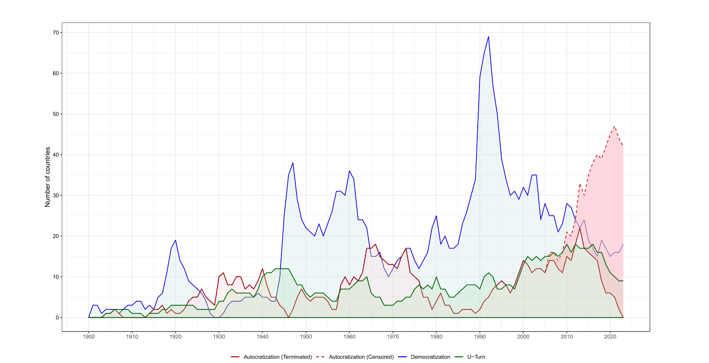
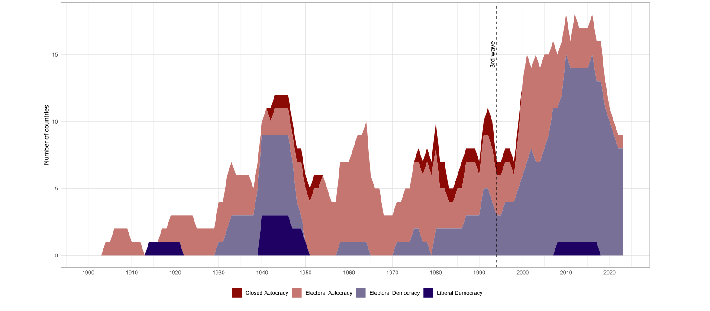
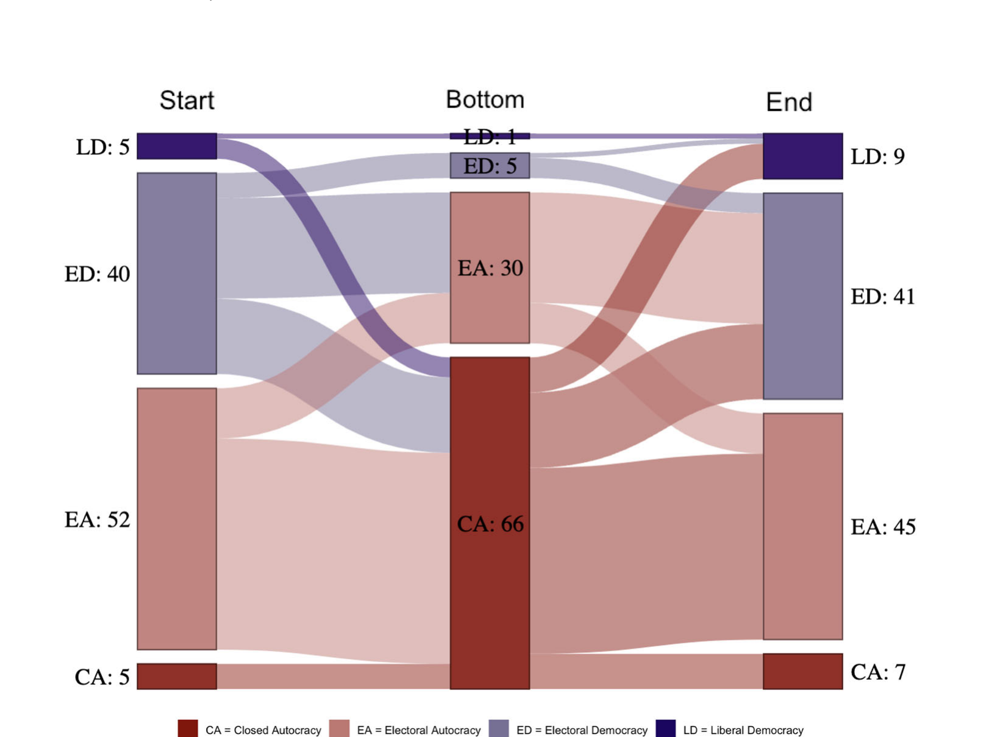
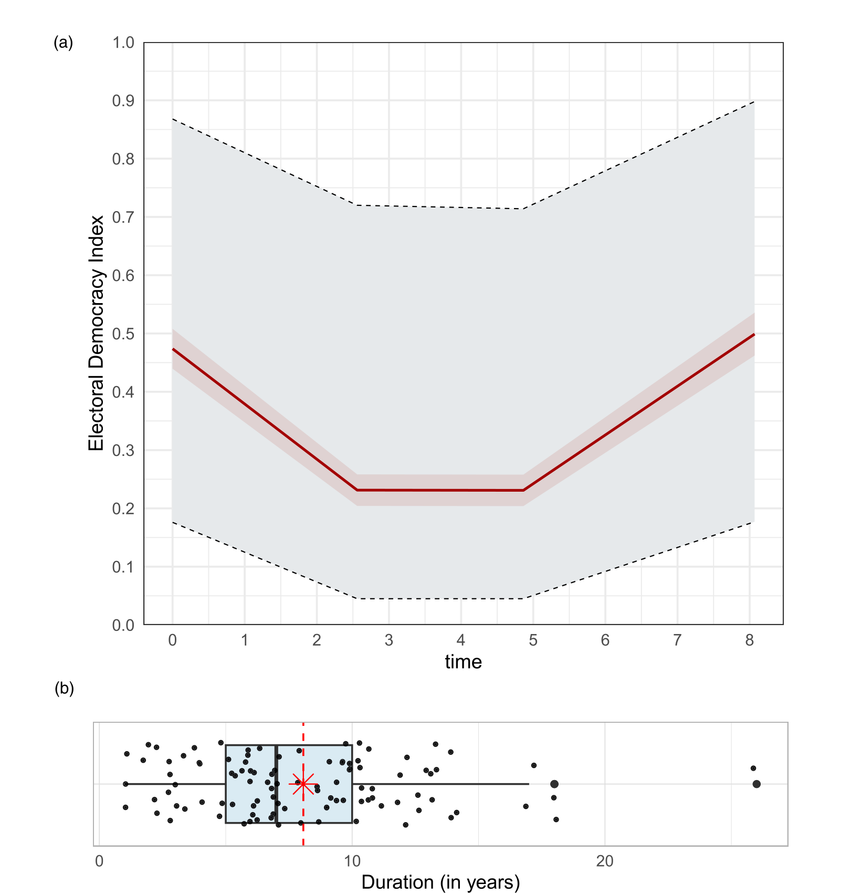
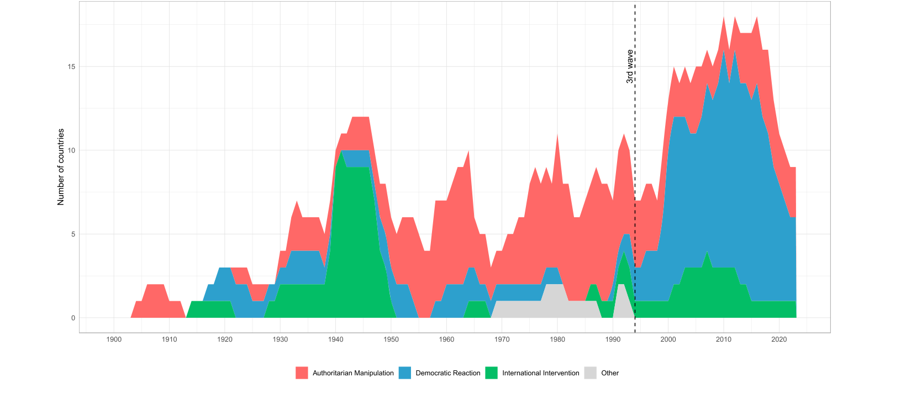
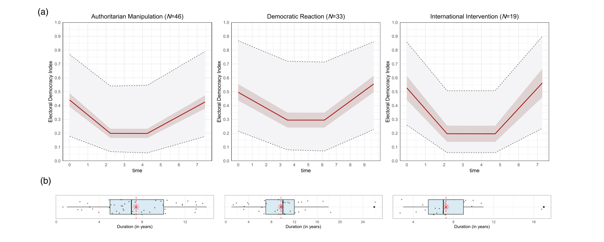

DEMOCRATIZATION
2025, VOL. 32, NO. 5, 1136–1159
https://doi.org/10.1080/13510347.2024.2448742

RESEARCH ARTICLE

### When autocratization is reversed: episodes of U-Turns since 1900

Marina Nord a, Fabio Angiolillo a, Martin Lundstedt a, Felix Wiebrecht b

and Staffan I. Lindberg a

a V-Dem Institute, Department of Political Science, University of Gothenburg, Gothenburg, Sweden;
b Department of Politics, University of Liverpool, Liverpool, UK

ARTICLE HISTORY Received 19 May 2024; Accepted 28 December 2024

KEYWORDS Democracy; autocratization; democratic resistance; turnaround; U-Turn

When autocratization results in democratization?

Under former President Jair Bolsonaro, attacks on the media, the judiciary, and the
legislature, as well as attempts to undermine the electoral system were prevalent, [1]

setting off Brazil on a path typical for the “third wave of autocratization.” [2] However,
this process ended and turned into a process of democratization after opposition candidate Lula da Silva defeated Bolsonaro at the ballot. [3]

CONTACT Marina Nord [marina.nord@v-dem.net](mailto:marina.nord@v-dem.net)
[Supplemental data for this article can be accessed online at https://doi.org/10.1080/13510347.2024.](https://doi.org/10.1080/13510347.2024.2448742)
[2448742.](https://doi.org/10.1080/13510347.2024.2448742)

© 2024 The Author(s). Published by Informa UK Limited, trading as Taylor & Francis Group
[This is an Open Access article distributed under the terms of the Creative Commons Attribution License (http://creativecommons.](http://creativecommons.org/licenses/by/4.0/)
[org/licenses/by/4.0/), which permits unrestricted use, distribution, and reproduction in any medium, provided the original work](http://creativecommons.org/licenses/by/4.0/)
is properly cited. The terms on which this article has been published allow the posting of the Accepted Manuscript in a repository
by the author(s) or with their consent.

The existing literature and available quantitative measures would typically treat
developments in Brazil as two isolated episodes of autocratization and democratization, respectively. We propose “U-Turn” as a new type of regime transformation in
which autocratization and democratization are parts of one longer push-and-pull
process rather than being independent of each other. This idea has pedigree in the literature, but we propose the first comprehensive conceptualization along with a systematic operationalization and descriptive analyses from 1900 to 2023.
This article offers five contributions. First, we conceptualize U-Turn as a distinct
type of regime transformation, building on earlier ideas about two-directional
regime change from the literature on autocratization, [4] resistance to autocratization, [5]

democratization, [6] democratic resilience, [7] and authoritarian instability. [8] To date,
most quantitative research treats changes that occur in one or the other direction
(i.e. towards or away from democracy) as cases of distinct phenomena whether in
terms of gradual upward and downward movements, [9] discrete transitions, [10] or episodes. [11] Besides, conventional time-series cross-sectional studies treat any change of
the same magnitude, in any direction, at either ends of the scale, as empirically equivalent, and do not distinguish between the start of regime transformation, its continuation,
and the possible outcomes (one of which is the regime rebounding to its previous equilibrium). Yet, we know from the comparative case-study literature that two-directional
regime change is common and regime transformations are time-bound processes. [12]

The comparative case-study literature, however, has typically explored two-directionality
in a narrow sense to explain specific processes, rather than suggesting a general concept.
We bring these somewhat separate research traditions closer together to develop a
general concept of two-directional regime transformation. Building on the episodes
approach, the U-Turn concept speaks to research that also takes a more comprehensive
approach to studying regime changes such as cycles and ceilings, [13] but differs from it in
that we clearly identify episodes of autocratization followed by episodes of democratization as defining elements of U-Turns.
Second, we develop an operationalization of U-Turn as a distinct type of regime
transformation supplementing the Episodes of Regime Transformation (ERT) methodology [14] which is based on changes in V-Dem’s Electoral Democracy Index. [15] We
then provide a new function to the ERT that systematically captures all episodes of
U-Turn from 1900 to 2023. We also qualitatively review all 102 U-Turns establishing
face validity of our approach. For additional transparency, we provide a dataset and a
codebook with a short description and classification of each U-Turn episode. This data
opens up new avenues for research, particularly regarding why some countries halt and
revert autocratization, while others do not, which is concealed when studying autocratization and democratization in isolation.
Third, we present the first systematic overview of the 102 U-Turns that occurred in
69 countries between 1900 and 2023. We find that more than half – 52% – of all autocratization episodes since 1900 did not establish stable authoritarian regimes but rather
transformed into U-Turns. We also find that U-Turns have never been more frequent
than during the “third wave of autocratization” [16] when 73% of all autocratization episodes have transformed into U-Turns after the process of autocratization was halted.
Fourth, we show that there is a significant homogeneity for U-Turns across regime
types: 94% involve a period of autocracy at the “bottom.” In other words, a democratic
breakdown does not necessarily prevent a return to democracy, especially if autocratization is halted and reversed relatively swiftly. An average U-Turn episode lasts

eight years and results in either restored (70 out of 102 cases) or even improved (22 out
of 102 cases) levels of democracy. [17] Even among the 45 cases of U-Turns starting in a
democracy, democracy broke down for a short period in 39 cases before the turnaround. Notably, 33 out of the 39 cases (85%) became democracies again by the end
of a U-Turn episode.
Finally, we identify three types of U-Turns depending on the key actors driving the
process of turnaround: authoritarian manipulation, democratic reaction, and international intervention. We find that authoritarian manipulation is the predominant
mode of U-Turns during the pre-1994 period, constituting 56% (37 out of 66) of all
U-Turns. Yet, over the past three decades, democratic reaction has become more
common and now constitutes the majority of U-Turn episodes, with 61% (22 out of
36) of all U-Turns. This speaks to the changing nature of U-Turns further increasing
the relevance of unpacking causes and consequences of contemporary patterns of
regime transformation.
Below, we first discuss the scholarship on regimes. Next, we build on it for a comprehensive conceptualization of U-Turns. We then describe operationalization rules
used to identify U-Turns from 1900 onwards. In the final sections, we provide the
first systematic analysis of patterns and trends regarding U-Turn episodes and variations
in the types of U-Turns. We conclude by outlining a new research agenda and highlighting some of the potential applications of our approach for future research.

One- and two-directional regime transformations

Quantitative approaches to studying regime change often use either categorical, discrete regime type data [18] or continuous measures of change. [19] Regardless, conventional
studies conceptualize regime transformation as a movement from autocracy to democracy, or vice versa. The common assumption is that the process of regime transformation ends once movement in one direction ceases. This unidirectionality is dominant
in the study of liberalization, [20] democratic transition, [21] democratic deepening, [22]

democratic erosion, [23] democratic breakdown, [24] and autocratic regression. [25]

Treating autocratization and democratization as isolated processes often fits reality
well. For example, many protracted and incumbent-led processes of democratization [26]

are indeed isolated processes that do not follow and are not intertwined with a previous
period of autocratization. Similarly, many cases of democratic breakdown that are followed by a durable authoritarian regime (such as Marco’s dictatorship in the Philippines) and some recent examples of gradual autocratization (such as Venezuela
under Chávez) can reasonably be treated as one-directional.
Nevertheless, we should allow for the possibility that a process of regime transformation is two-directional: a country goes through autocratization and then democratization (or vice versa) in one linked process where the latter movement is at least in
part endogenous to the first. [27] Admittedly, a country’s future development is to
some extent always intertwined with and influenced by all previous events and processes. However, we are seeking to distinguish between interdependencies that are
directly consequential and tangible, and those that are distant and indirect.
Two-directional regime change is more familiar in qualitative studies depicting that
regime transformation is more complex than isolated processes of democratization
and autocratization. However, these analyses tend to develop concepts and theories
that are leveraged to explain specific cases, rather than systematic and universal

concepts of two-directional regime transformation. Among the most well-known
examples are episodes of liberalization and democratic transition that fail and revert
to autocracy. O’Donnell and Schmitter, [28] for example, emphasize how liberalization
processes can fail and slump back to an autocratic setting. Studies of challenges of
democratic consolidation similarly show that newly transitioned democracies are
often fragile and quickly break down. [29] More recently, Hur and Yeo [30] introduced
the notion of “democratic ceilings” that certain countries reach after which they
decline again in their levels of democracy.
Another notion of two-directionality from the literature is that of fluctuations
reflecting a blend of democracy and autocracy and often relatively weak states and
party systems. [31] This resonates with other studies such as Hale [32] discussing “regular
and reasonably predictable cycles of movement both toward and away from ideal
types of democracy or autocracy” in the context of post-communist regimes.
Furthermore, democratization can swiftly follow autocratization in U-Turn-like
patterns such as after military or so-called promissory coups. [33] In other instances,
authoritarian incumbents’ approach to doubling-down on autocratic rule through
increased repression can backfire and lead to liberalization, labelled “democratization
by mistake” by Treisman. [34] A third U-Turn-like process is what Ginsburg and Huq [35]

describe as “near misses,” i.e. those consolidated democracies that weather through
democratic challenges and are able to recover their high levels of democracy.
These examples illustrate that autocratization and democratization can in fact be
two sides of the same process and should be studied as such. Separating the two introduces the risk of underestimating the role of longer-term dynamics and thus could lead
to biased estimates of the causes and effects of regime change.
There is plenty of research featuring two-directional regime change, paired with
both conceptual and theoretical developments. However, existing contributions typically offer a too narrow focus either on a specific form of regime transformation
(e.g. transitions from authoritarian rule), a specific regime type (e.g. fluctuations in
competitive authoritarian regimes), or specific events (e.g. coups). Allowing for a systematic approach to episodes of regime transformation to include more than one
direction of change lines up with these insights from the largely qualitative-comparative literature on how regime transformation unfolds.
A central contribution of this article is thus, by drawing on the insights from this
previous work, to develop a systematic conceptualization of two-directional regime
transformation that starts with autocratization and is followed by democratization.
Our approach, as will be elaborated in the next section, moves us further by accounting
for all such instances, independent of the type of autocratization or democratization,
the regime type they occur in, the events that characterize them, and so on. The
other side of the coin – democratization followed by and linked to autocratization –
is not explored here but has been developed elsewhere. [36] Admittedly, chains of
several ups and downs are also arguably possible.
One approach that comes close to our is that of Juan Linz’s concept of “re-equilibration,” [37] which is a “political process that, after a crisis that has seriously threatened
the continuity and stability of the basic democratic political mechanisms, results in
their continued existence at the same or higher levels of democratic legitimacy,
efficacy, and effectiveness”. This naturally includes a general two-directional regime
transformation consisting of autocratization followed by democratization. Re-equilibration, however, is a wider concept that includes crises that do not constitute

autocratization, such as the change from the Fourth to the Fifth Republic in France.
Thus, while most contributions on the subject are too narrow in our view, “re-equilibration” is rather too broad. Closer to our notion of the U-Turn is “re-democratization.” [38] However, it has not been conceptualized systematically and cases such as
Spain and Portugal suggest that the difference to “mere” democratization remains
elusive.
Identifying episodes of autocratization closely followed by episodes of democratization is further important for understanding how the wave of contemporary autocratization can be reversed. The more recent literature on democratic resilience focuses on
actors’ resistance, opposition strategies, and institutional characteristics that are associated with succeeding or failing in removing autocratizing incumbents from power. [39]

This work also speaks to our notion of the U-Turn in the sense that some accounts
of resilience also allow for the possibility that democracies “bounce back” to similar
or higher levels of democracy. [40] However, the focus on resilience is narrower than
U-Turn in that these studies only consider democracies and do not allow them to
experience democratic breakdown. In addition, democratic resilience can also be
identified by the absence of autocratization in the first place, [41] while U-Turn is
defined by autocratization taking place and followed by democratization.
Empirically, analyses of democratic resilience also typically stop at questions
whether autocratization is halted. [42] U-Turn, by contrast, includes subsequent reversal,
which is often overlooked in the quantitative literature, and thus could help us better
understand the dynamics of political regimes, particularly why autocratization sometimes triggers a successful pro-democratic backlash.
Recently, Maerz et al. [43] developed a unified architecture to detect processes of
regime changes, the “Episodes of Regime Transformation” (ERT), identifying five
possible paths and outcomes of episodes of democratization and autocratization
respectively. While a significant advancement, it still applies a unidirectional definition
of regime change. [44] We extend this framework by adding two-directional episodes.

U-Turn episodes

Regime transformation are substantive moves along a democracy-autocracy continuum [45] that may or may not involve transitions between regime types. [46] While autocratization is defined as “episodes that result in a sustained and substantial decline of
democratic attributes,” democratization refers to “episodes that exhibit substantial and
sustained improvement of democratic institutions and practices.” [47]

“U-Turn” is a new additional concept for episodes in which democratization is born
out of the initial autocratization making it meaningful to view both processes as part of
one episode of regime transformation: period of substantive two-directional regime
transformation along a democracy-autocracy continuum, in which autocratization is
closely followed by and linked to subsequent democratization.
This definition has the benefit of being wide enough to allow us to identify all relevant sets of cases, while at the same time being restrictive enough to not include cases
of a more short-term nature such as regular government turnovers. Importantly, the
concept pertains not only to democracies. U-Turn regime transformation may start
in countries across most of the democracy-autocracy spectrum. [48]

There are three important elements to a U-Turn. First, to qualify as a two-directional regime transformation, movements in both directions should be substantial

and sustained. This means that a slight bend upward towards democracy after an autocratization episode [49] or smaller regime fluctuations and “near misses” [50] are not identified as U-Turns.
Second, autocratization and democratization must be closely connected in time.
Temporal interlinkage is an essential part of a U-Turn. While historic events are
often important determinants of a country’s future development, a closer temporal
link ensures that interdependencies between the two processes are directly consequential and tangible, rather than confounded by a myriad of other events.
Third, autocratization and democratization must be endogenously interlinked. This
entails human agency intervening and changing the course of actions, which calls upon
focusing on key actors driving the process of U-Turn. We leverage previous research
focusing on key political actors in autocracies, [51] in democracies, [52] and from international perspective [53] as drivers of regime transformation to define a first, general distinction between U-Turns’ determinants. We thus distinguish between three types of
U-Turn: authoritarian manipulation, democratic reaction, and international
intervention.
Authoritarian manipulation occurs when key actors driving both autocratization
and democratization are anti-democratic, either civilians or military. This includes
instances of authoritarian power grab followed by subsequent liberalization, such as
coup-driven autocratization followed by elections, or institutional adaptation in autocracies in response to opposition pressure; or attempts at gradual autocratization, not
least through “executive aggrandizement,” [54] that are interrupted by other authoritarian actors, typically the military, that shortly after a coup call for elections. An example
of the former is South Korea between 1961 and 1964 when Park Chung-hee’s military
coup was followed by semi-competitive elections in 1963 legitimizing Park’s coup and
strengthening the military dictatorship. Example of the latter, in turn, is Juan Perón’s
gradual autocratization that started in 1949 and ended in 1955 with a military coup. In
1958, general elections followed restoring civilian rule. Authoritarian manipulation
typically entails that authoritarian elites see it in their interests to liberalize in order
to hold power and the strategy is sometimes successful. [55] However, such liberalization
does not necessarily result in a democratic transition, with the above example of South
Korea being a case in point.
Democratic reaction refers to U-Turn where pro-democracy actors are able to successfully counter autocratization, oust an autocratizing incumbent, and revert to
democratization. Democratic reaction can be characterized by bottom-up citizen
mobilization, elites’ ability to contend incumbents’ efforts, or elite-citizen alliances.
Citizens can vote the anti-democratic incumbent out of office [56] and/or turn out in
the streets demanding the executive dismissal, through organized or spontaneous
means. [57] Opposition elites, in turn, can resist the incumbent by leveraging legislative
and judiciary powers. [58] The Maldives is one recent example of a democratic reaction.
Following a prolonged political crisis in the country, Abdulla Yameen won the 2013
presidential election. Yameen soon attacked civil society and the media, undermined
courts, and expanded his own authority, leading to a democratic breakdown.
However, the ensuing public dissatisfaction, along with successful organization from
the opposition and civil society, led to a surprise defeat of Yameen in the 2018 presidential election to opposition candidate Ibrahim Solih and his MDP party winning the
2019 parliamentary elections, after which democracy returned to the Maldives as

–
repression and institutional manipulation ceased. Zambia (2010 ongoing) and

–
Brazil (2016 ongoing) are two other recent cases of democratic reaction where elections were the catalyst for making a U-turn.
Lastly, international intervention refers to U-Turns where international actors substantially change the course of a country’s political development. Interventions can be
aimed at breaking down a political regime (e.g. invasion), or at reconciling ongoing
conflicts (e.g. multilateral operations), or seeking to have a strong impact on a
regime’s direction in another way. The invasion of Western Europe during the Nazi
expansion, followed by the swift return of democracy following the German defeat,
is one example of international intervention. Another example of international inter
–
vention is Liberia (2003 2007), where a civil war eventually led to the Accra Comprehensive Peace Agreement and the establishment of the United Nations Mission in
Liberia. The latter oversaw general elections in 2005, which marked the turnaround.

Operationalization

Operationalization of U-Turns and their subsequent classification requires three sets of
decision rules: (i) rules to identify episodes of autocratization and democratization (i.e.
episodes of one-directional regime transformation), (ii) temporal interlinkage rules,
and (iii) rules for verifying the endogenous link.
Rules to identify one-directional regime transformation: To identify episodes of autocratization and democratization, we use the ERT R-package [59] with default parameters
as suggested by Edgell et al. [60] The script detects one-directional substantial and
sustained changes in democratic institutions and practices based on changes in
V-Dem’s Electoral Democracy Index (EDI, v2x_polyarchy) [61] and provides information
on the start and end years of autocratization and democratization episodes. [62]

Temporal interlinkage rules: Following the ERT logic for operationalizing episodes
of regime transformation, we consider the process of regime transformation as
ongoing if it has an annual change of at least ±0.01 in one out of five consecutive
years. Thus, we code episodes of U-Turn as episodes of autocratization that are followed by episodes of democratization within the time span of no more than five
years. The script measures this time span as a difference between the final year of autocratization episode and the first year of democratization episode. The choice of five
years as a temporal interlinkage rule is arbitrary but a reasonable and intuitive
choice for three reasons. First, a five-year time period is a normal election cycle for
the majority of countries. [63] The rule thus allows most countries to hold at least one
election after the final year of autocratization so that actors resisting autocratization
could potentially coordinate their actions against autocratization around “critical
events.” [64] Second, the five-year cut-off point is high enough to identify a broad set
of cases of reversals and not to limit ourselves to cases of a more short-term nature
such as military coups followed by immediate elections. But it is also low enough to
rule out cases of autocratization and democratization that are either not substantively
intertwined, or where interlinkage may be confounded by other events. Third, five
years is the maximum length of the interlinkage period for which we can guarantee
that the regime remains in “stasis” (i.e. no movements above 0.01 on the EDI in
either direction). [65] The “interlinkage period” thus graphically always constitutes the
“bottom” of a U-Turn.
Rules for verifying the endogenous link: We qualitatively reviewed each U-Turn
episode with a temporal link to ensure that the interlinkage between autocratization

and democratization is supported by historical-qualitative evidence. In doing so we
categorized all identified U-Turns as conceptualized above, distinguishing between
authoritarian manipulation, democratic reaction, and international intervention. [66]

Together with the dataset, we provide a detailed Codebook with a brief description
and reasoning for categorization for each U-Turn episode.
To ensure a transparent and reliable procedure, we organized the qualitative
coding in four steps. First, we assigned 25% of the U-Turn episodes each to four independent coders. In this step, each coder wrote a brief description and classified each
case into either of the three possible categories using the coding criteria outlined
above. Second, we divided the coded sample from step one between two coders
with the task of agreeing or disagreeing (and in this case, propose a different categorization) with the initial coding. Third, we sub-sampled the “contested” cases to the
remaining coders who did not take part in reviewing them in steps one and two.
This step ensured that more challenging cases were reviewed by every coder, increasing the reliability of the final categorization. Fourth, one coder reviewed the entire
sample of U-Turn categorization with the aim of ensuring description coherence
and harmonizing cross-coding judgment. This step revealed five further contested
cases, determined by different interpretations of who was the key actor in driving
the two-directional transformation and when the actor’s meaningful action took
place. These five cases were then discussed by all five coders in a plenary session
by following standard procedures on coders’ discussions around disagreements. [67]

At this stage, four cases were re-coded while one kept its original coding. As a
result, the inter-coder reliability between steps one and two is 86.3% (88/102 cases),
and it reaches 100% (14/14 cases) in the last step.
Coding rules are always debatable. We mostly follow the established ERT logic
when adding new parameters. The extensive validation process of the ERT parameters ensures that they are the soundest to identify episodes of regime transformation. [68] However, we also conduct multiple face validity and sensitivity tests to ensure
that meaningful changes to the exact parameters used for the identification of UTurns do not significantly affect the results and that we measure what we want to
measure. Specifically, we run validation tests manipulating parameters that could
lead to changes in the composition and characteristics of U-Turn episodes: the
default ERT parameters, and the interlinkage parameter. Our script also allows
users to engage in robustness and face-validity tests by setting their own parameters
for the cutoffs. [69]

To make sure that the temporal interlinkage rule of five years holds also qualitatively, we reviewed all cases of U-Turns with a temporal interlinkage rule of up to
ten years. Figure A1 in the Online Appendix shows the distribution of the number
of U-Turn episodes depending on the temporal interlinkage parameter, while in the
Codebook, we provide a qualitative description of the additional 22 cases. We find
that 64% of these additional cases cannot be defined as U-Turns as conceptualized
above, as autocratization and democratization do not seem to be endogenously
linked. Hence, setting a temporal interlinkage parameter of more than five years
increases the risks of capturing “false positive” U-Turns. Finally, for additional transparency and to demonstrate face validity, we also provide the visualization of all
U-Turn episodes in the Online Appendix.
Below we provide the first-ever descriptive analysis of U-Turns and discuss patterns
with their three different types. We thereby seek to demonstrate that the identification of

U-Turns provides new, important descriptive knowledge about our world. It also opens
up new avenues for research on the dynamics of political regimes, such as why autocratization processes only sometimes result in a U-Turn, or how “stand-alone” democratization process is different from democratization that is part of a U-Turn.

Descriptive results

Although determining causes and consequences of U-Turn episodes in comparison to
“stand-alone” episodes of autocratization and democratization falls outside the scope
of this article, we provide a series of descriptive analyses of U-Turns that can lay the
foundation for informed analyses of such kind. We find a total of 102 U-Turn episodes
from 69 countries over the period from 1900 to 2023. For reference, during the same
period, there were 205 “terminated” and 42 “censored” (meaning that they are still
ongoing, and one cannot yet tell if they will become U-Turns or not) autocratization
episodes, and 410 democratization episodes.
Two observations immediately stand out. First, 38% of countries in the world have

                                                experienced at least one episode of U-Turn since 1900, which highlights the signifi
cance of studying this phenomenon systematically. [70]

Second, more than half (52%) of all autocratization episodes become U-Turns after
the process of autocratization is halted. [71] This is an unexpectedly high rate, and a novel
finding in itself.
A first implication of this finding is that authoritarian consolidation is perhaps
more difficult than the existing literature sometimes posits. A second implication is
that democratizing agents stand a decent chance of turning autocratization around.
However, it is important to remember that only a subset of U-Turns are driven by
democratizing agents, and that many U-Turns are instances of authoritarian manipulation where both autocratization and democratization are led by autocratic actors.

Patterns and pathways of U-Turn episodes

Figure 1 shows an overview of U-Turn episodes against the backdrop of autocratization and democratization episodes, from 1900 to 2023. The green line with lightgreen stacked area shows the yearly number of countries that were in episodes of
U-Turn. The solid red line with light-red shaded area visualizes the number of autocratization episodes that have finished, while all censored (yet ongoing) episodes of
autocratization are depicted with a dashed dark red line with a darker red shaded
area appearing towards the end of the period. The blue line delineates the number
of countries that were in a democratization episode in any particular year. [72]

The relationship between the red- and green-shaded areas in Figure 1 reveals a systematic difference in U-Turn development across the three waves of autocratization
and democratization. The first wave of autocratization that concluded with the end
of World War II produced a visible spike of U-Turn episodes: Increasing rapidly
from 2 in 1929 to 12 in 1943–1946 before dropping back in the late 1940s when
many of the episodes concluded. Most were European countries occupied by Nazi
Germany and its allies to regain their democratic levels after liberation. By contrast,
the second wave of autocratization followed by the large third wave of democratization [73] did not result in an equivalent spike. Rather, the number of countries undergoing a U-Turn declined in the late 1960s and early 1970s and remained relatively

Figure 1. Episodes of democratization, autocratization, and U-Turn, 1900–2023.

stable through the mid-1970s and into the mid-1990s. The democratization spike in
the 1990s in Figure 1 is mainly the result of the collapse of the Soviet Union as well
as transformations in a long series of countries in Africa and Asia that had been autocracies for a long time. This created the opportunity for “stand-alone”
democratization. [74]

U-Turns are increasingly common
Zooming in on the developments of the recent period, Figure 1 shows that U-Turns
have never been more frequent than during the last 30 years – the period of the
“third wave of autocratization.” [75] In absolute terms, the highest annual number of
countries undergoing a U-Turn was recorded in 2010, 2012, and 2016 (18 U-Turn episodes each), and the annual count was at least 15 U-Turn episodes from 2009 to 2018.
Percentages show the same result. [76]

More importantly, the share of autocratization episodes that ended up as U-Turns
has changed significantly over time (i.e. the relationship between the green and the
light-red shaded areas). During the second wave of autocratization and into the beginning of the third wave of democratization, relatively few autocratization episodes
developed into U-Turns. Many autocratizers of the time successfully established
durable autocratic regimes, such as Marcos in the Philippines and Pinochet in Chile.
The relatively lower share of U-Turns during this period is also suggestive of the
importance of a constraining international environment increasing chances for sustained authoritarian rule. [77] The Cold War and the way in which it tended to lend
support to authoritarian incumbents seems to have limited the opportunity for
turning autocratization around.
Since the early inception of the third wave of autocratization by mid-1990s, [78] 73%
of the “terminated” autocratization episodes have already been turned around: 36 out
of 49. [79] In stark difference, during the period from 1900 to 1993, only 44% of autocratization episodes ended up as U-Turns: 66 out of 149.

The blue line with blue shaded area shows that the number of democratizing
countries keeps falling (N = 18 in 2023), which could indicate that making a U-Turn
is becoming more challenging. At the same time, the dashed red line with dark-red
shaded area in Figure 1 shows that by the end of 2023 there were 42 ongoing (“censored”) episodes of autocratization. This means that there is a record number of autocratization episodes for which we still do not know if they will become U-Turns or not.
Should the trend from the first part of the “third wave of autocratization” continue,
around 30 of the 42 ongoing autocratization episodes could possibly become
U-Turns, which would make a remarkable difference in regime change dynamics.
In sum, this first comprehensive overview of U-Turns since 1900 shows that (i)
slightly more than half of all autocratization episodes become U-Turns – this
outcome of autocratization is much more common than the current literature suggests;
(ii) U-Turns have even become the most common outcome of autocratization episodes
during the last 30 years; (iii) the world is in unchartered territory with an unprecedented number of autocratization episodes with yet indeterminate outcomes.

U-Turns now start mostly in democracies
Figure 2 provides a different perspective on global trends of U-Turns, slicing U-Turns
by the “Regimes of the World” (RoW) typology. [80] The stacked area shows the total
number of countries in a U-Turn episode each year (equivalent to the green line
and light-green shaded area in Figure 1), but episodes are now coloured by the
regime type they had by the onset of the autocratization phase. [81]

Notably, Figure 2 reveals that in recent years two-thirds of U-Turns start in democracies (66%, 24 out of 36 episodes) and only one-third (12 out of 36) start in autocracies. This finding coheres with Lührmann and Lindberg’s observation [82] and stands in
sharp contrast to the 1900 to 1993-period when roughly two-thirds (45 out of 66) of all
U-Turns started in autocracies. [83] This underscores that contemporary U-Turns occur
in a very different context from before. Most countries have at least some experience
with democratic institutions and those that do not have at least some experience with
emulating them as electoral autocracies.

Figure 2. U-Turns by Regime Types, 1900–2023.

Almost all U-Turns become autocracy at the bottom
Figure 3 plots pathways of all U-Turn episodes since 1900 using the RoW typology.
Three findings stand out. First, 94% of all episodes (N = 96) become autocracy at the

“ ”
bottom of the episode (i.e. during the interlinkage period), and most of those –
69% (N = 66) – are even closed autocracies for a short while. Notably, out of the 45
cases where autocratization started in a democracy, democracy broke down for a
short period in 39 cases before the turnaround. Yet, almost all of them (33 out of
39, or 85%) became democracies again by the end of a U-Turn episode. A possible
initial “worst case” scenario of democratic breakdown thus does not mean that a
swift upward movement is precluded.
Second, the distribution in terms of regime types is quite similar at the start- and
end-points of U-Turn episodes with a tendency towards resulting in more democracies. U-Turns started with autocratization phase in 45 democracies and 57 autocracies and ended after democratization phase with 50 democracies and 52
autocracies.
Third, Figure 3 displays the significant heterogeneity of pathways. This points to the
importance of not only studying U-Turns as a distinct type of regime transformation,
but also analysing variations of their pathways and outcomes in future research. For
example, a successful U-Turn that happens in a liberal democracy that never falls
out of the liberal democracy category is likely to have different drivers as well as consequences from the one beginning in an electoral autocracy with deterioration to
closed autocracy at the “bottom” of the episode.

Figure 3. Pathways of U-Turn Episodes by Regime Types, 1900–2023.

Average dynamics of a U-Turn episode
Figure 4 visualizes the “average” dynamics of a U-Turn episode along its two main
dimensions: level of democracy and time. The red line in Panel A shows changes in
average democracy levels across all episodes from 1900 to 2023 at four points: (i)
onset and (ii) end years of autocratization, and (iii) onset and (iv) end years of democratization. The x-axis of Panel A represents the average time (in years, counted from
the onset) at which these four points take place, and the y-axis represents the level of
democracy. The grey shaded area marks the maximum and minimum boundaries of
democracy levels at each of the four points, while the red shaded area marks the
95% confidence interval for the mean. Panel B in Figure 4 displays the full distribution
of the duration of U-Turn episodes.

Figure 4. Dynamics of an Average U-Turn Episode. A. Average Change in Democracy Levels Across U-Turn
Episodes. B. Full Distribution of Duration of U-Turn Episodes.

Figure 4 shows that initial and substantial worsening in democracy levels (autocratization) lasts on average 2.6 years and results in a total decline in EDI level of 0.24 (or
24% of the possible range of the variable). It is then followed by a “stasis” period, which
lasts, on average, 2.3 years. The “reversal” part (democratization) lasts, on average, 3.2
years and results in a total increase in EDI level of 0.27. An average U-Turn episode
thus (i) lasts 8.1 years, (ii) restores a country’s pre-episode democracy level, and (iii)
the process of autocratization is slightly faster (less than a year) than the process of subsequent democratization. This “aggregate” lens reveals the general dynamics of
U-Turn episodes, which we interpret in three ways.
First, restoring initial levels of democracy takes twice as much time as dismantling
democratic institutions and practices (2.3 + 3.2 = 5.5 years vs. 2.6 years) suggesting that
halting and reverting autocratization is possible, but requires a substantial effort. A
possible reason for this is that incumbents’ attacks on diagonal, vertical, and horizontal
accountability can take place in rapid succession, [84] while re-instating accountability
measures takes a collective effort. [85] The nature of autocratization is also likely to
impact the speed of turnaround. For example, a military coup that suspends key institutions like parliament, electoral management body, and courts can, if short-lived, be
relatively swiftly upended by reinstalling these without substantial loss in institutional
functioning. However, a more thorough autocratization with a gradual dismantling of
democratic institutions or turning them into instruments of autocratic rule, along with
more repressive control of society and losses in organizational capacity, should be
more time-consuming to revert.
Second, autocratization does not generally turn into immediate democratization.
There is a clear “stasis” period where levels of democracy are relatively low and
stable but contending forces struggle. A recent example is North Macedonia during
the 2010s, where the autocratizing incumbent Nikola Gruevski faced growing opposition from different social groups that mobilized in favour of democracy, despite
growing repression against civil and social organizations. [86]

Third, the broad grey shaded area around the entire U-shaped line reflects that UTurns are possible along the whole democracy-autocracy spectrum. [87] The historical
minimum EDI level at the onset of a U-Turn episode – 0.178 – belongs to Egypt
(1952-1964) and marks regime transformation that started with the 1952 revolution
that brought Gamal Abdel Nasser to power. The historical maximum at the onset of
a U-Turn – 0.868 – is Brazil (2016-ongoing). While it is not immediately visible in
the graph, the vast majority (92/102 cases, or 90% of the cases) of U-Turns result in
either restored (70/102 cases) or even improved (22/102 cases) levels of democracy.
This is a promising finding highlighting that U-Turns are not only common but
also successful.

Three types of U-Turns

In our conceptualization, the interlinkage between autocratization and democratization entails human agency intervening and changing the course of actions. Below,
we unpack U-Turn episodes into three types based on which actors drive the
change. We distinguish between U-Turns that are driven by authoritarian manipulation, democratic reaction, or international intervention. Figure 5 shows the frequency of these three types since 1900.

Figure 5. Types of U-Turns Across Time, 1900–2023.

Authoritarian manipulation was predominant across the 1950s through the 1980s
as indicated by the red-shaded area. After World War II and before the start of the
“third wave of autocratization,” 69% of U-Turns (29 out of 42 episodes) were driven
by authoritarian actors. This is unsurprising given that two-thirds of U-Turn episodes
of that period occurred in autocracies (see Figure 2). A typical pattern for that period
was coup-driven autocratization followed by military officers either handing over
control to civilians or holding elections to legitimize power grab and rule under dominant-party or personalist regimes. [88] The prevalence of this type of autocratization in
history undergirds the relevance of authoritarian-led democratization. [89]

Democratic reaction is by far the most common type of U-Turn since the 1990s, as
indicated by the blue-shaded area (61%, or 22 out of 36 episodes). This coheres well
with the finding from Figure 2 that roughly two-thirds of all “third-wave” U-Turns
start in democracies. More countries than ever before have forces of democratic resistance. Additionally, this could be due to the unique features of the “third wave,” namely
that autocratization happens through legal means and by actors winning free and fair
elections. [90] Opposition actors can thus react to gradual power grabs by voting incumbents out of office, finding lawful grounds to impeach autocratizers, or protesting
against them, as the extensive literature on democratic resistance suggests. [91]

International intervention is a much more rare event as shown by the relatively
smaller area covered by green in Figure 5. Only 19% (19 out of 102 episodes) of all
U-Turns historically were driven by international actors. The majority of these episodes are conflict-related, either following (civil) wars or coup d’états. Over the past
three decades, international intervention has become slightly more common again,
registering three to four episodes from 2003 to 2012.

Figure 6 replicates Figure 4 by distinguishing between the three distinct types of UTurns. Panel A shows the “average” dynamics of each type, while Panel B displays the
distribution of their duration. We first note that authoritarian manipulation is the
most frequent type of U-Turn (N = 46, or 45%), followed by democratic reaction (N
= 33, or 32%). Only 19% of U-Turns (N = 19) are driven by international intervention.
Another observation is that the three types of U-Turns have similar trajectories
along democracy levels. Yet, international intervention reveals the largest magnitude

Figure 6. Patterns of U-Turns. A. Average Change in Democracy Levels Across U-Turn Types. B. Full Distribution
of Duration of U-Turn Types.

of change in democracy levels – about one-third on a scale from 0 to 1. This is largely
because many of the U-Turn episodes with international involvement are conflictrelated.
Finally, while authoritarian manipulation and international intervention last on
average slightly more than seven years, democratic reaction lasts substantially longer

–
almost ten years. This is at least partly due to the nature of the autocratization
(especially in recent periods), as it occurs gradually and under legal façade. [92] It also
underscores that democratic reaction requires sustained efforts.

Discussion and conclusion

This article introduces a new type of regime transformation, “U-Turn.” U-Turn is a
two- directional process where autocratization is closely followed by democratization
and the two are interlinked. With the systematic identification of U-Turns, we show
that there were 102 such episodes of regime transformation between 1900 and 2023.
Our analysis also demonstrates that U-Turns are common – 52% of all autocratization
episodes transmuted into U-Turns within no more than five years after their end. Even
more notable perhaps, the share of U-Turns has increased to 73% during the contemporary “third wave of autocratization.”
Dissecting the varying paths U-Turn episodes take, our analysis demonstrates that
94% of all cases become an autocracy at the “bottom.” This holds true also for the
subset of episodes that start in democracies. In 39 of the 45 such cases, democracy
broke down for a short period before autocratization was reversed, and almost all of
them (33 out of 39, or 85%) became democracies again by the end of the U-Turn
episode. In other words, a democratic breakdown does not necessarily prevent a
return to democracy, especially if autocratization is halted and reversed relatively
soon – the average time for turnarounds is about five years after the onset of
autocratization.
Moreover, we identify three different types of U-Turns assessing each episode qualitatively. Most U-Turns since 1900 are the result of authoritarian manipulation (N = 46,
or 45%), meaning that actors driving both autocratization and democratization are
authoritarian. This type of U-Turn was particularly common in the pre-1994 period,

making up more than half (56%) of all episodes. The second most common U-Turn
type is democratic reaction (N = 33, or 32%), meaning that actors resisting autocratization are democratic, typically resisting autocratization through legal means. This
type makes up 61% of all U-Turn episodes during the past 30 years. Lastly, a
smaller portion, 19 episodes (or 19%), are categorized as international intervention.
Those are episodes in which international actors play a substantial role in the
regime dynamics. These cases are sparse across time and continents and are mostly
related to open conflicts.
This article lays the foundation for addressing many important research questions
that remain unanswered. We conclude by outlining some avenues for future research
that open up with our descriptive exploration of U-Turns.
First, future studies would do well to unpack how episodes of autocratization turn
into democratization. For example, one could spell out the causal processes behind the
U-Turn dynamics: why time spent at the “bottom” varies across cases; which actors are
systematically able to influence U-Turns; if there are typical features or events that tend
to accompany U-Turns; what has been important for U-Turns in specific countries,
and how “lessons learned” from different cases can enhance further theory building.
Second, scholars of regimes and regime changes can now employ quantitative
approaches to look further into the causes and consequences of U-Turns that are possibly distinct from drivers and effects of episodes of “stand-alone” autocratization and
democratization. For example, are there differences between U-Turns and episodes of
autocratization that are not reversed? Why do processes of autocratization only sometimes trigger a successful pro-democratic backlash and lead to U-Turns? Are there any
systematic differences between the effects of U-Turns and “stand-alone” autocratization and democratization with respect to growth, health provision, education, and
the like?
Finally, the data on U-Turns can be used to re-evaluate prior research findings
which were based on samples assuming the existence of only one-directional
regime transformation. It is important to understand if, and (if yes) to what extent
existing findings on the causes and consequences of both autocratization and democratization are influenced by the inclusion of U-Turns in both samples. For example,
the available large-N findings on the causes of democratization may underestimate or
overestimate the effect of certain factors, as two distinct regime transformations (i.e.
“stand-alone” democratization and U-Turn) were lumped into a single statistical
model.
Further research into U-Turns thus holds the promise of shining new light on the
dynamics of political regimes. Particularly, it could help us better understand onedirectional processes of democratization and autocratization and extend our knowledge of how they can come together in a two-directional process.

Notes

1. Smith, “COVID vs. Democracy.”
2. Lührmann and Lindberg, “A Third Wave of Autocratization.”
3. Hunter and Power, “Lula’s Second Act;” Nord et al., Democracy Winning and Losing at the
Ballot.
4. Bermeo, “On Democratic Backsliding;” Lührmann and Lindberg, “A Third Wave of Autocratization;” Medzihorsky and Lindberg, “Walking the Talk;” Wiebrecht et al., “State of the World
2022.”

5. Cleary and Öztürk, “When Does Backsliding Lead to Breakdown;” Gamboa, Opposition at the
Margins; Laebens and Lührmann, “What Halts Democratic Erosion;” Tomini, Gibril, and
Bochev, “Standing Up Against Autocratization.”
6. Lindberg, Democratization by Elections; Linz and Stepan, Problems of Democratic Transition;

’
O Donnell and Schmitter, Transitions from Authoritarian Rule.
7. Boese et al., “How Democracies Prevail;” Merkel and Lührmann, “Resilience of Democracies;”
Holloway and Manwaring, “How Well Does ‘Resilience’ Apply to Democracy;” Volacu and
Aligica “Conceptualising Democratic Resilience.”
8. Carothers, “Democracy Assistance;” Levitsky and Way, “Competitive Authoritarianism.”
9. Acemoglu and Robinson, Economic Origins of Dictatorship and Democracy; Teorell, Determinants of Democratization.
10. Boix and Stokes, “Endogenous Democratization;” Linz, The Breakdown of Democratic Regimes;
O’Donnell and Schmitter, Transitions from Authoritarian Rule; Przeworski, Democracy and
Development.
11. Maerz et al., “Episodes of Regime Transformation.”
12. Linz, The Breakdown of Democratic Regimes; O’Donnell and Schmitter, Transitions from
Authoritarian Rule.
13. Hale, Why Not Parties in Russia; Hur and Yeo, “Democratic Ceilings.”
14. Edgell et al., “Episodes of Regime Transformation Dataset and Codebook;” Maerz et al., “Episodes of Regime Transformation.”
15. Coppedge et al., V-Dem Codebook v14; Pemstein et al., “The V-Dem Measurement Model.”
16. Lührmann and Lindberg, “A Third Wave of Autocratization.”
17. We took the dynamics associated with such processes into consideration when choosing
between terms to describe the core concept here. Options like “re-democratization” or “bouncing back” are misleading since they imply that all cases lead to restoring previous levels of
democracy whereas that is not always the case.
18. Alvarez et al., “Classifying Political Regimes;” Boix, Miller, and Rosato, “A Complete Data Set
of Political Regimes;” Cheibub, Gandhi, and Vreeland, “Democracy and Dictatorship
Revisited;” Lührmann, Tannenberg, and Lindberg, “Regimes of the World (RoW).”
19. Bollen and Jackman, “Democracy, Stability, and Dichotomies;” Coppedge et al., V-Dem Codebook V14; Teorell, Determinants of Democratization.

’
20. O Donnell and Schmitter, Transitions from Authoritarian Rule.
21. Linz and Stepan, Problems of Democratic Transition; O’Donnell and Schmitter, Transitions
from Authoritarian Rule.
22. Maerz et al., “Episodes of Regime Transformation.”
23. Haggard and Kaufman, Backsliding; Mainwaring and Bizzarro, “The Fates of Third-Wave
Democracies.”
24. Linz, The Breakdown of Democratic Regimes.
25. Maerz et al., “Episodes of Regime Transformation.”
26. Acemoglu and Robinson, Economic Origins of Dictatorship and Democracy; Riedl et al.,
“Authoritarian-Led Democratization”; Ziblatt, “Conservative Political Parties.”
27. In this paper, we focus only on one subclass of two-directional regime transformation – UTurns. However, a country can also go through democratization and then autocratization in
one linked process, and chains of several ups and downs are also arguably possible.

’
28. O Donnell and Schmitter, Transitions from Authoritarian Rule.
29. Linz and Stepan, Problems of Democratic Transition; Mainwaring and Bizzarro, “The Fates of
Third-Wave Democracies;” Svolik, “Authoritarian Reversals;” Svolik, “Which Democracies
Will Last.”
30. Hur and Yeo, “Democratic Ceilings.”
31. Carothers, “The Surprising Instability;” Levitsky and Way, Competitive Authoritarianism;
Angiolillo, Wiebrecht, and Lindberg, “Democratic-Autocratic Party Systems.”
32. Hale, Why Not Parties in Russia, 134.
33. Marinov and Goemans, “Coups and Democracy;” Thyne and Powell, “Coup D’État or Coup
D’Autocracy.”
34. Treisman, “Democracy by Mistake.”
35. Ginsburg and Huq, “Democracy’s Near Misses.”
36. Nord et al., Democracy Winning and Losing at the Ballot.

37. Linz, The Breakdown of Democratic Regimes, 87.
38. Bermeo, “Redemocratization and Transition Elections.”
39. Boese et al., “How Democracies Prevail;”; Laebens and Lührmann, “What Halts Democratic
Erosion;” Tomini, Gibril, and Bochev, “Standing Up Against Autocratization;” Cleary
and Öztürk, “When Does Backsliding Lead to Breakdown;” Gamboa, Opposition at the Margins.
40. Merkel and Lührmann, “Resilience of Democracies;” Volacu and Aligica, “Conceptualising
Democratic Resilience.”

41. Boese et al., “How Democracies Prevail.”
42. Ibid.
43. Maerz et al., “Episodes of Regime Transformation.”
44. Four ERT paths involve a slight bend but only to determine that an episode ended. When identifying outcomes of autocratization, Maerz et al., similar to Ginsburg and Huq, include “averted
regression” for democracies registering some decline but recouping, and “pre-empted democratic breakdown” for democracies with substantial declines that barely avoid a breakdown
and regain some amount of lost democratic qualities. While potentially two-directional,
such transformations are still treated as essentially one-directional processes.
45. Democracy is conceptualized according as Dahl’s “polyarchy.” (Dahl, Polyarchy).
46. Maerz et al., “Episodes of Regime Transformation;” Lührmann and Lindberg, “A Third Wave
of Autocratization.”
47. Maerz et al., “Episodes of Regime Transformation,” p. 5.
48. Naturally, some closed autocracies, such as North Korea and Eritrea, cannot undergo a U-Turn
due to the “floor effect.”
49. Maerz et al., “Episodes of Regime Transformation.”
50. Way, Pluralism by Default; Hur and Yeo, “Democratic Ceilings;” Ginsburg and Huq, “Democ
’ ”
racy s Near Misses; Nord et al., Democracy Winning and Losing at the Ballot.
51. Riedl et al., “Authoritarian-Led Democratization;” Ekiert et al. “Ruling by Other Means;”
Matovski, Popular Dictatorships.
52. Tilly, “Processes and Mechanisms of Democratization;” Beissinger, The Revolutionary City;
Gamboa, Opposition at the Margins.
53. Blair et al., “UN Peacekeeping and Democratization;” Clausen and Albrecht, “Interventions
since the Cold War;” Levin, “When the Great Power Gets a Vote.”
54. Bermeo, “On Democratic Backsliding.”
55. Riedl et al., “Authoritarian-Led Democratization;” Albertus and Menaldo, “Authoritarianism
and the Elite Origins of Democracy;” Kavasoglu, “Autocratic Ruling Parties.”
56. Svolik, “Voting Against Autocracy.”
57. Beissinger, “The Revolutionary City.”
58. Gamboa, Opposition at the Margins; Laebens and Lührmann, “What Halts Democracy
Erosion;” Wiebrecht et al., “State of the World 2022.”
59. Maerz et al., “ERT – An R Package.”
60. Edgell et al., Episodes of Regime Transformation Codebook.
61. Coppedge et al., V-Dem Codebook v14.
62. Episodes of regime transformation are coded based on (i) an initial annual change in the EDI score
of at least ±0.01 (or 1% on a scale from 0 to 1), followed by (ii) an overall change of at least ±0.10
(at least 10% of the possible range of the variable) over the duration of the episode; and ending
with (iii) the last year in which there was an annual change of at least ±0.01 after episode onset
and immediately prior to experiencing one of the termination rules. Episodes are marked as terminated if one of the following conditions is met: (i) there is a reverse annual change of 0.03 or
greater in the EDI, (ii) there is a cumulative reverse change of 0.10 over a five-year period, or (iii)
there are no annual changes of at least ±0.01 in the EDI within five consecutive years.
63. Inter-Parliamentary Union, Parliaments at a Glance.
64. Knutsen, Nygård, and Wig, “Autocratic Elections;” Schedler, “The Politics of Uncertainty.”
65. This follows from the operationalization rules of the ERT: any annual change in the EDI score
above ±0.01 would have been included in either autocratization or democratization episode.
See Edgell et al., Episodes of Regime Transformation Codebook for details.
66. U-Turn episodes for which we could not establish an endogenous link were classified as
“other.” Only four out of 102 U-Turn episodes fall into this category: Estonia (1991–1993),

– – –
Sudan (1969 1987), Suriname (1975 1976), and Zimbabwe (1978 1981). These four cases

can be viewed as “false positives” in that all four are technically identified as U-Turns by the
code, but we do not qualify them as such after qualitative review (see Codebook for more
details). We suggest being cautious when using the category “other” and advocate for thorough
scrutiny of these four episodes before including them in any analysis.
67. O’Connoe and Joffe, “Intercoder Reliability in Qualitative Research;” Barbour, “Checklists.”
68. Maerz et al., “Episodes of Regime Transformation.”
69. The R code is available upon request.
70. This number is calculated as the total number of countries with U-Turn episodes (N = 69)
divided by the total number of countries in the V-Dem dataset from 1900 to 2023 (N = 183).
71. This number is calculated as the total number of U-Turns (N = 102) divided by the total
number of “terminated” autocratization episodes for which we can be sure that they cannot
become U-Turns according to our coding rules (N = 198). The estimate is 50% if we include
all “terminated” autocratization episodes (N = 205) in the calculations, and 41% if we
include all autocratization episodes (N = 247) regardless of whether they are “censored” or
not. Yet, that would assume that none of the yet indeterminate / “censored” episodes of autocratization could become a U-Turn, which seems unlikely looking at historical trends (Angiolillo et al., “State of the World 2023,” 18–19).
72. For democratization episodes, we do not demarcate censored ones because it has no bearing on
the identification of U-Turns.
73. Huntington, The Third Wave.
74. Levitsky and Way, Competitive Authoritarianism; Bunce, “Rethinking Recent Democratization;” Bunce and Wolchik, “Favorable Conditions and Electoral Revolutions.”
75. Lührmann and Lindberg, “A Third Wave of Autocratization.”
76. See Figure A2 in the Online Appendix.
77. Levin, “Whenthe Great Power Getsa Vote;” Dukalskis, “Making the World Safefor Dictatorship.”
78. Lührmann and Lindberg, “A Third Wave of Autocratization.”
79. Note that we include in the calculation only those “terminated” episodes for which we can be
sure that they cannot become a U-Turn according to our coding rules. The estimate is 64% if
we include all “terminated” episodes.
80. Lührmann, Tannenberg, and Lindberg, “Regimes of the World (RoW).”
81. A cautionary reading of the post-2010 period due to “censored” cases is advised.
82. Lührmann and Lindberg, “A Third Wave of Autorcratization.”
83. See Figure A5 in the Online Appendix for details.
84. Sato et al., “Institutional Order in Episodes of Autocratization.”
85. Angiolillo, Wiebrecht, and Lindberg, “Democratic-Autocratic Party Systems.”
86. Wiebrecht et al., “State of the World 2022.”
87. The density of the EDI distribution across time is illustrated in Figure A3 in the Online Appendix.
88. Geddes, “What Do We Know About Democratization;” Geddes, Wright, and Frantz, “How
Dictatorships Work;” Gandhi and Przeworski, “Authoritarian Institutions.”
89. Albertus and Menaldo, Authoritarianism and the Elite Origins of Democracy; Riedl et al.,
“Authoritarian-Led Democratization;” Kavasoglu, “Autocratic Ruling Parties.”
90. Lührmann and Lindberg, “A Third Wave of Autocratization.”
91. Tomini, Gibril, and Bochev, “Standing Up Against Autocratization;” Gamboa, Opposition at
the Margins; Wiebrecht et al., “State of the World 2022;” Laebens and Lührmann, “What
Halts Democratic Erosion.”
92. Lührmann and Lindberg, “A Third Wave of Autocratization.”

Acknowledgements

We thank Amanda B. Edgell, Carl Henrik Knutsen, Laura Maxwell, Juraj Medzihorsky, Rick Morgan,
Matthew C. Wilson, and the anonymous reviewers for their invaluable comments and suggestions.

Disclosure statement

No potential conflict of interest was reported by the author(s).

Funding

This research was made possible through support by Swedish Research Council, Grant [2014-00038];
Knut and Alice Wallenberg Foundation to Wallenberg Academy Fellow Staffan I. Lindberg, Grant

[2018.0144]; and European Union, represented by the European Commission, Grant [2023/442497]; as well as by internal grants from the Vice-Chancellor’s office, the Dean of the College of
Social Sciences and the Department of Political Science at University of Gothenburg.

Notes on contributors

Marina Nord is a postdoctoral research fellow at the V-Dem Institute, University of Gothenburg. Her
research focuses on comparative politics, democratization, autocratization, and the interaction of political and economic systems.

Fabio Angiolillo is a postdoctoral research fellow at the V-Dem Institute, University of Gothenburg.
His research focuses on comparative politics, political institutions, authoritarian regimes, political
parties, and political behaviour.

Martin Lundstedt is a PhD candidate at the Department of Political Science, University of
Gothenburg.

Felix Wiebrecht is Lecturer at the Department of Politics, University of Liverpool. His research focuses
on authoritarian politics and institutions as well as democratization and autocratization processes.

Staffan I. Lindberg is Professor of Political Science and Director of the university-wide research infrastructure at the V-Dem Institute, University of Gothenburg, founding Principal Investigator of Varieties of Democracy (V-Dem), founding Director of the national research infrastructure DEMSCORE,
Wallenberg Academy Fellow, author/editor of several books, and 60 + articles on democracy, elections, democratization, autocratization, accountability, clientelism, sequence analysis methods,
women’s representation, and voting behaviour in journals such as APSR, AJPS, Political Analysis,
Democratization, World Development, World Politics, etc.

ORCID

Marina Nord [http://orcid.org/0009-0009-4044-6721](http://orcid.org/0009-0009-4044-6721)
Fabio Angiolillo [http://orcid.org/0000-0003-1474-6500](http://orcid.org/0000-0003-1474-6500)
Martin Lundstedt [http://orcid.org/0000-0002-5847-2671](http://orcid.org/0000-0002-5847-2671)
Felix Wiebrecht [http://orcid.org/0000-0002-9159-5024](http://orcid.org/0000-0002-9159-5024)
Staffan I. Lindberg [http://orcid.org/0000-0003-0386-7390](http://orcid.org/0000-0003-0386-7390)

Bibliography

Acemoglu, D., and J. A. Robinson. Economic Origins of Dictatorship and Democracy. New York:
Cambridge University Press, 2006.
Albertus, M., and V. Menaldo. Authoritarianism and the Elite Origins of Democracy. New York:
Cambridge University Press, 2018.
Alvarez, M., J. A. Cheibub, F. Limongi, and A. Przeworski. “Classifying Political Regimes.” Studies in
Comparative International Development 31, no. 2 (1996): 3–36.
Angiolillo, F., M. Lundstedt, M. Nord, and S. I. Lindberg. “State of the World 2023: Democracy
Winning and Losing at the Ballot.” Democratization 31, no. 8 (2024): 1597–1621.
Angiolillo, F., F. Wiebrecht, and S. I. Lindberg. Democratic-Autocratic Party Systems: A New Index. VDem Working Paper 143. Gothenburg: University of Gothenburg: V-Dem Institute, 2023.
Barbour, R. S. “Checklists for Improving Rigour in Qualitative Research: A Case of the Tail Wagging
the Dog?” British Medical Journal 322 (2001): 1115–1117.
Beissinger, M. R. The Revolutionary City: Urbanization and the Global Transformation of Rebellion.
Princeton: Princeton University Press, 2022.
Bermeo, N. “On Democratic Backsliding.” Journal of Democracy 27, no. 1 (2016): 5–19.

Bermeo, N. “Redemocratization and Transition Elections: A Comparison of Spain and Portugal.”
Comparative Politics 19, no. 2 (1987): 213–231.
Blair, R. A., J. Di Salvatore, and H. M. Smidt. “UN Peacekeeping and Democratization in ConfictAffected Countries.” American Political Science Review 117, no. 4 (2023): 1308–1326.
Boese, V. A., A. B. Edgell, S. Hellmeier, S. F. Maerz, and S. I. Lindberg. “How Democracies Prevail:
Democratic Resilience as a Two-Stage Process.” Democratization 28, no. 5 (2021): 885–907.
Boix, C., M. Miller, and S. Rosato. “A Complete Data Set of Political Regimes, 1800–2007.”
Comparative Political Studies 46, no. 12 (2013): 1523–1554.
Boix, C., and S. C. Stokes. “Endogenous Democratization.” World Politics 55, no. 4 (2003): 517–549.
Bollen, K. A., and R. W. Jackman. “Democracy, Stability, and Dichotomies.” American Sociological
Review 54, no. 4 (1989): 612–621.
Carothers, T. “Democracy Assistance: Political vs. Development?” Journal of Democracy 20, no. 1
(2009): 5–19.
Carothers, C. “The Surprising Instability of Competitive Authoritarianism.” Journal of Democracy 29,
no. 4 (2018): 129–135.
Cheibub, J. A., J. Gandhi, and J. R. Vreeland. “Democracy and Dictatorship Revisited.” Public Choice
143, no. 1 (2010): 67–101.
Clausen, M.-L., and P. Albrecht. “Interventions Since the Cold War: From Statebuilding to
Stabilization.” International Affairs 97, no. 4 (2021): 1203–1220.
Cleary, M. R., and A. Öztürk. “When Does Backsliding Lead to Breakdown? Uncertainty and
Opposition Strategies in Democracies at Risk.” Perspectives on Politics 20, no. 1 (2022): 205–221.
Coppedge, M., J. Gerring, C. H. Knutsen, S. I. Lindberg, J. Teorell, et al. V-Dem Codebook v14, 2024.
Dahl, R. A. Polyarchy: Participation and Opposition. New Haven: Yale University Press, 1971.
Dukalskis, A. Making the World Safe for Dictatorship. New York: Oxford University Press, 2021.
Edgell, A. B., S. F. Maerz, L. Maxwell, R. Morgan, J. Medzihorsky, M. C. Wilson, V. A. Boese, et al.
Episodes of Regime Transformation Dataset and Codebook, v14, 2024.
Ekiert, G., E. J. Perry, and X. Yan. Ruling by Other Means: State-Mobilized Movements. Cambridge:
Cambridge University Press, 2020.
Gamboa, L. Opposition at the Margins: Strategies Against the Erosion of Democracy. New York:
Cambridge University Press, 2022.
Gandhi, J., and A. Przeworski. “Authoritarian Institutions and the Survival of Autocrats.”
Comparative Political Studies 40, no. 11 (2007): 1279–1301.
Geddes, B. “What Do We Know About Democratization After Twenty Years?” Annual Review of
Political Science 2, no. 1 (1999): 115–144.
Geddes, B., J. Wright, and E. Frantz. How Dictatorships Work: Power, Personalization, and Collapse.
New York: Cambridge University Press, 2018.
Ginsburg, T., and A. Huq. “Democracy’s Near Misses.” Journal of Democracy 29, no. 4 (2018): 16–30.
Haggard, S., and R. Kaufman. Backsliding: Democratic Regress in the Contemporary World.
Cambridge: Cambridge University Press, 2021.
Hale, H. E. Why Not Parties in Russia? Democracy, Federalism, and the State. New York: Cambridge
University Press, 2005.
Holloway, J., and R. Manwaring. “How Well Does ‘Resilience’ Apply to Democracy? A Systematic
Review.” Contemporary Politics 29, no. 1 (2023): 68–92.
Hunter, W., and T. J. Power. “Lula’s Second Act.” Journal of Democracy 34, no. 1 (2023): 126–140.
Huntington, S. P. The Third Wave: Democratization in the Late Twentieth Century. Norman:
University of Oklahoma Press, 1993.
Hur, A., and A. Yeo. “Democratic Ceilings: The Long Shadow of Nationalist Polarization in East Asia.”
Comparative Political Studies 57, no. 4 (2023): 584–612.
Inter-Parliamentary Union. Parliaments At a Glance: Term, 2020.
Kavasoglu, B. “Autocratic Ruling Parties During Regime Transitions: Investigating the Democratizing
Effect of Strong Ruling Parties.” Party Politics 28, no. 2 (2021): 377–388.
Knutsen, C. H., H. M. Nygård, and T. Wig. “Autocratic Elections: Stabilizing Tool or Force for
Change?” World Politics 69, no. 1 (2017): 98–143.
Laebens, M. G., and A. Lührmann. “What Halts Democratic Erosion? The Changing Role of
Accountability.” Democratization 28, no. 5 (2021): 908–928.
Levin, D. H. “When the Great Power Gets a Vote: The Effects of Great Power Electoral Interventions
on Election Results.” International Studies Quarterly 60, no. 2 (2016): 189–202.

Levitsky, S., and L. Way. Competitive Authoritarianism: Hybrid Regimes After the Cold War.
New York: Cambridge University Press, 2010.
Lindberg, S. I. Democratization by Elections: A New Mode of Transition. Baltimore: Johns Hopkins
University Press, 2009.
Linz, J. J. The Breakdown of Democratic Regimes. Baltimore: Johns Hopkins University Press, 1978.
Linz, J. J., and A. Stepan. Problems of Democratic Transition and Consolidation: Southern Europe,
South America, and Post-Communist Europe. Baltimore: Johns Hopkins University Press, 1996.
Lührmann, A., and S. I. Lindberg. “A Third Wave of Autocratization is Here: What is New About It?”
Democratization 26, no. 7 (2019): 1095–1113.
Lührmann, A., M. Tannenberg, and S. I. Lindberg. “Regimes of the World (RoW): Opening New
Avenues for the Comparative Study of Political Regimes.” Politics and Governance 6, no. 1
(2018): 60–77.
Maerz, S. F., A. B. Edgell, J. Krusell, L. Maxwell, and S. Hellmeier. ERT - An R Package to Load,
[Explore, and Work with the Episodes of Regime Transformation (ERT) Dataset, 2020. https://](https://github.com/vdeminstitute/ERT)
[github.com/vdeminstitute/ERT.](https://github.com/vdeminstitute/ERT)
Maerz, S. F., A. B. Edgell, M. C. Wilson, S. Hellmeier, and S. I. Lindberg. “Episodes of Regime
Transformation.” Journal of Peace Research 61, no. 6 (2024): 967–984.
Mainwaring, S., and F. Bizzarro. “The Fates of Third-Wave Democracies.” Journal of Democracy 30,
no. 1 (2019): 99–113.
Marinov, N., and H. Goemans. “Coups and Democracy.” British Journal of Political Science 44, no. 4
(2014): 799–825.
Matovski, A. Popular Dictatorships: Crises, Mass Opinion, and the Rise of Electoral Authoritarianism.
Cambridge: Cambridge University Press, 2021.
Medzihorsky, J., and S. I. Lindberg. “Walking the Talk: How to Identify Anti-Pluralist Parties.” Party
Politics 30, no. 3 (2023): 420–434.
Merkel, W., and A. Lührmann. “Resilience of Democracies: Responses to Illiberal and Authoritarian
Challenges.” Democratization 28, no. 5 (2021): 869–884.
Nord, M., M. Lundstedt, D. Altman, F. Angiolillo, C. Borella, T. Fernandes, L. Gastaldi, A. Good God,
N. Natsika, and S. I. Lindberg. Democracy Winning and Losing at the Ballot: Democracy Report
2024. Gothenburg: University of Gothenburg: V-Dem Institute, 2024.
O’Connor, C., and H. Joffe. “Intercoder Reliability in Qualitative Research: Debates and Practical
Guidelines.” International Journal of Qualitative Methods 19 (2020): 1–13.
O’Donnell, G., and P. C. Schmitter. Transitions from Authoritarian Rule: Tentative Conclusions About
Uncertain Democracies. Baltimore/London: Johns Hopkins University Press, 1986.
Pemstein, D., K. L. Marquardt, E. Tzelgov, Y. Wang, J. Krusell, and F. Miri. The V-Dem Measurement
Model: Latent Variable Analysis for Cross-National and Cross-Temporal Expert-Coded Data. VDem Working Paper 21. Gothenburg: University of Gothenburg: V-Dem Institute, 2020.
Przeworski, A. Democracy and Development: Political Institutions and Well-Being in the World, 1950–
1990. Cambridge: Cambridge University Press, 2000.
Riedl, R. B., D. Slater, J. Wong, and D. Ziblatt. “Authoritarian-Led Democratization.” Annual Review
of Political Science 23 (2020): 315–332.
Sato, Y., M. Lundstedt, K. Morrison, V. A. Boese, and S. I. Lindberg. Institutional Order in Episodes of
Autocratization. V-Dem Working Paper 133. Gothenburg: University of Gothenburg: V-Dem
Institute, 2022.
Schedler, A. The Politics of Uncertainty: Sustaining and Subverting Electoral Authoritarianism. Oxford:
Oxford University Press, 2013.
Smith, A. E. “COVID vs. Democracy: Brazil’s Populist Playbook.” Journal of Democracy 31, no. 4
(2020): 76–90.
Svolik, M. “Authoritarian Reversals and Democratic Consolidation.” American Political Science
Review 102, no. 2 (2008): 153–168.
Svolik, M. “Voting Against Autocracy.” World Politics 75, no. 4 (2023): 647–691.
Svolik, M. “Which Democracies Will Last? Coups, Incumbent Takeovers, and the Dynamic of
Democratic Consolidation.” British Journal of Political Science 45, no. 4 (2015): 715–738.
Teorell, J. Determinants of Democratization: Explaining Regime Change in the World, 1972–2006.
Cambridge: Cambridge University Press, 2010.
Thyne, C. L., and J. M. Powell. “Coup D’État or Coup D’Autocracy? How Coups Impact
Democratization, 1950–2008.” Foreign Policy Analysis 12, no. 2 (2016): 192–213.

Tilly, C. “Processes and Mechanisms of Democratization.” Sociological Theory 18, no. 1 (2000): 1–16.
Tomini, L., S. Gibril, and V. Bochev. “Standing Up Against Autocratization Across Political Regimes:
A Comparative Analysis of Resistance Actors and Strategies.” Democratization 30, no. 1 (2023):
119–138.
Treisman, D. “Democracy by Mistake: How the Errors of Autocrats Trigger Transitions to Freer
Government.” American Political Science Review 114, no. 3 (2020): 792–810.
Volacu, A., and P. D. Aligica. “Conceptualising Democratic Resilience: A Minimalist Account.”
Contemporary Politics 29, no. 5 (2023): 621–639.
Way, L. Pluralism by Default: Weak Autocrats and the Rise of Competitive Politics. Baltimore: Johns
Hopkins University Press, 2015.
Wiebrecht, F., Y. Sato, M. Nord, M. Lundstedt, F. Angiolillo, and S. I. Lindberg. “State of the World
2022: Defiance in the Face of Autocratization.” Democratization 30, no. 5 (2023): 769–793.
Ziblatt, D. Conservative Political Parties and the Birth of Modern Democracy in Europe. New York:
Cambridge University Press, 2017.

