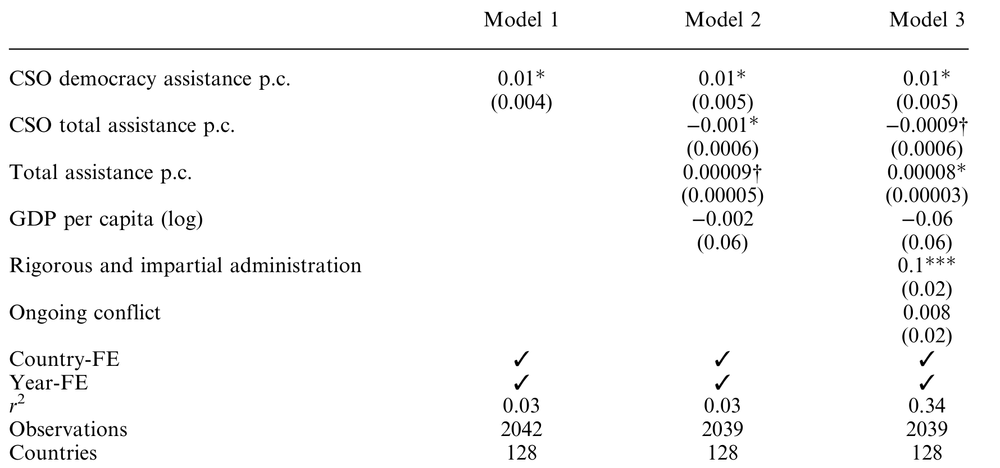
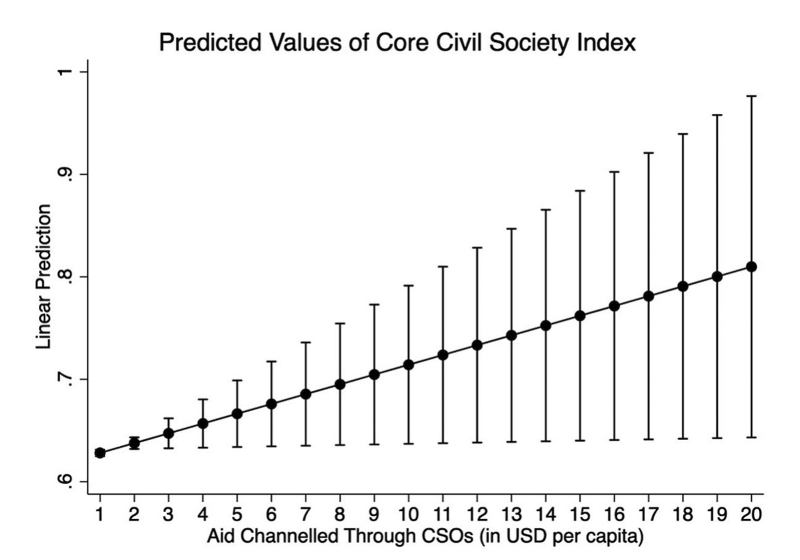
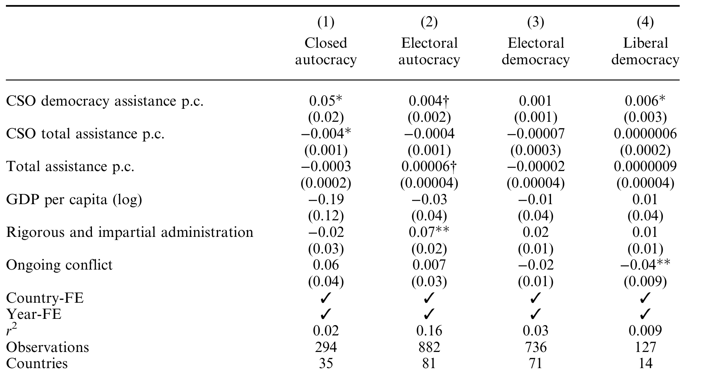
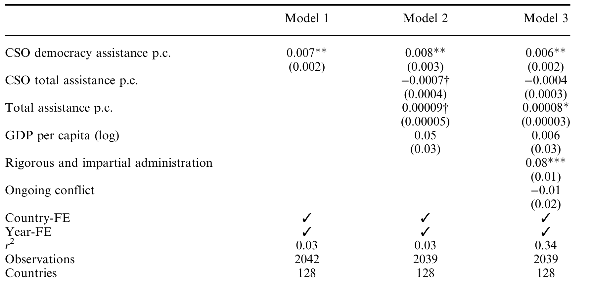
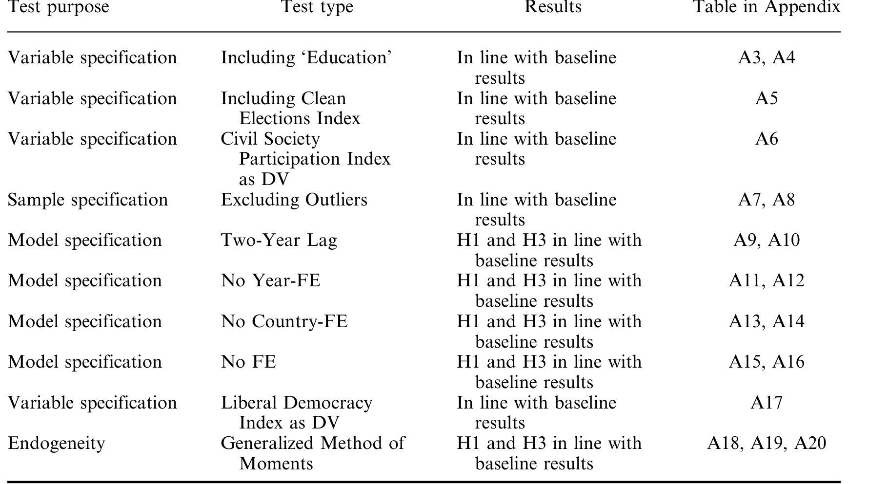

The Journal of Development Studies, 2025

–
Vol. 61, No. 11, 1737 [1755, https://doi.org/10.1080/00220388.2025.2487005](https://doi.org/10.1080/00220388.2025.2487005)

# From Aid to Empowerment: The Impact of Democracy Assistance on Civil Society

MARIKE BLANKEN*,**, FELIX WIEBRECHT† & ADEA GAFURI‡

*Department of Politics, University of Gothenburg, Gothenburg, Sweden, **Department of Politics and Public
Administration, University of Konstanz, Konstanz, Germany, †Department of Politics, University of Liverpool,
Liverpool, UK, ‡European Programme, Swedish Institute of International Affairs, Stockholm, Sweden

(Original version submitted October 2024; final version accepted March 2025)

A BSTRACT A growing body of research indicates that democracy aid improves levels of democracy in recipient countries. However, the precise mechanisms behind this relationship are understudied. Contributing to the
debates on democracy promotion, we argue that earmarked funding channelled through civil society strengthens civil society organisations’ capacity building, curbs corruption, and reduces information gaps.
Consequently, aid empowers civil society and ultimately enhances democracy in recipient countries. Using aid
data from OECD-DAC and Varieties of Democracy, we analyse earmarked funding for civil society organisations across 128 recipient countries between 2005 and 2021 and find evidence for the positive but modest
impact of this type of aid. The results demonstrate that democracy aid channelled through CSOs is positively
associated with both, the strength of civil society and democracy levels in the recipient country, although the
associations are relatively weak. We also find these associations to be slightly stronger in closed authoritarian regimes. This work contributes both theoretically and empirically to the debates about the effectiveness
of democracy aid and the role of civil society in democratisation processes.

KEYWORDS: Democracy aid; civil society; democracy assistance; democratisation; authoritarian
regimes

Global levels of democracy are currently declining (Wiebrecht et al., 2023). Given that international donors spend billions of dollars every year on democracy assistance, it is paramount to
understand the impact of this aid in fostering political change abroad. Empirical results in this
area have largely been mixed (e.g. Bush, 2015; Finkel, Pérez-Liñán, & Seligson, 2007; Scott &
Steele, 2011). However, more recent findings have indeed established positive relationships
between democracy assistance and improving levels of democracy in recipient countries (e.g.
Gafuri, 2022; Gisselquist, Niño-Zarazúa, & Samarin, 2021; Steele, Pemstein, & Meserve, 2021).
While these results are encouraging, the field remains theoretically underdeveloped. There is
still uncertainty regarding the precise mechanism through which democracy assistance

Correspondence Address: Felix Wiebrecht, Department of Politics, University of Liverpool, Liverpool, UK. Email:
felix.wiebrecht@liverpool.ac.uk
Supplementary Materials are available for this article which can be accessed via the online version of this journal
[available at https://doi.org/10.1080/00220388.2025.2487005.](https://doi.org/10.1080/00220388.2025.2487005)

© 2025 The Author(s). Published by Informa UK Limited, trading as Taylor & Francis Group
[This is an Open Access article distributed under the terms of the Creative Commons Attribution License (http://](http://creativecommons.org/licenses/by/4.0/)
[creativecommons.org/licenses/by/4.0/), which permits unrestricted use, distribution, and reproduction in any medium,](http://creativecommons.org/licenses/by/4.0/)
provided the original work is properly cited. The terms on which this article has been published allow the posting of
the Accepted Manuscript in a repository by the author(s) or with their consent.

contributes to democratisation. Recent work by Steele et al. (2021), for instance, fails to find
conclusive results for the strengthening of electoral institutions because of democracy aid, leading them to suggest that ‘perhaps other agents are being empowered to improve democracy’
(2021, p. 513).
Building upon this line of work, in this paper, we focus on civil society as an empowered
agent. Specifically, we are interested in analysing whether and how democracy aid channelled
through civil society organisations (CSOs) strengthens civil society and fosters democratisation
in recipient countries. [1] Over the last ten years, international donors have increasingly directed
democracy aid to CSOs as opposed to foreign governments (e.g. Allen, Ferry, & Shammama,
2023; Dietrich, 2013). We argue that earmarked funding, i.e. funding set aside to implement
donor-initiated projects, channelled through CSOs can empower them, curb corruption, and
reduce information gaps. Recognising its pivotal role in democratic processes, we then highlight
civil society as an ‘institutional vehicle’ that can foster democratic change since it can aid the
political momentum, contribute to civic education and enhance accountability mechanisms.
Utilizing time-series cross-sectional data from 128 recipient countries between 2005 and 2021,
we analyse whether earmarked democracy assistance channelled through CSOs a) enhances civil
society robustness, i.e. autonomy from the state, b) does so across regime types of the recipient
countries and c) improves democracy levels. We find that democracy assistance channelled
through CSOs is indeed associated with a strengthening of civil society. In addition, we demonstrate that democracy levels in the recipient countries improve with more democracy aid channelled through CSOs. These findings are robust to a wide range of model specifications and
further tests accounting for potential endogeneity. Although we identify positive and statistically significant relationships, the associations are rather weak, implying that to contribute to a
substantive strengthening of civil society and democracy in recipient countries, donors would
have to increase aid channelled through civil society well beyond current levels of support.
The contributions of this study to the literature are threefold. First, while previous research
has focused on general democracy assistance (e.g. Gafuri, 2022; Scott & Steele, 2011), we zoom
in specifically on examining the impact of democracy assistance channelled through CSOs. This
type of aid is becoming an increasingly common form of democracy assistance and therefore,
merits its own empirical assessment (Dietrich, 2013). We provide the most comprehensive
empirical analysis of aid and civil society, in terms of the number of donors and recipients

–
included and the timeframe (2005 2021). Our findings provide empirical evidence that there is a
positive association between democracy aid bypassing the government and modest improvements in civil society indices. Our findings are in line with previous studies that show that democracy aid bypassing governments can foster political change (e.g. Dietrich, 2013; Pospieszna &
Weber, 2020).
Second, this study adds to the literature on democracy promotion by focusing on the impact of
democracy assistance on civil society specifically. We contribute theoretically by stipulating the
key mechanisms through which aid via CSOs can strengthen civil society and democratisation
processes. We find that channelling democracy aid through CSOs strengthens civil society in
recipient countries, but in line with some qualitative studies also find that the overall, average
effects of aid may be minor (e.g. Heiss, 2019; Jalali, 2013; Zeeuw & Kumar, 2006). In the next
step, we also find that democracy aid channelled through CSOs is associated with modest improvements in democracy scores, supporting previous analyses that drew links between democracy aid
and democratisation without clarifying the precise mechanisms behind them (e.g. Steele et al.,
2021).
Third, our large-N study allows an evaluation of the impact of democracy assistance on civil
society across different regime types. Current debates do not only revolve around the question
of whether democracy assistance is effective per se, but also in which types of regimes this type
of aid can make a difference (e.g. Hyde, Lamb, & Samet, 2023). Previous research highlights
the importance of domestic political conditions on the effect of democracy assistance (e.g.

Cornell, 2013). We also find that the impact of democracy assistance varies across regimes but
identify a positive impact in closed authoritarian regimes and thus, contribute to recent findings
that even under the most authoritarian regimes, democracy assistance can be impactful (e.g.
Cornell, 2013; Hyde et al., 2023).
Next, we briefly review the literature and outline theoretical arguments for why democracy
assistance channelled through civil society is likely to affect both, civil society and overall democracy levels. After introducing our research design, we present our empirical tests and results.
Finally, we reflect on our findings and discuss potential avenues for future studies.

1. Literature review

Democracy assistance, as a targeted form of foreign aid, aims to advance democratisation
abroad (Grimm & Mathis, 2018). [2] It can take many forms, such as grants or loans, technical
support to improve electoral processes, or capacity building to improve an organisation’s
administration (Bush, 2015). This kind of assistance has a greater potential to foster democracy
than generic developmental aid because it directly targets democratic institutions and agents of
democratic development (Bader & Faust, 2014; Gisselquist et al., 2021; Mesquita et al., 2003).
Over the years, many studies have analysed the impact of democracy assistance programs,
and the findings have been mixed (Bush, 2015; Finkel et al., 2007; Gafuri, 2022; Grimm &
Mathis, 2018; Scott & Steele, 2011; Steele et al., 2021; Zeeuw & Kumar, 2006). Qualitative studies on democracy aid are sceptical of whether democracy assistance results in substantial
improvements in democracy. For instance, Zeeuw and Kumar (2006) argue that technical aid,
especially in post-conflict countries, does not lead to sustainable democratic improvements.
Bush (2015) describes a more ‘tamed’ version of democracy assistance whereby donors try to
avoid confrontation with the recipient regime. As a result, the programs do not contribute to
actual democratic improvements. Bicchi (2009) and Kurki (2011) note that European Union’s
democracy assistance faces challenges such as political instability, weak institutions, and
authoritarian rule in the recipient countries, limiting its effectiveness abroad.
Quantitative studies, in contrast, often empirically link democracy aid to improving levels of
democracy, primarily by measuring the change in democracy scores (Gisselquist et al., 2021).
Scott and Steele (2011), for instance, confirm a positive impact of USAID democracy aid on
democratisation, as opposed to more general economic aid packages. Likewise, Kalyvitis and
Vlachaki (2010) argue that democracy aid, delivered in democracy-related initiatives, positively
influences the democratisation of recipient nations. Recent work by Gafuri (2022), including a
large-N analysis, also demonstrates a positive effect of the EU’s democracy assistance on democracy levels in developing countries. In an attempt to identify the mechanism between democracy assistance and democratisation, Steele et al. (2021) focus on electoral institutions as
agents for change but find no conclusive evidence for the relationship between USAID aid
and changes in electoral institutions targeted by that aid. An important question, therefore,
remains: through which mechanisms is democracy aid contributing to improvements in
democracy?
Traditionally, civil society has been viewed as a driver of democratisation and has been at the
forefront of thinking about democracy (Diamond, 1994; Spires, 2011; Warren, 2011; Grimes,
2013; White, 1994). Civil society can be conceptualised as a realm of association in which people engage in collective action to address various needs, ideas, and interests (Edwards, 2014).
While there are many definitions, essentially, civil society is viewed by many as a key component to ensure government accountability to its citizens, a critical player in the checks and balances of the state, ensuring broad citizen participation in decision-making, and fostering
partnerships with the private sector to deliver services effectively (Grimes, 2013). In this vein,
civil society organisations (CSOs) can be seen as a formal representation of civil society (Wood
& Fällman, 2019). Similarly, the OECD understands any non-profit entity organised on a local,

national or international level to pursue shared objectives and ideals, without significant government-controlled participation or representation (OECD, 2022, p. 2). We follow this broad
conceptualization of civil society and, for instance, also conceive of NGOs, interest groups,
labour unions, professional associations, and charities as CSOs. This approach allows us to
capture all CSOs that engage in civic and political activities which is important given that they
may also contribute significantly to democratisation.
Research on aid specifically for civil society is divided. Some prominent studies highlight allocation to civil society as the most fruitful approach, especially when compared to governmentto-government funding (e.g. Dietrich, 2013). Others hold that foreign funding makes local civil
society too dependent on and accountable to donors, depoliticizes them, and undermines other
local NGOs (e.g. Atia & Herrold, 2018; Chahim & Prakash, 2014; Henderson, 2002; Zihnioğlu,
2019). Yet, apart from individual and comparative case studies, the effect of aid on civil society
specifically has largely escaped empirical tests. Given that many of the critical studies also highlight some positive effects such as professionalization, and enhanced training for NGOs, a
large-N analysis seems warranted (e.g. Atia & Herrold, 2018; Henderson, 2002).
We build upon prior research that highlights how donor countries can, through choosing different allocation channels, support different mechanisms to push for democratic change (e.g.
Dietrich, 2013; Pospieszna & Weber, 2020). Rather than supporting governments in power, we
highlight direct assistance to CSOs as an effective way to promote democratic progress. In other
words, in responding to the above question, we argue that civil society is an agent for change
and provides the mechanism through which democracy is strengthened in recipient countries.
Civil society can be regarded as an ‘empowering agent’ (Finkel et al., 2007) or ‘institutional
vehicle’ bringing about democratic change (Mercer, 2002), and direct assistance to CSOs serves
to ‘leveling the playing field between incumbent governments and opposition groups and allows
for bottom-up pressure to occur’ (Dietrich, 2013, p. 708; also Pospieszna & Weber, 2020).
Empirically, we provide the most comprehensive analysis of aid and civil society, in terms of

–
the number of donors and recipients included and the timeframe (2005 2021). While we provide
a causal theory and explain the mechanisms behind the associations between aid and democracy-related components, due to the observational nature of the data we refrain from making
any causal claims from our empirical results.

2. Theoretical framework

Below, we present a theoretical framework that explains how earmarked funding can strengthen
civil society, explain the variation across regime types, and its impact on democratisation

processes.
We argue that earmarked funding, in particular, is likely to contribute to strengthening
CSOs in recipient countries. Earmarked assistance refers to funding that is designated by
foreign donors to reach specific targets and goals (OECD, 2022). This type of democracy
assistance channelled through CSOs, particularly, is likely to empower CSOs. While other
types of developmental aid focus on enhancing economic or social conditions that facilitate
the foundation and survival of democracy, democracy assistance on the other hand, is specifically devised to empower key domestic agents (Finkel et al., 2007). Many local CSOs
are restricted in their operations by limited financial capital and consist of small teams
juggling different projects simultaneously. Therefore, additional financial assistance from
external donors can help CSOs invest in more human resources. In turn, with additional
funds and/or staff, CSOs can organize more projects. Consequently, their presence in society is strengthened and they are more robust. The problem of funding may be particularly
acute in more authoritarian contexts, where CSOs tend to rely more on the state for
financial assistance (Tuncel, 2023). Financial assistance, therefore, is likely to empower
CSOs and make them more independent and robust.

Moreover, while concerns about aid capture are widely warranted, these problems may be alleviated when working with CSOs (e.g. Dietrich, 2013). Although bypassed aid may not be completely insulated from aid capture, aid channelled through bypass actors is relatively more shielded
from misallocation compared to government-to-government transfers. On the one hand, the issuefocused approach of NGOs makes their survival strategy dependent on their performance. On the
other hand, given the large number of nonstate development actors, donors can potentially punish
bad implementation by switching to another partner (Dietrich, 2013). These two conditions create
incentives for bypass actors to, at a minimum, mitigate corrupt practices, thereby reducing the
amount of aid at risk of being captured, and instead being used to strengthen CSOs.
In general, aid programs are characterised by an information discrepancy between the
donor (principal) and the recipient (agent) (Radelet, 2006). The international dimension
and physical distance further contribute to this asymmetry (Radelet, 2006). The principalagent dilemma impacts almost every element of aid programs, including the creation of
programs, implementation, and evaluation. One way of overcoming this problem and helping donors achieve specific development goals is to earmark their funding (Tortora &
Steensen, 2014; Weinlich, Baumann, Lundsgaarde, & Wolff, 2020). Using earmarked funding increases accountability and involves the donor more directly (Weinlich et al., 2020).
When donors pursue specific goals, they can follow the implementation and track the progress of these programs. Consequently, donors can measure the extent to which they have
achieved their targets (or not) (Wood & Fällman, 2019). Therefore, earmarked funding is
more likely to help donors achieve specific goals and mitigates some of the risks associated with handing out money to CSOs (OECD, 2011).
Furthermore, democracy assistance may come as more than just ‘money’, but also in the
form of technical assistance, training, and aid that aims to enhance the capacity development of
civil society. Capacity development as an aid allocation approach has been increasingly
acknowledged as a worthwhile exercise (e.g. Bentley, McCarthy, & Mean, 2003; Blagescu &
Young, 2006). Capacity-building approaches for CSOs concentrate on improving an organisation’s administration, leadership, and operation (Blagescu & Young, 2006). Improving organisational capacity can enable CSOs to establish their mission, organise and manage resources
better and eventually achieve their goals (Blagescu & Young, 2006). In other words, aid delivered in the form of capacity development provides CSOs with the resources needed to
strengthen their organisational capacity. With a stronger capacity, CSOs can become more
effective in engaging citizens, advocating for their rights, and promoting participation in the
democratic process. Examples of this include the British Council’s Civil Society Support
Programme for CSOs in Ethiopia, or similar initiatives funded by the European Union in
Turkey (e.g. the Civil Society Development Center STGM). These projects include activities
such as strategic planning and project cycle management training for other CSOs and training
in project oversight, budget control, activity coordination, and social media administration.
Hence, given that donors focus on the capacity-building of CSO, it is reasonable to assume that
increased assistance directed to CSOs will enhance their organisational capacity, thereby enabling them to operate more effectively. [3]

Based on these considerations, we expect earmarked assistance to strengthen civil society in
the recipient countries and formulate our first hypothesis as follows:

H1: Democracy assistance channelled through civil society organisations is positively associated
with improvements in the civil society index in the recipient country.

3. CSO aid in different regime types

Yet, we argue that the impact of CSO aid on the strength of civil society varies across different
regimes. We concur with previous research that domestic political contexts must be considered

when assessing the effect of aid on democracy, but we depart from it in that we are not primarily focusing on authoritarian leaders’ survival strategies or time horizons (e.g. Cornell, 2013;
Lührmann, McMann, & Van Ham, 2017). This is the case because we are specifically investigating the impact of aid channelled through CSOs which is by definition, bypassing the dictator
(Dietrich, 2013). Therefore, we do not face a situation in which the dictator himself decides
whether to accept or decline democracy assistance according to the threat it poses to his
regime. [4] Instead, we argue that the impact of this type of aid depends on the form of civil society present in different regime types. Due to the highly restricted environment of CSOs in closed
authoritarian regimes, we expect international donors and aid to have the least impact here. As
we move to relatively more open regimes, however, we expect a larger impact of CSO aid on
the strength of civil society. Here we draw on the Regimes of the World (RoW) typology that
identifies closed autocracies, electoral autocracies, electoral democracies, and liberal democracies (Lührmann, Tannenberg, & Lindberg, 2018).
First, in closed autocracies, the head of state is not electorally accountable, and no meaningful
elections take place (Lührmann et al., 2018). In addition, opposition parties are non-existent and
to stay in power, the incumbent heavily relies on the repression of the media and civil society to
prevent those institutions from challenging the accountability of the regime (Dupuy, Ron, &
Prakash, 2016; Lührmann et al., 2018). CSOs in these regimes are in the weakest position across
the globe and claims-making NGOs are subject to harsh repression (e.g. Toepler, Zimmer,
Fröhlich, & Obuch, 2020). Rather than actively working towards their prescribed goals, many of
these CSOs are occupied with devising survival strategies (e.g. Benevolenski & Toepler, 2017). In
many cases, CSOs have also been fully co-opted by the regimes and instead of challenging it,
they are loyal supporters or contribute to its legitimation by performing service roles for the
regime (e.g. Wang & Snape, 2018; Wischermann, Bunk, Köllner, & Lorch, 2018). Given these
systematic disadvantages and the all-encompassing nature of closed authoritarian regimes, we
expect a relatively minor effect of CSO aid on the strength of civil society. CSOs here are, by definition, dependent on the regime for funding and permissions to operate and assistance from
international donors is unlikely to substantively change the position of CSO in such a context.
Second, in electoral autocracies, democratic elements are still present (Levitsky & Way, 2002).
Multi-party elections take place; however, the regime falls short of other democratic standards,
like fair party competition or universal suffrage (Levitsky & Way, 2002; Lührmann et al., 2018).
CSOs in these regimes also frequently experience repression and are severely constrained in their
work. Especially autocratising regimes have an interest in clamping down on civil society (e.g.
Toepler et al., 2020; Tuncel, 2023). Nevertheless, we expect the associations of CSO aid on the
strength of civil society to be larger in electoral autocracies than in closed authoritarian regimes.
Despite being restricted in their operations, CSOs here have more room to maneuver and
although many are still dependent on and restricted by the regimes, CSOs are still capable of
‘carving pockets of resistance’ (Yabanci, 2019, p. 300). Additional assistance from international
donors should therefore help CSOs to become more independent from the state and robust.
Electoral democracies conduct multi-party elections and demonstrate competence in electoral
institutions and procedures. Yet, they also display shortcomings in one or more other democratic elements, particularly in terms of civil rights and the rule of law (Lührmann et al., 2018).
Given that CSOs are relatively free to operate and are embedded in functioning support environments including opposition parties and relatively free media in these regimes, we expect
international democracy assistance through CSOs to have the largest impact on civil society in
electoral democracies. Since the political system is not substantively biased against civil society,
CSOs here should benefit more from international assistance.

Based on these considerations, we propose our second hypothesis on the varying effects of
CSO aid in different regime types as follows:

H2: Democracy assistance channelled through civil society organisations is associated with greater
improvements in the civil society index as regimes become more democratic. [5]

4. CSO aid on democratisation

Finally, beyond strengthening civil society, we also argue that aid channelled through CSOs
will be associated with overall democracy levels. Civil society is believed to have a pivotal role
in generating political momentum for democratic change (e.g. Clarke, 1998). During democratic
transitions, civil society is regarded as an ‘institutional vehicle’ or ‘empowering agent’ bringing
about democratic change and turning authoritarian societies into liberal societies (Finkel et al.,
2007; Mercer, 2002). Therefore, supporting and, in turn, empowering civil society enables it to
build pressure to democratise from within the country (e.g. Bratton & Van de Walle, 1997;
Collier & Mahoney, 2015; Dietrich, 2013; Lipset, 1994; Pinckney, Butcher, & Braithwaite,
2022; Pospieszna & Weber, 2020). The reasons for the importance of civil society in advancing
and retaining democracy are manifold (e.g. see Diamond, 1994; O’Donnell & Schmitter, 1986),
but we particularly highlight two factors.
First, CSOs play a significant role in educating and mobilizing populations for the cause of
democracy (Lipset, 1994). Although not all interventions prove successful, a large body of
research has shown that many civic education and engagement programmes are effective in
increasing citizens’ political knowledge and lead participants to update their assessments of the
local levels of democracy (e.g. Baldwin & Winters, 2020; Finkel, Neundorf, & Rascón Ramírez,
2024; Finkel & Lim, 2021; Hyde et al., 2023). Moreover, research shows democratisation is
often advanced when organisations ‘from below’ are involved as leaders in resistance campaigns
(e.g. Haggard & Kaufman, 2016; Pinckney, 2020). A prime example of this process was the
‘Arab Spring’ (e.g. Hudáková, 2021). CSOs can fulfil several important roles in episodes of
mass mobilization such as ‘provid[ing] strategic and tactical leadership, a focal point for the
interaction of activists … and a source for recruiting new members and identifying future leaders’ (Tarrow, 2011, p. 123). Indeed, in the case of Tanzania, most candidates standing for elections for the opposition started their careers in CSOs (Weghorst, 2022).
Second, studies have emphasized civil society’s role in monitoring government actions and
holding political leaders accountable (e.g. Grimes, 2013; Peruzzotti & Smulovitz, 2000). CSOs
can improve the channels of communication and oversight between governments and citizens
by informing about (proposed) legislation, drawing attention to its consequences, and proposing policy alternatives (e.g. Hegre, Bernhard, & Teorell, 2020). Yet, they can also take a more
active role in changing government actions, for instance, filing litigation in the courts or by
organizing disruptive protests that force governments to respond (e.g. Almén & Burell, 2018;
Cornell & & Grimes, 2015). Large and small-N studies confirm that having a robust civil society is also an important precondition for the survival of democracies in the current wave of
autocratisation (e.g. Bernhard, Hicken, Reenock, & Lindberg, 2020; Laebens & Lührmann,
2021).
With overall more assistance from international donors, CSOs should be better prepared to
organize more activities in either of these domains and therefore, we formulate our third
hypothesis as follows:

H3: Democracy assistance channelled through civil society organisations is positively associated
with higher levels of democracy in the recipient country.

5. Data and research design

To empirically test the proposed hypotheses, we conduct time-series cross-sectional analyses,
using ordinary least square (OLS) regressions, with data from the Varieties of Democracy

Project and the OECD/DAC. Based on the availability of data, the analysis includes the years
2005 to 2021 for 128 countries (see Table A2 in the Online Appendix).
Regarding democracy assistance on civil society and democracy, the OECD Creditor
Reporting System distinguishes two forms of official development assistance for civil society.
Aid to CSOs includes core contributions and contributions to programs initiated and developed
by CSOs (OECD, 2022). Aid channelled through CSOs includes funds directed via CSOs to
implement donor-initiated programs, in other words, earmarked funding (OECD, 2022). Most
donors generally prefer to earmark their funding (OECD, 2022). According to the OECD statistics of 2018, almost 85 percent of all support for CSO flows through CSOs, and only 15 percent was delivered to CSOs (OECD, 2022). In this study, we focus on aid channelled through
CSOs (earmarked funding) specifically.
To create the main independent variable, we extracted data from the OECD/DAC data from
all official donors listed in the Creditor Reporter System (CRS). [6] In this paper, we focus on aid
disbursements instead of commitments since only implemented projects can be expected to have
an impact. Specifically, we extract gross disbursements channelled ‘through NGOs and Civil
Society’ from ‘all official donors’. The CRS definition of an NGO closely corresponds to the
OECD definition of civil society, making it a valid data source for the independent variable
capturing aid to civil society organisations. The disbursements labelled ‘channelled through civil
society’ refer to funds specifically, distributed through CSOs to implement donor-initiated projects (earmarked funding) (OECD, 2022). In order to capture democracy assistance to civil society, we solely focus on aid labelled with the following Creditor Reporting System (CRS) code:
150.0 Government and Civil Society, since this aid specifically targets democratic development.
Lastly, we follow leading studies on foreign aid and democratisation, which use ‘foreign aid per
capita’ as their key independent variable (see Cornell, 2013; Finkel et al., 2007 & 2019; Gafuri,
2022; Grimm & Mathis, 2018; Scott & Steele, 2011). Therefore, we transform the aid variable
into per-capita values in constant US Dollars. This approach has the advantage that it also controls for aid intensity (Scott & Steele, 2011) and allows for more meaningful comparisons
between countries of different population sizes.
The main dependent variables are from the Varieties of Democracy (V-Dem) Project. The
main dependent variable is the Core Civil Society Index (CCSI). The index indicates how robust
civil society is, meaning to what extent it ‘enjoys autonomy from the state and [ … ] citizens freely
and actively pursue their political and civic goals, however conceived’ (Coppedge et al., 2023, p.
52). It combines indicators on CSO entry and exit, CSO repression, and CSOs’ participatory
environment and produces a score from low (0) to high (1) (Coppedge et al., 2023). CSOs in this
measure ‘include, but are by no means limited to, interest groups, labor unions, spiritual organizations if they are engaged in civic or political activities, social movements, professional associations, charities, and other non-governmental organizations’ (Coppedge et al., 2023).
To analyse whether the effectiveness of the assistance is contingent on the regime type of the
recipient country, we use the Regimes of the World (RoW) typology. The RoW typology is introduced by Lührmann et al. (2018) and is based on V-Dem variables, including the liberal and electoral index. Regimes are classified into four categories: closed autocracy, electoral autocracy,
electoral democracy, and liberal democracy (Lührmann et al., 2018). Third, we use the Varieties of

–
Democracy Electoral Index (EDI) as our dependent variable to capture the level of democracy (0
1 scale), where 0 is highly autocratic and 1 is highly democratic (Coppedge et al., 2023).
Following previous research on foreign aid, we include several control variables. First, we
control for ‘CSO Total Assistance’ which includes all aid channelled through civil society except
aid with the code ‘150. Government & Civil Society’, which constitutes our main independent
variable. This includes aid for educational purposes or humanitarian aid received by civil society, which might still affect civil society organisations in the recipient country. Second, we control for all other aid except aid channelled through civil society organisations (total assistance).
Aid received by the public sector or multilateral organisations still has the potential to influence

civil society because they may finance initiatives in civil society. All aid variables are transformed into per capita values to account for population size (Cornell, 2013; Grimm & Mathis,
2018).
Next, we control for GDP per capita to account for socio-economic development, using data
from the National Accounts by the United Nations (2023). [7] A wealthier population can engage
more in civil society activities than people who are struggling to survive (Lipset, 1959).
Furthermore, we account for ongoing conflicts since they are likely to affect the disbursement
of aid (Pospieszna & Weber, 2020). We operationalise this with a binary variable indicating
ongoing domestic or international conflict in the country based on data from the Global Peace
Index (GPI). [8] Moreover, several studies highlight the influence of governmental institutions
and state capacity on the associational landscape (Grimes, 2013; Winters, 2010). Employing the
V-Dem variable that captures ‘impartial and rigorous public administration’ we control for the
extent to which public administration is characterised by patronage, favouritism or discrimination (Coppedge et al., 2023).
Since we are interested in the developments within countries over time, we employ countryfixed effects. [9] Additionally, we include year-fixed effects to account for world trends commonly
experienced by all countries. We estimate all models using standard errors clustered by country.
As indicated by earlier studies on democracy aid, there may be a temporal delay between aid
disbursement and its effects (Cornell, 2013; Grimm & Mathis, 2018; Lührmann et al., 2017).
Therefore, we include a one-year lag in all our analyses, whereby the dependent variable is
measured one year after aid allocation and all independent variables incorporate a one-year
time lag. Including a one-year lag also helps to alleviate concerns of reverse causality to some
extent, where a robust civil society may attract more assistance rather than the other way
around (Cornell, 2013).

6. Results

Table 1 presents the regression results of the relationship between democracy aid channelled
through CSOs and civil society robustness. Model 1 below shows the bivariate regression. In

Table 1. The effect of democracy assistance channelled through CSOs on the Core Civil Society Index

Model 1 Model 2 Model 3

CSO democracy assistance p.c. 0.01 * 0.01 * 0.01 *
(0.004) (0.005) (0.005)
CSO total assistance p.c. −0.001 * −0.0009†
(0.0006) (0.0006)
Total assistance p.c. 0.00009† 0.00008 *
(0.00005) (0.00003)
GDP per capita (log) −0.002 −0.06
(0.06) (0.06)
Rigorous and impartial administration 0.1 ***
(0.02)
Ongoing conflict 0.008
(0.02)
Country-FE   
Year-FE   
r [2] 0.03 0.03 0.34

Observations 2042 2039 2039

Countries 128 128 128

Notes: Independent variables are lagged by one year. Robust standard errors clustered by country in
parentheses. †p < 0.1, * p < 0.05, ** p < 0.01, *** p < 0.001.

Figure 1. Predicted values of Core Civil Society Index (Model 3 above).

Model 2 we add other types of aid and GDP as controls and finally, Model 3 further includes
state capacity and conflict as controls, increasing the fit of the model substantially.
The results suggest a significant positive relationship between democracy aid channelled
through CSOs and improvements in the robustness of civil society one year later. On average,
the model indicates that a one USD per capita increase in democracy aid channelled through
CSOs is associated with an increase in civil society robustness of 0.01 units on the Core Civil
Society Index scale ranging from 0 (low) to 1 (high). This remains the same throughout all three
model specifications and provides evidence for the expected association between aid channelled
through CSOs and civil society robustness. Therefore, the results confirm our first hypothesis.
On average, these are small effect sizes, especially relating to more populous countries that
rarely receive more than 1 USD per capita in aid channelled through civil society. However, in
several smaller countries increases of more than 1 USD in aid channelled through civil society
are more common and therefore are likely to contribute to meaningful improvements.
Montenegro saw an increase in aid from 0.65 USD per capita in 2006 to just over 5 USD per
capita in 2019, during which its CCSI rose by 7.38%. Similarly, Armenia received 0.11 USD per
capita in 2005, increasing to about 4 USD per capita in 2021, while its CCSI grew from .75 to
.93 a 24% increase. These two examples show the predicted changes and overall trend of our
model. Figure 1 below displays this association with the predicted values for different levels of
aid channelled through CSOs.
Regarding the control variables, we find positive associations of the total assistance provided
and of rigorous and impartial bureaucracy on civil society robustness. However, we find significant negative results for other aid directed to CSOs. We find no significant effects for GDP per
capita and whether a conflict is ongoing in the recipient country.
Next, we estimate whether democracy assistance channeled through CSOs contributes to the
strengthening of civil society across regime types. Table 2 below shows the results across regime
types. We find statistically significant associations of CSO democracy assistance on strengthening the robustness of civil society in closed autocracies (Model 1), electoral autocracies (Model
2) (at p < 0.1 level), and liberal democracies (Model 4). Yet, the average effect is strongest in
the category of closed autocracies that is comprised of 35 countries in our sample of recipient
countries. This may be due to closed autocracies coming from lower levels of democracy which
allow them to experience relatively larger increases in their democracy scores. However, we find
no statistically significant effects in electoral democracies (Model 3). These results highlight

Table 2. The association of democracy assistance channelled through CSOs on civil society robustness
across different regime types

(1) (2) (3) (4)

Closed Electoral Electoral Liberal
autocracy autocracy democracy democracy

CSO democracy assistance p.c. 0.05 * 0.004† 0.001 0.006 *
(0.02) (0.002) (0.001) (0.003)
CSO total assistance p.c. −0.004 * −0.0004 −0.00007 0.0000006
(0.001) (0.001) (0.0003) (0.0002)
Total assistance p.c. −0.0003 0.00006† −0.00002 0.0000009
(0.0002) (0.00004) (0.00004) (0.00004)
GDP per capita (log) −0.19 −0.03 −0.01 0.01
(0.12) (0.04) (0.04) (0.04)
Rigorous and impartial administration −0.02 0.07 ** 0.02 0.01
(0.03) (0.02) (0.01) (0.01)
Ongoing conflict 0.06 0.007 −0.02 −0.04 **
(0.04) (0.03) (0.01) (0.009)
Country-FE    
Year-FE    
r [2] 0.02 0.16 0.03 0.009

Observations 294 882 736 127

Countries 35 81 71 14

Notes: Independent variables are lagged by one year. Robust standard errors clustered by country in
parentheses. †p < 0.1, * p < 0.05, ** p < 0.01, *** p < 0.001.

that although we find a positive impact of democracy aid channelled through CSOs in most,
the effect sizes vary across regime types.
In contrast to our Hypothesis 2, we find that as we move from more authoritarian to more
democratic regimes, democracy assistance channelled through CSOs has less of an impact on
the strength of civil society except for liberal democracies in our sample. Although going
against our initial expectation, the results are in line with Heiss (2019) who purports that civil
society can act as ‘watchdogs’ and provide a means for mobilization against the government
even in very authoritarian contexts. Nevertheless, given the limited sample size in some of the
categories, the results should be interpreted carefully, especially for closed autocracies and liberal democracies. In the Online Appendix, we also provide the results from these models in a
visualised form.
Finally, we turn to our third hypothesis on the association between democracy assistance
channelled through CSOs on overall democracy levels using V-Dem’s polyarchy measure. [10] The
results in Table 3 confirm that more democracy assistance channelled through CSOs is also
associated with improved levels of democracy in recipient countries.
Substantively, the results show that a one USD per capita increase in democracy assistance
channelled through CSOs is associated with a 0.006 unit increase in the Electoral Democracy

–
Index (scale 0 1). These effects are even smaller than those for the strengthening of civil society
in recipient countries suggesting that even if civil society benefits from aid, the link to strengthening democracy may be even more distant. Nevertheless, some successful examples illustrate
the benefits that this type of aid may have for overall democracy. For instance, El Salvador
benefited from increased aid, rising from 0.07 USD per capita to 4.38 USD per capita in 2018.
During this period, EDI scores increased from 0.54 to 0.64, marking an 18.52% increase.
Models 1–3 highlight similar results for the relationship between democracy assistance channelled through CSOs and democracy levels across different model specifications. In line with
previous research, we also find that the amount of total assistance channelled through CSOs is
associated with higher levels of democracy in the following year in recipient countries but to a

Table 3. The association between democracy assistance channelled through CSOs and recipient countries’ electoral democracy levels

Model 1 Model 2 Model 3

CSO democracy assistance p.c. 0.007 ** 0.008 ** 0.006 **
(0.002) (0.003) (0.002)
CSO total assistance p.c. −0.0007† −0.0004
(0.0004) (0.0003)
Total assistance p.c. 0.00009† 0.00008 *
(0.00005) (0.00003)
GDP per capita (log) 0.05 0.006
(0.03) (0.03)
Rigorous and impartial administration 0.08 ***
(0.01)
Ongoing conflict −0.01
(0.02)
Country-FE   
Year-FE   
r [2] 0.03 0.03 0.34

Observations 2042 2039 2039

Countries 128 128 128

Notes: Independent variables are lagged by one year. Robust standard errors clustered by country in
parentheses. †p < 0.1, * p < 0.05, ** p < 0.01, *** p < 0.001.

smaller extent than democracy assistance channelled through CSOs. In the Online Appendix,
we also provide a figure to visualise these results with predicted values.
Taken together, the results provide evidence for our Hypotheses 1 and 3 as well as giving
important insights into varying dynamics across regimes, albeit distinctly from our Hypothesis
2. Nevertheless, the relatively small coefficients may suggest that these are statistically significant but modest associations that would require donors to invest significantly more resources
to generate meaningful change in many countries, especially more populous ones.

7. Addressing endogeneity and robustness tests

Due to the observational nature of our data and the constraints of the two-way fixed-effects
models, the study has several limitations. Countries that improve their scores on civil society
and democracy indices may receive more aid over time and the relationship may thus, be
endogenous. To address the potential endogeneity bias between our key dependent variables core civil society index and electoral democracy index - and our key independent variable democracy assistance channelled through CSOs, we also use the Generalized Method of Moments
(GMM) (Arellano & Bover, 1995; Blundell & Bond, 1998).
GMM is designed precisely to deal with potential issues of endogeneity in panel data models
with relatively short periods that are dynamic over time, using the existing internal variable i.e.
independent variables with time lags, as instruments. We use a two-step GMM estimation
method, where we lag all independent variables for one year and include a one-year lag of the
dependent variable in the main model. Additionally, we use the key independent variable, aid
channelled through civil society, as an instrumental variable.
Using the GMM method, we find similar results to those of our baseline models for
Hypothesis 1 and identify a highly significant relationship between aid channelled through
CSOs and civil society robustness (full results in Table A18 in Online Appendix). Given that
this model includes a lagged dependent variable, the coefficients are naturally much smaller, in
this case, showing that a one-dollar per capita increase in aid channelled through CSOs is associated with an increase of 0.001 units on the Core Civil Society Index. Additionally, the levels

Table 4. Summary of robustness tests

Test purpose Test type Results Table in Appendix

Variable specification Including ‘Education’ In line with baseline A3, A4
results

Variable specification Including Clean In line with baseline A5
Elections Index results

Variable specification Civil Society
Participation Index
as DV

In line with baseline A6

results

Sample specification Excluding Outliers In line with baseline A7, A8
results

Model specification Two-Year Lag H1 and H3 in line with A9, A10
baseline results

Model specification No Year-FE H1 and H3 in line with A11, A12
baseline results

Model specification No Country-FE H1 and H3 in line with A13, A14
baseline results

Model specification No FE H1 and H3 in line with A15, A16
baseline results

Variable specification Liberal Democracy In line with baseline A17
Index as DV results

Endogeneity Generalized Method of H1 and H3 in line with A18, A19, A20
Moments baseline results

of the Core Civil Society Index and log GDP per capita from the preceding year positively
impact the Core Civil Society Index. On the other hand, other types of aid, rigorous and impartial public administration (lagged), and conflict (lagged) negatively impact the dependent variable and are statistically significant at the p < 0.01 level.
The results from the ‘Sargan Test’ which tests the validity of instruments and whether they
are suitably exogeneous, i.e. using the existing internal variables - independent variables with
time lags as instruments within the GMM framework - suggest that the instruments used are
appropriate and uncorrelated with the error term (see Table A18 in Online Appendix).
Moreover, we use the Arellano-Bond test to check for higher-order autocorrelation. The results
suggest that we reject the null hypothesis of no second-order autocorrelation at the 5% significance level but not at the 1% significance level.
Additionally, we also get similar results for Hypothesis 3, providing further evidence that
increased aid flows through CSOs are associated with marginally improved levels of democracy.
The results for Hypothesis 2 are replicated to some extent in the GMM models. However, as
opposed to the baseline results, they show a significant negative relationship between democracy assistance channelled through CSOs and civil society robustness in closed authoritarian
regimes. All the models pass the Sargan test for the validity of the instruments and most models
pass the Arellano-Bond test, although two fail to pass the second-order autocorrelation test

–
(see Tables A18 20 in the Online Appendix).
To ensure that the results are not driven by single measurements or model specifications, we
perform several robustness tests with a number of estimations and variable specifications. In
the interest of brevity, Table 4 illustrates the range of additional robustness tests we conducted.
The full results of these analyses can be found in the Online Appendix.
Taken together, our robustness tests show that especially the results for our Hypotheses 1
and 3 are very robust. We observe slightly more uncertainty around the results for Hypothesis
2. Here, we see that depending on variable and model specifications, the results for electoral
authoritarian regimes are statistically significant in some models but not in others. However,

results for closed authoritarian regimes remain robust throughout all our estimations with the
exception of the GMM model.

8. Discussion and conclusion

This study set out to assess the impact of democracy assistance channelled through CSOs on
civil society and democracy through a series of cross-sectional time-series analyses including
128 recipient countries between 2005 and 2021. The study contributes theoretically to debates
on the effect of Western-led democracy assistance programs on the democratisation processes
of low and middle-income countries, emphasizing the role of earmarked funding as a channel
to improve civil society. Additionally, we explain that this impact can vary across various types
of regimes and that this type of aid can promote overall democratisation.
Moreover, we provide the most comprehensive empirical analysis of the association between
earmarked aid and civil society, in terms of years and countries included in the sample. While a
number of studies have investigated the impact of democracy assistance (e.g. Gafuri, 2022;
Scott & Steele, 2011; Steele et al., 2021), the effect of earmarked funding given to CSOs has not
been investigated empirically. Our findings indeed point to the positive association between this
type of democracy assistance and improvements in civil society and democracy indices.
Nevertheless, the average effect sizes we identify are small, implying that to generate substantive
improvements in recipient countries, donors will have to invest significantly more resources into
this type of aid.
First, the results lend confirmation to the hypothesis that democracy assistance channelled
through CSOs on civil society and democracy is associated with modest improvements in the
civil society scores in the recipient country. This type of democracy assistance can empower
democratic agents and help them regarding capacity building. This is particularly true for earmarked funding that we analyse in this study since it also alleviates the risk of aid capture.
These findings also speak to recent qualitative work that has highlighted some negative consequences of earmarked funding for the autonomy and work of CSOs but do not negate them
(e.g. Heiss, 2019; Jalali, 2013; Zihnioğlu, 2019). We are highlighting average effects across a
large number of regimes and covering funding for different types of CSOs but acknowledge
that without some factors that this line of work has highlighted such as connections to grassroots mobilization, substantial advancements toward democracy are unlikely.
Second, the findings offer an interesting addition to previous findings on the impact of democracy assistance, not only for civil society but also for overall democracy levels. Our findings
suggest that there is a marginally positive impact of democracy assistance channelled through
CSOs on overall democracy levels. As such, the results are in line with prior studies that also
establish the broader connection between democracy assistance and improved levels of democracy (Gafuri, 2022; Scott & Steele, 2011; Steele et al., 2021). More specifically, the findings confirm that directing democracy assistance to certain democratic actors can promote democracy
as suggested, for instance, by Finkel et al. (2007). Yet, while previous research established the
empirical link between democracy assistance and levels of democracy, the precise mechanisms
behind this relationship have remained unaccounted for. As opposed to strengthening electoral
institutions as a path to democratisation (Steele et al., 2021), we highlight that empowering civil
society may be a mechanism through which democracy is developed or strengthened in recipient
countries and that this worthwhile to be tested explicitly in future research. Nevertheless, similar to work on aid used for electoral institutions, the modest effect sizes here also suggest that
this may not be the primary mechanism through which democracy aid is leading to improved
democracy levels. Further research is therefore encouraged to also analyse other potential
mechanisms that lead to this outcome.

Lastly, we also confirm that democracy aid channelled through CSOs has a varying impact
across different types of regimes. Although we find significant results for both, closed and

electoral authoritarian regimes as well as liberal democracies in our baseline results, the findings
for closed autocracies are the most robust across model specifications. This result is counter to
our expectations but is in line with some prior work that has emphasised that even in closed
authoritarian regimes, there are beacons of hope. Civil society initiatives offer citizens an
avenue to mobilize, organize into an opposition, and can pose a direct threat to authoritarian
states (Heiss, 2019). Their activities can have real and measure effects in the domestic politics of
authoritarian countries. Wischermann, Cuong, and Phuong (2016), for instance, find that
although many Vietnamese civic organizations are organised in authoritarian ways, many of
them nonetheless challenge policymakers and act as supporters of further democratisation (also
Vu, 2019). Even in China where civil society has also been closed significantly under Xi Jinping,
some NGOs infuse ideas of democratic citizenship, public accountability, and meaningful participation into political processes (Yang, 2023). Thus, these findings contribute to the ongoing
debate on whether democracy assistance in such regimes is a good investment at all, or whether
autocrats can too easily curtail any progress toward democracy (Bush, 2015; Hyde et al., 2023).
Our findings provide evidence for the continued benefits of democracy assistance even in closed
authoritarian regimes. Future research may build upon and extend this work by going into
more detail about the differences in aid effectiveness across regime types. It may also be worthwhile for further work to dissect aid to different types of CSOs and whether there are differences in effectiveness across these types.
Possible reasons why we see very small positive effects could be related to the fact that the
particular period studied here provides a ‘hard test’ for our hypotheses as many countries are
experiencing a wave of autocratisation (Wiebrecht et al., 2023). In addition, in line with Snider
(2018), who argues that democracy aid programs are negotiated deals that can reward economic
interests to incumbent regimes, especially in authoritarian contexts, this dynamic may make it
difficult for these programs to achieve their initially intended goals.
Nevertheless, we also acknowledge that our study has limitations. Due to the observational
nature of the data, we refrain from making causal claims regarding the effects of aid on civil
society and democracy scores. Future studies could use instrumental variables or mediation
analysis to establish more robust causal inference. Moreover, interviewing civil society members
and individuals involved with aid projects directed toward civil society in both recipient and
donor countries would be useful in understanding the nexus between aid and democracy-related
improvements. Our third hypothesis regarding the impact of democracy aid channelled through
CSOs on civil society, and consequently on democracy, may be tested more explicitly with a

—
mediation analysis. However, given the nature of our data country-year over time, and the
lagged variables, capturing both within- and between-country differences, it is very difficult to
employ mediation analysis.
Finally, understanding the effectiveness of democracy assistance directed to CSOs goes
beyond the academic sphere; it also offers valuable guidance to policymakers. Most importantly, the findings shows that there is a weak but robust association between democracy assistance earmarked funding channelled through CSOs and both, empowering civil society and
enhancing democracy. The results encourage donors to channel more of their democracy support through CSOs.

Notes

1. Throughout this article, we use the terms civil society organisations and non-government organisations
interchangeably.
2. Both, theoretically and empirically, we understand democratisation as any ‘substantial and sustained
improvement of democratic institutions and practices’ (Maerz, Edgell, Wilson, Hellmeier, & Lindberg, 2024,
p. 5).
3. We acknowledge that capacity building can also take place without funding channelled through CSOs, for
instance, in cases in which donors run capacity development programs themselves as in the case of Technical

Assistance to Civil Society Organisations in the Western Balkans and Turkey (TACSO) (Zihnioğlu, 2019).
However, this type of activity is not included in the operationalization of our key explanatory variable.
4. We acknowledge, however, that dictators are, of course, able to disrupt international funding flows to local
CSOs and increasingly do so (Toepler et al., 2020).
5. Empirically, we also include the category of liberal democracies for completeness but given that relatively little
assistance is given to liberal democracies we do not further theorise it.
6. [OECD.Stat. ‘Creditor Reporting System’. Accessed March 2023: https://stats.oecd.org/Index.aspx?DataSetCode=](https://stats.oecd.org/Index.aspx?DataSetCode=crs1.)
[crs1.](https://stats.oecd.org/Index.aspx?DataSetCode=crs1.)

7. United Nations Statistics Division ‘Main Aggregates Database’. GDP per capita is at constant 2015 prices in
[US Dollars. Accessed March 2023: https://unstats.un.org/unsd/snaama](https://unstats.un.org/unsd/snaama)
8. [Global Peace Index. Accessed April 2023: https://www.visionofhumanity.org/public-release-data/.](https://www.visionofhumanity.org/public-release-data/.)
9. A Hausman test confirms this is the appropriate model specification.
10. For potential concerns surrounding coder bias, it is also worth noting that the themes of civil society and
elections (including the Electoral Democracy Index) form two different expert surveys. In other words, the
experts coding levels of civil society are generally not the same as those coding elections, and ultimately the
levels of democracy.

Disclosure statement

No potential conflict of interest was reported by the author(s).

References

Allen, S. H., Ferry, L. L., & Shammama, O. (2023). Bypassing the incumbent: Leadership tenure and foreign aid
[channels. Global Studies Quarterly, 3(1), ksad007. doi:10.1093/isagsq/ksad007](https://doi.org/10.1093/isagsq/ksad007)
Almén, O., & Burell, M. (2018). Social accountability as social movement outcome: Protests in a Chinese city. Social
[Movement Studies, 17(6), 716–735. doi:10.1080/14742837.2018.1521716](https://doi.org/10.1080/14742837.2018.1521716)
Arellano, M., & Bover, O. (1995). Another look at the instrumental variable estimation of error-components models.
[Journal of Econometrics, 68(1), 29–51. doi:10.1016/0304-4076(94)01642-D](https://doi.org/10.1016/0304-4076(94)01642-D)
Atia, M., & Herrold, C. E. (2018). Governing through patronage: The rise of NGOs and the fall of civil society in
Palestine and Morocco. VOLUNTAS: International Journal of Voluntary and Nonprofit Organizations, 29(5),
[1044–1054. doi:10.1007/s11266-018-9953-6](https://doi.org/10.1007/s11266-018-9953-6)

Bader, J., & Faust, J. (2014). Foreign aid, democratization, and autocratic survival. International Studies Review,
[16(4), 575–595. doi:10.1111/misr.12158](https://doi.org/10.1111/misr.12158)
Baldwin, K., & Winters, M. S. (2020). How do different forms of foreign aid affect government legitimacy? Evidence
from an informational experiment in Uganda. Studies in Comparative International Development, 55(2), 160–183.
[doi:10.1007/s12116-020-09303-8](https://doi.org/10.1007/s12116-020-09303-8)

Benevolenski, V. B., & Toepler, S. (2017). Modernising social service delivery in Russia: Evolving government sup[port for non-profit organisations. Development in Practice, 27(1), 64–76. doi:10.1080/09614524.2017.1259392](https://doi.org/10.1080/09614524.2017.1259392)
Bentley, T., McCarthy, H., & Mean, M. (2003). Executive summary, inside out: Rethinking inclusive communities.
London: Demos.

Bernhard, M., Hicken, A., Reenock, C., & Lindberg, S. I. (2020). Parties, civil society, and the deterrence of demo[cratic defection. Studies in Comparative International Development, 55(1), 1–26. doi:10.1007/s12116-019-09295-0](https://doi.org/10.1007/s12116-019-09295-0)
Bicchi, F. (2009). Democracy assistance in the Mediterranean: An overview. Mediterranean Politics, 14(1), 61–78. doi:

[10.1080/13629390902747459](https://doi.org/10.1080/13629390902747459)

Blagescu, M., & Young, J. (2006). Capacity development for policy advocacy: Current thinking and approaches
among agencies [supporting Civil Society Organisations. https://www.gichd.org/fileadmin/pdf/LIMA/Capacity-](https://www.gichd.org/fileadmin/pdf/LIMA/Capacity-Development-for-Policy-Advocacy.pdf)
[Development-for-Policy-Advocacy.pdf.](https://www.gichd.org/fileadmin/pdf/LIMA/Capacity-Development-for-Policy-Advocacy.pdf)
Blundell, R., & Bond, S. (1998). Initial conditions and moment restrictions in dynamic panel-data models. Journal of
[Econometrics, 87(1), 115–143. doi:10.1016/S0304-4076(98)00009-8](https://doi.org/10.1016/S0304-4076(98)00009-8)
Bratton, M., & Van de Walle., N. (1997). Democratic experiments in Africa: Regime transitions in comparative perspective. Cambridge: Cambridge University Press.
Bush, S. S. (2015). The taming of democracy assistance. Cambridge: Cambridge University Press.
Chahim, D., & Prakash, A. (2014). NGOization, Foreign funding, and the Nicaraguan Civil Society. VOLUNTAS:
[International Journal of Voluntary and Nonprofit Organizations, 25(2), 487–513. doi:10.1007/s11266-012-9348-z](https://doi.org/10.1007/s11266-012-9348-z)
Clarke, G. (1998). Non-Governmental Organizations (NGOs) and politics in the developing world. Political Studies,
46(1), 36–52.
Collier, R. B., & Mahoney, J. (2015). Adding collective actors to collective outcomes: Labor and recent democratiza
–
tion in South America and Southern Europe. In Transitions to Democracy (pp. 97 119). New York: Columbia
University Press.

Coppedge, M., Gerring, J., Knutsen, C. H., Lindberg, S. I., Teorell, J., … Ziblatt, D. (2023). V-Dem Codebook v13.
[Retrieved from https://v-dem.net/documents/24/codebook_v13.pdf](https://v-dem.net/documents/24/codebook_v13.pdf)
Cornell, A. (2013). Does regime type matter for the impact of democracy aid on democracy? Democratization, 20(4),
[642–667. doi:10.1080/13510347.2012.659021](https://doi.org/10.1080/13510347.2012.659021)

Cornell, A., & Grimes, M. (2015). Institutions as incentives for civic action: Bureaucratic structures, civil society, and
[disruptive protests. The Journal of Politics, 77(3), 664–678. doi:10.1086/681058](https://doi.org/10.1086/681058)
[Diamond, L. J. (1994). Toward democratic consolidation. Journal of Democracy, 5(3), 4–17. doi:10.1353/jod.1994.](https://doi.org/10.1353/jod.1994.0041)
[0041](https://doi.org/10.1353/jod.1994.0041)

Dietrich, S. (2013). Bypass or engage? Explaining donor delivery tactics in foreign aid allocation. International Studies
[Quarterly, 57(4), 698–712. doi:10.1111/isqu.12041](https://doi.org/10.1111/isqu.12041)
Dupuy, K., Ron, J., & Prakash, A. (2016). Hands off my regime! Governments’ restrictions on foreign aid to non[governmental organizations in poor and middle-income countries. World Development, 84, 299–311. doi:10.1016/j.](https://doi.org/10.1016/j.worlddev.2016.02.001)
[worlddev.2016.02.001](https://doi.org/10.1016/j.worlddev.2016.02.001)

Edwards, M. (2014). Civil society. New York: Polity Press.
Finkel, S. E., & Lim, J. (2021). The supply and demand model of civic education: Evidence from a field experiment
[in the Democratic Republic of Congo. Democratization, 28(5), 970–991. doi:10.1080/13510347.2020.1843156](https://doi.org/10.1080/13510347.2020.1843156)
Finkel, S. E., Neundorf, A., & Rascón Ramírez, E. (2024). Can online civic education induce democratic citizenship?
[Experimental evidence from a new democracy. American Journal of Political Science, 68(2), 613–630. doi:10.1111/](https://doi.org/10.1111/ajps.12765)
[ajps.12765](https://doi.org/10.1111/ajps.12765)
Finkel, S. E., Pérez-Liñán, A., & Seligson, M. A. (2007). The effects of U.S. foreign assistance on democracy build[ing, 1990–2003. World Politics, 59(3), 404–439. doi:10.1017/S0043887100020876](https://doi.org/10.1017/S0043887100020876)
Gafuri, A. (2022). Can democracy aid improve democracy? The European Union’s democracy assistance 2002–2018.
[Democratization, 29(5), 777–797. doi:10.1080/13510347.2021.2012654](https://doi.org/10.1080/13510347.2021.2012654)
Gisselquist, R., Niño-Zarazúa, M., & Samarin, M. (2021). Does aid support democracy? A systematic review of the lit[erature. WIDER Working Paper 2021/14 Helsinki: Unu-Wider, 2021. doi:10.35188/UNU-WIDER/2021/948-8](https://doi.org/10.35188/UNU-WIDER/2021/948-8)
Grimes, M. (2013). The contingencies of societal accountability: Examining the link between civil society and good
[government. Studies in Comparative International Development, 48(4), 380–402. doi:10.1007/s12116-012-9126-3](https://doi.org/10.1007/s12116-012-9126-3)
Grimm, S., & Mathis, O. L. (2018). Democratization via aid? The European Union’s democracy promotion in the
[Western Balkans 1994–2010. European Union Politics, 19(1), 163–184. doi:10.1177/1465116517729761](https://doi.org/10.1177/1465116517729761)
Haggard, S., & Kaufman, R. R. (2016). Democratization during the third wave. Annual Review of Political Science,
[19(1), 125–144. doi:10.1146/annurev-polisci-042114-015137](https://doi.org/10.1146/annurev-polisci-042114-015137)
Hegre, H., Bernhard, M., & Teorell, J. (2020). Civil society and the democratic peace. Journal of Conflict Resolution,
[64(1), 32–62. doi:10.1177/0022002719850620](https://doi.org/10.1177/0022002719850620)
Heiss, A. (2019). NGOs and authoritarianism. In T. Davies (Ed.), Routledge handbook of NGOs and international relations (pp. 557–572). London: Routledge.
Henderson, S. L. (2002). Selling civil society: Western aid and the nongovernmental organization sector in Russia.
[Comparative Political Studies, 35(2), 139–167. doi:10.1177/0010414002035002001](https://doi.org/10.1177/0010414002035002001)
Hudáková, Z. (2021). Civil society in Tunisia: From islands of resistance to tides of political change. The Journal of
[North African Studies, 26(3), 498–526. doi:10.1080/13629387.2019.1702532](https://doi.org/10.1080/13629387.2019.1702532)
Hyde, S. D., Lamb, E., & Samet, O. (2023). Promoting democracy under electoral authoritarianism: evidence from
[Cambodia. Comparative Political Studies, 56(7), 1029–1071. doi:10.1177/00104140221139387](https://doi.org/10.1177/00104140221139387)
Jalali, R. (2013). Financing empowerment? How foreign aid to Southern Ngos and social movements undermines
[grass-roots mobilization. Sociology Compass, 7(1), 55–73. doi:10.1111/soc4.12007](https://doi.org/10.1111/soc4.12007)
Kalyvitis, S., & Vlachaki, I. (2010). Democratic aid and the democratization of recipients. Contemporary Economic
[Policy, 28(2), 188–218. doi:10.1111/j.1465-7287.2009.00154.x](https://doi.org/10.1111/j.1465-7287.2009.00154.x)
Kurki, M. (2011). Governmentality and EU democracy promotion: The European Instrument for Democracy and
Human Rights and the construction of democratic civil societies: Governmentality and EU democracy promo[tion. International Political Sociology, 5(4), 349–366. doi:10.1111/j.1749-5687.2011.00139.x](https://doi.org/10.1111/j.1749-5687.2011.00139.x)
Laebens, M. G., & Lührmann, A. (2021). What halts democratic erosion? The changing role of accountability.
[Democratization, 28(5), 908–928. doi:10.1080/13510347.2021.1897109](https://doi.org/10.1080/13510347.2021.1897109)
[Levitsky, S., & Way, L. (2002). The rise of competitive authoritarianism. Journal of Democracy, 13(2), 51–65. doi:10.](https://doi.org/10.1353/jod.2002.0026)
[1353/jod.2002.0026](https://doi.org/10.1353/jod.2002.0026)
Lipset, S. M. (1959). Some social requisites of democracy: Economic development and political legitimacy. American
[Political Science Review, 53(1), 69–105. doi:10.2307/1951731](https://doi.org/10.2307/1951731)
Lipset, S. M. (1994). The social requisites of democracy revisited: 1993 Presidential Address. American Sociological
[Review, 59(1), 1–22. doi:10.2307/2096130](https://doi.org/10.2307/2096130)
Lührmann, A., McMann, K. M., & Van Ham, C. (2017). The effectiveness of democracy aid to different regime types
[and democracy sectors. SSRN Electronic Journal. doi:10.2139/ssrn.2896872](https://doi.org/10.2139/ssrn.2896872)
Lührmann, A., Tannenberg, M., & Lindberg, S. I. (2018). Regimes of the World (RoW): Opening new avenues for
[the comparative study of political regimes. Politics and Governance, 6(1), 60–77. doi:10.17645/pag.v6i1.1214](https://doi.org/10.17645/pag.v6i1.1214)
Maerz, S. F., Edgell, A., Wilson, M. C., Hellmeier, S., & Lindberg, S. I. (2024). Episodes of regime transformation.
[Journal of Peace Research, 61(6), 967–984. doi:10.1177/00223433231168192](https://doi.org/10.1177/00223433231168192)

Mercer, C. (2002). NGOs, civil society and democratization: A critical review of the literature. Progress in
[Development Studies, 2(1), 5–22. doi:10.1191/1464993402ps027ra](https://doi.org/10.1191/1464993402ps027ra)
Mesquita, B. B. D., Smith, A., Siverson, R. M., & Morrow, J. D. (2005). The logic of political survival. Cambridge:

MIT Press.

O’Donnell, G., & Schmitter, P. (1986). Transitions from authoritarian rule. Comparative perspectives. Baltimore: Johns
Hopkins University.
[OECD. (2011). How DAC members work with civil society organisations. Retrieved from https://www.oecd.org/dac/](https://www.oecd.org/dac/peer-reviews/Final_How_DAC_members_work_with_CSOs%20ENGLISH.pdf)
[peer-reviews/Final_How_DAC_members_work_with_CSOs%20ENGLISH.pdf.](https://www.oecd.org/dac/peer-reviews/Final_How_DAC_members_work_with_CSOs%20ENGLISH.pdf)
[OECD. (2020). Development assistance committee members and civil society. Retrieved from doi:10.1787/51eb6df1-en](https://doi.org/10.1787/51eb6df1-en)
[OECD. (2022). Aid for civil society organisations. Retrieved from https://www.oecd.org/dac/financing-sustainable-](https://www.oecd.org/dac/financing-sustainable-development/development-finance-topics/Aid-for-CSOs-2022.pdf)
[development/development-finance-topics/Aid-for-CSOs-2022.pdf.](https://www.oecd.org/dac/financing-sustainable-development/development-finance-topics/Aid-for-CSOs-2022.pdf)
[OECD. (2023). Development co-operation report 2023: Debating the aid system. OECD. Retrieved from doi:10.1787/](https://doi.org/10.1787/f6edc3c2-en)

[f6edc3c2-en](https://doi.org/10.1787/f6edc3c2-en)

Peruzzotti, E., & Smulovitz, C. (2000). Societal accountability in Latin America. Journal of Democracy, 11(4), 147–
[158. doi:10.1353/jod.2000.0087](https://doi.org/10.1353/jod.2000.0087)
Pinckney, J. (2020). From dissent to democracy: The promise and perils of civil resistance transitions. Oxford: Oxford
University Press.
Pinckney, J., Butcher, C., & Braithwaite, J. M. (2022). Organizations, resistance, and democracy: How civil society
[organizations impact democratization. International Studies Quarterly, 66(1), sqab094. doi:10.1093/isq/sqab094](https://doi.org/10.1093/isq/sqab094)
Pospieszna, P., & Weber, P. M. (2020). Amplifying and nullifying the impact of democratic sanctions through aid to
[civil society. International Interactions, 46(5), 724–748. doi:10.1080/03050629.2020.1791108](https://doi.org/10.1080/03050629.2020.1791108)
Radelet, S. (2006). A primer on foreign aid (Center for Global Development Working Paper No. 92). Retrieved from
[SSRN: https://ssrn.com/abstract=983122](https://ssrn.com/abstract=983122)
Scott, J. M., & Steele, C. A. (2011). Sponsoring democracy: The United States and democracy aid to the developing
[world, 1988-20011. International Studies Quarterly, 55(1), 47–69. doi:10.1111/j.1468-2478.2010.00635.x](https://doi.org/10.1111/j.1468-2478.2010.00635.x)
Snider, E. A. (2018). US democracy aid and the authoritarian state: Evidence from Egypt and Morocco. International
Studies Quarterly, 62(4), 795–808.
Spires, A. J. (2011). Contingent symbiosis and civil society in an authoritarian state: Understanding the survival of
[China’s grassroots NGOs. American Journal of Sociology, 117(1), 1–45. doi:10.1086/660741](https://doi.org/10.1086/660741)
Steele, C. A., Pemstein, D., & Meserve, S. A. (2021). Democracy promotion and electoral quality: A disaggregated
[analysis. Governance, 34(2), 505–521. doi:10.1111/gove.12526](https://doi.org/10.1111/gove.12526)
Tarrow, S. (2011). Power in movement: Social movements and contentious politics. Cambridge: Cambridge University

Press.

Toepler, S., Zimmer, A., Fröhlich, C., & Obuch, K. (2020). The changing space for NGOs: Civil society in authoritarian and hybrid regimes. VOLUNTAS: International Journal of Voluntary and Nonprofit Organizations, 31(4),

[649–662. doi:10.1007/s11266-020-00240-7](https://doi.org/10.1007/s11266-020-00240-7)

Tortora, P., & Steensen, S. (2014). Making earmarked funding more effective: Current practices and a way forward.
[OECD. Retrieved from https://www.oecd.org/dac/aid-architecture/Multilateral%20Report%20N%201_2014.pdf.](https://www.oecd.org/dac/aid-architecture/Multilateral%20Report%20N%201_2014.pdf)
Tuncel, O. (2023). Selective inclusion under competitive autocratic regimes: An example from the Turkish educational
[civil society. Journal of Civil Society, 19(2), 232–250. doi:10.1080/17448689.2023.2206152](https://doi.org/10.1080/17448689.2023.2206152)
Vu, A. N. (2019). NGO-led activism under authoritarian rule of Vietnam: Between cooperation and contestation.
[Community Development, 50(4), 422–439. doi:10.1080/15575330.2019.1642925](https://doi.org/10.1080/15575330.2019.1642925)
Wang, W., & Snape, H. (2018). Government service purchasing from social organizations in China: An overview of
[the development of a powerful trend. Nonprofit Policy Forum, 9(1), 20170032. doi:10.1515/npf-2017-0032](https://doi.org/10.1515/npf-2017-0032)
Warren, M. E. (2011). Civil society and democracy. In M. Edwards (Ed.), The Oxford handbook of civil society.
Oxford: Oxford University Press.
Weghorst, K. (2022). Activist origins of political ambition: Opposition candidacy in Africa’s electoral authoritarian
regimes. Cambridge: Cambridge University Press.
Weinlich, S., Baumann, M.-O., Lundsgaarde, E., & Wolff, P. (2020). Earmarking in the multilateral development system: Many shades of grey. Bonn: Studies German Development Institute/Deutsches Institut Für
Entwicklungspolitik (DIE).
White, G. (1994). Civil society, democratization and development (I): Clearing the analytical ground.
[Democratization, 1(2), 375–390. doi:10.1080/13510349408403399](https://doi.org/10.1080/13510349408403399)
Wiebrecht, F., Sato, Y., Nord, M., Lundstedt, M., Angiolillo, F., & Lindberg, S. I. (2023). State of the world 2022:
[Defiance in the face of autocratization. Democratization, 30(5), 769–793. doi:10.1080/13510347.2023.2199452](https://doi.org/10.1080/13510347.2023.2199452)
Winters, M. S. (2010). Accountability, participation and foreign aid effectiveness: Accountability, participation and
[foreign aid effectiveness. International Studies Review, 12(2), 218–243. doi:10.1111/j.1468-2486.2010.00929.x](https://doi.org/10.1111/j.1468-2486.2010.00929.x)
Wischermann, J., Bunk, B., Köllner, P., & Lorch, J. (2018). Do associations support authoritarian rule? Evidence
[from Algeria, Mozambique, and Vietnam. Journal of Civil Society, 14(2), 95–115. doi:10.1080/17448689.2018.](https://doi.org/10.1080/17448689.2018.1464707)

[1464707](https://doi.org/10.1080/17448689.2018.1464707)

Wischermann, J., Cuong, B., & Phuong, D. (2016). Vietnamese civic organisations: Supporters of or obstacles to further democratisation? Results from an empirical survey. Journal of Current Southeast Asian Affairs, 35(2), 57–88.
[doi:10.1177/186810341603500203](https://doi.org/10.1177/186810341603500203)

Wood, J., & Fällman, K. (2019). Enabling civil society for sustainable development: Select survey findings. OECD
Development Co-Operation Working Papers.
Yabanci, B. (2019). Turkey’s tamed civil society: Containment and appropriation under a competitive authoritarian
[regime. Journal of Civil Society, 15(4), 285–306. doi:10.1080/17448689.2019.1668627](https://doi.org/10.1080/17448689.2019.1668627)
Yang, S. (2023). The party-state’s hegemonic project and responses from civil society: The case of service-oriented
[NGOs in China. Critical Asian Studies, 55(1), 40–61. doi:10.1080/14672715.2022.2164738](https://doi.org/10.1080/14672715.2022.2164738)
Zeeuw, J. D., & Kumar, K. (2006). Promoting democracy in postconflict societies. Boulder: Lynne Rienner Publishers.
Zihnioğlu, Ö. (2019). European Union civil society support and the depoliticisation of Turkish civil society. Third
[World Quarterly, 40(3), 503–520. doi:10.1080/01436597.2018.1545567](https://doi.org/10.1080/01436597.2018.1545567)

