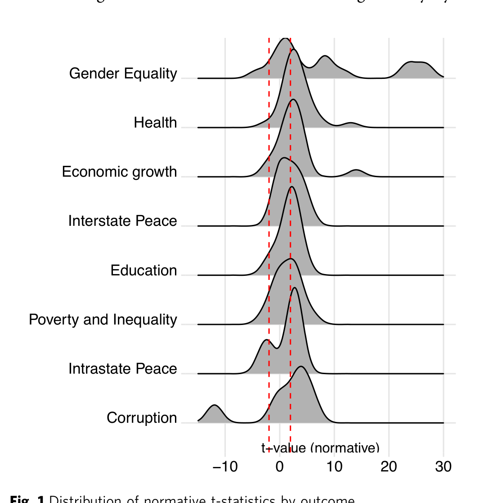

### REVIEW

https://doi.org/10.1057/s41599-026-07463-x **OPEN**

## Impact of democracy on economic, human, and societal development

Staffan I Lindberg [1] [✉], Martin Lundstedt [1], Felix Wiebrecht [1,2],
Vanessa Boese-Schlosser [3], Kelly Morrison [1,4], Natalia Natsika [5] & Yuko Sato [6,7]

How does democracy affect economic, human, and societal development? We review the
scientific evidence on this question from 2010 to present, finding that democracy improves
economic growth, population health, gender equality, and peace. However, we find that
empirical findings are either mixed or null for democracy’s effect on economic inequality and

poverty, corruption, and education. Our review goes beyond the summary statistics of meta
analyses, considering also the methodological rigor and effect sizes of the studies reviewed in

order to provide a more insightful answer to the question of what we really know about the

impact of democracy. Where democracy is found to have a robust effect, the impacts are

often substantial. Finally, we critically discuss challenges to the study of societal impacts of

democracy and outline ways of improving research going forward.

Is regime type consequential for economic, human, and societal development? If so, how and
why does it matter whether a country is a democracy or not? To answer those research
questions is the objective of this review. Our findings show that there is robust evidence that

democracies produce better outcomes on some—but not all—economic, human, and societal
developments.
The social impact of how we govern our societies has occupied generations of thinkers,
wondering if dissimilarities between autocracy and democracy could be partially responsible for
differences in economies, human and societal development. The perhaps most well-known is
Nobel Laureate Amartya Sen’s (Sen, 1999) observation that democracies avoid the worst outcomes, such as famines.
Yet we lack a comprehensive evaluation of accumulated knowledge. Some existing efforts
employ illuminating meta-analyses (Colagrossi et al., 2020; Gerring et al., 2022). However, these
accounts overlook two critical questions that influence what we really know: Are research
designs strong or weak; and are effect sizes substantively meaningful? The former question is
important given the leaps taken in both data and statistical modelling over the last decades. The
latter matters since, among findings with statistical significance, only those indicating a substantively meaningful impact of democracy really matter in the real world.
Widespread democratic backsliding (Bermeo, 2016), or autocratization (Lührmann and
Lindberg, 2019), enveloping populous and internationally powerful countries such as India, the
Philippines, and Türkiye, makes these questions even more consequential. By one recent

1 V-Dem Institute, University Gothenburg, Gothenburg, Sweden. 2 University of Liverpool, Liverpool, UK. 3 Social Science Research Center Berlin,
Berlin, Germany. [4] University of Tennessee, Knoxville, TN, USA. [5] Department of Political Science, University of Gothenburg, Gothenburg, Sweden.
6 Department of International Relations, Koç University, Istanbul, Turkey. 7 Democracy Institute, Central European University, Vienna, Austria.
[✉email: xlista@gu.se](mailto:xlista@gu.se)

HUMANITIES AND SOCIAL SCIENCES COMMUNICATIONS | (2026) 13:625 | https://doi.org/10.1057/s41599-026-07463-x 1

—
estimation, 71% of the world population lives in autocracies up

—
from 46% ten years earlier while 42 countries are autocratizing
(Wiebrecht et al., 2023).
Meanwhile, authoritarian governments, most notably China,
now claim superiority in delivering goods and services to their
citizens (Dukalskis, 2017; Dukalskis, 2021). Buttressed by sizable
economic growth rates in recent years, states like Rwanda have
emphasized efficient rule as opposed to democratic accountability. Autocracies are increasingly using trade, aid, and diplomatic ties to promote autocratic rule (Bader, 2015; von Soest,
2015).

What is ‘democracy’?
There are two main schools of thought on what constitutes
modern representative democracy. The minimalist definition
draws the line at competitive elections and somewhat widespread
suffrage (Schumpeter, 2013). A more inclusive conceptualization
also stresses freedom of expression and association (Dahl, 1971)
and is the most widely accepted. Several characteristics have been
suggested on top of this (Coppedge et al., 2011), but these two are
the common ground. The studies reviewed below use varying
measures of regimes, but the specific choice of conceptualization
is not part of our selection criteria. Autocracies also vary. Among
“classic” dictatorships, authors distinguish between, e.g., monarchies, one-party, and military dictatorships (Linz, 1978; Geddes
et al., 2014). More recent classifications add “hybrid”, “competitive”, or “electoral” authoritarian regimes (Levitsky and Way,
2010; Schedler, 2013; Lührmann and Lindberg, 2019). Yet, what
unites autocracies is that they are lacking in the core aspects of
free, fair, and competitive elections and/or freedoms of expression
and association in the definitions of studies reviewed here
(Geddes et al., 2018). Most studies reviewed use indices capturing
degrees between the extremes rather than categorical measures,
and do not analyze differences between other variations.

Why should democracy outperform autocracy?
We review here recent advances in research across a range of
disciplines that analyze the effect of political regimes. Yet theoretical contributions to this line of questions go back a long time.

—
Plato famously argued that an absolutist philosopher monarchy

—
rule by an enlightened autocrat constituted a superior form of
government to democracy. Kant theorized that democratic polities would have better outcomes by creating a “democratic peace”.
Contemporary thinkers have suggested different theories providing distinct expectations on the relationship between regimes
and social outcomes. Our purpose is not to evaluate these, but we
touch briefly on two examples to convey the intuitions of two
main strands of thinking.
Some scholars expect democracies to perform worse than
autocracies, pointing to myopic decision-making that prioritizes
short-term gains over long-term goals in order to win elections,
and that the larger number of “veto players” slows down decisionmaking processes (Tsebelis, 2011; Jacobs, 2016). Authoritarianism
has therefore sometimes been suggested as a more efficient
regime type (Beeson, 2010; Mittiga, 2022).
Others argue that democracies outperform autocracies. Likely
the most intuitive formulation of this logic is “selectorate theory”
(Mesquita et al., 2005). Used to explain variations across and
within regimes, it posits that political leaders stay in power by
distributing benefits to those that keep them in power—the
selectorate. This is a small faction in autocracies but a broad
electorate in democracies. Consequently, democratic governments should be motivated to generate growth, distribute public
goods including education and health services, pursue popular
policies benefitting the broad citizenry, and avoid imposing

suffering. Meanwhile, autocrats should be inclined to only dispense rents and spoils to regime elites and be less sensitive to the
public’s opinions and suffering.
Selectorate theory is influential in explaining differences across
and within regimes, but there are also other theoretical frameworks that explain these relationships. For example, many studies
on economic growth are inspired by “institutionalists” who argue
that democratic systems, with their individual rights and rule of
law, provide credible commitments that enable investment and
growth (North, 1990). Theories of democracy’s impact on
inequality typically relate more to models on the median voter
and income distribution within the electorate (Meltzer and
Richard, 1981). [1] A throughline across these arguments, however,
is the intuition that the size of the “selectorate” impacts a range of
outcomes in fundamental ways.
Contemporary debates on the impacts of political regimes first
applied rudimentary statistical analysis (Lipset, 1959) and fed into
“modernization theory” with empirics showing higher levels of
development among democracies. It became one of the most
intensely debated relationships in the social sciences, including
discussions of reverse causality (Bollen and Jackman, 1985;
Przeworski et al., 2000; Boix and Stokes, 2003). The scientific
quest to understand the effects of democracy later spread to other
societal outcomes, not least economic and human development.
The voluminous scholarly literature on how and why political
regimes impact societies not only engage social scientists but
increasingly researchers in health, medicine, biology, and technology. Across sciences, success in this research depends critically
on the quality of underlying data and methodological rigor.
Advances have been made in both areas in recent years.

Quantifying regimes and their impact. Greater sophistication in
the conceptualization and measurement of political regimes,
access to detailed data covering long stretches of time, and
advances in analytical techniques for cross-country time-series
data have catalyzed recent advances in research on the effects of
democracy. In this section, we review the advances in these areas.

Identifying political regimes
Measuring democracy and categorizing countries into democracies and autocracies has been wrought with difficulties, such as
how to capture unobservable, latent traits (e.g., the quality of
elections or the extent of de facto media freedom). Important
steps have been taken to deal with these difficulties, and a number
of cross-country measures with long time series have made the
current advances in assessing the impact of democracy possible
(Coppedge et al., 2017; Boese, 2019).
Four measures are prominent in the literature we review here.
The Polity2 measure has data going back to 1800 based on a
minimal definition of democracy, with ratings given by in-house
coders. Freedom House’s more detailed measures of political and
civil liberties have data going back to 1972 and offer some
capacity for disaggregation into the components of rights and
liberties. Third, building on Przeworski’s and others’ (2000)
earlier work, Boix et al. (2013) provide a dichotomous measure of
regime type based on whether free and fair elections with
extended suffrage take place. The most recent and detailed source
of data on democracy is the Varieties of Democracy (V-Dem)
dataset, which includes over 30 million data points going back to
1789. The V-Dem dataset leverages over 4,200 country experts to
provide ratings across 500 indicators and 202 entities. It then
aggregates these responses using Bayesian item response theory
models, which correct for experts’ differential item functioning
(DIF) and varying reliability (Pemstein et al., 2018). Indicators are
used to construct indices of democracy that allow for extensive

2 HUMANITIES AND SOCIAL SCIENCES COMMUNICATIONS | (2026) 13:625 | https://doi.org/10.1057/s41599-026-07463-x

disaggregation. These advances in data enabled a new generation
of analyses across the sciences that we review here. While V-Dem
arguably offers the most advanced and comprehensive measure of
democracy, most studies in this review use Polity or Freedom
House to measure democracy.

Allowing more robust causal inference
Studying effects of regime type on socio-economic and human
outcomes is naturally restricted to observational analysis, posing
issues of potential reverse causality and endogeneity (Przeworski
et al., 2000). The evolution in this field has now left behind fairly
rudimentary models, and recent advances include varying time
lags (Bellemare et al., 2017), estimating reverse causality (Leszczensky and Wolbring, 2022), more complex model specifications
(Bell and Jones, 2015), including appropriate robustness tests
(Neumayer and Plümper, 2017) and counterfactuals (Liu et al.,
2024), incorporating synthetic controls (Abadie et al., 2015) or
instrumental variables (Sovey and Green, 2011), and employing
difference-in-differences designs. Some of these developments
reflect a move towards causal identification strategies striving to
approximate exogenous variation and assumptions for causal
identification. (Torreblanca et al., 2025).
Methodological advances and higher-quality data thus enable
recent studies to produce more precise and reliable estimates of
the societal impacts of democracy and autocracy, especially since
around the year 2010. Nevertheless, limitations remain regarding
causal identification given the primary reliance on observational
data (Imai and Kim, 2021). Thus, while research designs have
been influenced by causal identification strategies, truly exogenous variation in treatment assignment will remain impossible in
studies of political regimes.
There may also be concerns surrounding issues of p-hacking
and pro-democracy biases, i.e., studies that confirm democracy’s
positive effects may be more likely to be published (Knight, 2003).
As a problem affecting studies across most, if not all, fields, we
cannot entirely rule out these concerns. Yet, we have reason to
believe that by focusing on more recent studies with more
advanced modeling strategies and studies published in higherranking journals, we at least alleviate these apprehensions. The
sample of studies we include is generally less subject to such
biases (Gerring et al., 2022), in part because publication bias has
been reduced over time (O’Hara, 2011).

Inclusion criteria
We identify outcomes for this review based on the Sustainable
Development Goals (SDGs), because they represent a globally
accepted set of development goals. We exclude SDGs that relate
to sustainability, the environment, and climate change. Studies on
the relationship between democracy and these outcomes encapsulate a vast variety of literature that necessitates a separate
treatment. Further, two recent reviews on democracy’s impacts
on the environment and climate change (Pickering et al., 2022;
Lindvall and Karlsson, 2023) already provide evidence in these
areas. The economic, human, and societal outcomes under review
here (growth, economic inequality, poverty, corruption, public
goods, health, education, gender equality, interstate peace, and

– –
intrastate peace) map onto SDGs 1 6, 8 10, and 16.
We review studies published in peer-reviewed journals going
back to 2010. [2] The justification for this cut-off follows from the
methodological and data improvements detailed above. Our
inclusion criteria are based on three factors. First, we only include
studies specifically designed to assess the direct impact of regime
type on each outcome and that use data fit to make credible
claims about generalizable impacts. We thus exclude studies that,
by design do not allow for inference about the direct and

generalizable effects of democracy, for instance, when regime type
is merely included as control or moderating variable, or data is
only cross-sectional. In practice, the cutoff before 2010 excludes
many of the studies lacking requisite statistical sophistication or
sufficiently solid underlying data.
Second, we focus exclusively on the outcomes mentioned
previously, rather than policy outputs. For example, we exclude
studies that look at public spending or the introduction of certain
policies. To determine the impact of regimes, we focus only on
those studies that immediately study the outcomes of interest,
such as levels of poverty, rather than spending on povertyalleviating measures. Third, we follow Gerring et al. (2022) in
excluding studies whose sample is to small (N countries < 60) to
avoid regional- or level of development-specific effects. Table A1
in the supplementary materials includes a comprehensive list of
excluded studies along with reasons for exclusion.
These criteria allow us to focus on the most rigorous available
studies analyzing the direct effects of regime type, rather than
every study that in one way or another speaks to the subject,
regardless of its quality.

Our contribution
Our review primarily offers a qualitative, in-depth reading of the
literature. We scrutinize the research beyond summary statistics
to evaluate the state of knowledge, focusing especially on the
methods employed and the size of effects identified by existing
studies.
This approach responds to two key limitations of existing
reviews in this area, such as Gerring et al. (2022) (see also
Colagrossi et al. (2020) and Knutsen (2021) for reviews of economic growth). First, previous reviews do not consider large
variation in the sophistication, quality, and robustness of existing
research designs, beyond simple indicators such as whether the
baseline model is cross-sectional, whether the model uses fixed
effects, etc. (Gerring et al., 2022). Many existing studies feature
research designs that deal poorly with endogeneity, have small
sample sizes, utilize doubtful underlying data, and include weak
or nonexistent robustness tests, among other limitations. Existing
reviews give the same weight to results from studies with these
limitations and the most well-designed studies. In contrast, our
review evaluates not only the findings of existing research but also
our confidence in these findings based on the sophistication of the
underlying research designs. Our research thus makes an
important contribution to existing knowledge, especially given
the above-mentioned improvements in research designs and data
in the last 15 years.
Second, existing work overlooks effect sizes or assesses them
crudely and in aggregate using partial correlation coefficients
(Colagrossi et al., 2020), despite effect sizes being critical to the
discussion of the impact of democracy on economic and societal
outcomes. In practice, miniscule substantive effects are largely
irrelevant to practitioners. Our approach thus moves beyond
current knowledge, which is based merely on meta-analyses of
statistical significance, by evaluating the substantive effects of
democracy.
These improvements upon existing work allow us to speak
both to how important regime type is (if at all) for each of the
outcomes as well as the precision and credibility with which
current research can make such claims. Moreover, the approach
here also allows us to identify common challenges to these
research fields that have not been visible in existing work.
Naturally, given the number of studies, we have sought to give
a more in-depth account of some studies that are nonetheless
representative of the state of what we know. The full sample of
studies is found in the supplementary materials. When discussing

HUMANITIES AND SOCIAL SCIENCES COMMUNICATIONS | (2026) 13:625 | https://doi.org/10.1057/s41599-026-07463-x 3

the state of each field, we at times make use of literature outside of
the inclusion criteria if they offer important insights. For example, we reference some micro-level natural experiments that
clarify causal mechanisms. Hence, additions exclusively aid the
interpretation.
Finally, we believe our review improves upon previous studies
by use of more unremitting inclusion criteria. In contrast with
previous work, we exclude studies where research designs less
reliably allow for inferences about the effects of democracy or the
underlying data is weak. Our sample, therefore, speaks to the
direct effects of regime type and leverages the best available
quantitative evidence, rather than including most or all studies
available regardless of their quality.

Effects of democracy on societies
Statistical meta-level analysis. As a first step, and to provide a
generalized picture, we replicate the analytical strategy of Gerring
et al. (2022) meta-analysis for our sample. We report “normatively adjusted t-statistics,” from the benchmark (i.e., baseline)
model of each study, where positive signs mean that democracy
has a normatively good outcome (e.g., less poverty) and negative
signs indicate the opposite. Figure 1 presents these results,
allowing for easy comparison of the statistical significance and
direction of the effects of democracy on various outcomes.
In terms of an overall picture of democracy’s dividends, Fig. 1
shows some variation. While there is overall support for positive
effects of democracy on growth, health, gender equality, and
peace, there are more mixed findings for the effect of democracy
on inequality and poverty, education, and corruption. These
summary statistics provide an overview of the sample of studies
and hint at the findings.
It is important to note the variation in the number of analyses
included for each area. This variation reflects the available
evidence and influences our confidence in the general effects that
the Figure identifies. The mean number of countries exceeds 100,
and the mean number of years studied is 30 or more in all areas.
The mean number of observations varies quite a lot, with
inequality and poverty having the fewest, and interstate peace
studies being an outlier due to studies assessing country-dyads

Fig. 1 Distribution of normative t-statistics by outcome.

that multiply the number of observations. The full dataset is
available for download alongside the supplementary material.
In the appendix, Table A2 provides summary statistics for the
full sample of 120 analyses, derived from 87 studies, that meet the
criteria. It includes the number of analyses; mean number of
countries, years, and observations for each of the eight outcomes,
as well as the mean and median of the normative t-values; and the
number of analyses demonstrating negative, null, and positive
effects of democracy.

Economic impact: growth. Democracies typically have higher
economic growth rates than autocracies. Between 1800 and 2009,
democracies averaged 2.6% annual growth, while autocracies
averaged 1.5% (Knutsen 2021). Democracies are also less subject
to catastrophic economic outcomes than autocracies. For example, between 1990 and 2009, 7.1% of democracies experienced
negative growth, whereas, 28.3% of autocracies did (Knutsen
2021).
Several recent articles suggest that democracy causes growth
(Knutsen and Wig, 2015; Gründler and Krieger, 2016; Colagrossi
et al., 2020). An influential study using a dynamic panel model,
propensity score matching allowing for the generation of a
control group comparable to democratizers, and instrumental
variables on a panel of 175 countries from 1960 to 2010, finds
consistent evidence that democratization led to 20 percentage
points higher GDP per capita 25 years after transition (Acemoglu
et al., 2019). Scrutinizing these findings by adopting the same
dataset but relaxing the assumption that the effect of democratization is homogenous, a difference in difference estimation finds
that the average effect size of democratization is rather at around
10% increase in GDP per capita (Eberhardt, 2022). Another
recent difference in difference estimation that employs tools to
account for the selection into the “treatment” of democratization
finds that it yields around 30 percentage points higher economic
growth 50 years post transition (Boese-Schlosser and Eberhardt,
2024). A panel study of 141 countries between 1820 and 2000
employing an instrument for democracy based on the level of
democracy in linguistically similar countries finds that moving
from autocracy to democracy leads to a national income increase
between 125 and 278% (Madsen et al., 2015).
Yet not all studies find a robust effect on growth. For example,
after employing system GMM estimation (Murtin and Wacziarg,
2014) and fixed effects panel data regression (Cheibub et al.,
2010) for large cross-national time-series panels, some studies
find no robust relationship between democracy and growth
(Yang, 2011; Wu, 2012; Williams, 2014; Magee and Doces, 2015).
Others suggest that the effect is conditional by mediating factors
(Cervellati and Sunde, 2014; Kim and Han, 2015; Sen et al., 2018).
For example, one study using a fixed effects regression on a panel
of 153 countries from 1960 to 2010 finds that democratization on
average increasing GDP per capita by 35% in more developed
economies, but has no discernable effect in low-income settings
(Sima and Huang, 2023).
The analysis of how growth impacts democracy has become
more sophisticated as causal identification strategies have
improved. With this development, we also observe more
consistent evidence of a positive effect of democracy, and
typically of a quite large magnitude. Given the mixed findings
from studies published before 2010, however, the relationship
remains contested. Some scholars suggest that the variation in
results is attributable to choices of model specification, control
variables, democracy measures, and temporal scope (Knutsen and
Wig, 2015; Knutsen, 2021) or to failing to account for the time
frame of the expected effect (Acemoglu et al., 2019; Knutsen,
2021). Yet, the case for a causal effect of democracy on growth
has gained substantial strength over the last 15 years. Further

4 HUMANITIES AND SOCIAL SCIENCES COMMUNICATIONS | (2026) 13:625 | https://doi.org/10.1057/s41599-026-07463-x

́

scrutinizing of the causal connection is needed, given that there is
good reason to expect some endogeneity, and researchers should
probe what explains the varying effect sizes.

Economic impact: poverty and inequality. The impact of democracy on poverty is contested. Many studies have used proxies for
poverty, such as infant mortality, with only a few recent articles
empirically examining the relationship directly. One study finds
in a panel of 140 countries between 1980 and 2018, no robust
association in a dynamic panel regression, but finds an 11-14%
reduction in poverty in the five years following democratization
when estimating non-parametric treatment effects (Dörffel and
Freytag, 2023). Another study employing a difference-indifferences estimation of 114 countries between 1995 and 2015
finds that democracy reduces the share of poor citizens by about
5% (Gao and Zang, 2022).
While some studies find that democracy reduces income
inequality (Islam, 2016; Padovano et al., 2021), most research has
repeatedly failed to find any robust association even when
accounting for issues of endogeneity, as most studies in this line
of work do (Timmons, 2010; Knutsen, 2015; Nikoloski, 2015;
Scheve and Stasavage, 2017). For example, a fixed effects panel
regression on a sample of 184 countries between 1960 and 2010
finds no impact of democratization on economic inequality
(Acemoglu et al., 2015). Others have shown that the relationship
might be conditional, for example, that democratization only
improves redistribution if elites are weak during transition
(Albertus and Menaldo, 2014), or if levels of inequality are
extreme (Dorsch and Maarek, 2019). Others highlight the
importance of economic factors such as capital exit options,
FDI, and globalization as important mediating variables (Wong,
2016; Bahamonde and Trasberg, 2021).
The relatively weak cumulative evidence of democracy’s effect
on reducing poverty, and the seeming non-relationship to
reducing inequality, is surprising given theoretical expectations
that more accountability should lead to further redistribution.
There are many potential explanations for this. For example,
research shows that autocracies redistribute more via taxes and
cash transfers, whereas democracies focus resources on public
goods (Kammas and Sarantides, 2019), and in some wealthy
democracies, many policies serve the interests of the rich (Gilens,
2012).
Further attempts at causally identifying the effects of
democracy are needed, as well as analyses of conditionality.
Micro-level evidence could serve as an inspiration here, as a
number of (quasi-)experimental studies have shown important
effects through precise causal channels (Pande, 2020). Electoral
mechanisms are evidenced in an experiment in Sierra Leone
where increased accountability led to legislators spending 2.5
times more funds on development projects (Bidwell et al., 2020).
Another experiment demonstrated that fairer elections led
members of parliament in Ghana to spend 19% more on local
development (Ofosu, 2019). There is limited cross-national
evidence finding that democracy reduces poverty, and even less ́
showing that it has a direct effect on reducing inequality.

Economic impact: corruption. Analyses of the relationship
between democracy and corruption have repeatedly found it to be
∩-shaped: the most authoritarian and the most democratic states
are the least corrupt (Charron and Lapuente, 2010; Peyton and
Belasen, 2012; Saha et al., 2014; Jetter et al., 2015). As a result,
some studies have found insignificant results when estimating
linear models (Kalenborn and Lessmann, 2013). Analysis of panel
data with fixed effects regressions, including 174 countries over a
span of 50 years, shows that democratization curtails corruption
and that “having one year of democracy contributes to a 13–28%

standard deviation increase in state capacity” (which includes the
lack of bureaucratic corruption) in the long term (Wang and Xu,
2018). A study assessing a panel of 179 countries between 1900
and 2015 using year- and country-fixed effects finds similar
effects (McMann et al., 2020). The introduction of free and fair
elections, for instance, is linked to a modest but statistically significant decrease in corruption of 0.007 on V-Dem’s Corruption
Index, ranging from 0 to 1. This study also demonstrates that
freedom of expression and association are driving this curvilinear
relationship, and elections only reduce corruption when they
become highly free and fair, suggesting that deficient democracies
are not ‘good enough’ to curtail corruption.
While the relationship is quite consistent across studies, the
effect of democracy on corruption suffers from serious concerns
of endogeneity. In other words, we lack the type of causal probing
necessary for inference about the effects of democracy on this
outcome. Again, there is micro-level evidence that can suggest
causal mechanisms to test cross-nationally. For instance, some
studies that leverage random variation of audits of municipal use
of funds in Brazil show that audits reduced corruption in local
municipalities by 8% (Avis et al., 2018) and mayors no longer
accountable due to term limits stole about USD 55,000 more than
those up for reelection (Ferraz and Finan, 2011). Such findings
suggest that the accountability mechanisms of democracy do
influence corruption, but when and how so remains relatively
understudied in current cross-country research. While democracy
is associated with lower corruption overall, the underlying
mechanisms behind the effect are yet to be teased out.

Human development impact: population health. A large body of
evidence shows that democracy is conducive to better population
health (Wigley and Akkoyunlu-Wigley, 2011; Justesen, 2012; Lin
et al., 2012; McGuire, 2013; Martel García, 2014; Krueger et al.,
2015; Miller, 2015; Welander et al., 2015; Patterson and Veenstra,
2016; Wigley and Akkoyunlu-Wigley, 2017; Okada, 2018; Cronert
and Hadenius, 2021; Mejia, 2022; Salazar et al., 2023). For
example, a study of 170 countries from 1970 to 2014 using fixed
effects panel regression found that 22% of the variation in cardiovascular diseases, 16% in tuberculosis, and 18% in transport
injuries was due to differences in experience of democracy.
Substantively, the effect of democracy was larger than that of
GDP. Using synthetic controls, the same study found that HIVfree life expectancy at age 15 increased by 3% 10 years after a
transition to democracy (Bollyky et al., 2019). Autocratization has
been found to have the opposite impact. Creating synthetic
controls from a panel of 136 countries between 1989 and 2019,
another study finds that autocratizing countries had worse estimated life expectancy, health service coverage, and levels of outof-pocket spending on health (Wigley et al., 2020).
These estimated effects are often sizeable. One study finds, in a
panel of 115 countries from 1960 to 2015, that a one standarddeviation increase in democracy corresponds to an increased life
expectancy of 5 years for a country with an initial mean life
expectancy of 54 years (Oyèkọlá,́ 2023). In a sample of 192
countries between 1960 and 2000, another estimation finds that
the effect of 10 years of full democracy translates into a 10%
reduction in infant mortality rates, equivalent to a GDP per capita
increase of 40% over a decade (Gerring et al., 2012). In a global
panel ranging from 1900 to 2012, another analysis estimates a
reduction by 32% of infant mortality from a ten-year democratic
experience without any change in wealth in a country with a GDP

—
per capita of $1000 and no democratic history approximating
many African countries at the time of independence (Gerring
et al., 2021).
Some studies find less consistent effects. For example, some
suggest that state capacity rather than democracy affects infant

́

HUMANITIES AND SOCIAL SCIENCES COMMUNICATIONS | (2026) 13:625 | https://doi.org/10.1057/s41599-026-07463-x 5

mortality (Dietrich and Bernhard, 2016; Rosenberg, 2018),
although others find state capacity and democracy to be
complementary (Hanson, 2015). Others argue that the effects of
democracy start to materialize only when reaching relatively high
levels on democracy indices (Wang et al., 2019). Studying 61
democratic transitions between 1970 and 2009, a recent study
found that democratization led to decreased early-life mortality in
21 countries, increased mortality in eight countries, and no
change in 32 countries (Ramos et al., 2020).
Most findings suggest that democracy does lead to better
population health, and that the effect of democracy is sizeable.
This has been increasingly corroborated with more advanced
designs such as those using instrumental variables and synthetic
controls, although a lot of the evidence is drawn from fixed effects
regressions of panel data. It is necessary to further scrutinize the
causal effects and examine whether they are conditional or
heterogeneous relative to other factors. Micro-level evidence, for
example, suggests clear effects from electoral accountability: a
natural experiment in Brazil of the introduction of voting
technology enabling illiterate voters to cast valid ballots resulted
in a 34% increase in public health spending over the following
eight years (Fujiwara, 2015). Delving further into such mechanisms in cross-country settings would strengthen our knowledge of
how democracy impacts population health, and with what
magnitude.

Human development impacts: education. Multiple studies leveraging large panels of data demonstrate a clear relationship
between more democracy and higher school enrollment rates and
years in education (Murtin and Wacziarg, 2014; Acemoglu et al.,
2015; Hanson, 2015; Miller, 2015; Dietrich and Bernhard 2016),
though there are exceptions to this finding and it may be less
pronounced when compared to competitive autocracies (Aghion
et al., 2019; Miller, 2015). Analyzing between 128 and 184
countries from the 1960s to 2010 and using instrumental variables, one study finds that average years of schooling increased by
1.3 in a country moving from the lowest to the highest levels of
democracy (Dahlum and Knutsen, 2017). Using fixed effects
linear regressions for a panel of 184 countries from 1960 or
independence to 2010, another study found that, relative to
autocracy, democracy increases secondary school enrollment by
almost 70% in the long run (Acemoglu et al. 2015). A differencein-differences design with 109 countries between 1820 and
2010 shows that effects for primary school only occur in countries
with very low previous enrollment, but that secondary education
enrollment rates increased by about 18% compared to autocracies, regardless of prior levels (Paglayan 2021).
Finally, few studies have found a positive association between
democracy and literacy. One study identifies democracies as
having, on average, 6.5% higher literacy rates than nondemocracies without competitive elections based on two-way
fixed-effects regressions with a sample of 158 countries between
1960 and 2007 (Miller, 2015). However, beyond this analysis, the
relationship to education quality is unclear in part due to the
inherent difficulty in measuring education quality crossnationally (Dahlum and Knutsen, 2017).
Taken together, there is substantial evidence that democratization leads to greater quantity of education, especially at the
secondary level. Individual-level survey data across Sub-Saharan
Africa also suggests that the effect is greater in large rural
populations in developing countries (Harding, 2020). Yet more
research is needed to establish the relationship between
democracy and education quality. One study suggests voters
have little ability to hold leaders accountable for the quality of
education (Harding, 2020). To make substantial advances in this
direction, measurement problems must be addressed.

Societal development impacts: gender equality. Gender equality is a
multifaceted concept, but our focus here lies on gender equality in
politics, including access to liberties and representation. Although
democracies do not accede to international conventions for
women’s rights at a higher rate than autocracies (Cho, 2014),
democracies do provide higher levels of female empowerment
and political gender equality relative to autocracies (Cole, 2020).
Analyzing panel data from 149 countries between 1900 and 2012
with two-way fixed-effects regressions, one study finds that an
increase in one standard deviation in a country’s polity score
leads to an increase of 0.11 and 0.09 on the 0 to 1 scale for
women’s civil liberties and civil society participation (Sundström
et al., 2017). Also studying V-Dem’s aggregate index of political
gender equality, a shock-based instrumental variables panel data
design identified a causal effect of democracy on gender equality
(Andersen, 2023). This study finds that an increase by one
standard deviation in democracy leads to a 0.63 standard deviation increase in women’s political empowerment.
While some authoritarian countries set high legislative quotas
to showcase gender equality in representation (Hughes et al.,
2019), increasing female representation has been a lengthy
process in democracies (Paxton et al., 2010; Fallon et al., 2012;
Stockemer and Kchouk, 2017), to the effect that differences in
average levels of representation are small. Yet, the proportion of
women in cabinets is on average 5.7 percentage points higher in
democracies, and women hold more important portfolios in
democracies than in autocracies (Högström, 2015; Nyrup et al.,
2023).
Thus, current evidence suggests that democracies perform
better on gender equality, although many fall short of equal
representation and participation by gender. Nevertheless, to
establish a more complete picture of political gender equality,
future research should study a broader variety of different
indicators. Currently, research predominantly focuses on the
proportion of women in leadership positions, which may mask
some broader societal dynamics.

Societal development impacts: interstate peace. Empirical analyses
have regularly found that democracies do not fight wars with each
other (Dafoe, 2011; Bernhard et al., 2017). For example, studying
a global set of country-dyads of militarized interstate disputes
between 1900 and 2000, one study demonstrates that pairs of
states with scores of above 0.61 (out of 1) on V-Dem’s electoral
democracy index have never gone to war with each other (Altman
et al., 2021). Using a non-parametric sensitivity analysis to analyze dyads across 186 countries between 1950 and 1992, another
recent study finds that for the observed relationship between
democracy and peace to be invalidated, there would need to exist
an unmeasured confounder 47 times more common in democratic pairs of states than other pairs (Imai and Lo, 2021). For
context, the authors note that this means the relationship between
democracy and peace is five times more robust than the association between smoking and lung cancer. In a sample of 173
countries between 1900 and 2010, and assessing militarized
interstate disputes at the dyad-level, another study finds that
accountability stemming from civil society, as opposed to elections and checks and balances, has the greatest and most consistent explanatory power on the likelihood of interstate peace
(Hegre et al., 2020).
The association between democracy and interstate peace is thus
very robustly established, but the causal mechanisms are trickier
to flesh out. The most common arguments of spuriousness
revolve around the peace being based on market economy rather
than democracy (Mousseau, 2013; Mousseau, 2018). However,
this has come under significant scrutiny with more recent studies
showing that these empirical findings are due to e.g.,

6 HUMANITIES AND SOCIAL SCIENCES COMMUNICATIONS | (2026) 13:625 | https://doi.org/10.1057/s41599-026-07463-x

misspecification, unfounded operationalizations, and poor data
(Dafoe, 2011; Dafoe et al., 2013). While causal identification
remains challenging in a field so reliant on cross-country
observational analysis, teasing out mechanisms has been
advanced through breaking down and testing constituent parts
of democracy.

Societal development impacts: intrastate peace. Consolidated
democratic states tend to run a lower risk of intrastate conflict
(Skrede Gleditsch and Ruggeri 2010). One study that models
conflict on specific institutions in a global sample of countries
from 1817 to 2006 shows that free and fair electoral competition
leads to the lowest risk of civil conflict (Bartusevičius and
Skaaning 2018). Other evidence demonstrates that moving from
the 10th to 90th percentile on vertical (electoral) constraints
reduces the probability of conflict onset in a given year from 2.9
to 0.9 percentage points, even if the risk of conflict is at its lowest
when combined with horizontal (checks and balances) constraints (Fjelde et al., 2021).
Yet, countries undergoing regime transitions, i.e., moving from
autocracy to democracy or the other way around, are often found
to be the most prone to civil conflict (Cederman et al., 2010; Cook
and Savun, 2016; Jones and Lupu, 2018). In such settings, as well
as in post-conflict settings, democratic exercises like fraudulent
elections can trigger domestic violence rather than operate as a
medium for peaceful coordination (Flores and Nooruddin, 2012;
Brancati and Snyder, 2013; Donno et al., 2022).
In terms of casual identification, the study of intrastate conflict
suffers from much the same challenges as that of interstate
conflict. The main challenge here is, however, to try and causally
understand why there is “more violence in the middle” (Jones and
Lupu, 2018), i.e., why regimes in transition tend to be so prone to
violence, and when transitions towards democracy are safe and
not, or if it is inherent in such processes that they include a high
risk of civil strife. Causality aside, there is robust empirical
evidence that consolidated autocracies and democracies have
much lower levels of intrastate conflict.

Critical challenges for future research. Research in the areas we
review has reached different levels of maturity. Especially in the
areas of growth, health, and peace, a significant number of studies
examine the impact of democracy. Studies in this vein also dissent
the mechanisms linking democracy to these outcomes, address
potential confounders, and rely on extensive, high-quality data. In
these areas, scholars should further explore the extent to which
we observe these relationships and determine the causal
mechanisms and size of effects. For the other outcomes—economic inequality and poverty, corruption, and education—future
research should inquire further into the heterogeneous effects and
test specific mechanisms relating to each outcome.
There are other policy areas where regime type may matter,
such as challenges related to climate change and environmental
protection. Recent research indicates diverging effects of
democracy on these outcomes, including positive (Clulow,
2019), null (Chesler et al., 2023), and negative (Aller et al.,
2021) effects, depending on the specific outcome of focus within
these multifaceted areas. Interest in the impact of political
regimes on the environment and the climate is quickly growing,
and the climate science community has called for social scientists
to engage more in this area (Brutschin and Andrijevic, 2022;
Davidson et al., 2024). Additional efforts from the scholarly
community are needed to broaden and deepen our knowledge of
how and why political regimes matter for the environment,
sustainability, and climate change.

We would also like to point to three more general but critical
challenges for scholarship on the effects of political regimes. First,
scholars need to pay more attention to the methodological and
substantive consequences of measures of democracy. Most
comparative studies have made use of broad-based, aggregate
measures of democracy such as Polity and Freedom House
(Gerring et al., 2022). While the advantages of different
democracy measures are discussed in detail elsewhere (Coppedge
et al., 2011; Boese, 2019), future research should further
disentangle which institutions matter and what components of
democracy are substantial drivers of observed empirical relationships. The more sophisticated research reviewed in this article
finds evidence of specific and diverging effects of components
such as elections, media freedom, and an unconstrained civil
society (e.g. Hegre et al., 2020; McMann et al., 2020). Relatedly, in
some cases, the impact of democracy comes to the fore when
analyzing high-quality democracies (Altman et al., 2021; Wang
et al., 2019), an effect that cannot be found using measures with
too low a bar for “full democracy”. Teasing out when and how
democracy matters is necessary to advance research in this field.
Thirdly, one should investigate why autocracies perform as well
as democracies in some areas. This is partly about incorporating
knowledge of how imperfections in democratic rule can lead to
the overrepresentation of the interests of a select few (Hicken,
2011; Gilens, 2012). Yet incentives for dictators to improve their
performance and image must not be ignored. Dictators can send
inexpensive signals concealing their authoritarian rule to the
international community, for instance, through signing international treaties or by increasing the share of female parliamentarians and upholding rights on paper (Bjarnegård and Zetterberg,
2022). Dictators can also have “genuine”, albeit ulterior, motives
to improve their track records. Ensuring primary education can
allow dictators to instill a patriotic ideology among citizens
(Paglayan, 2021). Dictators often also need to provide some
public goods to their citizens and engage in redistribution to
retain power (Pelke, 2020). Similarly, while we have largely
treated autocracies as a homogenous category, yet there is
substantial variation across types of autocracies that future
research needs to investigate in more detail.
Fourthly, research on political regimes typically relies on high
data quality at the country level. One challenge is the significant
variation across regimes regarding data availability and reliability.
Some countries partly or fully lack the capacity to collect certain
data (Devarajan, 2013; Jerven, 2013). In other areas, divergent
statistical standards and missing data patterns, particularly in
developing countries, may limit inferences we can draw from
cross-national analyses. There is also mounting evidence that
autocratic regimes manipulate data strategically and intentionally
(Guriev and Treisman, 2019). Comparisons of reported economic
growth with satellite imaging of nighttime lights demonstrate that
autocracies overstate real GDP growth rates by roughly 35% on
average (Martínez, 2022), or around 0.5–1.5 percentage points per
year (Magee and Doces, 2015). There are systematic data
discrepancies also for environmental emissions (Tang et al.
2022), tax revenues (Carlitz and McLellan, 2021), school
enrollment (Sandefur and Glassman, 2015), and populations
(Akinyoade et al., 2017). Data quality became a particularly
prominent issue in the wake of the COVID-19 pandemic.
Contrary to early reports of an “autocratic advantage”, most
evidence demonstrates that lower official case and death numbers
in autocracies are a product of missing and/or manipulated data.
Once statistical models account for these discrepancies, there is
little evidence that authoritarian countries had fewer deaths than
democracies (Annaka, 2021; Liu et al., 2024). Data quality and
manipulation can have far-reaching political implications, for

HUMANITIES AND SOCIAL SCIENCES COMMUNICATIONS | (2026) 13:625 | https://doi.org/10.1057/s41599-026-07463-x 7

instance, for the allocation of public resources and foreign aid
(Sandefur and Glassman, 2015). Yet variation in data quality
across regime types also poses a real challenge for robust scientific
inference. The extent of manipulation implies a downward bias in
the studies reviewed here: the effects of democracy discussed
above may, in fact, be larger than what current evidence shows.

Conclusion
The key research question for this review was if regime type is
consequential for economic, human, and societal development? We
find, first, that advances in the measurement of political regimes,
along with better computation and methods, have improved the
reliability with which we can analyze these relationships.
Second, our findings show that there is evidence that democracies produce better outcomes on some—but not all—economic,
human, and societal developments. When it comes to growth,
health, peace, and gender equality, there is convincing evidence of
a positive effect of democracy. While the size of the effects and
the consistency of the results vary between different aspects of
each outcome, the effect size is often substantial and thus consequential for those areas in which a relationship is repeatedly
found. Critically, very few studies suggest that autocracies outperform democracies.
For the other outcomes—economic inequality and poverty,
corruption, and education—the evidence is less consistent.
The academic community must also answer a pressing question: If democracy is making life better for people living in
democracies, why is it currently receding around the world?
Finally, this review of the evidence does not address the relative
importance of democracy compared to other major political, social,
and economic factors for improving performance on these critical
outcomes. That is an important avenue for future research.

Data availability
All data generated or analyzed during this study are included in
the supplementary information files.

Received: 2 April 2025; Accepted: 23 April 2026;

Notes

1 We acknowledge a wide variety of other important theoretical insights, including the
idea of veto players (Tsebelis 2011). Unfortunately, it is beyond the scope of this review
article to review all these frameworks.

2 Nevertheless, we acknowledge the importance of pre-2010 studies in shaping the
discipline today in terms of substance and method. Przeworski et al. (2000), for
instance, had an enormous influence on future literature by calling attention to issues
of reverse causality, endogeneity, and selection bias. Due in large part to this seminal
work, later studies account for these issues in much more sophisticated ways than did
previous research.

References
Abadie A, Diamond A, Hainmueller J (2015) Comparative politics and the syn[thetic control method. Am J Polit Sci 59(2):495–510. https://doi.org/10.1111/](https://doi.org/10.1111/ajps.12116)
[ajps.12116](https://doi.org/10.1111/ajps.12116)
Acemoglu D, Naidu S, Restrepo P et al. (2015) Chapter 21 - democracy, redistribution, and inequality. In: Atkinson AB, Bourguignon F (eds) Handbook of
[income distribution. vol 2. Elsevier, pp 1885–1966. https://doi.org/10.1016/](https://doi.org/10.1016/B978-0-444-59429-7.00022-4)
[B978-0-444-59429-7.00022-4](https://doi.org/10.1016/B978-0-444-59429-7.00022-4)
Acemoglu D, Naidu S, Restrepo P et al. (2019) Democracy does cause growth. J
[Polit Econ 127(1):47–100. https://doi.org/10.1086/700936](https://doi.org/10.1086/700936)
Aghion P, Jaravel X, Persson T et al. (2019) Education and military rivalry. J Eur
[Econ Assoc 17(2):376–412. https://doi.org/10.1093/jeea/jvy022](https://doi.org/10.1093/jeea/jvy022)
Akinyoade A, Appiah E, Asa S (2017) Census-taking in Nigeria: the good, the
[technical, and the politics of numbers. Afr Popul Stud 31(1). https://doi.org/](https://doi.org/10.11564/31-1-997)
[10.11564/31-1-997](https://doi.org/10.11564/31-1-997)

Albertus M, Menaldo V (2014) Gaming democracy: elite dominance during
transition and the prospects for redistribution. Br J Polit Sci 44(3):575–603
Aller C, Ductor L, Grechyna D (2021) Robust determinants of CO 2 emissions.
[Energy Econ 96:105154. https://doi.org/10.1016/j.eneco.2021.105154](https://doi.org/10.1016/j.eneco.2021.105154)
Altman D, Rojas-de-Galarreta F, Urdinez F (2021) An interactive model of
[democratic peace. J Peace Res 58(3):384–398. https://doi.org/10.1177/](https://doi.org/10.1177/0022343319883672)
[0022343319883672](https://doi.org/10.1177/0022343319883672)
Andersen TB (2023) Does democracy cause gender equality? J Institutional Econ
[19(2):210–228. https://doi.org/10.1017/S1744137422000236](https://doi.org/10.1017/S1744137422000236)
Annaka S (2021) Political regime, data transparency, and COVID-19 death cases.
[SSM Popul Health 15:100832. https://doi.org/10.1016/j.ssmph.2021.100832](https://doi.org/10.1016/j.ssmph.2021.100832)
Avis E, Ferraz C, Finan F (2018) Do government audits reduce corruption? estimating the impacts of exposing corrupt politicians. J Polit Econ
[126(5):1912–1964. https://doi.org/10.1086/699209](https://doi.org/10.1086/699209)
Bader J (2015) China, autocratic patron? an empirical investigation of China as a
[factor in autocratic survival*. Int Stud Q 59(1):23–33. https://doi.org/10.](https://doi.org/10.1111/isqu.12148)
[1111/isqu.12148](https://doi.org/10.1111/isqu.12148)
Bahamonde H, Trasberg M (2021) Inclusive institutions, unequal outcomes:
democracy, state capacity, and income inequality. Eur J Polit Econ 70:102048.
[https://doi.org/10.1016/j.ejpoleco.2021.102048](https://doi.org/10.1016/j.ejpoleco.2021.102048)
Bartusevičius H, Skaaning S-E (2018) Revisiting democratic civil peace: electoral
[regimes and civil conflict. J Peace Res 55(5):625–640. https://doi.org/10.1177/](https://doi.org/10.1177/0022343318765607)
[0022343318765607](https://doi.org/10.1177/0022343318765607)
Beeson M (2010) The coming of environmental authoritarianism. Environ Polit
[19(2):276–294. https://doi.org/10.1080/09644010903576918](https://doi.org/10.1080/09644010903576918)
Bell A, Jones K (2015) Explaining fixed effects: random effects modeling of timeseries cross-sectional and panel data. Polit Sci Res Methods 3(1):133–153.
[https://doi.org/10.1017/psrm.2014.7](https://doi.org/10.1017/psrm.2014.7)
Bellemare MF, Masaki T, Pepinsky TB (2017) Lagged explanatory variables and the
[estimation of causal effect. J Polit 79(3):949–963. https://doi.org/10.1086/](https://doi.org/10.1086/690946)
[690946](https://doi.org/10.1086/690946)
[Bermeo N (2016) On democratic backsliding. J Democr 27(1):5–19. https://doi.org/](https://doi.org/10.1353/jod.2016.0012)
[10.1353/jod.2016.0012](https://doi.org/10.1353/jod.2016.0012)
Bernhard M, Örsün ÖF, Bayer R (2017) Democratization in conflict research: how
conceptualization affects operationalization and testing outcomes. Int Inter[act 43(6):941–966. https://doi.org/10.1080/03050629.2017.1257489](https://doi.org/10.1080/03050629.2017.1257489)
Bidwell K, Casey K, Glennerster R (2020) Debates: voting and expenditure
responses to political communication. J Polit Econ 128(8):2880–2924
Bjarnegård E, Zetterberg P (2022) How autocrats weaponize women’s rights. J
[Democr 33(2):60–75. https://doi.org/10.1353/jod.2022.0018](https://doi.org/10.1353/jod.2022.0018)
Boese VA (2019) How (not) to measure democracy. Int Area Stud Rev
[22(2):95–127. https://doi.org/10.1177/2233865918815571](https://doi.org/10.1177/2233865918815571)
Boese-Schlosser V, Eberhardt M (2024) Democracy doesn’t always happen over
night: regime change in stages and economic growth. Rev Econ Stat 1–31.
[https://doi.org/10.1162/rest_a_01461](https://doi.org/10.1162/rest_a_01461)
Boix C, Miller M, Rosato S (2013) A complete data set of political regimes,
[1800–2007. Comp Polit Stud 46(12):1523–1554. https://doi.org/10.1177/](https://doi.org/10.1177/0010414012463905)
[0010414012463905](https://doi.org/10.1177/0010414012463905)
Boix C, Stokes SC (2003) Endogenous democratization. World Polit 55(4):517–549.

[https://doi.org/10.1353/wp.2003.0019](https://doi.org/10.1353/wp.2003.0019)
Bollen KA, Jackman RW (1985) Political democracy and the size distribution of
[income. Am Sociol Rev 50(4):438–457. https://doi.org/10.2307/2095432](https://doi.org/10.2307/2095432)
Bollyky TJ, Templin T, Cohen M et al. (2019) The relationships between democratic experience, adult health, and cause-specific mortality in 170 countries
between 1980 and 2016: an observational analysis. lancet
393(10181):1628–1640
Brancati D, Snyder JL (2013) Time to kill: the impact of election timing on
[postconflict stability. J Confl Resolut 57(5):822–853. https://doi.org/10.1177/](https://doi.org/10.1177/0022002712449328)
[0022002712449328](https://doi.org/10.1177/0022002712449328)
Brutschin E, Andrijevic M (2022) Why ambitious and just climate mitigation needs
[political science. Polit Gov 10(3):167–170. https://doi.org/10.17645/pag.v10i3.](https://doi.org/10.17645/pag.v10i3.6156)
[6156](https://doi.org/10.17645/pag.v10i3.6156)
Carlitz RD, McLellan R (2021) Open data from authoritarian regimes: new
[opportunities, new challenges. Perspect Polit 19(1):160–170. https://doi.org/](https://doi.org/10.1017/S1537592720001346)
[10.1017/S1537592720001346](https://doi.org/10.1017/S1537592720001346)
Cederman L-E, Hug S, Krebs LF (2010) Democratization and civil war: empirical
evidence. J Peace Res 47(4):377–394. [https://doi.org/10.1177/](https://doi.org/10.1177/0022343310368336)
[0022343310368336](https://doi.org/10.1177/0022343310368336)
Cervellati M, Sunde U (2014) Civil conflict, democratization, and growth: violent
democratization as critical juncture. Scand J Econ 116(2):482–505
Charron N, Lapuente V (2010) Does democracy produce quality of government?
[Eur J Polit Res 49(4):443–470. https://doi.org/10.1111/j.1475-6765.2009.](https://doi.org/10.1111/j.1475-6765.2009.01906.x)
[01906.x](https://doi.org/10.1111/j.1475-6765.2009.01906.x)
Cheibub JA, Gandhi J, Vreeland JR (2010) Democracy and dictatorship revisited.
[Public Choice 143(1):67–101. https://doi.org/10.1007/s11127-009-9491-2](https://doi.org/10.1007/s11127-009-9491-2)
Chesler A, Javeline D, Peh K et al. (2023) Is democracy the answer to intractable
[climate change? Glob Environ Polit 1–16. https://doi.org/10.1162/glep_a_](https://doi.org/10.1162/glep_a_00710)
[00710](https://doi.org/10.1162/glep_a_00710)

8 HUMANITIES AND SOCIAL SCIENCES COMMUNICATIONS | (2026) 13:625 | https://doi.org/10.1057/s41599-026-07463-x

Cho S-Y (2014) International women’s convention, democracy, and gender
[equality. Soc Sci Q 95(3):719–739. https://doi.org/10.1111/ssqu.12069](https://doi.org/10.1111/ssqu.12069)
Clulow Z (2019) Democracy, electoral systems and emissions: explaining when and
why democratization promotes mitigation. Clim Policy 19(2):244–257.
[https://doi.org/10.1080/14693062.2018.1497938](https://doi.org/10.1080/14693062.2018.1497938)
Colagrossi M, Rossignoli D, Maggioni MA (2020) Does democracy cause growth? a
[meta-analysis (of 2000 regressions). Eur J Polit Econ 61:101824. https://doi.](https://doi.org/10.1016/j.ejpoleco.2019.101824)
[org/10.1016/j.ejpoleco.2019.101824](https://doi.org/10.1016/j.ejpoleco.2019.101824)
Cole WM (2020) Working to protect rights: women’s civil liberties in cross-cultural
[perspective. Soc Sci Res 91:102461. https://doi.org/10.1016/j.ssresearch.2020.](https://doi.org/10.1016/j.ssresearch.2020.102461)
[102461](https://doi.org/10.1016/j.ssresearch.2020.102461)
Cook SJ, Savun B (2016) New democracies and the risk of civil conflict: the lasting
legacy or military rule. J Peace Res 53(6):745–757
Coppedge M, Gerring J, Altman D et al. (2011) Conceptualizing and measuring
[democracy: a new approach. Perspect Polit 9(2):247–267. https://doi.org/10.](https://doi.org/10.1017/S1537592711000880)
[1017/S1537592711000880](https://doi.org/10.1017/S1537592711000880)
Coppedge M, Gerring J, Lindberg SI et al. (2017) V-dem comparisons and contrasts with other measurement projects. NY, SSRN Scholarly Paper, Roche[ster. https://doi.org/10.2139/ssrn.2951014](https://doi.org/10.2139/ssrn.2951014)
Cronert A, Hadenius A (2021) Institutional foundations of global well-being:
democracy, state capacity and social protection. Int Polit Sci Rev
[42(5):705–724. https://doi.org/10.1177/0192512120917186](https://doi.org/10.1177/0192512120917186)
Dafoe A (2011) Statistical critiques of the democratic peace: caveat emptor. Am J
[Polit Sci 55(2):247–262. https://doi.org/10.1111/j.1540-5907.2010.00487.x](https://doi.org/10.1111/j.1540-5907.2010.00487.x)
Dafoe A, Oneal JR, Russett B (2013) The democratic peace: weighing the evidence
[and cautious inference. Int Stud Q 57(1):201–214. https://doi.org/10.1111/](https://doi.org/10.1111/isqu.12055)
[isqu.12055](https://doi.org/10.1111/isqu.12055)
Dahl RA (1971) Polyarchy: participation and opposition. Yale University Press
Dahlum S, Knutsen CH (2017) Do democracies provide better education? Revi[siting the democracy–human capital link. World Dev 94:186–199. https://doi.](https://doi.org/10.1016/j.worlddev.2017.01.001)
[org/10.1016/j.worlddev.2017.01.001](https://doi.org/10.1016/j.worlddev.2017.01.001)
Davidson MR, Filatova T, Peng W et al. (2024) Simulating institutional heterogeneity
[in sustainability science. Proc Natl Acad Sci USA 121(8):e2215674121. https://](https://doi.org/10.1073/pnas.2215674121)
[doi.org/10.1073/pnas.2215674121](https://doi.org/10.1073/pnas.2215674121)
Devarajan S (2013) Africa’s statistical tragedy. Rev Income Wealth 59(S1):S9–S15.

[https://doi.org/10.1111/roiw.12013](https://doi.org/10.1111/roiw.12013)
Dietrich S, Bernhard M (2016) State or regime? The impact of institutions on
[welfare outcomes. Eur J Dev Res 28(2):252–269. https://doi.org/10.1057/ejdr.](https://doi.org/10.1057/ejdr.2014.70)
[2014.70](https://doi.org/10.1057/ejdr.2014.70)
Donno D, Morrison K, Savun B (2022) Not all elections are created equal: election
[quality and civil conflict. J Polit 84(1):134–147. https://doi.org/10.1086/](https://doi.org/10.1086/714778)
[714778](https://doi.org/10.1086/714778)
Dörffel C, Freytag A (2023) The poverty effect of democratization. World Dev
[165:106186. https://doi.org/10.1016/j.worlddev.2023.106186](https://doi.org/10.1016/j.worlddev.2023.106186)
Dorsch MT, Maarek P (2019) Democratization and the conditional dynamics of
income distribution. Am Polit Sci Rev 113(2):385–404
Dukalskis A (2017) Legitimation and autocratic power in North Korea, Burma, and
[China. Routledge, London. https://doi.org/10.4324/9781315455532](https://doi.org/10.4324/9781315455532)
Dukalskis A (2021) Making the world safe for dictatorship. Oxford University
Press
Eberhardt M (2022) Democracy, growth, heterogeneity, and robustness. Eur Econ
[Rev 147:104173. https://doi.org/10.1016/j.euroecorev.2022.104173](https://doi.org/10.1016/j.euroecorev.2022.104173)
Fallon KM, Swiss L, Viterna J (2012) Resolving the democracy paradox: democratization and women’s legislative representation in developing nations, 1975 to
[2009. Am Sociol Rev 77(3):380–408. https://doi.org/10.1177/0003122412443365](https://doi.org/10.1177/0003122412443365)
Ferraz C, Finan F (2011) Electoral accountability and corruption: evidence from
[the audits of local governments. Am Econ Rev 101(4):1274–1311. https://doi.](https://doi.org/10.1257/aer.101.4.1274)
[org/10.1257/aer.101.4.1274](https://doi.org/10.1257/aer.101.4.1274)
Fjelde H, Knutsen CH, Nygård HM (2021) Which institutions matter? Re[considering the democratic civil peace*. Int Stud Q 65(1):223–237. https://](https://doi.org/10.1093/isq/sqaa076)
[doi.org/10.1093/isq/sqaa076](https://doi.org/10.1093/isq/sqaa076)
Flores TE, Nooruddin I (2012) The effect of elections on postconflict peace and
[reconstruction. J Polit 74(2):558–570. https://doi.org/10.1017/S0022381611001733](https://doi.org/10.1017/S0022381611001733)
Fujiwara T (2015) Voting technology, political responsiveness, and infant health:
evidence from Brazil. Econometrica 83(2):423–464
Gao Y, Zang L (2022) Is democracy pro-poor? An empirical test of the Sen
[hypothesis based on global evidence. Governance 35(3):847–868. https://doi.](https://doi.org/10.1111/gove.12627)
[org/10.1111/gove.12627](https://doi.org/10.1111/gove.12627)
Geddes B, Wright J, Frantz E (2014) Autocratic breakdown and regime transitions:
[a new data set. Perspect Polit 12(2):313–331. https://doi.org/10.1017/](https://doi.org/10.1017/S1537592714000851)
[S1537592714000851](https://doi.org/10.1017/S1537592714000851)
Geddes B, Wright JG, Wright J et al. (2018) How dictatorships work: power,
personalization, and collapse. Cambridge University Press
Gerring J, Knutsen CH, Berge J (2022) Does democracy matter? Annu Rev Polit Sci
[25(1):357–375. https://doi.org/10.1146/annurev-polisci-060820-060910](https://doi.org/10.1146/annurev-polisci-060820-060910)
Gerring J, Knutsen CH, Maguire M et al. (2021) Democracy and human development: issues of conceptualization and measurement. Democratization
[28(2):308–332. https://doi.org/10.1080/13510347.2020.1818721](https://doi.org/10.1080/13510347.2020.1818721)

Gerring J, Thacker SC, Alfaro R (2012) Democracy and human development. J
Polit 74(1):1–17
Gilens M (2012) Affluence and influence: economic inequality and political power
[in America. Affluence Influ. Princeton University Press. https://doi.org/10.](https://doi.org/10.1515/9781400844821)
[1515/9781400844821](https://doi.org/10.1515/9781400844821)
Gründler K, Krieger T (2016) Democracy and growth: evidence from a machine
[learning indicator. Eur J Polit Econ 45:85–107. https://doi.org/10.1016/j.](https://doi.org/10.1016/j.ejpoleco.2016.05.005)
[ejpoleco.2016.05.005](https://doi.org/10.1016/j.ejpoleco.2016.05.005)
Guriev S, Treisman D (2019) Informational autocrats. J Econ Perspect
[33(4):100–127. https://doi.org/10.1257/jep.33.4.100](https://doi.org/10.1257/jep.33.4.100)
Hanson JK (2015) Democracy and state capacity: complements or substitutes? Stud
[Comp Int Dev 50(3):304–330. https://doi.org/10.1007/s12116-014-9173-z](https://doi.org/10.1007/s12116-014-9173-z)
Harding R (2020) Who is democracy good for? elections, rural bias, and health and
[education outcomes in sub-Saharan Africa. J Polit 82(1):241–254. https://doi.](https://doi.org/10.1086/705745)
[org/10.1086/705745](https://doi.org/10.1086/705745)
Hegre H, Bernhard M, Teorell J (2020) Civil society and the democratic peace. J
[Confl Resolut 64(1):32–62. https://doi.org/10.1177/0022002719850620](https://doi.org/10.1177/0022002719850620)
[Hicken A (2011) Clientelism. Annu Rev Polit Sci 14(1):289–310. https://doi.org/10.](https://doi.org/10.1146/annurev.polisci.031908.220508)
[1146/annurev.polisci.031908.220508](https://doi.org/10.1146/annurev.polisci.031908.220508)
Högström J (2015) Do development and democracy positively affect gender
[equality in cabinets? Jpn J Polit Sci 16(3):332–356. https://doi.org/10.1017/](https://doi.org/10.1017/S1468109915000225)
[S1468109915000225](https://doi.org/10.1017/S1468109915000225)
Hughes MM, Paxton P, Clayton AB et al. (2019) Global gender quota adoption,
[implementation, and reform. Comp Polit 51(2):219–238. https://doi.org/10.](https://doi.org/10.5129/001041519X15647434969795)
[5129/001041519X15647434969795](https://doi.org/10.5129/001041519X15647434969795)
Imai K, Kim IS (2021) On the use of two-way fixed effects regression models for
[causal inference with panel data. Polit Anal 29(3):405–415. https://doi.org/10.](https://doi.org/10.1017/pan.2020.33)
[1017/pan.2020.33](https://doi.org/10.1017/pan.2020.33)
Imai K, Lo J (2021) Robustness of empirical evidence for the democratic peace: a
[nonparametric sensitivity analysis. Int Organ 75(3):901–919. https://doi.org/](https://doi.org/10.1017/S0020818321000126)
[10.1017/S0020818321000126](https://doi.org/10.1017/S0020818321000126)
Islam MN (2016) Does democracy reduce income inequality? Empir Econ
[51(4):1299–1318. https://doi.org/10.1007/s00181-015-1047-3](https://doi.org/10.1007/s00181-015-1047-3)
Jacobs AM (2016) Policy making for the long term in advanced democracies. Annu
[Rev Polit Sci 19:433–454. https://doi.org/10.1146/annurev-polisci-110813-](https://doi.org/10.1146/annurev-polisci-110813-034103)
[034103](https://doi.org/10.1146/annurev-polisci-110813-034103)
Jerven M (2013) Poor numbers: how we are misled by African development statistics and what to do about it. Poor Numbers. Cornell University Press.
[https://doi.org/10.7591/9780801467615](https://doi.org/10.7591/9780801467615)
Jetter M, Agudelo AM, Hassan AR (2015) The effect of democracy on corruption:
[income is key. World Dev 74:286–304. https://doi.org/10.1016/j.worlddev.](https://doi.org/10.1016/j.worlddev.2015.05.016)
[2015.05.016](https://doi.org/10.1016/j.worlddev.2015.05.016)
Jones ZM, Lupu Y (2018) Is there more violence in the middle? Am J Polit Sci
[62(3):652–667. https://doi.org/10.1111/ajps.12373](https://doi.org/10.1111/ajps.12373)
Justesen MK (2012) Democracy, dictatorship, and disease: political regimes and
[hiv/aids. Eur J Polit Econ 28(3):373–389. https://doi.org/10.1016/j.ejpoleco.](https://doi.org/10.1016/j.ejpoleco.2012.02.001)
[2012.02.001](https://doi.org/10.1016/j.ejpoleco.2012.02.001)
Kalenborn C, Lessmann C (2013) The impact of democracy and press freedom on
[corruption: conditionality matters. J Policy Model 35(6):857–886. https://doi.](https://doi.org/10.1016/j.jpolmod.2013.02.009)
[org/10.1016/j.jpolmod.2013.02.009](https://doi.org/10.1016/j.jpolmod.2013.02.009)
Kammas P, Sarantides V (2019) Do dictatorships redistribute more? J Comp Econ
[47(1):176–195. https://doi.org/10.1016/j.jce.2018.10.006](https://doi.org/10.1016/j.jce.2018.10.006)
Kim MH, Han Y (2015) Investigating the empirical relationship between polity and
[economic growth. Rev Polit Econ 27(3):341–368. https://doi.org/10.1080/](https://doi.org/10.1080/09538259.2015.1039296)
[09538259.2015.1039296](https://doi.org/10.1080/09538259.2015.1039296)
[Knight J (2003) Null and void. Nature 422(6932):554–555. https://doi.org/10.1038/](https://doi.org/10.1038/422554a)
[422554a](https://doi.org/10.1038/422554a)
Knutsen CH (2015) Reinvestigating the reciprocal relationship between democracy
[and income inequality. Rev Econ Inst 6(2):37. https://doi.org/10.5202/](https://doi.org/10.5202/rei.—v6i2.173)
[rei.v6i2.173](https://doi.org/10.5202/rei.—v6i2.173)
Knutsen CH (2021) A business case for democracy: regime type, growth, and
[growth volatility. Democratization 28(8):1505–1524. https://doi.org/10.1080/](https://doi.org/10.1080/13510347.2021.1940965)
[13510347.2021.1940965](https://doi.org/10.1080/13510347.2021.1940965)
Knutsen CH, Wig T (2015) Government turnover and the effects of regime type:
how requiring alternation in power biases against the estimated economic
[benefits of democracy. Comp Polit Stud 48(7):882–914. https://doi.org/10.](https://doi.org/10.1177/0010414014565891)
[1177/0010414014565891](https://doi.org/10.1177/0010414014565891)
Krueger PM, Dovel K, Denney JT (2015) Democracy and self-rated health across
[67 countries: a multilevel analysis. Soc Sci Med 143:137–144. https://doi.org/](https://doi.org/10.1016/j.socscimed.2015.08.047)
[10.1016/j.socscimed.2015.08.047](https://doi.org/10.1016/j.socscimed.2015.08.047)
Leszczensky L, Wolbring T (2022) How to deal with reverse causality using panel
data? recommendations for researchers based on a simulation study. Sociol
[Methods Res 51(2):837–865. https://doi.org/10.1177/0049124119882473](https://doi.org/10.1177/0049124119882473)
Levitsky S, Way LA (2010) Competitive authoritarianism: hybrid regimes after the
Cold War. Cambridge University Press
Lin R-T, Chen Y-M, Chien L-C et al. (2012) Political and social determinants of life
expectancy in less developed countries: a longitudinal study. BMC Public
[Health 12(1):85. https://doi.org/10.1186/1471-2458-12-85](https://doi.org/10.1186/1471-2458-12-85)

HUMANITIES AND SOCIAL SCIENCES COMMUNICATIONS | (2026) 13:625 | https://doi.org/10.1057/s41599-026-07463-x 9

́

Lindvall D, Karlsson M (2023) Exploring the democracy-climate nexus: a review of
correlations between democracy and climate policy performance. Clim Policy
24(1):87–103
Linz JJ (1978) The breakdown of democratic regimes: crisis, breakdown and reequilibration. An Introduction. United Kingdom, Johns Hopkins University
Press
Lipset SM (1959) Some social requisites of democracy: economic development and
political legitimacy1. Am Polit Sci Rev 53(1):69–105
Liu L, Wang Y, Xu Y (2024) A practical guide to counterfactual estimators for
causal inference with time-series cross-sectional data. Am J Polit Sci
[68(1):160–176. https://doi.org/10.1111/ajps.12723](https://doi.org/10.1111/ajps.12723)
Lührmann A, Lindberg SI (2019) A third wave of autocratization is here: What is
[new about it? Democratization 26(7):1095–1113. https://doi.org/10.1080/](https://doi.org/10.1080/13510347.2019.1582029)
[13510347.2019.1582029](https://doi.org/10.1080/13510347.2019.1582029)
Madsen JB, Raschky PA, Skali A (2015) Does democracy drive income in the
[world, 1500–2000? Eur Econ Rev 78:175–195. https://doi.org/10.1016/j.](https://doi.org/10.1016/j.euroecorev.2015.05.005)
[euroecorev.2015.05.005](https://doi.org/10.1016/j.euroecorev.2015.05.005)
Magee CSP, Doces JA (2015) Reconsidering regime type and growth: lies, dicta[torships, and statistics. Int Stud Q 59(2):223–237. https://doi.org/10.1111/](https://doi.org/10.1111/isqu.12143)
[isqu.12143](https://doi.org/10.1111/isqu.12143)
Martel García F (2014) Democracy is good for the poor: a procedural replication of
[Ross (2006). Res Polit 1(3):2053168014559094. https://doi.org/10.1177/](https://doi.org/10.1177/2053168014559094)
[2053168014559094](https://doi.org/10.1177/2053168014559094)
Martínez LR (2022) How much should we trust the dictator’s GDP growth esti[mates? J Polit Econ 130(10):2731–2769. https://doi.org/10.1086/720458](https://doi.org/10.1086/720458)
McGuire JW (2013) Political regime and social performance. Contemp Polit
19(1):55–75
McMann KM, Seim B, Teorell J et al. (2020) Why low levels of democracy promote
[corruption and high levels diminish it. Polit Res Q 73(4):893–907. https://doi.](https://doi.org/10.1177/1065912919862054)
[org/10.1177/1065912919862054](https://doi.org/10.1177/1065912919862054)
Mejia SA (2022) Democracy and health in developing countries: new crossnational evidence, 1990–2016. Sociol Perspect 65(5):981–1000
Meltzer AH, Richard SF (1981) A rational theory of the size of government. J Polit
[Econ 89(5):914–927. https://doi.org/10.1086/261013](https://doi.org/10.1086/261013)
Mesquita BBD, Smith A, Siverson RM et al. (2005) The logic of political survival.
MIT Press
Miller MK (2015) Electoral authoritarianism and human development. Comp Polit
[Stud 48(12):1526–1562. https://doi.org/10.1177/0010414015582051](https://doi.org/10.1177/0010414015582051)
Mittiga R (2022) Political legitimacy, authoritarianism, and climate change. Am
[Polit Sci Rev 116(3):998–1011. https://doi.org/10.1017/S0003055421001301](https://doi.org/10.1017/S0003055421001301)
Mousseau M (2013) The democratic peace unraveled: it’s the economy. Int Stud Q
[57(1):186–197. https://doi.org/10.1111/isqu.12003](https://doi.org/10.1111/isqu.12003)
Mousseau M (2018) Grasping the scientific evidence: the contractualist peace
supersedes the democratic peace. Confl Manag Peace Sci 35(2):175–192.
[https://doi.org/10.1177/0738894215616408](https://doi.org/10.1177/0738894215616408)
Murtin F, Wacziarg R (2014) The democratic transition. J Econ Growth
[19(2):141–181. https://doi.org/10.1007/s10887-013-9100-6](https://doi.org/10.1007/s10887-013-9100-6)
Neumayer E, Plümper T (2017) Robustness tests for quantitative research. Cambridge University Press
Nikoloski Z (2015) Democracy and income inequality: revisiting the long and
short-term relationship. Rev Econ Inst 6(2):1–24
North DC (1990) Institutions, institutional change and economic performance.
Cambridge University Press
Nyrup J, Yamagishi H, Bramwell S (2023) Consolidating progress: the selection of
female ministers in autocracies and democracies. Am Polit Sci Rev 1–20.
[https://doi.org/10.1017/S000305542300062X](https://doi.org/10.1017/S000305542300062X)
Ofosu GK (2019) Do fairer elections increase the responsiveness of politicians? Am
[Polit Sci Rev 113(4):963–979. https://doi.org/10.1017/S0003055419000479](https://doi.org/10.1017/S0003055419000479)
O’Hara B (2011) Negative results are published. Nature 471(7339):448–449.

[https://doi.org/10.1038/471448e](https://doi.org/10.1038/471448e)
Okada K (2018) Health and political regimes: evidence from quantile regression.
[Econ Syst 42(2):307–319. https://doi.org/10.1016/j.ecosys.2017.06.003](https://doi.org/10.1016/j.ecosys.2017.06.003)
Oyèkọlá́ Ọ [(2023) Democracy does improve health. Soc Indic Res. https://doi.org/](https://doi.org/10.1007/s11205-022-03027-z)
[10.1007/s11205-022-03027-z](https://doi.org/10.1007/s11205-022-03027-z)
Padovano F, Scervini F, Turati G (2021) Comparing governments’ efficiency at
[supplying income redistribution. Const Polit Econ 32(1):68–97. https://doi.](https://doi.org/10.1007/s10602-020-09314-6)
[org/10.1007/s10602-020-09314-6](https://doi.org/10.1007/s10602-020-09314-6)
Paglayan AS (2021) The non-democratic roots of mass education: evidence from
[200 years. Am Polit Sci Rev 115(1):179–198. https://doi.org/10.1017/](https://doi.org/10.1017/S0003055420000647)
[S0003055420000647](https://doi.org/10.1017/S0003055420000647)
Pande R (2020) Can democracy work for the poor? Science 369(6508):1188–1192
Patterson AC, Veenstra G (2016) Politics and population health: testing the impact
[of electoral democracy. Health Place 40:66–75. https://doi.org/10.1016/j.](https://doi.org/10.1016/j.healthplace.2016.04.011)
[healthplace.2016.04.011](https://doi.org/10.1016/j.healthplace.2016.04.011)
Paxton P, Hughes MM, Painter IiMA (2010) Growth in women’s political representation: a longitudinal exploration of democracy, electoral system and
[gender quotas. Eur J Polit Res 49(1):25–52. https://doi.org/10.1111/j.1475-](https://doi.org/10.1111/j.1475-6765.2009.01886.x)
[6765.2009.01886.x](https://doi.org/10.1111/j.1475-6765.2009.01886.x)

Pelke L (2020) Inclusionary regimes, party institutionalization and redistribution
[under authoritarianism. Democratization 27(7):1301–1323. https://doi.org/](https://doi.org/10.1080/13510347.2020.1786683)
[10.1080/13510347.2020.1786683](https://doi.org/10.1080/13510347.2020.1786683)
Pemstein D, Marquardt KL, Tzelgov E et al. (2018) The v-dem measurement model:
latent variable analysis for cross-national and cross-temporal expert-coded data.
[SSRN Scholarly Paper, Rochester, NY. https://doi.org/10.2139/ssrn.3167764](https://doi.org/10.2139/ssrn.3167764)
Peyton K, Belasen AR (2012) Corruption in emerging and developing economies:
evidence from a pooled cross-section. Emerg Mark Financ Trade
[48(2):29–43. https://doi.org/10.2753/REE1540-496X480202](https://doi.org/10.2753/REE1540-496X480202)
Pickering J, Hickmann T, Bäckstrand K et al. (2022) Democratising sustainability
transformations: assessing the transformative potential of democratic prac[tices in environmental governance. Earth Syst Gov 11:100131. https://doi.org/](https://doi.org/10.1016/j.esg.2021.100131)
[10.1016/j.esg.2021.100131](https://doi.org/10.1016/j.esg.2021.100131)
Przeworski A, Alvarez RM, Alvarez ME et al. (2000) Democracy and development:
political institutions and well-being in the world, 1950-1990. 3. Cambridge
University Press
Ramos AP, Flores MJ, Ross ML (2020) Where has democracy helped the poor?
democratic transitions and early-life mortality at the country level. Soc Sci
[Med 265:113442. https://doi.org/10.1016/j.socscimed.2020.113442](https://doi.org/10.1016/j.socscimed.2020.113442)
Rosenberg DY (2018) Political economy of infant mortality rate: role of democracy
[versus good governance. Int J Health Serv 48(3):435–460. https://doi.org/10.](https://doi.org/10.1177/0020731418774226)
[1177/0020731418774226](https://doi.org/10.1177/0020731418774226)
Saha S, Gounder R, Campbell N et al. (2014) Democracy and corruption: a
[complex relationship. Crime Law Soc Change 61(3):287–308. https://doi.org/](https://doi.org/10.1007/s10611-013-9506-2)
[10.1007/s10611-013-9506-2](https://doi.org/10.1007/s10611-013-9506-2)
Salazar AO, Rodríguez J, Salayeva R et al. (2023) Does democracy matter for
lifespan inequalities? regime type and premature mortality by sex. Stud Comp
[Int Dev. https://doi.org/10.1007/s12116-023-09407-x](https://doi.org/10.1007/s12116-023-09407-x)
Sandefur J, Glassman A (2015) The political economy of bad data: evidence from
African survey and administrative statistics. J Dev Stud 51(2):116–132.
[https://doi.org/10.1080/00220388.2014.968138](https://doi.org/10.1080/00220388.2014.968138)
Schedler A (2013) The politics of uncertainty: sustaining and subverting electoral
authoritarianism. OUP Oxford
Scheve K, Stasavage D (2017) Wealth inequality and democracy. Annu Rev Polit
Sci 20(1):451–468
Schumpeter JA (2013) Capitalism, socialism and democracy. Routledge
Sen A (1999) Development as freedom. Oxford University Press
Sen K, Pritchett L, Kar S et al. (2018) Democracy versus dictatorship? The political
[determinants of growth episodes. J Dev Perspect 2(1–2):3–28. https://doi.org/](https://doi.org/10.5325/jdevepers.2.1-2.0003)
[10.5325/jdevepers.2.1-2.0003](https://doi.org/10.5325/jdevepers.2.1-2.0003)

—
Sima D, Huang F (2023) Is democracy good for growth? Development at political
[transition time matters. Eur J Polit Econ 102355. https://doi.org/10.1016/j.](https://doi.org/10.1016/j.ejpoleco.2022.102355)
[ejpoleco.2022.102355](https://doi.org/10.1016/j.ejpoleco.2022.102355)
Skrede Gleditsch K, Ruggeri A (2010) Political opportunity structures, democracy, and
[civil war. J Peace Res 47(3):299–310. https://doi.org/10.1177/0022343310362293](https://doi.org/10.1177/0022343310362293)
von Soest C (2015) Democracy prevention: the international collaboration of
[authoritarian regimes. Eur J Polit Res 54(4):623–638. https://doi.org/10.1111/](https://doi.org/10.1111/1475-6765.12100)
[1475-6765.12100](https://doi.org/10.1111/1475-6765.12100)
Sovey AJ, Green DP (2011) Instrumental variables estimation in political science: a
[readers’ guide. Am J Polit Sci 55(1):188–200. https://doi.org/10.1111/j.1540-](https://doi.org/10.1111/j.1540-5907.2010.00477.x)
[5907.2010.00477.x](https://doi.org/10.1111/j.1540-5907.2010.00477.x)
Stockemer D, Kchouk B (2017) (Democratic) regime change and the representation
[of women in parliament. Int Rev Sociol 27(3):491–509. https://doi.org/10.](https://doi.org/10.1080/03906701.2017.1338929)
[1080/03906701.2017.1338929](https://doi.org/10.1080/03906701.2017.1338929)
Sundström A, Paxton P, Wang Y-T et al. (2017) Women’s political empowerment:
[a new global index, 1900–2012. World Dev 94:321–335. https://doi.org/10.](https://doi.org/10.1016/j.worlddev.2017.01.016)
[1016/j.worlddev.2017.01.016](https://doi.org/10.1016/j.worlddev.2017.01.016)
Tang X, Wang Y, Yi H (2022) Data manipulation through patronage networks:
evidence from environmental emissions in China. J Public Adm Res Theory
[muac019. https://doi.org/10.1093/jopart/muac019](https://doi.org/10.1093/jopart/muac019)
Timmons JF (2010) Does democracy reduce economic inequality? Br J Polit Sci
[40(4):741–757. https://doi.org/10.1017/S0007123410000165](https://doi.org/10.1017/S0007123410000165)

́ Torreblanca C, Dinneen W, Grossman G et al. (2025) The credibility revolution in

political science. Preprint
Tsebelis G (2011) Veto players: how political institutions work. In: Veto Play.
[Princeton University Press. https://doi.org/10.1515/9781400831456](https://doi.org/10.1515/9781400831456)
Wang EH, Xu Y (2018) Awakening leviathan: the effect of democracy on state
capacity. Res Polit 5(2):2053168018772398. [https://doi.org/10.1177/](https://doi.org/10.1177/2053168018772398)
[2053168018772398](https://doi.org/10.1177/2053168018772398)
Wang Y, Mechkova V, Andersson F (2019) Does democracy enhance health? new
empirical evidence 1900–2012. Polit Res Q 72(3):554–569
Welander A, Lyttkens CH, Nilsson T (2015) Globalization, democracy, and child
health in developing countries. Soc Sci Med 136:52–63
Wiebrecht F, Sato Y, Nord M et al. (2023) State of the world 2022: defiance in the
[face of autocratization. Democratization 30(5):769–793. https://doi.org/10.](https://doi.org/10.1080/13510347.2023.2199452)
[1080/13510347.2023.2199452](https://doi.org/10.1080/13510347.2023.2199452)
Wigley S, Akkoyunlu-Wigley A (2011) THE impact of regime type on health: does
redistribution explain everything? World Polit 63(4):647–677

́

10 HUMANITIES AND SOCIAL SCIENCES COMMUNICATIONS | (2026) 13:625 | https://doi.org/10.1057/s41599-026-07463-x

Wigley S, Akkoyunlu-Wigley A (2017) The impact of democracy and media
freedom on under-5 mortality, 1961–2011. Soc Sci Med 190:237–246
Wigley S, Dieleman JL, Templin T et al. (2020) Autocratisation and universal
health coverage: synthetic control study. BMJ 371:m4040
Williams A (2014) The effect of transparency on output volatility. Econ Gov
[15(2):101–129. https://doi.org/10.1007/s10101-013-0138-x](https://doi.org/10.1007/s10101-013-0138-x)
Wong MYH (2016) Democratic persistence and inequality: the role of foreign
[direct investments. Stud Comp Int Dev 51(2):103–123. https://doi.org/10.](https://doi.org/10.1007/s12116-015-9202-6)
[1007/s12116-015-9202-6](https://doi.org/10.1007/s12116-015-9202-6)
Wu C (2012) When is democracy better for economic performance and when is it
not: the interaction between polity and structural factors. Stud Comp Int Dev
[47(4):365–388. https://doi.org/10.1007/s12116-012-9118-3](https://doi.org/10.1007/s12116-012-9118-3)
Yang B (2011) Political democratization, economic liberalization, and growth vola[tility. J Comp Econ 39(2):245–259. https://doi.org/10.1016/j.jce.2010.08.001](https://doi.org/10.1016/j.jce.2010.08.001)

Acknowledgements
We are grateful to everyone providing feedback on earlier drafts on various parts of what
eventually became this review, including Marina Nord, Maria Leissner, Lisa Gastaldi, the
editors, and anonymous reviewers. This research was supported by the European Union,
represented by the European Commission grant 2020/422-197 (PI: Lindberg) and ERC
Consolidator Grant number 724191 (PI: Lindberg).

Author contributions

SI Lindberg, M Lundstedt, and F Wiebrecht are main authors of this work; remaining
authors contributed equally to different sections on varying impacts.

Funding
Open access funding provided by University of Gothenburg.

Competing interests
The authors declare no competing interests.

Ethical approval
The study does not involve human participants or their data.

Informed consent

The study does not involve human participants or their data.

Additional information

Supplementary information The online version contains supplementary material
[available at https://doi.org/10.1057/s41599-026-07463-x.](https://doi.org/10.1057/s41599-026-07463-x)

Correspondence and requests for materials should be addressed to Staffan I. Lindberg.

[Reprints and permission information is available at http://www.nature.com/reprints](http://www.nature.com/reprints)

Publisher’s note Springer Nature remains neutral with regard to jurisdictional claims in
published maps and institutional affiliations.

Open Access This article is licensed under a Creative Commons
Attribution 4.0 International License, which permits use, sharing,
adaptation, distribution and reproduction in any medium or format, as long as you give
appropriate credit to the original author(s) and the source, provide a link to the Creative
Commons licence, and indicate if changes were made. The images or other third party
material in this article are included in the article’s Creative Commons licence, unless

indicated otherwise in a credit line to the material. If material is not included in the

article’s Creative Commons licence and your intended use is not permitted by statutory
regulation or exceeds the permitted use, you will need to obtain permission directly from
[the copyright holder. To view a copy of this licence, visit http://creativecommons.org/](http://creativecommons.org/licenses/by/4.0/)
[licenses/by/4.0/.](http://creativecommons.org/licenses/by/4.0/)

© The Author(s) 2026

HUMANITIES AND SOCIAL SCIENCES COMMUNICATIONS | (2026) 13:625 | https://doi.org/10.1057/s41599-026-07463-x 11

