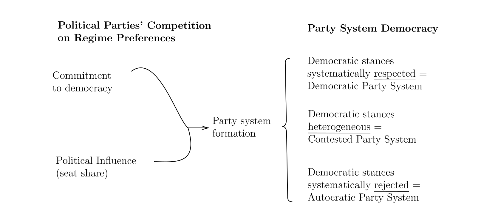
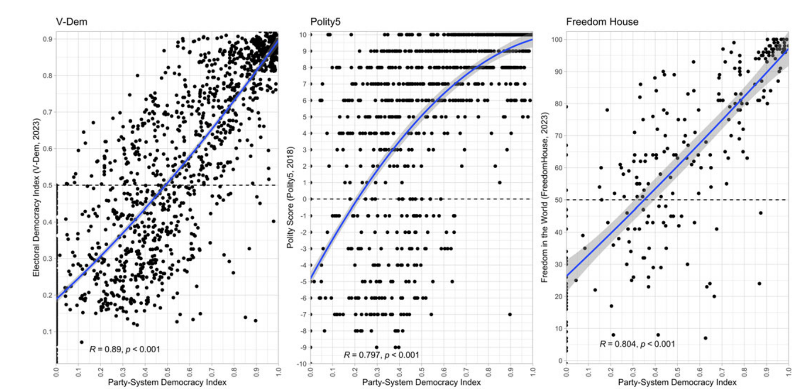
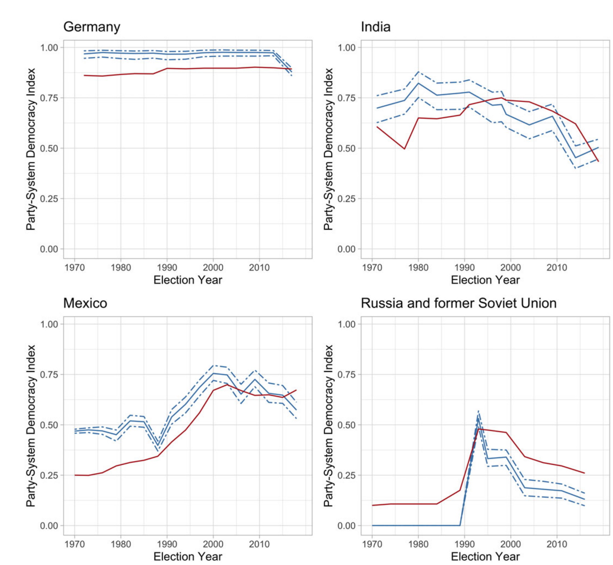
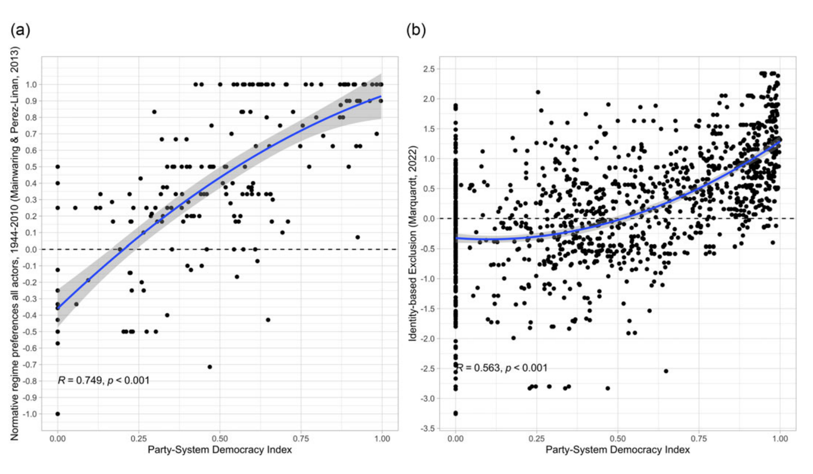
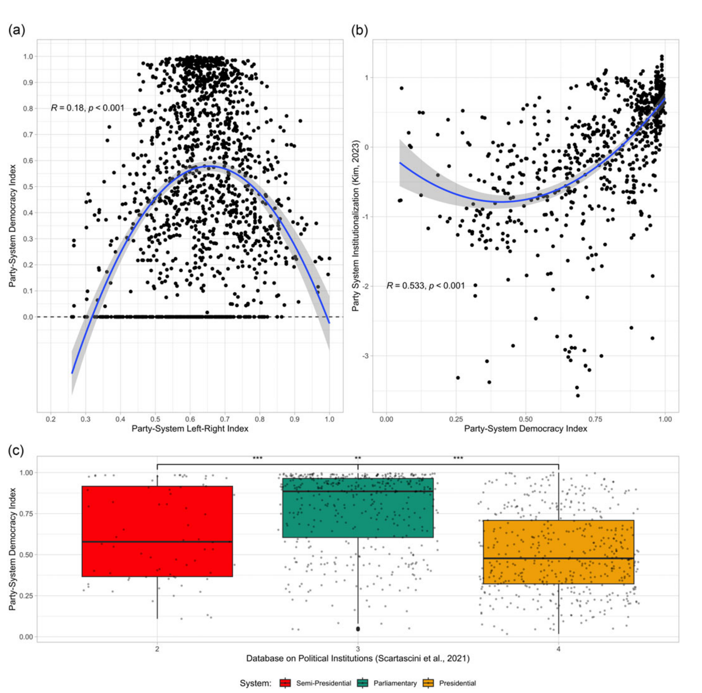
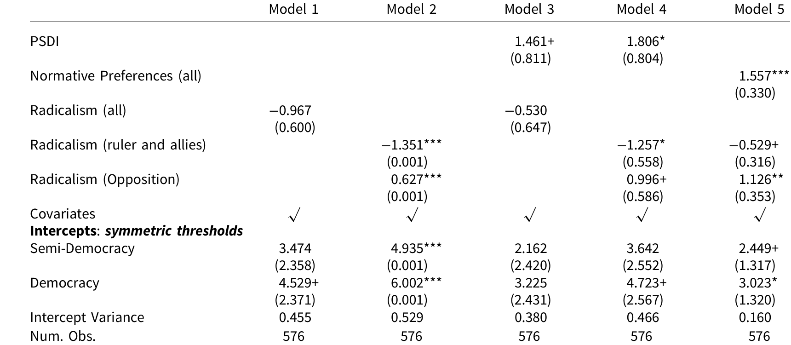
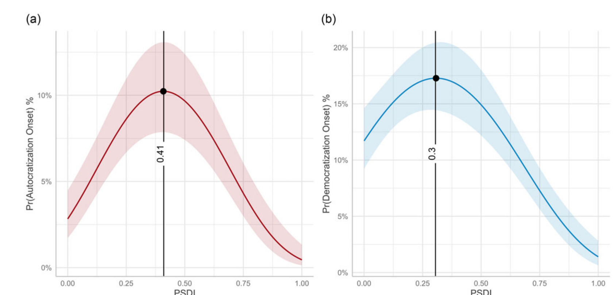
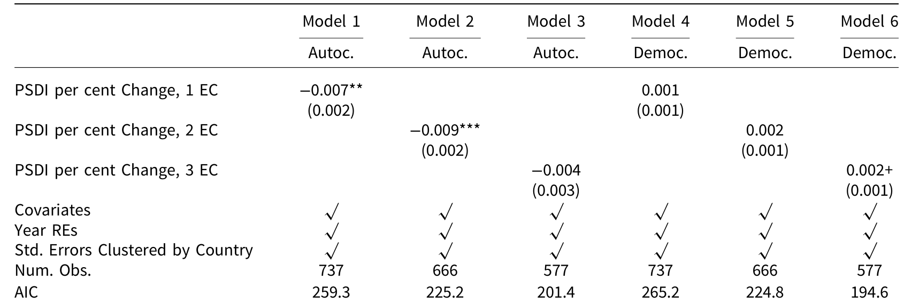
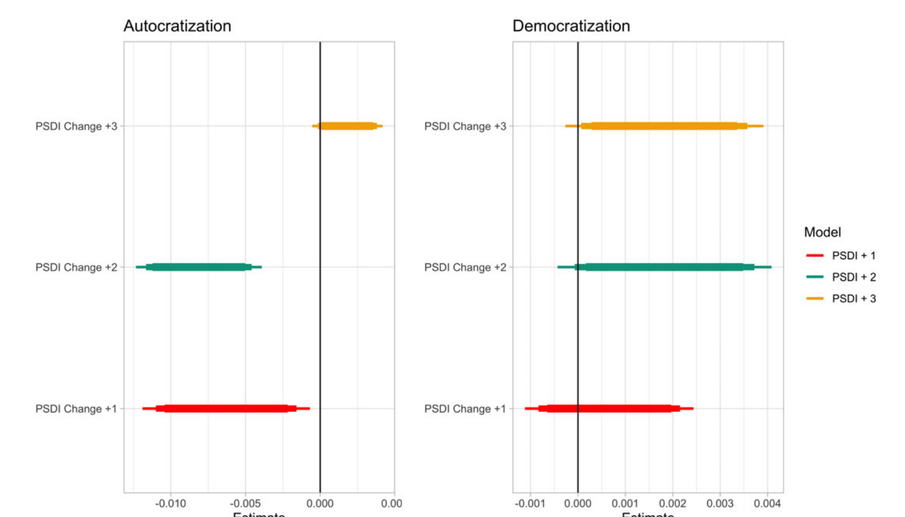

British Journal of Political Science (2025), 55, e42, 1–24
[doi:10.1017/S0007123424000887](https://doi.org/10.1017/S0007123424000887)

ARTICLE

# Party Systems, Democratic Positions, and Regime Changes: Introducing the Party-System Democracy Index

Fabio Angiolillo [1], Felix Wiebrecht [2] and Staffan I. Lindberg [1]

1 Department of Political Science, University of Gothenburg, Gothenburg, Sweden and 2 Department of Politics, University of
Liverpool, Liverpool, UK
[Corresponding author: Fabio Angiolillo; Email: fabio.angiolillo@gu.se](mailto:fabio.angiolillo@gu.se)

(Received 14 February 2024; revised 16 August 2024; accepted 5 November 2024)

Abstract

One of the most important global political developments is the current wave of autocratization. Most
research identifies this as an executive-led process, while others highlight the role opposition actors play in
resisting it. We combine this work into a common framework asking, how (anti-)democratic are party
systems? Party-system literature emphasises and measures policy differences, while we conceptualise party
systems’ democratic positions highlighting to what extent divergent regime preferences are prevalent across
parties. To estimate this dimension, we introduce the Party-System Democracy Index (PSDI), capable of
tracking regime preferences across party systems from 1970 to 2019 across 178 countries and 3,151 countryyears. We implement well-established content, convergent, and construct validity tests to confirm the PSDI’s
reliability. Finally, we also show that the PSDI is an important predictor for regime changes in either direction
and that changes in the PSDI can signal a looming regime change. This work provides a new framework for
studying regime changes and contributes to the renewal of the party-systems literature.

Keywords: democracy; autocracy; political parties; party system; regime change

Introduction

One of the most significant current phenomena in politics – the third wave of autocratization (for
example, Bermeo 2016; Lührmann and Lindberg 2019; Wiebrecht et al. 2023) – demonstrates that
political competition can be structured primarily around the question of regime type, that is,
whether a country ought to be democratic or autocratic (for example, Mainwaring and Pérez-Liñán 2013; Selçuk and Hekimci 2020). In many countries, this regime change has been identified
as a process led by executives variably termed ‘executive aggrandizement’ (Bermeo 2016),
‘incumbent takeover’ (Baturo and Tolstrup 2023), and going hand in hand with higher levels of
‘personalism’ (Frantz et al. 2021). However, a second strand of literature has also emphasised the
importance of analyzing opposition parties as key actors for resistance to autocratization (Gamboa
2022; Tomini, Gibril, and Bochev 2023; Wiebrecht et al. 2023; Cleary and Öztürk 2022).
These two branches of research highlight the need to approach this as a dimension of the party
system. Yet, we lack a framework to analyze the potential differences of regime preferences within
and across party systems. The literature shows that party systems structure competition between

Authors are listed in order of contributions.

© The Author(s), 2025. Published by Cambridge University Press. This is an Open Access article, distributed under the terms of the Creative
Commons Attribution licence [(https://creativecommons.org/licenses/by/4.0/),](https://creativecommons.org/licenses/by/4.0/) which permits unrestricted re-use, distribution and
reproduction, provided the original article is properly cited.

parties primarily on policy positions (Sartori 1976), such as economic (Mair 1997; Jolly et al. 2022;
Dalton 2008), religious, as well as cultural (Abou-Chadi and Wagner 2020; Dassonneville, Hooghe
and Marks 2024; Reiljan 2020), and ethnic dimensions (Posner 2004; Vogt et al. 2015), impacting
voting behaviour (Dalton 2008) and influencing the formation of coalitions defining the balance
of power between government and opposition (Sartori 1976; Lipset and Rokkan 1967;
Panebianco 1988).
However, recent research shows that in many autocratizing countries, differences around
economic ideologies and/or cultural divides have become overshadowed by conflicts around
regime preferences as such (McCoy, Rahman, and Somer 2018; McCoy and Somer 2019; Selçuk
and Hekimci 2020). It is therefore essential to capture the extent to which diverging regime
preferences are present in party systems and how prevalent they are. This is not the least the case
since this party-system dimension is possibly also crucial to explaining the advance or resistance of
regime changes in either direction (Mainwaring and Scully 1995; Ong 2022; Medzihorsky and
Lindberg 2024; Gamboa 2022). To what extent is a party system (anti-)democratic?
To answer this question, we introduce and provide a conceptualization of party systems’
democratic positions, that is, the prevalence of preferences for democracy or autocracy in a party
system. We place party systems on a continuum in which regime preferences are homogeneous at
both ends (near-perfect commitment to democracy and absolute refusal of democratic
preferences) while they are heterogeneous at intermediate levels. In addition, we provide a
new empirical measure to estimate party systems’ democratic positions, the Party-System
Democracy Index (PSDI), and validate it extensively empirically. Finally, we also show that party
systems’ democratic positions are a significant predictor of regime changes in either direction.
Results show the non-linear relationship between PSDI and onsets of democratization as well as
autocratization, where countries experiencing intermediate levels of PSDI are more likely to be
exposed to regime changes. We also present evidence for negative changes in PSDI triggering
autocratization onsets and that positive changes in PSDI are associated with democratization
onsets, though more weakly.
This article makes three contributions. First, complementing other structural factors of party
systems such as the number of parties, their institutionalization, closure, nationalization, and
fragmentation (Lijphart 1999; Blondel 1968; Duverger 1959; Casal Bértoa and Enyedi 2016;
Mainwaring 2018; Caramani 2004), we introduce a neglected dimension of party systems, namely
their democratic positions. This dimension allows us to capture the prevalence of regime
preferences for democracy and autocracy within and across party systems. As such, our work is
the first to our knowledge to estimate the position of a party system on a democracy-autocracy
continuum and responds to recent calls to study ‘regime cleavages’ in more detail (McCoy,
Rahman, and Somer 2018; McCoy and Somer 2019; Selçuk and Hekimci 2020).
Second, we introduce an empirical measure that can capture this dimension cross-nationally.
The PSDI has extensive global coverage at the party-system level (178 countries from 1970-2019)
which is broader than any other party-system variable and allows scholars to link this new
dimension of party systems with national-level outcomes. We corroborate its validity following
Adcock and Collier’s (2001) framework and highlight content validity by showing that the PSDI
corresponds well to regime types and different measures of democracy. Additionally, we
demonstrate convergent validity by testing its relationship with related measures such as
normative regime preferences and power-sharing among social groups. Finally, we perform
construct validation by linking the PSDI to party systems’ left-right economic dimensions, party
system institutionalization indices, and constitutional types. Additionally, we also replicate
Mainwaring and Pérez-Liñán's (2013, Chapter 4) findings on episodes of democratization in Latin
America, and replace their variable on ‘normative preferences for democracy’ with the PSDI.
Third, extending the long tradition of research on democratization and autocratization (for
example, Bermeo 2016; Lührmann and Lindberg 2019; Lindberg, 2006; Diamond 1999), we test
the relationship between levels and changes in PSDI and episodes of democratization and

autocratization. Our results highlight the importance of analyzing all actors, that is, government
and opposition, simultaneously in studying regime changes since they may all advance or resist
such developments. Here, we combine findings from recent work on regime changes highlighting
either the role of the executive (Bermeo 2016) or the opposition (Gamboa 2022; Tomini, Gibril,
and Bochev 2023) into a common framework.
The PSDI provides a new tool to understand party competition across the globe and its
consequences for political institutions and broader society. We highlight four implications and
possible applications beyond the focus on regime change in this article. First, it may help future
research understand when and why mobilization for democracy and autocracy takes place.
Second, the PSDI provides insights into government coalitions’ and opposition groups’
commitment to democracy. Third, current debates around voters’ susceptibility to vote for antidemocratic parties (for example, Svolik 2019) may also benefit from taking a broader perspective
and incorporating party-system factors such as the PSDI into their analysis. Finally, party-system
characteristics such as the PSDI should also provide additional explanatory power in
understanding divergent policy outcomes across countries and regimes.

Conceptualizing Democratic Levels in Party Systems
The world is facing a large wave of autocratization meaning that not only are global levels of
democracy declining but also that several countries have become autocracies in recent decades
(Wiebrecht et al. 2023). Attributed to leaders such as Erdoğan and Orbán, autocratization has
largely been described as an executive-led process (Bermeo 2016; Lührmann and Lindberg 2019;
Sato and Wiebrecht 2024). While this is an accurate representation, recent research also points to
the important role of the opposition parties in instances of autocratization (Gamboa 2022; Cleary
and Öztürk 2022; Wiebrecht et al. 2023; Laebens and Lührmann 2021; Tomini, Gibril, and Bochev
2023). Their preferences and actions are also decisive for outcomes in autocratization processes as
they may resist it with varying success.
The existing literature on democratization similarly focuses on individual parties and their
elite-led episodes of democratization (Riedl et al. 2020; Slater and Wong 2013; Kavasoglu 2022).
This line of work shows that incumbent elites often purposefully change their regime preferences
to stay in power and therefore come to initiate democratization episodes. Others also highlighted
opposition parties’ fundamental role as a driving force whose democratic regime preferences can
lead to democratization (Ong 2022; Gandhi and Ong 2019; Wahman 2013). In sum, most research
on regime change looks at government and opposition actors in isolation, while both exist in a
broader institutional setting simultaneously. Therefore, a comprehensive approach is needed in
studying regime change that can account for government and opposition positions
simultaneously.
We propose that analysing party systems can provide such a comprehensive approach and
combine research on executive and opposition actions. Party systems structure the competition
between individual parties allowing them to develop competing policy positions (for example,
economic, religious, and ethnic) and influencing the formation of coalitions (Sartori 1976; Lipset
and Rokkan 1967; Panebianco 1988). Party systems have key implications beyond mere party
politics. Previous literature has, for instance, identified party-system characteristics as important
in determining voting behaviour including for anti-political establishment parties (Dalton 2008;
Casal Bértoa and Rama 2020) polarization in society (Lupu 2015; Bischof and Wagner 2019), and
decentralization (Riedl and Tyler Dickovick, 2014). As such, they are also likely to be important
factors regarding regime changes.
Previous work in this area has predominantly focused on the structural characteristics of party
systems. Among others, these include the number of parties and party systems’ closure, volatility,
institutionalization, and nationalization (Lijphart 1999; Blondel 1968; Duverger 1959; Casal

Bértoa and Enyedi 2016; Mainwaring 2018; Caramani 2004). Yet, the consequences of these
structural characteristics on political regimes remain debated (Valentim and Dinas 2024; Casal
Bértoa 2017).
Building upon these structural dimensions, we suggest that party systems are also a reflection of
individual parties’ political and ideological positions. In other words, party systems are also
defined by how prevalent certain ideas are across all parties. While governments are naturally in a
privileged position to enact their preferences, due to veto players on different levels, they may not
always directly translate into policies and outcomes. Previous research shows that the positions of
the opposition and the party system as a whole also matter for welfare (Jensen and Bech Seeberg,
2015) and immigration policies (Abou-Chadi 2016). Yet, in contrast to party positions that have
been measured using various methods and data (for example, Jolly et al. 2022; Pemstein et al. 2022;
Gemenis 2013; Carroll and Kubo 2019), estimating overall party-system positions of this kind
received much less attention.
We suggest that one of the most important dimensions of party systems for analysing regime
changes is the prevalence of democratic (and authoritarian) preferences. Already Mainwaring and
Pérez-Liñán (2013) stressed the importance of ‘normative preferences for democracy’ of national
political elites as a source of democratic regime stability in Latin America. Recent studies suggest
that ‘democracy cleavages’ – differences over conceptions of democracy beyond conventional
socioeconomic cleavages – are potential drivers of autocratization (Somer and McCoy 2018), for
instance, in the cases of Turkey (Selçuk and Hekimci 2020) and Venezuela (García-Guadilla and
Mallen 2019). This points to the pressing task of accurately measuring the extent to which party
systems are democratic or authoritarian on a global scale.
Although related (as shown below), the prevalence of democratic and authoritarian preferences
is also different from countries’ democratic levels. Naturally, in a near-perfect liberal democracy,
most parties and actors are expected to have a strong preference for democracy. The reverse is also
expected at the other end of the continuum. Nevertheless, most countries in the world are not
found at those extremes. In addition to famous examples such as Weimar Germany failing under
the rise of the Nazi party (De Juan et al. 2024), one can now find anti-pluralist parties in most
democracies and they often influence their competitors’ policies and agendas (Medzihorsky and
Lindberg 2024; Abou-Chadi and Krause 2020). Similarly, in authoritarian regimes, ruling parties
may decide to hold onto power in their restrictive systems or liberalize them subsequently (Riedl
et al. 2020; Slater and Wong 2013; Ziblatt 2017; Slater and Wong 2022; Treisman 2020), while
opposition parties may also either advocate democratic transitions or favour the status quo regime
type, for instance, because they were co-opted (Howard and Roessler 2006; Reuter and
Robertson 2015).
Figure 1 illustrates this conceptualisation visually. In any party system, competition may arise
around regime preferences on the abovementioned democratic-authoritarian continuum. The
nature and extent of this competition depend on individual political parties’ regime preferences
and the political influence they yield in their respective party systems. The latter may be most
easily identified by parties’ seat shares in parliament. Together, parties’ preferences and influence
constitute the latent democratic level of the whole party system where democratic stances may be
either respected, contested, or rejected. Measuring the configuration of democratic preferences
taking into account the strength of each party is a novel way of capturing this dimension of the
party system and conceptually distinct from democracy levels. We suggest that all party systems
can be placed on a continuum ranging from all parties being highly committed to democracy to all
parties being decidedly anti-pluralist, that is, authoritarian.
We illustrate the reasoning with three cases along this continuum. First, in near-perfect liberal
democracies, the overwhelming majority of parties will be committed to democracy. Regime
preferences are therefore not expected to structure party competition. Instead, differences in
policies, either captured by parties’ positions on the traditional economic left-right or GAL-TAN
dimensions (Gabel and Huber 2000; Hooghe et al. 2010) or on newly-emerging topics such as

Figure 1. From political parties to party-system democratic levels.

migration and integration (Polk and Rosén 2024; Bakker, Jolly, and Polk 2022) will structure
political parties’ interactions. Examples here include Norway and Switzerland, where a number of
parties represent different positions and ideologies but where preferences around regime types do
not structure the party system.
At the other end of this continuum, closed authoritarian regimes and hegemonic party systems
also feature homogeneous preferences, but for autocracy. Again, therefore, regime preferences are
not expected to structure political parties’ interactions. At the extreme, we find closed autocracies
like China and Cuba where opposition parties are de jure or de facto disbanded, the ruling party
fully controls the legislative chamber and legally does not allow for alternative political preferences
(Angiolillo 2023). Thus, either de jure or de facto, debates around regime types are extremely
limited, if not entirely absent.
Finally, in the middle, preferences for and commitment to regime types are heterogeneous.
The more differences concerning democratic commitments characterize the party system, the
more the latent trait of the party system’s democratic level will be contested. Between the two
extremes on the democratic-autocratic continuum, parties’ interactions within the party system
will be also structured around frictions on regime preferences, above and beyond the
dimensions that existing party-system indices measure. When this (new) dimension is
contested, one can observe what scholars term ‘democracy cleavages’ (Selçuk and Hekimci 2020;
García-Guadilla and Mallen 2019). It is also these contexts where we would expect most regime
changes to begin. In other words, for episodes of autocratization or democratization to be
initiated, there have to be actors in the party system advocating for changes that take the regime
in either direction.
One implication of the theoretical expectations above is that if a party system moves from one
of the extremes towards the middle along this dimension, it should be an ‘early warning’ sign of
increasing potential for a regime change. Democracies’ party systems moving toward intermediate
levels indicates an emerging anti-pluralism in the system that could translate into either executives
engaging in aggrandizement (Medzihorsky and Lindberg 2024; Bermeo 2016) or into anti-regime
opposition parties shifting the structure of political competition to new areas of contestation
(Svolik et al. 2023; Mudde and Kaltwasser 2012). Recent contributions also highlight that a large
part of the electorate, even in democracies, is ready to support undemocratic actions, especially in
polarized political contexts (Graham and Svolik 2020). Hence, changes in parties’ appeals to the
electorate and their commitment to democratic values can have dire consequences on the overall
party system. As a result, party systems’ regressions along the democratic-autocratic continuum
can then signal creeping movements towards more contested regime preferences. This could
progressively stir away political parties’ discussions on policy preferences and, instead, pave the

way for autocratization by attacking accountability mechanisms (Laebens and Lührmann 2021;
Sato et al. 2022; Linz 1978).
Similarly, if the party system in an autocracy moves toward intermediate levels, it could
indicate an increasing probability of subsequent democratization. In closed dictatorships, it could
foreshadow ruling elites’ increasing acceptance of (limited) pluralism while in less dictatorial
settings it could signal the opening of fairer multi-party elections that in themselves can contribute
to democratization (Lindberg, 2006; Donno 2013). An overall shift away from authoritarian
stances in the party system may then signal a decision among governing parties to liberalize the
regime entirely (Slater and Wong 2013; Riedl et al. 2020). At the same time, an improvement
toward the middle can also be seen if a (liberal) opposition party or parties contribute to this
change due to an increase in their (electoral) strength (Ong 2022; Wahman 2013).

Measuring the Party-System Democracy Index
To capture the latent democratic position of party systems across time and space, we created the
Party-System Democracy Index (PSDI). The PSDI measures how preferences for democracy or
autocracy are distributed in party systems across the globe by taking stock of parties’ individual
levels of anti-pluralism and aggregating them on the party-system level taking parties’ relative
strength into account. This measure is computed drawing from the V-Party dataset, which is the
largest resource on political parties available, covering 3,151 elections across 178 countries from
1970 to 2019 and measures 3,467 political parties (Lindberg et al. 2022; Pemstein et al. 2022).
V-Party generates estimates through the leading V-Dem expert-rating methodology (Pemstein et al.
2022; Coppedge et al., 2023). Yet, the V-Party raters were recruited mostly from outside
the regular V-Dem pool of experts for their expertise on political parties in specific countries. [1]

The V-Party data collection also took place separately and at a different time from the regular
V-Dem coding period, making it unlikely that experts remember how they rated for V-Dem when
they coded for V-Party. The questions posed in the V-Party expert survey focusing on stances
expressed by individual parties are also independent of and of a different nature than V-Dem
surveys focusing on country averages. In addition, V-Party’s Item Response Theory (IRT) model is
able to produce high and low bounds when aggregating expert coding that functions similarly to
traditional confidence intervals. Finally, V-Party indicators and indices have been validated by
previous studies (Düpont et al. 2022; Medzihorsky and Lindberg 2024). We thus feel confident in the
quality and independence of the V-Party data. To estimate the PSDI, we use the following equation:

PSDI = 1 − Σ(p=1 to N) (API_pt * ws_pt) (1)

Where p represents political parties, t is the time of the election-year, and ws the weight for each
party’s seat share within the lower house (v2paseatshare), while API is the anti-pluralist index
(v2xpa_antiplural). In creating Equation 1, we follow two main steps leveraging on (i) the antipluralist index by Medzihorsky and Lindberg (2024) and (ii) the party-system level as a whole.
In the first step, the PSDI builds on V-Party’s anti-pluralist index (API), which is an aggregated
measurement of parties’ commitment to political pluralism, [2] respect of political opponents,
defence of minority rights, and rejection of political violence. The API ranges from 0 (highly
pluralistic) to 1 (highly anti-pluralistic) (Medzihorsky and Lindberg 2024), and captures the extent
to which a party is committed to the core elements of democratic standards (Linz 1978).

1 Of all (N = 711) V-Party experts, 40 per cent overlap (N = 287) with raters that contributed also to at least one of the 15
surveys/areas of the V-Dem dataset. This provides confidence in the substantial differences between experts’ coding decisions
in both datasets.

2 Here referring to free and fair elections with multiple parties, freedom of speech, media, assembly, and association.

It is worth emphasizing that this conceptualization of pluralism goes to the heart of parties’ stance
toward democracy as a political system and is distinct from policy stances. The API has also been
validated extensively making it a suitable index to build upon (Medzihorsky and Lindberg 2024).
In the second step, as parties’ influence on the political system changes according to their
electoral performances, we weight the anti-pluralism levels by parties’ seat shares in parliament,
which is a common approach to account for parties’ relative size and political power (Reiljan
2020). Moreover, this approach also reduces some possible V-Party data structure limitations
since ‘as the general rule experts coded data for all parties that reached more than 5 per cent of the
vote share at a given election’ (Lindberg et al. 2022, p.5). As shown in the Appendix, we find that
weighting by vote share would mildly increase missingness, particularly in countries using singlemember district electoral systems, where the composition of parliament is well-known but
aggregated national voting results may not be known.
Lastly, we rescale the PSDI to range from 0 to 1 and the resulting measure is subtracted from 1.
This allows us to structure the PSDI so that lower levels are associated with more authoritarian
party systems and higher levels with more democratic ones. This direction is intuitively
comparable across countries, time, and other prominent cross-national measurements (for
example, V-Dem, Polity V, Freedom House).
To summarize, the PSDI is the empirical result of (i) the anti-pluralist position of each political
party p in the party system, (ii) weighting political parties by their seat shares, and finally,
(iii) computing the democratic stances of the overall party system. [3] As a result, we leverage the
wealth of data from party-country-election-year to reach a continuous variable at the countryelection-year, ranging from 0 to 1, with values closer to 0 corresponding to more authoritarian
party systems, and values closer to 1 translating into party systems being more democratic. [4]

Along with the PSDI, we provide two sub-component variables related to the government’s and
opposition’s democratic levels, [5] which brings at least three additional benefits. First, we increase
the transparency of the PSDI, allowing for the inspection of the sub-components independently
of, and together with, the PSDI. Second, these two sub-components can help develop further
research on the government’s and opposition’s regime attitudes separately, connecting them with
citizens’ voting behaviours (Graham and Svolik 2020; Laebens and Öztürk 2021) and inter-party
coalition and coordination challenges (Arriola 2013; Wahman 2013), among others. Third, by
providing PSDI’s sub-components, it is possible to better unpack the origins of regime changes
and assess with higher precision the role of governmental parties’ democratic position (Bermeo
2016; Lührmann and Lindberg 2019) compared to the entire party system’s.

3 To maximize our sample, we define absolute authoritarian party systems (that is, PSDI = 0) as those that do not allow any
opposition party to run for elections. If and only if applying Equation 1 to aggregate parties’ anti-pluralist position at the
systemic level fails to find any opposition party and the democratic level (as defined by the electoral democracy index by
Coppedge et al. (2024) of that country in a given year is lower than 0.5 (that is, lower than the mean of all country-year in the
sample computed by the IRT model in Coppedge et al. (2024, p.32), the PSDI assigns a value of 0. We acknowledge that this
value is diverging from Sartori’s (1976) definition of party systems. Hence, we recommend users following Sartori’s (1976)
more stringent definition of party systems to consider excluding values equal to 0 in their analysis.

4 Conceptually, Sartori’s (1976) definition of party systems is – in some respects – highly demanding, and we concur with
previous literature that party systems can sometimes exist also at lower thresholds than the one set by Sartori (Mainwaring,
Bizzarro, and Petrova 2018, p.18). Empirically, the approach proposed in this article is in line with several prominent partysystem indices such as Dalton (2008), Kim (2023), and Bizzarro et al. (2018).
5 We group anti-pluralist attitudes based on V-Party’s government support variable that measures whether a party belongs to
the governing coalition or opposition. The equation for the PSDI government sub-group is:

PSDI_government = PSDI − [Σ(p=1 to N) (API_opt * ws_opt)] (2)

The PSDI opposition sub-group follows Equation 2 substituting o with g where gp represents parties in the governing coalition,
op represents parties in the opposition.

Figure 2. PSDI and different measures of democracy.

Validation

We follow Adcock and Collier’s (2001) framework in validating the PSDI performing content,
convergent, and construct validation.

Content Validation

Figure 2 compares the PSDI to the three most prominent continuous measures of democracy:
V-Dem’s Electoral Democracy Index (EDI) (Coppedge et al. 2024), Polity Score by Polity5, and
Freedom House’s Freedom in the World. According to the ‘adequacy of concept’ by Adcock and
Collier (2001, p. 538), we should expect that most parties in highly democratic countries (closer to
1, +10, or 100 in the datasets’ respective scales) do not have preferences for undermining the
political system as such. Therefore, parties’ individual scores on the anti-pluralism index should in
most cases be low and, consequently, the PSDI should be closer to 1 (more democratic party
systems). Conversely, authoritarian party systems where formal opposition is not allowed should
have a high density at the lowest democracy levels.
Figure 2 confirms this expectation showing that there are three quite distinct fitted lines across
the three measures pointing to the linear relationship between levels of democracy and partysystem democratic positions. The high density of observations around the top-right corners in the
three panels in Figure 2 shows the commitment to pluralism from the vast majority of parties in
high-level democracies. Conversely, the high density of observations at the bottom-left corners in
the three panels is mainly driven by de jure or de facto lack of opposition parties in closed
autocracies.
Figure 2 also shows more scattered observations when PSDI is lower than 0.8. This illustrates
that both electoral democracies and electoral autocracies can have party systems that are relatively
more democratic or authoritarian. This result highlights how parties’ commitment to democratic
stances can have a higher variation in these regimes, which previous literature shows as more
likely to be exposed to regime transformations (Bermeo 2016; Diamond 2015; Lührmann and
Lindberg 2019). Between the two extremes of highly democratic or authoritarian party systems, we
find scattered observations when focusing on electoral autocracies and democracies (or hybrid
regimes). The primary reason has to do with the heterogeneity in democratic commitment among
parties involved in the party system, which makes it a contested space. In electoral autocracies, the

limited freedoms opposition parties have in competing in free and fair elections result in severely
undermining alternative regime preferences (for example, democratic). In electoral democracies,
the rise of anti-democratic parties could drive the PSDI away from the top-right corners and shift
the party system to a more contested space.
[Figure A1 in the Appendix shows Figure 2 through a density plot. Figures A2–A7 in the](https://doi.org/10.1017/S0007123424000887)
Appendix report each country’s PSDI levels between 1970-2019. We also provide an alternative
measurement using the PSDI distribution by regime types according to the Regimes of the World
[measure (Lührmann, Lindberg, and Tannenberg 2017) (Figure A8 in the Appendix), which shows](https://doi.org/10.1017/S0007123424000887)
that the highest levels of PSDI are concentrated in liberal democracies, while it has more variation
in electoral democracies and moves towards 0 in autocracies.

Four Typical Cases
In Figure 3, we present the change in the PSDI over time in four typical cases: (i) a liberal
democracy (Germany), (ii) an episode of autocratization in India since 2008 (Edgell et al. 2023),
(iii) an episode of democratization in Mexico between 1988 and 2001 (Edgell et al. 2023), and (iv)
the Soviet Union as a closed autocracy (1917-1990) and the subsequent Russian Federation as an
electoral autocracy since 1991.
For stable liberal democracies like Germany, the party system is characterized by high levels of
commitment to democratic values across all parties. In addition, the German case also shows that
once an anti-pluralist party enters parliament, the PSDI captures the change and decreases
accordingly. The rise of the decisively anti-pluralist party Alternative for Germany (AfD)
(Arzheimer and Berning 2019) changed the German PSDI from 0.97 in 2013 to 0.87 in 2017, a
statistically significant decrease in Figure 3. Meanwhile, Germany’s EDI remains virtually
unchanged (the small drop between 2013 and 2023 is not statistically significant) (Coppedge
et al. 2024).
The autocratization case of India illustrates that the PSDI can be an ‘early warning’ indicator
of a higher probability of democratic backsliding. The gradual decline in the PSDI dimension of
the party system started in the 1980s, predating the onset of autocratization as measured by the
EDI by over a decade. In Figure 3, India’s PSDI declined from 0.82 in 1980 to 0.45 in 2014, while
the EDI was relatively stable with a non-statistically significant change from 0.65 in 1980 to 0.62
in 2014. It captures the increasingly different regime preferences between the Indian National
Congress (INC) and the Bharatiya Janata Party (BJP), and that Modi’s BJP not only became
more anti-pluralist but also increased its size in parliament. The BJP’s anti-pluralist stances
became an effective appeal to voters, especially in social contexts with high fractionalization of
other cleavages, such as ethnic and religious (Chhibber and Verma 2018; Harriss 2015). The
Indian case presents some evidence of how the PSDI dimension became increasingly salient,
changing the nature of inter-party interactions and leading to severe tensions around regime
preferences.
In Mexico, the hegemonic electoral authoritarian government under the Institutional
Revolutionary Party (PRI) that allowed opposition only formally (Magaloni 2006) led to a fairly
low PSDI for a long time. [6] During the 1990s, the PSDI gradually increased when PRI’s internal
reforms led to a reduction of anti-pluralism in the ruling party (Langston 2017), a decline in its
share of seats, and the emergence of other more pluralist parties in the party system (Levitsky et al.
2016). Figure 3 shows how the PSDI captures this and reaches its peak following the 2000 elections
that led to the first alternation in power and, according to many observers, the inauguration of
democracy in Mexico. With the PRI in opposition with a smaller number of seats in parliament,
the PSDI increased from 0.4 in 1988 to 0.76 in 2000 with a similar change in EDI passing from
0.34 in 1988 to 0.67 in 2000. This elite-led democratization (Riedl et al. 2020), which allowed

6 PRI was in power since 1929 but our measure ranges from 1970 to 2019.

Figure 3. The PSDI and regime stability, democratization, and autocratization episodes.
Note: The dotted lines refer to the PSDI’s confidence intervals, while the two solid lines represent the PSDI (blue) and EDI (red) The lower
and upper bounds are calculated by substituting the API with its low/high intervals in Equation 1 (Coppedge et al. 2024, 33).

national elites to liberalize the country and the party system simultaneously, led to changes in
both, PSDI and EDI, and therefore the PSDI does not precede changes in EDI.
Autocracies may be closed completely or their party systems may be dominated by ruling
parties (Angiolillo 2024), like in Russia. Figure 3 shows the flat PSDI score at 0 for the Soviet
Union’s single-party regime between 1970-1989. After the fall of the Soviet Union, the PSDI
increased, following the democratization of the party system. However, this was followed by a first
drop in the PSDI already under Yeltsin (1991-1999), and a second erosion of the party system
under Putin and the establishment of his party, United Russia (Reuter 2017). Between 1993 and
2003, the PSDI moved from 0.53 to 0.19, while the EDI had a milder, yet statistically significant,
decrease from 0.48 to 0.34. United Russia can be seen as a hegemonic ruling party, which resonates
with the low PSDI levels as these regimes allow formal opposition parties, but their chances of
victory are marginal and even they do not have a strong commitment to democracy, which reflects
the lower PSDI score than Mexico during the PRI era.

Figure 4. Correlations of the party-system democracy index (PSDI) and related concepts.

[Figure A9 in the Appendix reproduces the case studies in Figure 3 by disaggregating the PSDI](https://doi.org/10.1017/S0007123424000887)
into its two possible sub-components of government and opposition democracy positions,
providing further evidence on the aggregate parties’ (anti)democratic drivers. In additional
[content validity tests, a paired plot (Figure A10 in the Appendix) demonstrates that the PSDI](https://doi.org/10.1017/S0007123424000887)
indeed captures party-system dynamics that differ from merely measuring the anti-pluralism
index of the governing coalition, and compare with studies (typically focusing on Western
Europe) using party system-level indicators measured with vote-share weights instead of seatshare (for example, Dalton 2008; Reiljan 2020); we recompute Equation 1 using vote shares.
[Figure A11 in the Appendix shows that there is no major difference between the two measures.](https://doi.org/10.1017/S0007123424000887)
However, there is a marginal 3.8 per cent of the sample that takes extreme values depending on the
[selected weight (cases listed in Table A1), which strengthens the confidence in using the seat share](https://doi.org/10.1017/S0007123424000887)
[and we articulate the reasons in the Appendix. Lastly, Figure A12 shows that there are no](https://doi.org/10.1017/S0007123424000887)
significant differences across majoritarian, proportional, and mixed electoral systems.

Convergent Validation
For tests of the convergent validity, we use two measurements, elites’ preferences for democracy
and distribution of power by social groups, of varying similarity to the PSDI.
Panel A in Figure 4 shows the PSDI’s relationship to the ‘normative preferences for democracy’
across all elites in Latin American countries between 1970-2010 developed by Mainwaring and
Pérez-Liñán (2013). Although Mainwaring and Pérez-Liñán's (2013) measure focuses on elites
and the PSDI on party systems, these two measures are expected to be highly correlated.
Mainwaring and Pérez-Liñán (2013) variable ranges from -1 (absence of democratic preferences)
to +1 (high democratic preferences). Panel A corroborates our expectation, further strengthening
the convergent validity of the PSDI. Moreover, PSDI’s coverage extends further than only Latin
American countries and features a global sample.
In Panel B in Figure 4, we explore the PSDI’s convergent validity further by using Marquardt’s
(2021) ‘Identity-based exclusion’ measure, [7] a latent variable aggregating the V–Dem and Ethnic

7 We would like to thank Kyle Marquardt for sharing this data with us.

Power Relations Projects’ inclusion variables by Vogt et al. (2015), which adjusts the distribution
of power by social groups accounting for the political relevance of such groups. We expect
convergence between these two measures since a somewhat equal power distribution across social
groups is almost definitionally a characteristic of a democratic party system (Dahl 2008). Panel
B corroborates this expectation further strengthening the convergent validity of the PSDI.

Construct Validation

We organize the construct validation in two complementary approaches. First, we test the PSDI
against different concepts expected to be correlated. Second, we replicate the findings by
Mainwaring and Pérez-Liñán (2013) on the relationship between elites’ normative preferences for
democracy and democratization.
Panel A in Figure 5 compares the PSDI with the party-system economic left-right dimension,
which is computed using Equation 1 and replacing ‘API’ with ‘economic left-right’ from the VParty dataset (Lindberg et al. 2022). This generates values for every party system on a scale from 0
(extremely left-wing) to 1 (extremely right-wing). We expect the PSDI index to have a secondpolynomial correlation with left-right levels since democratic regime preferences can be
undermined when party systems’ centrifugal directions are predominant (Medzihorsky and
Lindberg 2024; Schamis 2006; Weyland 2013; Sartori 1976). The results shown in Panel
A conform with our expectations of party systems across the globe. Furthermore, we retest the
same convergence by using CHES Europe data on left-right economic positions (Jolly et al. 2022),
[which yielded similar results as shown in panel A in Figure A13 in the Appendix.](https://doi.org/10.1017/S0007123424000887)
Panel B in Figure 5 shows the correlation between the PSDI and party-system
institutionalization index as computed by Kim (2023), which is limited to democracies around
the world and captures the following concepts: aggregate legislative volatility, aggregate
government volatility, minor party performance, party distinctiveness, and party switching. Kim’s
(2023) index ranges from lack of party system institutionalization (-3) to highly institutionalized
(1). Previous literature finds that more institutionalized party systems are associated with higher
levels of democracy (Chiaramonte and Emanuele 2022; Ridge 2023; Casal Bértoa and Enyedi
2021), which leads to the expectation that more democratic party systems also tend to be more
institutionalized. Panel B corroborates this expectation with the PSDI. We also test for an
alternative measurement presented by Casal Bértoa and Enyedi (2022) on ‘party system closure’ in
[Europe, which yields similar results as reported in panel B in Figure A13 in the Appendix.](https://doi.org/10.1017/S0007123424000887)
Panel C in Figure 5 shows the correlation between the PSDI and constitutional types
differentiating between presidential, semi-presidential, and parliamentary, drawn from
Scartascini, Cruz, and Keefer (2021). The literature points to higher levels of democracy in
parliamentary systems compared to presidential ones (Linz 1990; Stepan and Skach 1993; Boese
et al. 2021), which are corroborated by results in panel C where parliamentary systems have
significantly higher levels of PSDI than other constitutional typologies. We also use Cheibub’s
[(2007) data to replicate this convergence in panel C in Figure A13, which leads to similar results.](https://doi.org/10.1017/S0007123424000887)
The last construct validation entails the replication of previous findings replacing the variable
most closely related to the PSDI with it. Mainwaring and Pérez-Liñán's (2013) ‘normative
preference for democracy’ refers to the commitment to democratic norms of ruling and
opposition elites. Although their approach is limited to individuals rather than parties or party
systems, their concept relates to the overall democratic commitment of actors placed in a
favourable position to effectively influence the governance of a country. For these reasons,
‘normative preference for democracy’ and the PSDI relate to similar enough concepts to perform a
construct validity. Hence, we replicate the quantitative analysis on regime change in Latin

American countries presented by Mainwaring and Pérez-Liñán (2013, 104–105). They test how
actors’ normative preferences for democracy are, on average, the driver for regime transition from

Figure 5. Construct validation of the party-system democracy index (PSDI).

an autocracy to a semi-democracy or a democracy. Table 1 shows similar results to the original
multilevel logit models presented by Mainwaring and Pérez-Liñán (2013), where we replace their
‘normative preferences for democracy’ variable with the PSDI. This strengthens the construct
validity of the PSDI.

Empirical Application: PSDI and Regime Change
Inspired by the results of replicating the study on regime survival in Latin America, we move to
test if the PSDI is also a good predictor for a wider scope of regime changes on a global scale. We
draw from Maerz et al.’s (2023) definition of regime transformations as a ‘substantial and
sustained’ (p.5) change in democratic levels to identify positive (democratization) or negative
(autocratization) episodes of regime transformation. We focus on the onset of regime
transformation, which is defined as the year in which the autocratization or democratization
begins.

Table 1. Replication of Mainwaring and Pérez-Liñán (2013, Tab 4.2) using PSDI

Model 1 Model 2 Model 3 Model 4 Model 5

PSDI 1.461+ 1.806*
(0.811) (0.804)
Normative Preferences (all) 1.557***
(0.330)
Radicalism (all) −0.967 −0.530
(0.600) (0.647)
Radicalism (ruler and allies) −1.351*** −1.257* −0.529+
(0.001) (0.558) (0.316)
Radicalism (Opposition) 0.627*** 0.996+ 1.126**
(0.001) (0.586) (0.353)
Covariates p p p p p

Intercepts: symmetric thresholds
Semi-Democracy 3.474 4.935*** 2.162 3.642 2.449+
(2.358) (0.001) (2.420) (2.552) (1.317)
Democracy 4.529+ 6.002*** 3.225 4.723+ 3.023*
(2.371) (0.001) (2.431) (2.567) (1.320)
Intercept Variance 0.455 0.529 0.380 0.466 0.160

Num. Obs. 576 576 576 576 576

Note: Random-effects ordered logistic coefficients (standard errors) with symmetric thresholds. P-value: p<0.1+, p<0.05*, p<0.01**,
p<0.001***.

The literature suggests that regimes classified as hybrid, electoral (democracies and
autocracies), and semi-democratic are more likely to be exposed to regime transformations
(Bermeo 2016; Diamond 2015; Lührmann and Lindberg 2019; Lindberg, 2006), while highly
democratic or authoritarian regimes are on average more stable (Geddes, Wright, and Frantz
2014; Lachapelle et al. 2020; Boese et al. 2021). It seems reasonable to intuit that varying levels of
democratic commitments that structure party systems could play a role in this. At the extremes,
parties are unified in their commitment to democratic or Cheibub’sauthoritarian stances, while
heterogeneity structuring political competition in the ‘muddled middle’ can contribute to regime
transformations (McCoy, Rahman, and Somer 2018; Evans and Whitefield 1995; Selçuk and
Hekimci 2020). For these reasons, we expect:

H1a: A negative quadratic relationship between PSDI levels and onsets of autocratization

H1b: A negative quadratic relationship between PSDI levels and onsets of democratization

Previous literature shows the important role of anti-pluralist political parties coming into
power to start autocratization episodes (Medzihorsky and Lindberg 2024; Graham and Svolik
2020), which tallies with others highlighting the predominant role of the executive driving it
(Bermeo 2016; Lührmann and Lindberg 2019) and the opposition resisting it – sometimes
successfully (Gamboa 2022; Wiebrecht et al. 2023). In addition, democratic commitment may also
wane among the supporters and elites of established parties (Graham and Svolik 2020;
Krishnarajan 2023; Wuttke, Gavras, and Schoen 2022). Building on these streams of literature, we
intuit that changes in party systems on the PSDI dimension are also predictors of regime changes
by altering the probability of an onset. Accordingly, we should also expect that a negative change
in the PSDI is a predictor of autocratization episode onsets. The second hypothesis is:

H2: A negative change in PSDI is associated with an increase in the probability of autocratization

onsets.

Conversely, the literature on political parties and democratization focusing on authoritarian
parties’ elite-led episodes of democratization shows that they often purposefully change their

regime preferences to secure survival in power (Riedl et al. 2020; Slater and Wong 2013; Albertus
and Menaldo 2018; Kavasoglu 2022). Others have studied the role of opposition parties’
democratic regime preferences play as driving forces of democratization (Ong 2022; Gandhi and
Ong 2019; Wahman 2013). Taken together, we infer from this literature that changes in the overall
party system level of commitment to a more democratic regime should be of importance to the
probability of whether democratization takes place or not. We thus expect that:

H3: A positive change in PSDI is associated with an increase in the probability of democratization

onsets.

Model Specifications
To test these hypotheses, we employ probit models with year-level random effects and standard
errors clustered at the country-level. Different from the analyses above replicating Mainwaring
and Pérez-Liñán's (2013) study, we now use two dichotomous variables from the Episodes of
Regime Transformations (ERT) by Maerz et al. (2023) as dependent variables. The first captures
the onset of autocratization (1) or not (0), while the second identifies whether an onset of
democratization takes place (1) or not (0). [8]

The key independent variables in Hypotheses 1a and 1b are the PSDI level and the quadratic
PSDI level, which ensures capturing non-linear relationships of interest. In the evaluation of
Hypotheses 2 and 3, we use the change of PSDI but also compute it over different time periods to
gain further insights into the dynamics of regime transformations. Previous literature suggests that
autocratization can start shortly after an autocratic incumbent is elected into office (Laebens and
Lührmann 2021) and that the extent of autocratization can even deepen in the mid-run
(Lührmann and Lindberg 2019; Knutsen, Mokleiv Nygård and Wig, 2017). Opposed to this,
democratization often is a slower process that requires authoritarian elites’ commitment to
democratization and/or opposition parties’ gaining traction from the popular vote (Ong 2022;
Wahman 2013; Lindberg, 2006).
We also employ a set of control variables on economic, political, and social aspects. First, we
follow Mainwaring and Pérez-Liñán (2013) and Carter and Signorino (2010) and add a cubic
transformation of the regime’s age as reported by Maerz et al. (2023) ERT framework, controlling
for possible duration-dependence. Second, we use a set of economic variables from the Maddison
Project Database (MPD) in the form of one-year per cent GDP growth, GDP per capita (logged),
and one-year per cent GDP per capita change, which can influence regime stability. Third, due to a
suggested neighbourhood effect (Boese et al. 2021), we also control for the average democratic
level of the political regions with a one-year lag, as well as whether the incumbent accepted
electoral outcomes, levels of legislative constraints, and the extent of civil society participation, all
three lagged at one-year as well, as previous literature shows these variables’ importance in
possible regime transformations (Boese et al. 2021; Kim, Bernhard, and Hicken 2023; Hellmeier
and Bernhard 2023) [9] These variables are taken from the V-Dem dataset by Coppedge et al. (2024),
which is different from the V-Party dataset by Lindberg et al. (2022) from which we create the
PSDI using Equation 1. Lastly, we also control for identity-based exclusion from Marquardt
(2021), which can further explain some societal tensions.

Main Results

Figure 6 reports the predicted probability for the relationship between PSDI and autocratization
[(panel A) and democratization (panel B) onsets, while Table A3 reports the full results testing H1a](https://doi.org/10.1017/S0007123424000887)

8 These are rare events that during the 1970-2019 period happened in 135 and 244 country-years out of 8,454 country-years,
respectively.

9 By contrast, we do not use countries’ EDI since the ERT is already based on changes in the EDI.

Figure 6. Predicted probabilities of autocratization and democratization onsets by PSDI.

(Models 1–3) and H1b (Models 4–6). While the PSDI levels are significant in predicting
autocratization and democratization onsets, the second polynomial function of PSDI
provides strong evidence for the non-linear relationship that the PSDI has on both regime
[changes. In panel A, Figure 6 shows graphical results from Table A3, Models 1–3. The curve](https://doi.org/10.1017/S0007123424000887)
highlights the non-linear and negative relationship between PSDI and predicted probabilities of
autocratization expressed in percentage points. When the PSDI is at 0.41, it is associated with the
highest probability of autocratization onset at 10.23 per cent. On the one hand, this can be the
result of a deterioration in party systems’ democratic levels. This would progressively lead to party
systems declining from higher levels of the PSDI to levels around 0.41, making autocratization
more possible. On the other hand, it can also be the case that party systems with an already
heterogeneous stance on democratic values are linked with a more anti-pluralist government
coalition (Bermeo 2016; Medzihorsky and Lindberg 2024), opening the opportunity for an
autocratization onset to take place.
Furthermore, the probability of an autocratization onset is relatively high when the PSDI is
between 0.20 and 0.55. This appears to confirm that while at the extremes of the PSDI, there is a
much stronger commitment to democratic (top PSDI values) or authoritarian values (bottom
PSDI values), the increasing disagreements and resulting heterogeneity in commitment to
democratic values can result in autocratization episodes beginning.
[Moving to democratization onsets, Figure 6 graphically shows the results from Table A3,](https://doi.org/10.1017/S0007123424000887)
Models 4–6. First, the curve is skewed on the right, and when the PSDI is around 0.30, there is a
17.29 per cent probability of democratization onset. The size of this effect is almost twice the
highest probability for onsets of autocratization. One of the primary reasons is that party systems’
democratic positions are notably stronger in predicting episodes of democratization when there is
a stark transition from an authoritarian to a democratic regime. This finding resonates well with
previous literature on authoritarian-led democratization as well as the effects of opposition parties’
political alliances and democratization (Ong 2022; Gandhi and Ong 2019; Riedl et al. 2020; Slater
and Wong 2022; Wahman 2013), which can be the result of changes in elites’ interests for regime
change along with opposition parties’ electoral strategies adaptation.
Second, the PSDI seems to play a much stronger role in onsets of democratization in the
authoritarian regime spectrum than in setting off episodes of democratic deepening (Mainwaring
and Pérez-Liñán 2013; Maerz et al. 2023). At higher levels of PSDI where we know that most

Table 2. PSDI Changes over three election years and influence on regime change, 1970-2019

Model 1 Model 2 Model 3 Model 4 Model 5 Model 6

Autoc. Autoc. Autoc. Democ. Democ. Democ.

PSDI per cent Change, 1 EC −0.007** 0.001
(0.002) (0.001)
PSDI per cent Change, 2 EC −0.009*** 0.002
(0.002) (0.001)
PSDI per cent Change, 3 EC −0.004 0.002+
(0.003) (0.001)
Covariates p p p p p p

Year REs p p p p p p

Std. Errors Clustered by Country p p p p p p

Num. Obs. 737 666 577 737 666 577

AIC 259.3 225.2 201.4 265.2 224.8 194.6

Note: ‘EC’ refers to ‘electoral cycle’. P-value: p<0.1+, p<0.05*, p<0.01**, p<0.001***.

regimes are also reasonably democratic, the instances of democratization onsets decrease
considerably. [10] This finding is also in line with the literature suggesting that aspects such as access
to liberal rights, civil society participation, and government and public administration
performance contribute to democratic deepening (Schedler 1998; Diamond 1999).
Taken together, Panels A and B in Figure 6 show that the PSDI predicts the highest likelihood
of autocratization at slightly higher levels (0.41) than the highest chances of democratization
(highest at 0.3). As democratization can be defined as a significant and substantial increase in
democratic standards (Maerz et al. 2023), we would expect party-system democratic levels to also
be relatively lower than already established democracies. Looking at the somehow sharp decrease
in democratization’s predicted probability when the PSDI increases, this can also be linked to a
‘ceiling effect’ where highly democratic party systems are not expected to experience further
democratization anymore. When comparing this result with PSDI levels and chances of
autocratization, the starting point of a significant and substantial decrease in democratic standards
(Maerz et al. 2023), it is likely that a party system’s worsening in democratic commitment
influences the regime transformation already at higher levels than 0.3, which is the PSDI level with
the highest probability of democratization onset.
These results demonstrate the significant potential of the PSDI in predicting regime
transformations in both directions, corroborating H1a and H1b. To expand on these findings,
H2 and H3 posit that also a change in PSDI is associated with onsets of regime changes. Table 2
and Figure 7 present the results, and we highlight three primary findings. First, negative changes in
PSDI are significantly associated with autocratization onset in the short- and mid-run. Model 1 in
Table 2 shows that a one-unit decrease in PSDI per cent change since the last election is associated
with an almost 0.7 per cent (e [0.007] = 1.007) increase in chances of autocratization. Model 2 in
Table 2 presents the same relationship but models the PSDI per cent change since two elections
before any given election year. The coefficient is similar at a 0.9 per cent (e [0.009] = 1.009) increase in
autocratization onset with a one-unit decrease in PSDI per cent Change. Meanwhile, Model 3
shows that there is no relationship between PSDI per cent Change and autocratization onset when
using the difference between PSDI and its value three election cycles before. Apparently,
anti-pluralists have a limited window of up to around eight years to trigger autocratization after
gaining enough strength to start affecting the structure of competition in the party system. A span
of three elections is considerable (that is, between twelve to fifteen years) and recent literature

10 When the PSDI is greater than 0.75, there are less than 5 per cent chances of democratization, a natural result of a ceiling
effect.

Figure 7. Summary for PSDI Changes Estimates on Onset of Regime Change from Table 2.
Note: This figure summarizes results in Table 2, focusing on the estimates of PSDI per cent Change on regime changes. For each Model,
we draw three levels of confidence intervals (CIs) at 85, 90, and 95 per cent. To interpret the CI, thicker lines represent bigger CIs (that is,
CI = 85 is the thickest line and CI = 95 is the slimmest line).

suggests that such a time frame could even embed episodes of democratic resistance or
turnarounds (Gamboa 2022; Nord et al., (2025)).
Second, there is limited evidence of an association between short- and medium-term positive
changes in PSDI and democratization onsets, hinting at the much slower process of party systems’
democratization. Yet, Model 6 in Table 2 shows how this relationship is somewhat significant
when looking at PSDI per cent change between a given election and PSDI levels three election
cycles before. Thus, there is some evidence to posit that positive changes in PSDI can be influential
for democratization onsets if sustained across multiple elections. These results resonate with
previous findings on the role of multiparty elections for democratic onsets as a slow development
of democratic values (Lindberg, 2006; Howard and Roessler 2006; Donno 2013).
Taken together, Figure 7 summarizes the results in Table 2 by showing how the relationship
between changes in PSDI and autocratization and democratization follows different patterns. This
suggests that negative changes in PSDI can have strong predictive power for autocratization onsets
within a short range (for example, one election span), while positive changes seem to be influential
for democratization onsets only as a constant and progressive improvement. Hence, the results
corroborate H2 and lend some support for H3, yet highlighting the importance of different time
spans for both types of regime changes.
In the Appendix, we provide robustness checks on the presented main models. A first possible
[challenge to Table A3 is that the PSDI is computed according to the data structure at the election-](https://doi.org/10.1017/S0007123424000887)
country-year level, yet we use a country-year data structure and replace the resulting PSDI missing
values with the PSDI value associated with the election through which a legislature is formed. [11]

11 [Figure A14 shows how virtually all observations fall within a maximum of a 5-year inter-observation period. For closed](https://doi.org/10.1017/S0007123424000887)
autocracies without elections, V-Party provides observations on parties when new legislatures are formed.

[Hence, in Tables A4–A5 we re-run the same models as in Table A3 but using the election-country-](https://doi.org/10.1017/S0007123424000887)
year data structure, yielding similar results. Another aspect to consider is whether looking at the
entire party system is a less precise predictor than only focusing on government coalitions’
democratic stances, as previous literature has consistently done (Medzihorsky and Lindberg 2024;
[Bermeo 2016). Tables A6–A7 provide evidence that re-running Models 1–6 in Table A3 reaches](https://doi.org/10.1017/S0007123424000887)
similar results, yet only looking at the government coalitions provides weaker results than looking
at the entire party system. Another aspect to consider is whether the main results hold if we
consider the commitment to democracy in party systems relative to countries’ overall democracy
levels. To this end, we create the variable ‘democratic tension’ as the difference between PSDI and
[EDI and use this to replicate the models in Table A3 (Figure A8). The results show that when the](https://doi.org/10.1017/S0007123424000887)
EDI is higher than the PSDI, countries are more likely to experience autocratization, whereas
democratization is more likely when the PSDI is higher than the EDI. These results are
qualitatively similar to the main models, with stronger results for models on democratization. We
also test the influence of the fall of the Soviet Union on regime changes in Central and Eastern
Europe and Central Asia. The collapse of the Soviet Union could affect the relationship between
PSDI and democratization onset as many countries within the former Soviet Union subsequently
liberalized with around seventy countries democratizing between 1990-1993 (Nord et al., 2025). In
[Table A9, we exclude countries directly affected by the fall of the Soviet Union between 1989 and](https://doi.org/10.1017/S0007123424000887)
1999 and reach results similar to the main models. We also run the main model by replacing the
[logit function with multinomial logistic regressions (Table A10) and find that the results are even](https://doi.org/10.1017/S0007123424000887)
stronger than the main findings. To further test the main function, we run a Cox semi-parametric
[analysis using as time dimension the years before an episode of regime change occurs. Table A11](https://doi.org/10.1017/S0007123424000887)
[and Figures A15–A16 present strong evidence corroborating the main results.](https://doi.org/10.1017/S0007123424000887)
Moreover, previous literature focusing on party systems also discusses whether regime changes
are influenced by the party or party-system institutionalization (Casal Bértoa 2017; Enyedi and
[Casal Bértoa 2018; Kim, Bernhard, and Hicken 2023). Hence, we replace the PSDI from Table A3](https://doi.org/10.1017/S0007123424000887)
with different measures of party and party-system institutionalization: party institutionalization
by Bizzarro, Hicken, and Self (2017), party-system closure by Casal Bértoa and Enyedi (2016),
[and party-system institutionalization by Kim (2023). The results in Tables A12–A13 show that](https://doi.org/10.1017/S0007123424000887)
PSDI is systematically better than any of these widely used measures when predicting
[autocratization and democratization onsets. While Tables A14–A15 show the full results for](https://doi.org/10.1017/S0007123424000887)
[Table 2, in Tables A16–A20 we perform a similar exercise to retest results in Table 2 as well,](https://doi.org/10.1017/S0007123424000887)
yielding very similar results where changes in PSDI are more precise than any of the alternative

measures.

Conclusion

One of the most vivid aspects of contemporary world developments is the undermining of
democracy. Assessing to what extent a party system is democratic, authoritarian, or divided in
between, is, therefore, an increasingly important dimension for analyzing party systems. Yet, the
literature on party systems has not developed a framework to analyze this cleavage. The existing
measures of party system dimensions that structure parties’ interactions focus on left-right, GALTAN, ethnic, or religious cleavages representative of policy positions. Moreover, these highly
influential measures typically also have limited regional and/or temporal scope. In this study, we
introduce the new and comprehensive PSDI based on parties’ levels of anti-pluralism, with global
coverage from 1970 to 2019. Following Adcock and Collier (2001), we highlight the index’s
content, convergent, and construct validity. We also provide an empirical application estimating
the relationship between PSDI and regime changes. The results demonstrate a strong non-linear
association with both autocratization and democratization episodes. Future research can build on
this new measure to test research questions such as, but not limited to, sources of autocratization

and democratization at the party-system level, the consequences of the PSDI for interstates or
social conflicts, relationships between political institutions (for example, the parliament and the
executive), or elected representatives and voters.

[Supplementary material. To view supplementary material for this article, please visit https://doi.org/10.1017/](https://doi.org/10.1017/S0007123424000887)
[S0007123424000887](https://doi.org/10.1017/S0007123424000887)

Data availability statement. Replication data for this paper can be found at Angiolillo, Wiebrecht and Lindberg (2024) in
[Harvard Dataverse at: https://doi.org/10.7910/DVN/9BVJGU.](https://doi.org/10.7910/DVN/9BVJGU)

Acknowledgements. We thank the editor and the three anonymous reviewers for their comments and suggestions. For
discussions and feedback on previous versions, we also thank Ryan Bakker, Paul Bederke, Tiago Fernandes, Laura Gamboa,
Airo Hino, Ann-Kristin Kölln, Kyle Marquardt, Juraj Medzihorsky, Aníbal Pérez-Liñán, Marina Nord, Jonathan Polk, Yuko Sato, Michael Wahman, Fernando Casal Bértoa, and audiences at APSA 2023, Demscore Conference 2023, EPSA 2023,
Aarhus University, University of Gothenburg, and the University Institute of Lisbon.

Funding. We recognize support by the Swedish Research Council, Grant 2018-01614, PI: Staffan I Lindberg; by Knut and
Alice Wallenberg Foundation to Wallenberg Academy Fellow Staffan I. Lindberg, Grant 2018.0144; by European Research
Council, Grant 724191, PI: Staffan I. Lindberg; as well as by internal grants from the Vice Chancellor’s office, the Dean of the
College of Social Sciences, and the Department of Political Science at the University of Gothenburg. The computations of
expert data were enabled by the National Academic Infrastructure for Supercomputing in Sweden (NAISS), partially funded
by the Swedish Research Council through grant agreement no. NAISS 2023/5-406.

Competing interests. None.

References

Abou-Chadi T (2016) Political and institutional determinants of immigration policies. Journal of Ethnic and Migration
Studies 42(13), 2087–2110.
Abou-Chadi T and Krause W (2020) The causal effect of radical right success on mainstream parties’ policy positions:
A regression discontinuity approach. British Journal of Political Science 50(3), 829–847.
Abou-Chadi T and Wagner M (2020) Electoral fortunes of social democratic parties: Do second dimension positions matter?
Journal of European Public Policy 27(2), 246–272.
Adcock R and Collier D (2001) Measurement validity: A shared standard for qualitative and quantitative research. American
Political Science Review 95(3), 529–546.
Albertus M and Menaldo V (2018) Authoritarianism and the elite origins of democracy. New York: Cambridge University

Press.

Angiolillo F (2023) Authoritarian ruling parties’ recruitment dilemma: Evidence from China. Journal of East Asian Studies
23(3), 491–515.
Angiolillo F (2024) Introducing the one-party membership dataset: A dataset on party membership in autocracies. Journal of
Peace Research 61(4), 694–708.
Angiolillo F (2025) “Replication Data for: Party Systems, Democratic Positions, and Regime Changes: Introducing the Party
”
System Democracy Index [, https://doi.org/10.7910/DVN/9BVJGU, Harvard Dataverse, V1.](https://doi.org/10.7910/DVN/9BVJGU)
Arriola LR (2013) Multi-ethnic coalitions in Africa: Business financing of opposition election campaigns. Cambridge:
Cambridge University Press.
Arzheimer K and Berning CC (2019) How the Alternative for Germany (AfD) and their voters veered to the radical right,
2013–2017. Electoral Studies 60, 102040.
Bakker R, Jolly S and Polk J (2022) Analyzing the cross-national comparability of party positions on the socio-cultural and
EU dimensions in Europe. Political Science Research and Methods 10(2), 408–418.
Baturo A and Tolstrup J (2023) Incumbent takeovers. Journal of Peace Research 60(2), 373–386.
Bermeo NG (2016) On democratic backsliding. Journal of Democracy 27(1), 5–19.
Bischof D and Wagner M (2019) Do voters polarize when radical parties enter parliament? American Journal of Political
Science 63(4), 888–904.
Bizzarro F, Gerring J, Knutsen CH, Hicken A, Bernhard M, Skaaning S-E, Coppedge M and Lindberg SI (2018) Party
strength and economic growth. World Politics 70(2), 275–320.
Bizzarro F, Hicken A and Self D (2017) The V-Dem party institutionalization index: a new global indicator (1900-2015).
V-Dem Working Paper 48.
Blondel J (1968) Party systems and patterns of government in Western democracies. Canadian Journal of Political Science/
Revue Canadienne de Science Politique 1(2), 180–203.

Boese VA, Edgell AB, Hellmeier S, Maerz SF and Lindberg SI (2021) How democracies prevail: Democratic resilience as a
two-stage process. Democratization 5(28), 885–907.
Caramani D (2004) The nationalization of politics: The formation of national electorates and party systems in Western Europe.
Cambridge: Cambridge University Press.
Carroll R and Kubo H (2019) Measuring and comparing party ideology and heterogeneity. Party Politics 25(2), 245–256.
Carter DB and Signorino CS (2010) Back to the future: Modeling time dependence in binary data. Political Analysis 18(3),

271–292.

Casal Bértoa F (2017) Political parties or party systems? Assessing the ‘myth’ of institutionalisation and democracy. West
European Politics 40(2), 402–429.
Casal Bértoa F and Enyedi Z (2016) Party system closure and openness: Conceptualization, operationalization and validation.
Party politics 22(3), 265–277.
Casal Bértoa F and Enyedi Z (2021) Party system closure: Party alliances, government alternatives, and democracy in Europe.
Oxford: Oxford University Press.
Casal Bértoa F and Enyedi Z (2022) Who governs Europe? A new historical dataset on governments and party systems since
1848. European Political Science 21(1), 150–164.
Casal Bértoa F and Rama J (2020) Party decline or social transformation? Economic, institutional and sociological change
and the rise of anti-political-establishment parties in Western Europe. European Political Science Review 12(4), 503–523.
Cheibub JA (2007) Presidentialism, Parliamentarism, and Democracy. Cambridge: Cambridge University Press.
Chhibber PK and Verma R (2018) Ideology and identity: The changing party systems of India. Oxford: Oxford University

Press.

Chiaramonte A and Emanuele V (2022) The deinstitutionalization of Western European party systems. Cham: Palgrave
MacMillan.
Cleary MR and Öztürk A (2022) When does backsliding lead to breakdown? Uncertainty and opposition strategies in
democracies at risk. Perspectives on Politics 20(1), 205–221.
Coppedge, M, et al. (2023) ‘V-Dem Methodology v13’.
Coppedge M, Gerring J, Henrik Knutsen C, Lindberg SI, Teorell J, Altman D, Angiolillo F, Bernhard M, Borella C,
Cornell A, et al. (2024) V-Dem Codebook v14.
Dahl RA (2008) Polyarchy: Participation and opposition. New Haven: Yale University Press.
Dalton RJ (2008) The quantity and the quality of party systems: Party system polarization, its measurement, and its
consequences. Comparative Political Studies 41(7), 899–920.
Dassonneville R, Hooghe L, and Marks G (2024) Transformation of the political space: A citizens’ perspective. European
Journal of Political Research 63(1), 45–65.
De Juan A, Haass F, Koos C, Riaz S, and Tichelbaecker T (2024) War and nationalism: How WW1 battle deaths fueled
civilians’ support for the Nazi Party. American Political Science Review 118(1), 144–162.
Diamond L (1999) Developing democracy: Toward consolidation. Baltimore: JHU Press.
Diamond L (2015) Facing up to the democratic recession. Journal of Democracy 26(1), 141–155.
Donno D (2013) Elections and democratization in authoritarian regimes. American Journal of Political Science 57(3), 703–716.
Düpont N, Berker Kavasoglu Y, Lührmann A and John Reuter O (2022) A global perspective on party organizations.
Validating the Varieties of Party Identity and Organization Dataset (V-Party). Electoral Studies 75, 1–7.
Duverger M (1959) Political parties: Their organization and activity in the modern state. London: Metheun & Co. Ltd.
[Edgell AB et al. (2023) Episodes of Regime Transformation Dataset, v13. url: https://github.com/vdeminstitute/ERT.](https://github.com/vdeminstitute/ERT)
Enyedi Z and Casal Bértoa F (2018) Institutionalization and de-institutionalization in post-communist party systems. East
European Politics and Societies 32(3), 422–450.
Evans G and Whitefield S (1995) The politics and economics of democratic commitment: Support for democracy in
transition societies. British Journal of Political Science 25(4), 485–514.
Frantz E, Kendall-Taylor A, Nietsche C and Wright J (2021) How personalist politics is changing democracies. Journal of
Democracy 32(3), 94–108.
Gabel MJ and Huber JD (2000) Putting parties in their place: Inferring party left-right ideological positions from party
manifestos data. American Journal of Political Science 44(1), 94–103.
Gamboa L (2022) Resisting Backsliding: Opposition Strategies against the Erosion of Democracy. New York: Cambridge
University Press.
Gandhi J and Ong E (2019) Committed or conditional democrats? Opposition dynamics in electoral autocracies. American
Journal of Political Science 63(4), 948–963.
García-Guadilla MP and Mallen A (2019) Polarization, participatory democracy, and democratic erosion in Venezuela’s
twenty-first century socialism. The ANNALS of the American Academy of Political and Social Science 681(1), 62–77.
Geddes B, Wright J, and Frantz E (2014) Autocratic breakdown and regime transitions: A new data set. Perspectives on
Politics 12(2), 313–331.
Gemenis K (2013) What to do (and not to do) with the comparative manifestos project data. Political Studies 61, 3–23.

Graham MH and Svolik MW (2020) Democracy in America? Partisanship, polarization, and the robustness of support for
democracy in the United States. American Political Science Review 114(2), 392–409.
Harriss J (2015) Hindu Nationalism in Action: The Bharatiya Janata Party and Indian Politics. South Asia Journal of South
Asian Studies 38(4), 712–718.
Hellmeier S and Bernhard M (2023) Regime transformation from below: Mobilization for democracy and autocracy from
1900 to 2021. Comparative Political Studies 56(12), 1858–1890.
Hooghe L, Bakker R, Brigevich A, De Vries C, Edwards E, Marks G, Rovny J, Steenbergen M and Vachudova M (2010)
Reliability and validity of measuring party positions: The Chapel Hill expert surveys of 2002 and 2006. European Journal of
Political Research 49(5), 687–703.
Howard, MM and Roessler PG (2006) Liberalizing electoral outcomes in competitive authoritarian regimes. American
Journal of Political Science 50(2), 365–381.
Jensen C and Bech Seeberg H (2015) The power of talk and the welfare state: Evidence from 23 countries on an asymmetric
opposition-government response mechanism. Socio-Economic Review 13(2), 215–233.
Jolly S, Bakker R, Hooghe L, Marks G, Polk J, Rovny J, Steenbergen M and Anna Vachudova M (2022) Chapel Hill expert
survey trend file, 1999–2019. Electoral Studies 75, 102420.
Kavasoglu B (2022) Autocratic ruling parties during regime transitions: Investigating the democratizing effect of strong ruling
parties. Party Politics 28(2), 377–388.
Kim W (2023) Measuring party system institutionalization in democracies. Party Politics, 13540688231211241.
Kim W, Bernhard M and Hicken A (2023) Party system institutionalization and the durability of competitive authoritarian
regimes. European Journal of Political Research 63, 1374–1396.
Knutsen CH, Mokleiv Nygård H, and Wig T (2017) Autocratic elections: Stabilizing tool or force for change? World Politics
69(1), 98–143.
Krishnarajan S (2023) Rationalizing democracy: The perceptual bias and (un) democratic behavior. American Political
Science Review 117(2), 474–496.
Lachapelle J, Levitsky S, Way LA and Casey AE (2020) Social revolution and authoritarian durability. World Politics 72(4),

557–600.

Laebens MG and Lührmann A (2021) What halts democratic erosion? The changing role of accountability. Democratization
5(28), 908–928.
Laebens MG and Öztürk A (2021) Partisanship and autocratization: Polarization, power asymmetry, and partisan social
identities in Turkey. Comparative Political Studies 54(2), 245–279.
Langston JK (2017) Democratization and authoritarian party survival: Mexico’s PRI. Oxford: Oxford University Press.
Levitsky S, Loxton J, Van Dyck B and Domínguez JI (2016) Challenges of party-building in Latin America. Cambridge:
Cambridge University Press.
Lijphart A (1999) Patterns of Democracy: Government Forms and Performance in Thirty-Six Countries. New Haven: Yale
University Press.
Lindberg IS, Düpont N, Higashijima M, Kavasogly YB, Marquardt KL, Bernhard M, Döring H, Hicken A, Laebens M,
et al. (2022) Varieties of Party Identity and Organization (V-Party) Dataset V2.
Lindberg SI (2006) Democracy and elections in Africa. Baltimore: Johns Hopkins University Press.
Linz JJ (1978) The Breakdown of Democratic Regimes: Crisis, Breakdown and Reequilibration. Baltimore: Johns Hopkins
University Press.
Linz JJ (1990) The perils of presidentialism. Journal of Democracy 1(1), 51–69.
Lipset SM and Rokkan S (1967) Party systems and voter alignments: Crossnational perspectives. New York: Free Press.
Lührmann A and Lindberg SI (2019) A third wave of autocratization is here: What is new about it? Democratization 26(7),

1095–1113.

Lührmann A, Lindberg SI and Tannenberg M (2017) Regimes in the world (RIW): A robust regime type measure based on
V-Dem. V-Dem Working Paper 47.
Lupu N (2015) Party polarization and mass partisanship: A comparative perspective. Political Behavior 37, 331–356.
Maerz SF, Edgell A, Wilson MC, Hellmeier S and Lindberg SI (2023) Episodes of Regime Transformation. Journal of Peace
Research 61(6), 967–984.
Magaloni B (2006) Voting for autocracy: Hegemonic party survival and its demise in Mexico. Cambridge: Cambridge
University Press.
Mainwaring S (2018) Party systems in Latin America: Institutionalization, decay, and collapse. Cambridge: Cambridge
University Press.
Mainwaring S, Bizzarro F and Petrova A (2018) Party system institutionalization, decay, and collapse. Party systems in Latin
America: Institutionalization, decay, and collapse 17.

Mainwaring S and Pérez-Liñán A (2013) Democracies and dictatorships in Latin America: Emergence, survival, and fall.
Cambridge: Cambridge University Press.
Mainwaring S and Scully T (1995) Building democratic institutions: Party systems in Latin America. Stanford: Stanford
University Press.

Mair P (1997) Party system change: Approaches and interpretations. Oxford: Oxford University Press.
Marquardt KL (2021) Measuring politically-relevant identity, with and without groups. V-Dem Working Paper 115.
McCoy J, Rahman T and Somer M (2018) Polarization and the global crisis of democracy: Common patterns, dynamics, and
pernicious consequences for democratic polities. American Behavioral Scientist 62(1), 16–42.
McCoy J and Somer M (2019) Toward a theory of pernicious polarization and how it harms democracies: Comparative
evidence and possible remedies. The Annals of the American Academy of Political and Social Science 681(1), 234–271.
Medzihorsky J and Lindberg SI (2024) Walking the talk: How to identify antipluralist parties. Party Politics 30(3), 420–434.
Mudde C and Kaltwasser CR (2012) Populism in Europe and the Americas: Threat or corrective for democracy? Cambridge:
Cambridge University Press.
Nord M, Angiolillo F, Lundstedt M, Wiebrecht F, and Lindberg SI (2025) When autocratization is reversed: episodes of UTurns since 1900. Democratization, 1–24.
Ong E (2022) Opposing Power: Building Opposition Alliances in Electoral Autocracies. Ann Arbor: University of Michigan

Press.

Panebianco A (1988) Political parties: Organization and power. Cambridge: Cambridge University Press .
Pemstein D, Marquardt KL, Tzelgov E, Wang Y-T, Medzihorsky J, Krusell J, Miri F and von Römer J (2022) The V–Dem
Measurement Model: Latent Variable Analysis for Cross-National and Cross-Temporal Expert-Coded Data. V-Dem
Working Paper 21, 7th edition.
Polk J and Rosén G (2024) Trade and the transnational cleavage in European party politics. Journal of European Public Policy
31(1), 104–130.
Posner DN (2004) Measuring ethnic fractionalization in Africa. American Journal of Political Science 48(4), 849–863.
Reiljan A (2020) Fear and loathing across party lines’(also) in Europe: Affective polarization in European party systems.
European Journal of Political Research 59(2), 376–396.
Reuter OJ (2017) The origins of dominant parties: Building authoritarian institutions in post-Soviet Russia. Cambridge:
Cambridge University Press.
Reuter OJ and Robertson GB (2015) Legislatures, cooptation, and social protest in contemporary authoritarian regimes. The
Journal of Politics 77(1), 235–248.
Ridge HM (2023) Party system institutionalization, partisan affect, and satisfaction with democracy. Party Politics 29(6),

1013–1023.

Riedl RB, Slater D, Wong J and Ziblatt D (2020) Authoritarian-led democratization. Annual Review of Political Science 23,

315–332.

Riedl, RB and Tyler Dickovick J (2014) Party systems and decentralization in Africa. Studies in Comparative International
Development 49, 321–342.
Sartori G (1976) Parties and party systems: A framework for analysis. Colchester: ECPR Press.
Sato Y, Lundstedt M, Morrison K, Boese VA and Lindberg SI (2022) Institutional order in episodes of autocratization.
V-Dem Working Paper 133.
Sato Y and Wiebrecht F (2024) Disinformation and Regime Survival. Political Research Quarterly 77(3), 1010–1025.
Scartascini C, Cruz C and Keefer P (2021) The database of political institutions 2020 (DPI2020). In. Schamis, Hector
E (2006) ‘Populism, socialism, and democratic institutions’. Journal of Democracy 17, 20.
Schedler A (1998) What is democratic consolidation? J. Democracy 9, 91.

–
Selçuk O and Hekimci D (2020) The rise of the democracy authoritarianism cleavage and opposition coordination in Turkey
(2014–2019). Democratization 27(8), 1496–1514.
Slater D and Wong J (2013) The strength to concede: Ruling parties and democratization in developmental Asia. Perspectives
on Politics 11(3), 717–733.
Slater D and Wong J (2022) From Development to Democracy: The Transformations of Modern Asia. Princeton: Princeton
University Press.
Somer M and McCoy J (2018) Déjà vu? Polarization and endangered democracies in the 21st century. American Behavioral
Scientist 62(1), 3–15.
Stepan A and Skach C (1993) Constitutional frameworks and democratic consolidation: Parliamentarianism versus
presidentialism. World Politics 46(1), 1–22.
Svolik MW (2019) Polarization versus democracy. Journal of Democracy 30(3), 20–32.
Svolik MW, Avramovska E, Lutz J and Milaèiæ F (2023) In Europe, Democracy Erodes from the Right. Journal of Democracy
34(1), 5–20.
Tomini L, Gibril S and Bochev V (2023) Standing up against autocratization across political regimes: A comparative analysis
of resistance actors and strategies. Democratization 30(1), 119–138.
Treisman D (2020) Democracy by mistake: How the errors of autocrats trigger transitions to freer government. American
Political Science Review 114(3), 792–810.
Valentim V and Dinas E (2024) Does party-system fragmentation affect the quality of democracy? British Journal of Political
Science 54(1), 152–178.

Vogt M, Bormann N-C, Rüegger S, Cederman L-E, Hunziker P, and Girardin L (2015) Integrating data on ethnicity,
geography, and conflict: The ethnic power relations data set family. Journal of Conflict Resolution 59(7), 1327–1342.
Wahman M (2013) Opposition Coalitions and Democratization by Election. Government and Opposition 48(1), 3–32.
Weyland K (2013) The threat from the populist left. Journal of Democracy 24, 18.
Wiebrecht F, Sato Y, Nord M, Lundstedt M, Angiolillo F and Lindberg SI (2023) State of the world 2022: Defiance in the
face of autocratization. Democratization 30(5), 769–793.
Wuttke A, Gavras K and Schoen H (2022) Have Europeans grown tired of democracy? New evidence from eighteen
consolidated democracies, 1981–2018. British Journal of Political Science 52(1), 416–428.
Ziblatt D (2017) Conservative political parties and the birth of modern democracy in Europe. Cambridge: Cambridge
University Press.

Cite this article: Angiolillo F, Wiebrecht F, and Lindberg SI (2025) Party Systems, Democratic Positions, and Regime
[Changes: Introducing the Party-System Democracy Index. British Journal of Political Science 1–24. https://doi.org/10.1017/](https://doi.org/10.1017/S0007123424000887)
[S0007123424000887](https://doi.org/10.1017/S0007123424000887)

