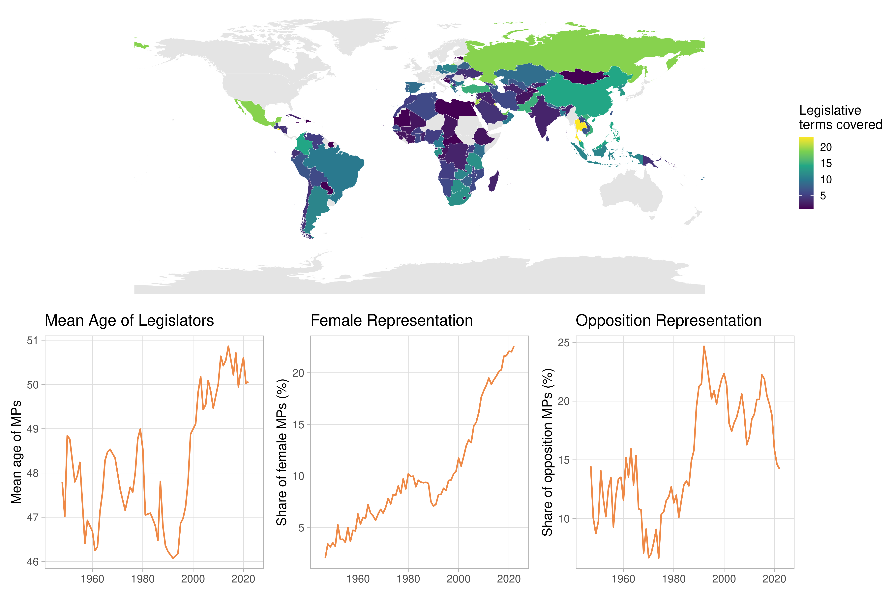
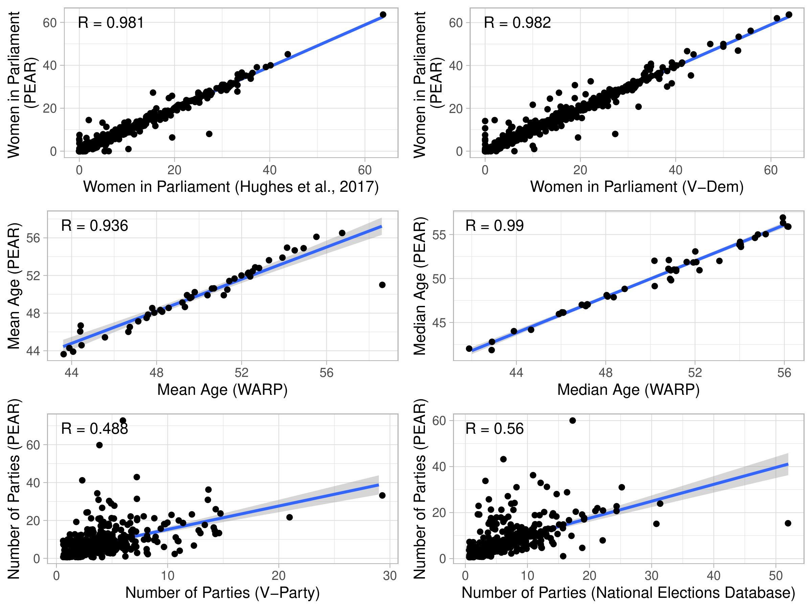
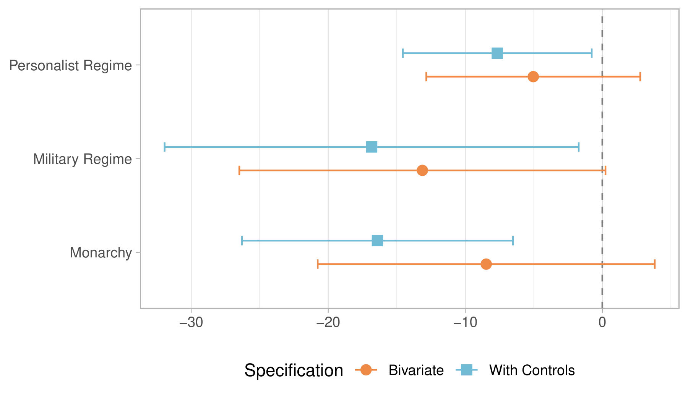

# Parliamentary Elites in Authoritarian Regimes (PEAR): New Data

Felix Wiebrecht, Department of Politics, University of Liverpool

*Journal of Peace Research* (forthcoming). Accepted manuscript.

## Abstract

Authoritarian politics are largely defined and shaped by elite politics. Yet, our knowledge about political elites in nondemocracies remains confined to those in particular regimes or, cross-nationally, leaders at the highest echelons of decision-making. This article introduces a novel dataset, Parliamentary Elites in Authoritarian Regimes (PEAR), that fills this gap and provides comprehensive information on members of parliament (MPs) across non-democracies. With currently more than 230,000 observations on individual MPs from 882 legislative terms in 133 authoritarian regimes from 1945 to 2024, PEAR is based on the largest individual-level demographic database on national legislators ever assembled and provides unprecedented information about these types of elites in authoritarian regimes. The dataset records MPs’ names, gender, age, party affiliation, incumbency status, and constituency, and uniquely classifies legislators into ruling-party members, regime-supporting elites, and opposition politicians. These are then aggregated into legislature-level variables in the country-year format, showing, for instance, the share of women in parliament, the MPs’ mean and median ages, the share of young and elder MPs, and legislatures’ retention rates. I first present how the dataset was created from publicly available sources, including parliamentary websites, electoral commissions, and election observer reports, then highlight descriptives, and validate it against existing datasets. I then illustrate an application of the data, generating new insights into the reshuffling of elites in authoritarian regimes. PEAR will be an invaluable resource for our understanding of autocracies.

**Keywords:** authoritarianism; legislatures; members of parliament; political elites; data

Authoritarian politics are largely defined by elite politics. This is, for instance, evidenced by the important finding that dictators are more likely to be overthrown by regime insiders than by social movements (Svolik 2012). In consequence, large bodies of literature have developed around the study of coups (Chin et al. 2021), purges (Goldring and Matthews 2023), personalization and power-sharing (Geddes et al. 2018; Meng 2020), succession politics (Goldring and Ward 2024), elite defections (Reuter and Szakonyi 2019), and the cooptation of elites (Gandhi 2008), among others. Yet, who are the elites in authoritarian regimes?

Existing work has answered this question in detail for particular regimes, including China and Russia (Landry et al. 2018; Szakonyi 2025), but cross-nationally has largely focused only on elites at the highest echelons of power, namely leaders and cabinet members (Arriola et al. 2021; Nyrup and Bramwell 2020). Yet the authoritarian elite extends well beyond these two groups, encompassing civil servants, business elites, traditional authorities, and legislators, each occupying a distinct position within the broader elite coalition that sustains authoritarian rule. This article focuses on the latter group. Beyond their standing as one stratum of the authoritarian elite, legislatures occupy a central and well-established place in the study of authoritarian politics. Parliaments have been shown to help autocrats co-opt the opposition (Gandhi 2008), manage ruling parties and elite coalitions (Wiebrecht 2024; Blaydes 2010), and structure center-periphery relations (Malesky and Schuler 2010). Members of parliament (MPs) have been credited with demanding concessions from executives (Tavana and York 2025), serving as important bridges between rulers and masses (Truex 2016; Reuter and Robertson 2015), and are heavily involved in lawmaking processes (Noble 2020; Lü et al. 2020). Yet systematic cross-national data on the individual legislators who populate these institutions remain limited in their temporal and regional scope and are often restricted to democratic systems, leaving scholars without systematic data on legislative elites in nondemocracies across countries and over time.

This article introduces a new dataset that addresses this gap. The Parliamentary Elites in Authoritarian Regimes (PEAR) dataset provides the first comprehensive cross-national dataset on individual legislators in countries that have been coded as nondemocratic by leading cross-national datasets (Boix et al. 2013; Geddes et al. 2018; Lührmann et al. 2018; Chin et al. 2021).[^1] Covering more than 230,000 MPs across 133 regimes between 1945 and 2024, PEAR represents the largest individual-level demographic database on national legislators ever assembled. The dataset contains detailed information on MPs’ gender, age, party affiliation, incumbency status, and constituencies (where applicable), as well as a novel classification of legislators into ruling-party members, regime-supporting elites, and opposition politicians. By systematically collecting information on legislative elites across time and space, PEAR makes it possible to study both the composition of the broader authoritarian elite and the institutional dynamics of authoritarian legislatures in their own right.

Existing datasets on political elites suffer from several limitations. Many focus exclusively on democratic regimes, such as the Global Legislators Database (Carnes et al. 2025) and the Comparative Legislators Database (Göbel and Munzert 2022). Others cover both democracies and autocracies but are typically limited either in their temporal coverage or in the range of countries they include (Stockemer and Sundström 2022; Weiss and Kouba 2025). As a result, scholars currently lack systematic data on legislative elites in authoritarian regimes across countries and over time.

PEAR addresses this limitation by compiling information on MPs serving in authoritarian legislatures from 1945 to 2024. I created this dataset based on publicly available resources, including parliamentary websites, national electoral commissions, the Constituency-Level Elections Archive (CLEA) (Kollman et al. 2022), books on political elites, online encyclopedias, election observer mission reports, and prior data collection efforts.[^2] By combining these sources into a harmonized dataset, PEAR enables researchers to analyze the composition and careers of authoritarian legislative elites at an unprecedented scale.

Beyond introducing the dataset, this article also demonstrates its analytical potential through an application. PEAR can be used to study patterns of elite circulation within authoritarian regimes. Leveraging new measures of legislative retention, I demonstrate that personalist regimes exhibit significantly higher levels of elite reshuffling among legislative elites than more institutionalized authoritarian regimes. This finding suggests that the dynamics of personal rule extend beyond the executive and shape the broader composition of authoritarian elite coalitions (Woldense 2022).

## Existing Datasets

Existing datasets on political elites suffer from four overlapping limitations: narrow elite coverage (focusing on leaders or cabinet members), limited temporal range, limited country coverage, or the absence of individual-level data. Table 8 summarizes the datasets built on individual MP-level data across at least ten countries that come closest to what PEAR provides.

Most of these, including the Global Legislators Database (Carnes et al. 2025), the Comparative Legislators Database (Göbel and Munzert 2022), and Martin et al. (2024)’s data, are, in fact, not global but only focus on democracies. Where data collection has achieved an impressive temporal coverage, it only covers a limited number of countries as in the case of the Comparative Legislators Database (Göbel and Munzert 2022) and Weiss and Kouba (2025)’s data on Latin American legislatures. The Global Leadership Project (Gerring et al. 2019) includes nondemocracies but is limited to two cross-sectional waves, leaving us with limited knowledge about historical developments. The Worldwide Age Representation in Parliaments (WARP) data (Stockemer and Sundström 2022) achieves the broadest coverage in principle, but for most authoritarian regimes includes only one or two electoral cycles. The validation exercise below illustrates that the overlap in country-year observations across WARP and PEAR is relatively small, with the latter covering considerably more legislative terms and more variables. Therefore, although all these data collection efforts are laudable, none of them comes close to providing comprehensive data on MPs in authoritarian regimes. Given that autocracies constitute most of the world’s political systems by some accounts (Wiebrecht et al. 2023), this is a substantial gap.

**Table 1. Available Datasets on Members of Parliaments (with Individual-level data)**

| Dataset | Countries (N) | Elections (N) | From | To | Regimes |
|:--|:--|:--|:--|:--|:--|
| Global Leadership Project (Gerring et al., 2019) | 145 |  | 2010 & 2017 | 2013 & 2018 | All |
| Global Legislators Database (Carnes et al., 2025) | 103 | 103 | 2015 | 2017 | Democracies |
| Comparative Legislators Database (Göbel and Munzert, 2022) | 16 | 529 | 1789 | 2022 | Democracies |
| Worldwide Age Representation in Parliaments (Stockemer and Sundström, 2022) | 149 | 860 | 1949 | 2022 | All |
| Martin, McClean, and Strøm (2024) | 68 | 288 | 2000 | 2018 | Democracies |
| Latin American Legislators Dataset (Weiss and Kouba, 2025) | 18 | 259 | 1978 | 2023 | All (Latin America) |
| **PEAR** | **133** | **882** | **1945** | **2024** | **Autocracies** |

## Creation of Dataset

PEAR remedies this gap by providing comprehensive data on MPs in authoritarian regimes from 1945 until 2024, providing the most extensive data collection of this kind. Similar to the abovementioned datasets, it is based on individual-level data. PEAR provides data on regimes that have been coded as authoritarian by any of the following datasets: Boix et al. (2013)’s binary coding of democracy, Geddes et al. (2014)’s list of authoritarian regimes with the corresponding extension by Chin et al. (2021), and the Regimes of the World’s (Lührmann et al. 2018) fourfold distinction of regimes. This ensures that researchers are not bound to a specific regime classification scheme and, instead, allows them to test whether their results are similar across all of them when using PEAR. Once a country transitions to democracy across all datasets, it is dropped from the dataset.

The observations in PEAR are for authoritarian (s)election-years for legislative terms. Therefore, the sample is a subset of all authoritarian regimes, as not all regimes had legislatures at all times. For the identified autocracies, I first compiled lists of members of the lower or unicameral chamber of parliament. In line with but going beyond similar data collection efforts (Martin et al. 2024; Stockemer and Sundström 2022), the main sources I have drawn on were parliamentary websites, national electoral commissions, the Constituency-Level Elections Archive (CLEA) (Kollman et al. 2022), books on political elites for individual countries, election observer reports, online encyclopedias, as well as prior data collections on individual countries (Morse 2022; Schuler 2021; Tavana 2026). The specific sources used are available in the appendix for full transparency. This first version of the dataset includes information on MPs’ names, gender, age, party affiliation, incumbency status, and constituency whenever applicable (all with varying degrees of missingness). I collected the list of names at the beginning of each term, irrespective of whether MPs were elected in competitive elections, selected through ruling parties, or appointed. Due to the wide variety of sources used, the lists of MPs and their attributes were collected manually rather than through web-scraping or automated extraction, with work supported by research assistants whose work was subsequently checked.

In most cases, the sources also offered information on the MPs, including their gender, year of birth, party affiliation, and constituency. Whenever these were not directly available from the sources, online searches for those particular individuals were used to identify this information. In addition, PEAR also offers information on the incumbency status of the MPs, which was determined by comparing the list of names of MPs across subsequent legislative terms, using a combination of exact and fuzzy name-matching to account for spelling and transliteration variation, with all fuzzy matches manually reviewed for accuracy. Whenever possible, names have been recorded in the local languages to minimize discrepancies that may occur between different ways of romanizing names.

With the collection of individual-level data, one of PEAR’s important contributions is unprecedented information about the party affiliation of a large number of elites. To facilitate a more systematic study of parties in autocracies, PEAR also includes a distinction of parties into three categories: ruling parties, regime-supporting parties, and opposition parties. Every political party has been categorized into one of these types. This has been done on the basis of several criteria. First, ruling parties are generally identified as the largest party in the executive following Miller (2020)’s concept and prior data collection. All ruling parties are also coded as regime-supporting parties. Yet, this category is broader in that it also includes ‘loyal’ opposition parties, parties in coalition agreements with the ruling party, as well as MPs in closed authoritarian regimes where party affiliations are unidentifiable.[^3] In distinguishing whether parties can be identified as regime-supporting or genuine opposition, I follow Kavasoglu (2022)’s approach of analyzing whether parties enter a pre-electoral coalition with the ruling party, support the incumbent’s election bid without building a formal alliance, provide support for the ruling party in parliament, or whether a member of the party is appointed as cabinet member. If any of the above apply, a party is coded as regime-supporting and otherwise as an opposition party. Classic cases of ‘loyal’ or ‘co-opted’ opposition parties, including the Communist Party of the Russian Federation, the Kazakhstani Social Democratic Party Auyl, and the National United Front for an Independent, Neutral, Peaceful and Cooperative Cambodia (FUNCINPEC), are therefore coded as regime-supporting parties in PEAR. This parsimonious coding scheme is applicable across autocracies and will provide scholars with the most up-to-date classification of parties in nondemocracies.[^4] As such, it will allow for new strides in the study of ruling parties, opposition parties, and, importantly, novel comparisons between the two and their elites.

The individual-level indicators are aggregated into legislature-level variables in the country-year format for the first years of the legislative terms.[^5] PEAR provides, among others, variables on the share of women in parliament, the MPs’ mean and median age, as well as the share of young (male/female) MPs and elder (male/female) MPs, following the example of WARP (Stockemer and Sundström 2022), as well as legislatures’ retention rates.[^6] For the latter, I follow Moncrief et al. (2004)’s approach in comparing the list of names at the beginning of each term. Therefore, replacements of MPs during legislative terms, for instance, due to sudden deaths, are not included in the measure here. I calculate the retention rate for every parliamentary term as the share of MPs that also held legislative office in the previous term, in line with the standard approach (Martin et al. 2024; François and Grossman 2015). All these measures are further disaggregated for ruling parties, regime-supporting parties, and opposition parties so that researchers can use, for instance, the share of women, age-related variables, and retention rates for each of these groups. Table 9 provides an overview of the individual-level variables used in PEAR and the national-level variables to which they have been aggregated.

**Table 2. Overview of Individual-Level and National-Level Variables in PEAR**

| Individual-Level Variables | National-Level Variables       |
|:---------------------------|:-------------------------------|
| Name                       | Year of Legislative Term Start |
| English Name               | Year of Legislative Term End   |
| Party                      | Coverage of MPs                |
| Partyfacts ID              | Coverage of Gender             |
| Coalition                  | Coverage of Age                |
| Gender                     | Coverage of Party              |
| Year of Birth              | Retention Ratea                 |
| Age                        | Share of Female MPsa            |
| Incumbent                  | Mean Agea,b                       |
| Regime Support             | Median Agea,b                     |
| Ruling Party               | Share of Age 30 or Undera,b       |
| Opposition                 | Share of Age 35 or Undera,b       |
| Constituency               | Share of Age 40 or Undera,b       |
|                            | Share of Age 70 or Overa,b        |
|                            | Share of Age 75 or Overa,b        |
|                            | Share of Age 80 or Overa,b        |
|                            | Number of Parties              |

a Also available separately for ruling party MPs, regime supporters, and opposition MPs.  
b Also available separately for female MPs.

Ultimately, PEAR covers 882 of the 1,474 legislative terms identified as authoritarian by at least one of four leading regime-classification datasets (Lührmann et al., 2018; Geddes et al., 2014; Chin et al., 2021; Boix et al., 2013), a coverage rate of 60%.[^7] While not perfect, this level of missingness is to be expected given how much more difficult it is to locate information on authoritarian regimes compared to democracies. Coverage is near-complete for legislative terms after 1990 but hovers around 50% before then, and is complete for Western Europe and North America but considerably lower for the Middle East and North Africa, Latin America and the Caribbean, and Sub-Saharan Africa (47–56%) relative to Asia-Pacific and Eastern Europe (72–79%). Missing legislatures also skew toward lower-GDP regimes. Reassuringly, missing and collected legislatures do not differ significantly across the constraints on dictatorial rule they pose, suggesting selection is not strongly driven by how powerful a legislature is.

Turning to the legislatures that are captured in PEAR, there may be slight discrepancies between the list of names of MPs that I was able to identify and legislatures’ statutory number of MPs. In some cases, I could only identify elected MPs but not presidential appointees.[^8] In the interest of transparency, I provide information about the coverage that PEAR achieves regarding MPs, their age, gender, and party affiliation. PEAR achieves high individual-level completeness and includes, on average, 99.4% of all MPs across all terms and information on MPs’ gender in 97.3% of observations. Coverage is lower for MPs’ age (53%) and party affiliation (81.3%). Researchers should therefore weigh these temporal, regional, and variable-specific gaps against their particular research question and sample before drawing inferences from PEAR. For instance, longitudinal analyses spanning the full 1945–2024 period risk conflating historical change with sample composition change.[^9]

## Descriptives

Figure 1 illustrates PEAR’s geographic coverage and its main descriptive trends over time. The top panel shows the number of legislative terms covered for each country. Coverage is uneven, reflecting both the availability of sources and the varying survival of authoritarian rule across countries. El Salvador and Thailand are covered most extensively, with 23 legislative terms each, followed by Kuwait (21), Jordan (20), Mexico (19), and the United Arab Emirates (18). A second tier of long-running cases, including Albania, Pakistan, Turkey, and Vietnam that each contribute 14–16 terms. These are countries that combined lengthy spells of authoritarian rule with regularly held (if not necessarily competitive) legislative elections. Countries shown in grey were either not classified as authoritarian since 1945 or are not covered due to unavailability of data.

The bottom panels of Figure 1 show how the mean age of MPs, the share of female legislators, and the share of opposition MPs have evolved since 1945, smoothed using a 5-year centered rolling average. The mean age of legislators fluctuated around 47–49 years for most of the period, reaching a low of 46.1 years around 1992, before rising steadily to a peak of 50.9 years in 2014 and remaining at an elevated level of just above 50 years through 2022. Given that age coverage is comparatively low as noted above, these fluctuations should be interpreted with some caution. Female representation, by contrast, shows a clear and accelerating upward trend. Starting from a negligible base of 2–3% in the late 1940s, the share of women rose slowly and unevenly through the 1960s and 1970s, plateaued at roughly 7–9% between the mid-1980s and mid-1990s, and then increased sharply from the early 2000s onward, climbing from 11.7% in 2000 to 18.3% in 2010 and reaching approximately 22% by 2020–2022.

The share of opposition MPs (across all authoritarian regimes in the sample, including closed autocracies) follows a more cyclical pattern. It remained low and volatile through the 1950s and 1960s, stabilized at around 10–15% during the 1970s and 1980s, and then rose markedly to a peak of 24.7% in 1992, plausibly reflecting the wave of controlled political liberalization that accompanied the end of the Cold War. Opposition representation remained elevated, at roughly 20–22%, throughout the 1990s and 2000s, before declining again over the 2010s to around 15% by the end of the series, likely indicating the ongoing autocratization also seen among autocracies, such as, for instance, Cambodia (Samet 2025).

*Note: Top panel shows number of legislative terms covered by PEAR for each country. Grey indicates no PEAR coverage, either because country not identified as authoritarian or because of data unavailability. Bottom panels: mean age of MPs (left), share of female MPs (middle), and share of opposition MPs (right) over time, each smoothed using a 5-year centered rolling average. Includes all PEAR observations in which coverage for MPs, gender, or age ranges between 95% and 105%. Includes all country-years that have been identified as authoritarian by at least one out of GWF, BMR, and RoW.*

## Validation

I present several validation tests that show that despite the range of sources used, PEAR produces observations in line with other existing datasets. Correlations between variables from PEAR and other existing datasets can be found in Figure 2. The value of the variable in the validation dataset is shown on the x-axis, while my corresponding value is displayed on the y-axis. In the top panels, I match the share of women in parliaments against the same variable collected by Hughes et al. (2017) and Coppedge et al. (2021). In the middle panels, I compare the mean and median age of MPs with data from WARP (Stockemer and Sundström 2022). Finally, in the bottom panels, I display the correlation in the number of parties as identified by PEAR, V-Party (Lührmann et al. 2020), and the National Elections Database (Marx et al. 2024).

*Note: Includes all PEAR observations in which coverage for gender, age, and/or party membership ranges between 95% and 105%. Includes all country-years that have been identified as authoritarian by at least one out of GWF, BMR, and RoW.*

Two points are worth highlighting from this validation exercise. First, for gender and age variables, correlations are near-perfect. The correlations show a very small number of observations where values diverge somewhat. I investigated all cases in which discrepancies were larger than 3 percentage points (or 1 year for age-related variables) and explained them in the appendix. In some cases, this is due to PEAR also including appointed and nominated MPs, while neither of the other datasets seems to account for these. As mentioned above, agreement with data from WARP is also high, but overlap in country-years is limited as WARP contains information about significantly fewer election cycles in autocracies. Second, correlations for the number of parties included are significantly weaker but still provide evidence for the validity of PEAR. In both cases, PEAR tends to include more parties. This is to be expected as V-Party does not include parties that achieved less than 5% of the votes. The correlation coefficient is already higher when comparing the number of parties included in PEAR with those in the National Elections Database. PEAR also includes MPs designated as Independents who are not considered by these datasets. Whenever possible, PEAR provides both the specific political parties that MPs belong to as well as the pre-electoral coalition they are part of (e.g., UMNO and Barisan Nasional in the case of Malaysia).[^10] Taken together, these correlations evidence PEAR’s validity.

In the following, the article will provide an application that showcases PEAR’s added value by highlighting a new variable on legislative retention that was previously unavailable cross-nationally.

## Application: Legislative Retention

Decisions over which legislators remain in office or are replaced shape elite cohesion, the distribution of rents (Blaydes 2010), and the management of intra-elite threats (Geddes et al. 2018). Simultaneously, patterns of legislative turnover affect representation and the informational channels through which regimes monitor society (Truex 2016). Yet, we know remarkably little about how mid-level elites, such as MPs, are managed longitudinally across regimes. Existing research has largely focused on leaders and cabinets, leaving patterns of elite circulation beyond the executive understudied. By providing systematic measures of legislative retention, PEAR enables scholars to observe the depth and structure of elite circulation below the cabinet for the first time in a cross-national and historical perspective.

A particularly important question is whether patterns of legislative retention vary systematically with the degree of regime personalization. Existing scholarship argues that personalist autocracies are characterized by weaker formal institutions, greater discretion in elite appointments, and more frequent reshuffling to prevent the emergence of rival power centers (Geddes et al. 2018; Meng 2020). Personalist rulers often rotate elites strategically to minimize threats and to reinforce dependence on the leader (Kroeger 2020). If these dynamics extend beyond the executive, one would also expect higher levels of legislative turnover in more personalist regimes. Parliamentary seats in such contexts may function less as institutionalized career paths and more as contingent patronage assignments, subject to replacement at the ruler’s discretion. Examining the relationship between personalism and legislative retention, therefore, provides a novel test of whether personalization reshapes elite circulation beyond the cabinet level.

To test this expectation, I use PEAR’s legislative retention variables. As mentioned above, I calculate the retention rate for every parliamentary term as the share of MPs that also held legislative office in the previous term, in line with existing work (Martin et al. 2024; François and Grossman 2015). Specifically, here, I use the retention rate for regime supporters (as opposed to the total retention rate, or that for opposition members). For my independent variable, I use Chin et al. (2021)’s regime classification and test whether authoritarian regimes designated as personalist exhibit lower levels of legislative retention than party-based regimes.

I include a number of control variables in these analyses as well, based on existing research. First, the length of the legislative term should be related to legislative retention rates. This has been consistently shown in democracies (Gouglas et al. 2018; Kouba and Weiss 2025). PEAR also includes a variable indicating how many years have passed since the last legislative election, which is used for this hypothesis. Second, adjusting the size of the legislative body will have repercussions on how many MPs can technically regain membership and, consequently, should also affect retention rates (Kouba and Weiss 2025; Heinsohn 2014). PEAR also includes information on the size of the legislative bodies and can identify changes in the size from one term to the next. I include both the number of seats and the relative change in size as control variables here. Third, outside career options are important for MPs, and the more options there are, the more career movements should be observable (Gouglas et al. 2018; Kouba and Weiss 2025). I test this expectation with variables from V-Dem (Coppedge et al. 2021) on whether regional governments exist and on whether regimes have a bicameral structure. I also add dummy variables on whether authoritarian regimes are military regimes or monarchies. This allows me to compare personalist regimes directly to party-based regimes, the other major form of authoritarian rule. Finally, I also include data on the GDP per capita as taken from Fariss et al. (2022) in the models as well as the level of electoral democracy from V-Dem (Coppedge et al. 2021).

I test the above expectation with linear models that use the country-(s)election-year as the unit of analysis and add country-random effects, which are more appropriate for PEAR’s data structure. Finally, I use robust standard errors for the estimations.

*Note: Authoritarian regimes as identified by Chin et al. (2021). The dependent variable is the legislative retention rate of regime-supporting MPs (0–100%).*

Results in Figure 3 show that legislative retention rates among regime supporters are significantly lower in personalist regimes compared to party-based regimes (full results in appendix). While the results in the bivariate Model 1 do not reach statistical significance, Model 2 with controls generates a significant coefficient for personalist regimes at p < 0.05. On average, personalist regimes experience retention rates that are 7.7 percentage points lower than party-based regimes. Thus, there is significantly more reshuffling in personalist regimes than in party-based regimes. Another authoritarian regime type that experiences even lower retention rates of regime supporters is that of monarchies. Given that they also generally exhibit high levels of personalism (Geddes et al. 2018), I take this as further evidence for the expected relationship. Results for the control variables are significant for GDP per capita and the size of the legislature, with larger chambers associated with lower retention rates. In addition, these models also generate significant results for the importance of time, i.e., that retention rates tend to be lower as more time has passed since the previous legislative election. This is also in line with existing work originating from democracies (Gouglas et al. 2018).

Robustness tests using Geddes et al. (2018)’s latent personalism index confirm the direction of the result, though the coefficient only reaches p < 0.1, likely due to smaller samples. Results are directionally consistent but weaker when using ruling-party retention rates (in appendix). It may also be held that the degree of electoral competitiveness, district magnitude, and the type of candidate selection are further important control variables. In the absence of systematic constituency-level variables for these indicators, I ran further robustness tests using V-Dem’s national-level variables. Due to data missingness, the number of observations decreases significantly in these further tests. Neither the regime-supporter nor the ruling-party specification reaches conventional levels of statistical significance under these additional controls. The point estimates are nonetheless stable, at −7.4 and −7.7 percentage points, indicating a loss of precision rather than of substance, consistent with the sample reduction of up to 50% that these variables impose.

These findings illustrate the analytical leverage that PEAR provides for studying authoritarian elite politics. By systematically tracking legislative careers across regimes and over time, the dataset makes it possible to observe patterns of elite circulation that were previously difficult to measure beyond the executive level. The results presented here offer evidence that personalist regimes experience greater reshuffling among legislative elites than more institutionalized authoritarian regimes, suggesting that the dynamics of personal rule extend beyond the inner circle of the executive to shape broader elite coalitions. More generally, PEAR enables scholars to move beyond leader- and cabinet-focused analyses and to examine how mid-level elites are recruited, rotated, and retained across political systems.

## Conclusion

In this paper, I have introduced PEAR, which is the largest individual-level biographical and demographic database on national legislators ever assembled. The dataset covers the period 1945 to 2024 and 882 legislative terms in 133 authoritarian regimes, and it contains detailed information on legislators in autocracies, including gender, age, party affiliation, constituency (where applicable), incumbency status, and whether they support or oppose the regime. The dataset has undergone extensive validation checks to show that the data closely aligns with the data in existing datasets. I also illustrate that the data can be used to generate new insights about elite reshuffling in authoritarian regimes. As the most comprehensive data on authoritarian elites currently available, PEAR opens up several further avenues for research beyond the application shown in this article. First, in combination with other existing datasets on cabinets (Nyrup and Bramwell 2020) and politburos (Matthews 2023), we now have systematic data on authoritarian elites across institutions. This allows for even more insight into authoritarian elite management strategies, including, for instance, promotions from legislative to cabinet office, and retention within the broader elite. Second, PEAR enables broader comparative work on how women’s descriptive representation evolves across authoritarian regime types, historical periods, and world regions, including its intersection with age. Third, the dataset’s age variables allow for systematic study of gerontocratic tendencies in authoritarian legislatures, for instance, whether an aging elite signals regime stagnation or decay, how age structure relates to succession crises, and whether personalist regimes retain older or younger cohorts than party-based ones. Fourth, PEAR’s constituency-level information, where available, opens the door to studying subnational and distributive politics under authoritarianism, including whether ruling parties concentrate seats and resources in loyal regions, ethnic or regional favoritism in candidate selection, and the geographic distribution of opposition strength. Potential extensions could also allow researchers to construct seat-level measures of electoral competitiveness that are not currently available for autocracies.

## Acknowledgements

I would like to thank Nancy Chen Zining, Hazel Yeoun Choi, Cai Sumi, Satvik Dev, and Denny Indra Sukmawan for their generous assistance in making the creation of this dataset possible. Furthermore, I am grateful to Daniel Tavana, Tevfik Murat Yildirim, Paul Schuler, Emilia Simison, Taekbin Kim, and Yonatan L. Morse who have generously shared their previously collected data on members of parliaments in individual countries or pointed me to valuable resources. For feedback on earlier versions of this project, I thank Oren Samet, Özlem Tuncel, Eugenia Nazrullaeva, Joseph Wright, Edward Goldring, Scott Williamson, and David Szakonyi.

## Conflicts of Interest

The author has no known conflicts of interest.

## Funding

I acknowledge funding for this project from the American Political Science Association Centennial Center and the Steiger Fund.

## Data Availability Statement

The dataset, codebook, and do-files for the empirical analysis in this article, along with the Online Appendix, are available at https://www.prio.org/journals/jpr/replicationdata. All analyses were conducted using R.

## Supplementary Materials

The appendix and country notes, which provide details on the data collection for every single country, will also be made available and hosted on the Harvard Dataverse.

## Biographical Statement

FELIX WIEBRECHT, PhD in Government and Public Administration (Department of Government and Public Administration - CUHK, 2022); Lecturer in Politics, University of Liverpool (2023-); research interests: authoritarian regimes, political elites, legislatures, regime changes

## References

Arriola, Leonardo R, Jed Devaro, and Anne Meng. 2021. “Democratic Subversion: Elite Cooptation and Opposition Fragmentation.” *American Political Science Review* 115 (4): 1358–72.

Blaydes, Lisa. 2010. *Elections and Distributive Politics in Mubarak’s Egypt*. Cambridge University Press.

Boix, Carles, Michael Miller, and Sebastian Rosato. 2013. “A Complete Data Set of Political Regimes, 1800–2007.” *Comparative Political Studies* 46 (12): 1523–54.

Carnes, Nicholas, Joshua Ferrer, Miriam Golden, Esme Lillywhite, Noam Lupu, and Eugenia Nazrullaeva. 2025. “The Global Legislators Database: Characteristics of National Legislators in the World’s Democracies.” *British Journal of Political Science* 55: e27.

Chin, John J, David B Carter, and Joseph G Wright. 2021. “The Varieties of Coups d’état: Introducing the Colpus Dataset.” *International Studies Quarterly* 65 (4): 1040–51.

Coppedge, Michael, John Gerring, Carl Henrik Knutsen, et al. 2021. *V-Dem Dataset V11. 1*.

Fariss, Christopher J, Therese Anders, Jonathan N Markowitz, and Miriam Barnum. 2022. “New Estimates of over 500 Years of Historic GDP and Population Data.” *Journal of Conflict Resolution* 66 (3): 553–91.

François, Abel, and Emiliano Grossman. 2015. “How to Define Legislative Turnover? The Incidence of Measures of Renewal and Levels of Analysis.” *The Journal of Legislative Studies* 21 (4): 457–75.

Gandhi, Jennifer. 2008. *Political Institutions Under Dictatorship*. Cambridge University Press.

Geddes, Barbara, Joseph Wright, and Erica Frantz. 2014. “Autocratic Breakdown and Regime Transitions: A New Data Set.” *Perspectives on Politics* 12 (2): 313–31.

Geddes, Barbara, Joseph Wright, and Erica Frantz. 2018. *How Dictatorships Work: Power, Personalization, and Collapse*. Cambridge University Press.

Gerring, John, Erzen Oncel, Kevin Morrison, and Daniel Pemstein. 2019. “Who Rules the World? A Portrait of the Global Leadership Class.” *Perspectives on Politics* 17 (4): 1079–97.

Göbel, Sascha, and Simon Munzert. 2022. “The Comparative Legislators Database.” *British Journal of Political Science* 52 (3): 1398–408.

Goldring, Edward, and Austin S. Matthews. 2023. “To Purge or Not to Purge? An Individual-Level Quantitative Analysis of Elite Purges in Dictatorships.” *British Journal of Political Science* 53 (2): 575–93.

Goldring, Edward, and Peter Ward. 2024. “Elite Management Before Autocratic Leader Succession: Evidence from North Korea.” *World Politics* 76 (3): 417–56.

Gouglas, Athanassios, Bart Maddens, and Marleen Brans. 2018. “Determinants of Legislative Turnover in Western Europe, 1945–2015.” *European Journal of Political Research* 57 (3): 637–61.

Heinsohn, Till. 2014. “Institutional Determinants of Legislative Turnover in the German State Parliaments: 1947–2012.” *The Journal of Legislative Studies* 20 (4): 473–94.

Hughes, Melanie M, Pamela Paxton, Amanda Clayton, and Pär Zetterberg. 2017. “Quota Adoption and Reform over Time (QAROT), 1947–2015.” *Ann Arbor, MI: Inter-University Consortium for Political and Social Research \[Distributor\]*, 08–16.

Kavasoglu, Berker. 2022. “Opposition Party Organizational Features, Ideological Orientations, and Elite Co-Optation in Electoral Autocracies.” *Democratization* 29 (4): 634–54.

Kollman, Ken, Allen Hicken, Daniele Caramani, David Backer, and David Lublin. 2022. “Constituency-Level Elections Archive.” *Ann Arbor, Mich.: Center for Political Studies, University of Michigan. At Http://Www. Electiondataarchive.org*.

Kouba, Karel, and Michael Weiss. 2025. “Legislative Turnover in Latin America: Introducing a New Dataset and Analyzing Its Temporal Dynamics.” *Latin American Politics and Society* 67 (3): 125–40.

Kroeger, Alex M. 2020. “Dominant Party Rule, Elections, and Cabinet Instability in African Autocracies.” *British Journal of Political Science* 50 (1): 79–101.

Landry, Pierre F, Xiaobo Lü, and Haiyan Duan. 2018. “Does Performance Matter? Evaluating Political Selection Along the Chinese Administrative Ladder.” *Comparative Political Studies* 51 (8): 1074–105.

Lü, Xiaobo, Mingxing Liu, and Feiyue Li. 2020. “Policy Coalition Building in an Authoritarian Legislature: Evidence from China’s National Assemblies (1983-2007).” *Comparative Political Studies* 53 (9): 1380–416.

Lührmann, Anna, Nils Düpont, Masaaki Higashijima, et al. 2020. *Varieties of Party Identity and Organization (V-Party) Dataset V1*.

Lührmann, Anna, Marcus Tannenberg, and Staffan I Lindberg. 2018. “Regimes of the World (RoW): Opening New Avenues for the Comparative Study of Political Regimes.” *Politics and Governance* 6 (1): 60–77.

Malesky, Edmund, and Paul Schuler. 2010. “Nodding or Needling: Analyzing Delegate Responsiveness in an Authoritarian Parliament.” *American Political Science Review* 104 (3): 482–502.

Martin, Shane, Charles T McClean, and Kaare W Strøm. 2024. “Legislative Resources, Corruption, and Incumbency.” *British Journal of Political Science* 54 (2): 526–35.

Marx, Benjamin, Vincent Pons, and Vincent Rollet. 2024. *National Elections Database (Version 1.0)*. <http://nationalelectionsdatabase.com>.

Matthews, Austin S. 2023. “The Politburos of Communist Eastern Europe: Introducing New Individual-Level Data on Candidate and Full Members.” *Communist and Post-Communist Studies* 56 (2): 159–76.

Meng, Anne. 2020. *Constraining Dictatorship: From Personalized Rule to Institutionalized Regimes*. Cambridge University Press.

Miller, Michael K. 2020. “The Autocratic Ruling Parties Dataset: Origins, Durability, and Death.” *Journal of Conflict Resolution* 64 (4): 756–82.

Moncrief, Gary F, Richard G Niemi, and Lynda W Powell. 2004. “Time, Term Limits, and Turnover: Trends in Membership Stability in US State Legislatures.” *Legislative Studies Quarterly* 29 (3): 357–81.

Morse, Yonatan L. 2022. “Pathways to Power in Authoritarian Regimes: Civil Service, Multipartyism and Legislative Selection in Cameroon.” *Government and Opposition* 57 (3): 490–507.

Noble, Ben. 2020. “Authoritarian Amendments: Legislative Institutions as Intraexecutive Constraints in Post-Soviet Russia.” *Comparative Political Studies* 53 (9): 1417–54.

Nyrup, Jacob, and Stuart Bramwell. 2020. “Who Governs? A New Global Dataset on Members of Cabinets.” *American Political Science Review* 114 (4): 1366–74.

Reuter, Ora John, and Graeme B Robertson. 2015. “Legislatures, Cooptation, and Social Protest in Contemporary Authoritarian Regimes.” *The Journal of Politics* 77 (1): 235–48.

Reuter, Ora John, and David Szakonyi. 2019. “Elite Defection Under Autocracy: Evidence from Russia.” *American Political Science Review* 113 (2): 552–68.

Samet, Oren. 2025. “When You Come at the King: Opposition Coalitions and Nearly Stunning Elections.” *American Journal of Political Science* 69 (4): 1469–85.

Schuler, Paul. 2021. *United Front: Projecting Solidarity Through Deliberation in Vietnam’s Single-Party Legislature*. Stanford University Press.

Stockemer, Daniel, and Aksel Sundström. 2022. “Introducing the Worldwide Age Representation in Parliaments (WARP) Data Set.” *Social Science Quarterly* 103 (7): 1765–74.

Svolik, Milan W. 2012. *The Politics of Authoritarian Rule*. Cambridge University Press.

Szakonyi, David. 2025. “Corruption and Co-Optation in Autocracy: Evidence from Russia.” *American Political Science Review* 119 (1): 402–19.

Tavana, Daniel L. 2026. “Endogenous Opposition: Identity and Ideology in Kuwaiti Electoral Politics.” *American Journal of Political Science* 70 (2): 623–42.

Tavana, Daniel L, and Erin York. 2025. “Legislative Cooptation in Authoritarian Regimes: Policy Cooperation in the Kuwait National Assembly.” *British Journal of Political Science* 55: e72.

Truex, Rory. 2016. *Making Autocracy Work: Representation and Responsiveness in Modern China*. Cambridge University Press.

Weiss, Michael, and Karel Kouba. 2025. “The Latin American Legislators Dataset.” *Scientific Data* 12 (1): 1767.

Wiebrecht, Felix. 2024. “Corruption, Elite Contestation, and Parliaments: Why Do Legislatures Become Stronger in Authoritarian Regimes?” *Political Research Quarterly* 77 (1): 255–69.

Wiebrecht, Felix, Yuko Sato, Marina Nord, Martin Lundstedt, Fabio Angiolillo, and Staffan I Lindberg. 2023. “State of the World 2022: Defiance in the Face of Autocratization.” *Democratization* 30 (5): 769–93.

Woldense, Josef. 2022. “What Happens When Coups Fail? The Problem of Identifying and Weakening the Enemy Within.” *Comparative Political Studies* 55 (7): 1236–65.

[^1]: A full list of countries and years covered by the dataset is available in the appendix.

[^2]: The appendix details all consulted sources for all countries.

[^3]: In China, for instance, PEAR cannot identify whether MPs are members of the Chinese Communist Party, members of any of the ‘satellite parties’, or unaffiliated. However, all MPs can be characterized as regime-supporting.

[^4]: Parties can also move in and out of categories over time, such as the MHP in Turkey that only joined the governing coalition in 2018.

[^5]: A potential drawback is that PEAR does not provide yearly data. However, even if it were possible to identify mid-term changes in legislatures’ compositions cross-nationally, the cost of this would outweigh any potential gains.

[^6]: A full codebook is provided in the appendix.

[^7]: Not all measures fully agree on the identification of authoritarian country-years, so that coverage for each classification will be slightly higher than that.

[^8]: In other cases, I identified more MPs than the statutory number of members would suggest. Thus, coverage can also exceed 100%.

[^9]: A full discussion of missingness is provided in the appendix.

[^10]: Though for the correlations here, the specific parties have been used as designations.
