# Southeast Asia in Political Science: A Bibliometric Analysis

Felix Wiebrecht, Department of Politics, University of Liverpool

*Contemporary Southeast Asia* (forthcoming). Accepted manuscript.

## Abstract

This article examines publications on Southeast Asia in Political Science over two decades (2003–23) to evaluate the region’s representation in the discipline and analyse trends in research methods and authorship patterns. Findings show that Southeast Asia’s overall presence in the discipline increased slightly over the period studied and that authorship trends largely followed disciplinary trends. Research on Southeast Asia has become more gender diverse, collaborative and international than ever before. In contrast, the use of quantitative methods has stalled since 2017. These patterns also vary by country. The findings have important implications for integrating Southeast Asia into Political Science and for knowledge production about and from the region.

**Keywords:** Southeast Asia; political science; international relations; knowledge production; area studies

The study of Southeast Asia within Political Science has long been accompanied by debates about the field’s own identity and direction. From disagreements about whether area expertise or cross-regional comparison should take precedence to questions about the region’s standing within the broader discipline,[^1] scholars of Southeast Asian politics have repeatedly reflected on where their subfield stands and where it should be heading.[^2] These debates lack systematic empirical evidence about the state of the field, including questions such as who produces knowledge about the region and how methods have evolved over time.

Existing evidence suggests that Political Science pays limited attention to Southeast Asia. Matthew Wilson and Carl-Henrik Knutsen found that in 2019, only 5.7 per cent of publications in prominent Political Science journals refer to East and Southeast Asia.[^3] Among them, China and Japan are the most referenced countries, leaving only a small proportion of articles focusing on Southeast Asia. Similarly, Thomas Pepinsky finds that, on average, *World Politics* publishes only one article per year on Southeast Asia.[^4] The absence is striking given the foundational mark that scholarship on the region has left on some areas of Political Science[^5] and its continued relevance for theory development and testing.[^6]

Drawing on the most comprehensive dataset of political science research, I provide the largest bibliometric analysis of the state of Southeast Asia studies in the discipline.[^7] I identify 2,034 Southeast Asia-focused articles in Political Science journals published between 2003 and 2023 and analyse article- and author-level trends, including authorship patterns and methodologies used. Unlike prior bibliometric work on regional representation in the discipline, which has focused on the highest-ranked journals[^8] or individual outlets,[^9] this article examines a broad sample of 174 Political Science journals and extends the analysis beyond publication counts to include research methods, authors’ gender, institutional affiliations and collaboration patterns.

The findings suggest that the voice of Southeast Asianists is relatively stronger in Political Science than before, as research on the region now occupies a slightly larger share of published work than in the first two decades of the century. Southeast Asia-related research in Political Science has also become more collaborative, converging on the disciplinary norm from a markedly lower starting point. Gender representation, meanwhile, has done more than converge. Over the studied period, it rose at about one and a half times the discipline’s rate, overtaking it in the early 2010s and running ahead in most years since. Authorship has been consistently more internationally distributed than the discipline’s, and it internationalized further at about the same rate as the discipline. By contrast, its adoption of quantitative methods has lagged behind the discipline. At the same time, disaggregated results show that these developments vary considerably by country.

## Data and Methods

What does the study of Southeast Asia look like in Political Science? Before proceeding, it is important to acknowledge the strong area studies tradition for the study of Southeast Asia. While debates continue around the health of area studies, this article does not intend to set Political Science as a benchmark, but to provide a focused analysis of the study of Southeast Asia in the discipline.[^10]

### Goals of the Analysis
The absence of systematic empirical evidence on Southeast Asia’s place in Political Science motivates three sets of questions that structure the remainder of this article. First, how present is Southeast Asia-focused research within the discipline and how has this changed over the period under study (2003-23), both overall and for individual countries within the region? Second, what methodological approaches characterize this scholarship, and how do these compare to trends in the discipline as a whole, both over time and across countries within Southeast Asia? Third, how has the composition of scholars producing this research changed over the past two decades in terms of gender, institutional location and collaborative practice and are any potential changes in line with broader disciplinary trends?

### Sample Construction
In line with the existing literature[^11], I focus exclusively on journal articles because they are widely recognized as important research outputs in the field and provide easier access and more systematic information than book chapters and monographs.[^12] This article builds on the replication package of Guy Grossman, William Dinneen and Carolina Torreblanca, who assembled a comprehensive bibliometric dataset of Political Science publications spanning from 2003 to 2023.[^13] Their corpus covers 138,598 articles published across 174 journals selected from Clarivate’s Political Science (*PolSet*) journal index. To be included, journals had to be English-language, peer-reviewed, classified as Political Science by Scopus, and have a SCImago Journal Rank (SJR) impact factor of at least 1.0, a citation-based measure of journal prestige. This criterion prioritizes outlets where the discipline’s mainstream production is concentrated, while excluding highly specialized or low-visibility journals. This approach goes beyond previous bibliometric analyses of Political Science that have focused predominantly on the highest-ranked journals.[^14] Yet it also masks a share of important research published in non-English-language journals, and I acknowledge that the corpus likely underrepresents scholarship produced within Southeast Asia itself, particularly work published in local-language or regionally oriented outlets. In Southeast Asia, scholars may also have strong incentives to publish in journals in their native languages.[^15] I return to this concern empirically below.

Two journals in the corpus focus specifically on Southeast Asia: the *Journal of Current Southeast Asian Affairs* and *Contemporary Southeast Asia*. Rather than restricting analysis to these outlets, this article retains all 174 journals and identifies Southeast Asia-relevant articles at the article level. This approach captures Southeast Asia-focused work published in disciplinary journals alongside these two specialist outlets, but comes with two limitations. First, it misses journals not classified as Political Science but that regularly publish articles on politics in Southeast Asia. These include area studies journals such as *Sojourn: Journal of Social Issues in Southeast Asia* and the *Journal of Southeast Asian Studies*. Second, the SJR threshold of 1.0 excludes several outlets that are significant venues for regionally focused work. Journals such as *Journal of East Asian Studies*, *Asian Survey* and *Pacific Affairs*, for instance, do not appear in the sample. These exclusions mean the findings describe Southeast Asia-focused Political Science as it appears in English-language, mainstream and higher-prestige journals, not as a census of all scholarly output on the region.

To identify Southeast Asia-focused articles in the Political Science corpus, I searched article abstracts. A pilot test showed that this approach identified significantly more relevant articles than title-only matching. The Grossman, Dinneen and Torreblanca replication package does not include abstract text, so I collected abstracts from three external sources.[^16] The first, OpenAlex, is a free, open-access bibliographic database that indexes metadata including abstracts for scholarly publications across disciplines. I also collected abstracts from Semantic Scholar and through direct scraping of publicly visible abstracts where publisher terms permitted. After combining all three sources, abstracts are available for 118,876 of the 133,090 articles with a digital object identifier (DOI) (89.3 per cent). Because the analysis still produced relatively low coverage rates for some journals, I conducted a supplementary keyword search on several publisher platforms using the full regional keyword string described below. This approach identified three additional articles. While incomplete abstract coverage across journals is a methodological limitation, further manual searches are unlikely to significantly change the sample of Southeast Asia-related articles. The remaining journals with a higher share of abstracts missing include other more regional-focused outlets such as *Post-Soviet Affairs* and *Latin American Perspectives*.

An article is classified as Southeast Asia-focused if any keyword from the table below appears within word boundaries in the combined title and abstract, in a case-insensitive manner. Word-boundary matching prevents spurious matches on substrings (such as “Lao” within “Labor”). Articles matching only region-level keywords such as Southeast Asia, South-East Asia, ASEAN, Mekong or Indochina, without matching any country-specific keyword, are classified as “Regional” throughout the analysis.

Keyword matching alone risks including cross-national studies in which a Southeast Asian country appears as one case among many. To exclude such articles, any article in which two or more distinct non-Southeast Asian country names appear in the combined title and abstract is dropped from the sample. This threshold retains focused single-country studies and bilateral comparisons, such as Thailand and China, while removing broad comparative work in which Southeast Asia plays an incidental role. A further source of false positives comprises articles about US domestic politics or Vietnam War history that match on “Vietnam” or “Vietnamese” but are not about Southeast Asia. I excluded these with a compound keyword filter that removed any article containing a Vietnam keyword alongside terms specific to the Vietnam War context (such as “Vietnam veteran”, “draft lottery”, “Selective Service Lottery”, “Vietnam-era” or “Vietnamese American”). This rule removed 17 articles.

**Table 1. Keywords Used to Identify Southeast Asia Articles**

| **Category** | **Keywords** |
|:--|:--|
| Region | Southeast Asia, South-East Asia, ASEAN, Mekong, Indochina |
| Indonesia | Indonesia, Indonesian |
| Vietnam | Vietnam, Vietnamese, Viet Nam |
| Philippines | Philippines, Philippine, Filipino |
| Thailand | Thailand, Thai |
| Myanmar | Myanmar, Burma, Burmese |
| Malaysia | Malaysia, Malaysian |
| Singapore | Singapore, Singaporean |
| Cambodia | Cambodia, Cambodian, Khmer |
| Laos | Laos, Lao |
| Timor-Leste | Timor-Leste, Timor Leste, East Timor |
| Brunei | Brunei |

After keyword matching, exclusion filtering and manual review to remove false positives and duplicates, the final sample comprises 2,034 Southeast Asia-focused articles published between 2003 and 2023, authored by 2,245 distinct researchers.

### Variable Construction
Most analytical variables are drawn directly from the Grossman, Dinneen and Torreblanca replication package and merged into the Southeast Asia subsample by Scopus paper identifier (“eid”) or DOI.[^17] This ensures full comparability with the discipline-wide benchmarks reported in Grossman, Dinneen and Torreblanca. Variables from Grossman, Dinneen and Torreblanca include methods classification, authors’ gender and co-authorship. Each article is coded as quantitative, qualitative, normative or formal based on a supervised machine-learning classifier trained on a human-coded sample. I imputed author gender from given names using the genderize.io database, which has been widely validated in bibliometric research. For Southeast Asian scholars specifically, 70 of 2,245 authors (3.1 per cent) could not be assigned a gender and are excluded from gender analyses. In addition, I collected author affiliations from OpenAlex and online searches.

## Findings

### Articles
First, it is worth examining how well work on Southeast Asia is represented in Political Science overall. The existing literature has already highlighted the underrepresentation of Southeast Asia, but has primarily focused on top journals in the discipline.[^18] At the same time, Political Science has seen a rapid increase in the sheer volume of published work.[^19]

Figure 1 shows the share of Political Science articles that focus on Southeast Asia. The denominator is the full corpus of 138,598 articles published across the 174 sampled journals. Much of this corpus is not tied to any single geographic region, encompassing theoretical, methodological and cross-national or global research. The reported share should therefore be read as Southeast Asia’s standing within the discipline’s total output, not as a direct comparison with other regions.

The figure shows some growth in the share of Southeast Asia-focused articles over time, particularly in the later 2010s. The rising share of publications on the region shows that more Southeast Asia-focused work is published today than at the start of the period under study. Starting at 1.4 per cent of Political Science articles, the region’s coverage in the sampled journals fluctuated between 2003 and 2012, even falling to just 0.9 per cent in 2011. Since then, coverage has increased to almost 2 per cent of all Political Science in 2021, settling at 1.7 per cent in 2023. This is a positive development for research on the region. Southeast Asia now occupies a stronger position in the discipline than it did just ten years ago. Yet Southeast Asia is also home to around 8.5 per cent of the world’s population and therefore remains far from being represented in proportion to its size. These findings align with earlier work on comparative politics coverage but show the issue spans the discipline.[^20]

Among the countries in the region, Indonesia is best covered by existing research. While the share of Indonesia-focused articles initially hovered around 0.2 per cent to 0.3 per cent, it rose significantly since 2016, peaking in 2020. This increased scholarly attention aligns with Indonesia's status as the region's most populous country. The Philippines, Thailand and Myanmar reached a similar share of coverage by 2023 (0.25 per cent, 0.23 per cent and 0.22 per cent respectively), with Myanmar’s rise particularly recent and pronounced, climbing from a negligible 0.015 per cent share in 2013. Singapore’s share has fluctuated but essentially returned to its early-2000s level (0.15 per cent in 2003, 0.14 per cent in 2023), while Vietnam and Malaysia’s shares actually declined slightly overall (from 0.17 per cent each in 2003 to 0.12 per cent in 2023), despite both attracting somewhat more attention in the mid-2010s. In contrast, Cambodia, Timor-Leste and Laos’ shares remained marginal throughout, even in 2023 (0.04 per cent, 0.03 per cent and 0.01 per cent, respectively). While the latter two have consistently ranked among the lowest shares in the region, Cambodia’s share briefly rose to 0.20 per cent in 2021 before collapsing back to 0.04 per cent by 2023. Figure A1 in the Appendix also shows the absolute numbers of articles across Southeast Asia and for individual countries.

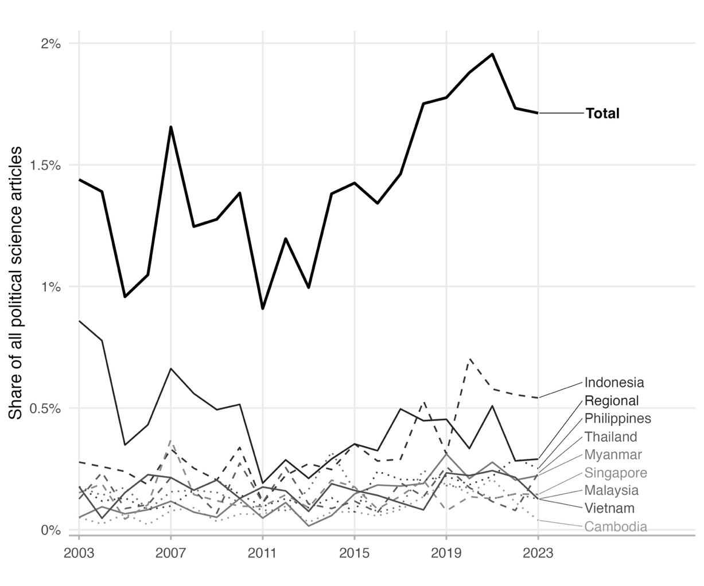

*Note:* Share of articles on Southeast Asia over time. The denominator is all articles in the 174-journal corpus per year. An article is counted for each country or region it mentions. Brunei, Laos and Timor-Leste are excluded because they have a low share of articles.

There seems to be a loose correspondence between population and publication volume. Indonesia, the region’s most populous country, accounts for the largest absolute number of articles across the entire sample (502), followed by the Philippines (241) and Vietnam (230). At the other end, Brunei (10) and Laos (34), among the smallest and least internationally prominent states in the region, generate the fewest publications. A rough population gradient is thus visible across the sample. Yet, Singapore, with a population of over six million, accounts for 195 articles, which is a volume comparable to Thailand (213) and Malaysia (207), whose populations are 12 and six times larger. Myanmar, with its population of 55 million and one of the region’s lowest GDPs, generates 205 publications, placing it sixth overall. Timor-Leste, with fewer than 1.5 million inhabitants, produces 64 articles, which is more than Laos, a country more than five times its population size. Adjusting directly for population, as reported in Table A1 (see Appendix), sharpens this picture considerably. Timor-Leste and Singapore are the most intensively studied countries in the region per capita, while Indonesia, the largest object of study in absolute terms, ranks lowest.

These anomalies suggest that there may indeed be a “hierarchy of countries to study”[^21] or “circles of esteem”, but not necessarily as anticipated.[^22] While Indonesia and Vietnam, for instance, may be expected as “main domains”, Thailand is also usually listed as a country of focus in the region, which Political Science does not reflect.[^23] Differences in coverage between the Philippines, Thailand, Myanmar, Malaysia and Cambodia are not as sizeable as perhaps anticipated. Rather than because of the demographic or economic weight of the countries, some of the scholarly attention may be explained by theoretical concerns. Singapore, for instance, attracts sustained interest as a paradigmatic case of electoral authoritarianism in comparative politics.[^24] Myanmar’s disproportionate coverage reflects decades of scholarly attention to military rule, conflict and the country's diverse ethnic composition.[^25] Timor-Leste, despite its size, became a prominent laboratory for scholarship on post-conflict state-building and international administration following its formal independence in 2002.[^26]

Article coverage across the region also appears loosely related to major domestic episodes of democratization and autocratization, though not only in one direction. Malaysia’s 2018 general election, which ended six decades of single-coalition rule, produced a sharp but short-lived spike in coverage (from a pre-2018 average of around 0.11 per cent to 0.23 per cent that year). In Myanmar, coverage rose with the country’s 2015 transitional election and stayed elevated through its subsequent autocratization, including the 2021 military coup, roughly tripling from a pre-2015 average of 0.07 per cent to over 0.20 per cent. Cambodia shows a similar rise following the 2017 dissolution of its main opposition party and the one-party election that followed in 2018, peaking at 0.20 per cent in 2021, but this reverses sharply by 2023, falling to 0.04 per cent, plausibly as deepening autocratization has made the country more difficult for outside researchers to access.[^27] The Philippines’ coverage nearly doubled the year President Rodrigo Duterte took office in 2016 and continued to grow over the following years, tracking a domestic turn towards illiberal, violent populism that, however, has not made access to the country as difficult as to Cambodia’s one-party turn. Thailand, by contrast, is a clear exception to this pattern. Neither of its two military coups, in 2006 and 2014, is associated with any detectable change in coverage, perhaps because repeated military intervention had by then become a familiar feature of Thai politics. Given the small number of articles involved for any single country in a given year, these patterns are best read as suggestive rather than as a systematic test of the relationship between regime change and scholarly attention.

Second, debates around the study of Southeast Asia have also often centred on methodological choices. Figure 2 shows the development of research methods in Political Science and Southeast Asia-focused work. It relies on Grossman, Dinneen and Torreblanca’s fourfold distinction into quantitative, qualitative, normative and formal methods, identifying the first two as the predominant methodological frameworks.[^28] Quantitative methods have gradually become more common in Political Science and overtook qualitative ones as the most commonly used methodologies around 2013. Southeast Asia-focused work, by contrast, has traditionally been more qualitative. This preference likely reflects the area studies tradition in which much Southeast Asia scholarship is rooted, favouring deep country expertise, archival and fieldwork-based methods and single-country case studies that have historically been central to the subfield. Therefore, in some years during the studied period, 75 per cent of the Southeast Asia-focused publications have used qualitative methodologies. Nevertheless, while qualitative work remains predominant in this subfield of Political Science, quantitative methodologies have also become more popular, especially since 2010. They are now used in around 40 per cent of Southeast Asia-focused publications. This may partly reflect publication incentives, with scholars targeting generalist journals facing stronger pressure to adopt the methodological conventions that those outlets reward.

However, while Southeast Asia-focused work is experiencing similar trends, the field has not become dominated by quantitative methods and, more recently, the trend of increasing use of quantitative methods has slowed. Since around 2017, the share of articles using quantitative methods has not increased, remaining at around 40-45 per cent overall. Thus, Southeast Asian scholarship has not converged with or outpaced the broader discipline in this dimension. Southeast Asia-focused work has remained below the disciplinary share every year in the period, and its adoption of quantitative methods has levelled off since 2017 while the discipline’s has continued to rise.

One possible explanation for this plateau is that internationalization and quantification may be working against each other. Scholars based within the region may, on average, have less access and exposure to the quantitative training common at Western institutions. Thus, a shift towards more regionally distributed authorship (as shown below) could itself be dampening a shift towards quantitative methods that might otherwise have followed the discipline more closely.

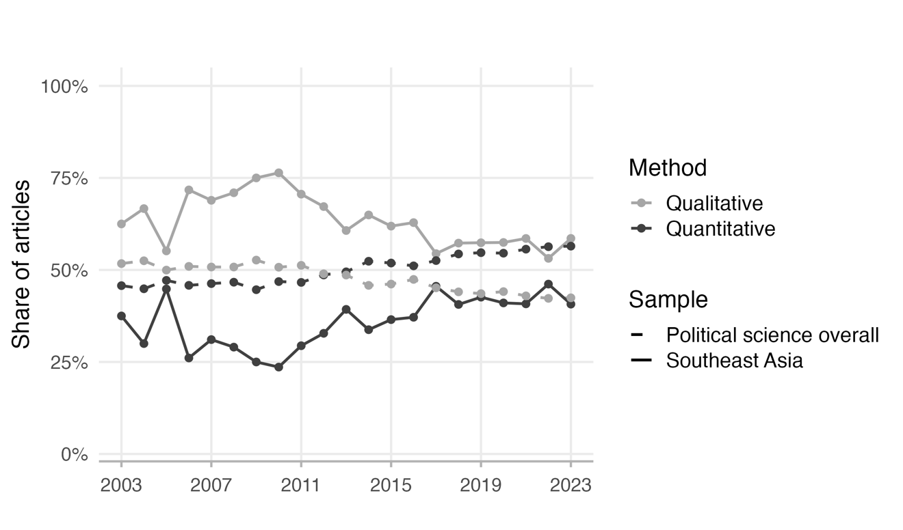

*Note:* Share of articles classified as quantitative or qualitative/theoretical. Classifications from Grossman, Dinneen and Torreblanca.[^29] Articles without a classification are excluded.

Yet the trajectories and the extent to which qualitative methods dominate vary across countries, as Figures A2 and A3 (see Appendix) visualize. For instance, the share of quantitative methods grew most consistently in Indonesia, Vietnam and the Philippines. Other countries show a less linear pattern. Thailand and Malaysia saw a temporary rise in quantitative work around 2010–18 that partly receded, while Myanmar and Cambodia dipped sharply towards almost no quantitative output over roughly the same period before recovering. Singapore stands out for its flat trajectory from the mid-2000s, holding steady at around a third of articles throughout. Qualitative and theoretical work dominates across the board, ranging from just under half of articles for Indonesia and Vietnam to a clear majority for Cambodia, Timor-Leste and Myanmar. Quantitative methods, in contrast, are comparatively more common in scholarship on the Philippines (over two-fifths of articles), Indonesia and Singapore (around a third each) than in work on Myanmar (roughly a quarter) or Cambodia and Timor-Leste (roughly a fifth each), potentially reflecting the (non-)availability of high-quality quantitative data in these contexts.

Overall, the article-level analyses show that Southeast Asia-focused work has become slightly more represented in Political Science. In line with disciplinary developments, it has also become more quantitative, though not to the same extent as political science overall, and not equally across studies of individual countries.

### Authors
First, gender representation remains a significant issue across all aspects of Political Science. Studies of Political Science have consistently shown a gender gap regarding publications[^30] that is only slowly closing over time.[^31] These gender gaps also vary across subfields.[^32] However, until now, no clear picture of Southeast Asia-focused work in Political Science has been available.

Figure 3 shows the share of female authors over time, measured as the proportion of author-article observations where the author is coded as female. Each author on each article counts as one observation, such that an article with four female co-authors produces four observations. The trends are shown for both Southeast Asia-focused articles and Political Science more generally. Across both, we see a trend of increasing female representation in published work. Political Science started at around 23 per cent in 2003. Southeast Asia-focused work started from a similar early-2000s average but fluctuated far more from year to year, reflecting the small number of articles published at the time. By the end of the timeline, both trends had converged upward, with just over 40 per cent of authors being female in Southeast Asia-focused work and just under 40 per cent being female across the entire discipline. In nine of the 13 years from 2011 to 2023, Southeast Asia-focused work has been slightly more gender-balanced than the overall discipline. Thus, the disciplinary trend of increasing female authorship is even more prominent in Southeast Asia-focused work. Put differently, work on Southeast Asia is still male-dominated but much less so today than it was in the early 2000s and slightly less so than Political Science more broadly.

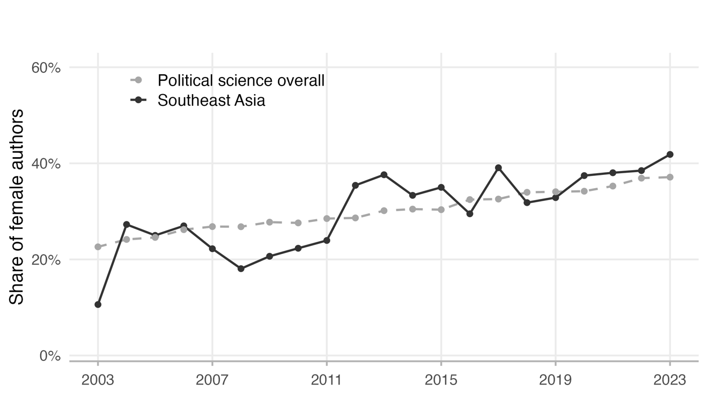

*Note:* Share of author-article observations with female authorship. Authors with unknown gender excluded. One author on one article equals one observation.

While most individual countries track this overall trend, as Figure A4 shows (see Appendix), the pattern is not universal. These individual-country shares are based on a comparatively small number of observations each year and, even after five-year rolling-average smoothing, should be interpreted with some caution, as they can fluctuate substantially more than the overall trend for Southeast Asia. That said, Vietnam and Cambodia show the steepest and most consistent gains, rising from near-zero and under a fifth, respectively, to around half of the authors by the end of the period. Indonesia’s rise is comparable in scale, from 23 per cent in 2003 to 47 per cent by 2023. Thailand and Myanmar have followed a similar trend since 2012. The Philippines and Singapore, by contrast, are the two countries that move against the trend altogether. Here, female authorship share falls from 31 per cent to 28 per cent and from 29 per cent to 26 per cent, leaving them the two lowest-ranked countries in the region by 2023, having moved from eight to ten percentage points above the Southeast Asia benchmark at the start of the period to 12 to 14 points below it at the end. Part of this variation reflects convergence towards a common, rising regional norm. The countries starting lowest in 2003, including Vietnam, Thailand and Cambodia, record by far the largest gains, while Malaysia and Myanmar, which began at around 40 per cent, end the period roughly where they started. This, however, does not account for the Philippines and Singapore. Both began near 30 per cent, some ten points below the eventual regional average, but drifted slightly downward.

Second, important debates also concern where the producers of knowledge on certain countries and regions are based. While most comparative politics work, for instance, is published by US- and Europe-based scholars,[^33] this also applies to work focused on non-Western contexts.[^34] Recent work also shows that research on Sub-Saharan Africa, for instance, is also predominantly published by scholars outside the region and overwhelmingly by academics in the United States and Europe.[^35]

Figure 4 below shows where the authors of scholarship on Southeast Asia are based. It shows the share of author-article observations, where each author on a Southeast Asia-focused article counts as one observation, restricted to the top 15 countries. This figure plots the authors’ host institutions. As in the Middle East, North Africa and Sub-Saharan Africa, a large majority of work on Southeast Asia is also produced outside the region.[^36] The United States stands out as the key country in this area, with around 24 per cent of authors in the dataset identified as US-based. This also aligns with other research findings that, in general, most Political Science research comes from authors at US institutions.[^37] Australia and the United Kingdom (UK) follow the United States. While the UK is commonly placed behind the US in research metrics, Southeast Asia-focused work appears to be a real strength at Australian institutions.[^38] This is, of course, not surprising given the geographic locations, but it makes for an interesting finding of Southeast Asia research “hotspots”. Given their limited number, institutions in Singapore also rank highly, and it is the country in Southeast Asia that produces the most Southeast Asia-focused work. Right behind it are institutions from Indonesia, which also produce a large share of Southeast Asia-focused work, significantly more than from other countries in the region, including Thailand, Malaysia and the Philippines. Continental Europe also shows a relative lack of engagement with Southeast Asia in its work. Among the top 15 countries producing knowledge on Southeast Asia, only Germany, the Netherlands and Sweden are included, which may indicate the predominant inward-looking character of Political Science there.[^39] Similarly, research from China on the region is also limited, despite the country's overall rise in Political Science research.[^40] Institutions from other Southeast Asian countries, such as Laos, Timor-Leste, Vietnam, Cambodia and Myanmar, are not among the region's top 15 knowledge producers, reflecting more limited research infrastructure in these countries.

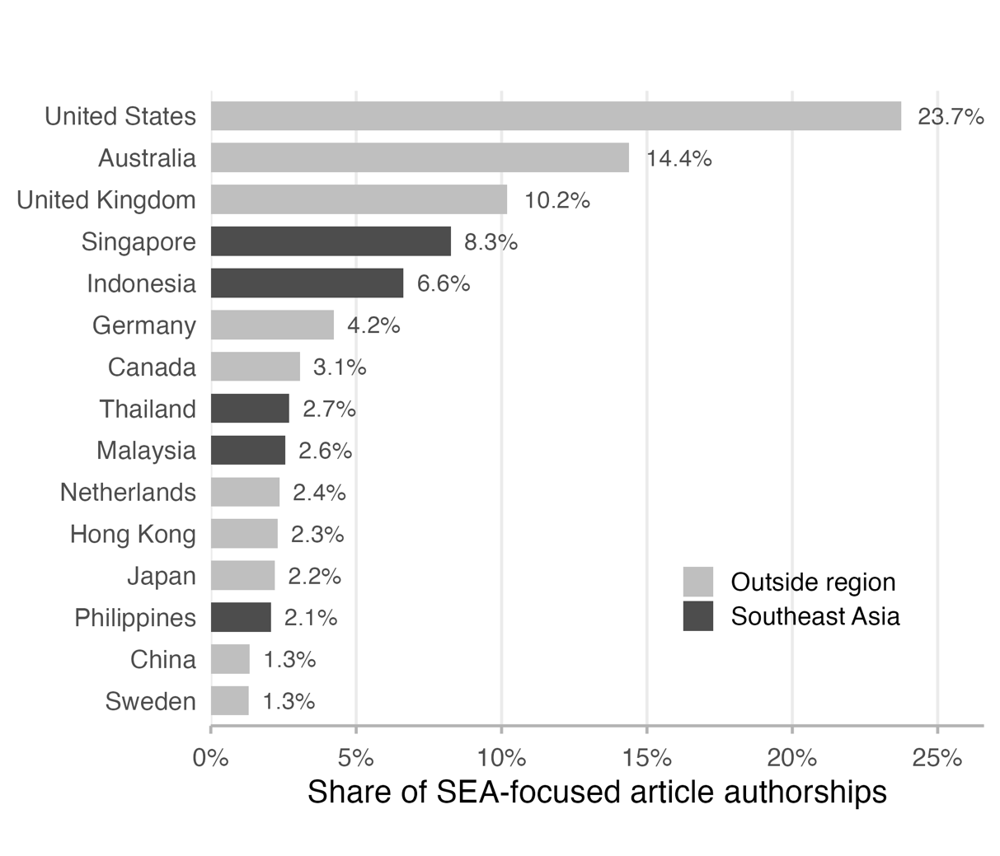

*Note:* Top 15 countries by author affiliation, 2003–2023. Counts are at the author-article level. Articles with unknown author affiliation excluded.

Assessing changes in knowledge production over time shows that work on Southeast Asia has become more international. Figure 5 below shows that authorship of Southeast Asia-focused research has grown substantially less concentrated in the traditional Anglophone core (the United States, the UK and Australia) over the past two decades. The share of authors based outside of these three countries rose from 46 per cent in 2003 to 71 per cent by 2023. Political Science as a whole shows a similar rise over the same period (30 per cent to 55 per cent). Linking author locations with the study of individual countries in the region also reveals notable developments, for instance, in Cambodia and Myanmar. The former’s declining Anglophone-core authorship after 2017 is matched by a rise in Cambodia-based authors (1.4 per cent to 7.3 per cent of author-observations), consistent with foreign researchers losing access as domestic scholars become relatively more visible. In contrast, Myanmar’s decline after the 2021 coup (51 per cent to 37 per cent) is not matched by any comparable rise in Myanmar- or region-based authorship. Instead, a more diffuse set of outside countries fills the gap, with Hong Kong most notably.

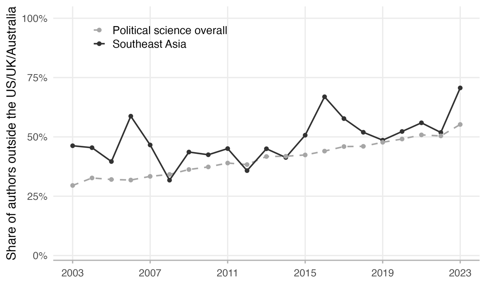

*Note:* Share of author-article observations based at an institution outside the United States, the UK or Australia. Author-article observations with unknown institutional affiliation excluded.

Similarly, the extent to which each Southeast Asian country is studied from within the region rather than from outside it varies. Figure 6 below shows the composition of authors’ affiliations broken down by country studied, ordered by Western dominance. At one end of the spectrum is Timor-Leste, which is rarely studied by scholars based in Southeast Asia but predominantly by researchers in Australia and New Zealand. More research on Timor-Leste comes from these two countries than from the US, UK and Europe combined. Countries with fewer publications are particularly dominated by scholars based in Western institutions, including Vietnam, Cambodia, Myanmar and the Philippines. Scholars in the United States primarily study Vietnam and the Philippines, reflecting historical connections such as the Vietnam War and colonial history in the Philippines. Scholars based in the UK, for instance, are also more likely to research Myanmar and Malaysia than the Philippines or Vietnam.

On the other end of the spectrum, where Western dominance is less pronounced, are Indonesia, Thailand, Malaysia and Singapore. The relatively weaker Western dominance in these countries may reflect stronger domestic academic infrastructure than in other Southeast Asian countries. Among them, Singapore is the only country that is predominantly studied by scholars based in Asia. This reflects not only a strong domestic research environment but also Hong Kong-based scholars' interest in Singapore and the frequent comparisons drawn between the two.

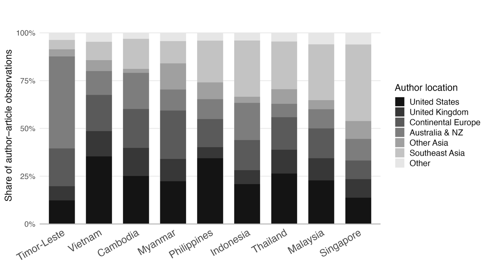

*Note:* Share of author institutional affiliation by country focus. Author-article observations with known institutional affiliations only. Laos and Brunei excluded because of the small number of publications related to them.

Third, Political Science has also seen a rapid trend towards co-authorship. In recent years, co-authorship has become the most dominant form of production.[^41] In region-focused research, particularly when conducted with qualitative methods, however, it was less pronounced. Figure 7 shows that research on Southeast Asia follows similar trends to the discipline of Political Science overall. Notably, Southeast Asia-focused work started the period significantly below the disciplinary average in co-authorship. Only around 18 per cent of articles had two or more authors in 2003, compared to 27 per cent across Political Science overall. The gap has since narrowed to under four percentage points, with half of Southeast Asia-focused articles (50 per cent) and just over half of all Political Science articles (53 per cent) co-authored by 2023. This suggests that scholarship on Southeast Asia has increasingly integrated into the broader discipline's collaborative norms rather than remaining a more solitary, area-specialist mode of production. Southeast Asia-focused work also aligns with the broader discipline in its increasing shift to team-based production. While teams of three or more coauthors used to be rare, now around a fifth of Southeast Asia-focused publications and almost a quarter across Political Science are written by teams of authors.

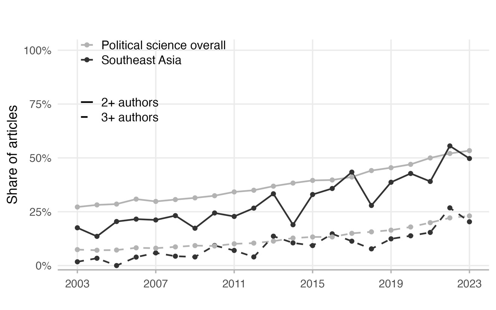

*Note:* Share of articles with two or more/three or more authors.

Among Southeast Asian states, Indonesia consistently outpaced this overall trend, reaching close to three-fifths of articles co-authored by 2023. The Philippines tracked a similar, though less pronounced, trajectory for most of the period, peaking at just over half of articles co-authored in 2022 before easing slightly to just under half by 2023. Thailand shows a particularly sharp late rise, climbing to around two-thirds of articles co-authored by 2023 after tracking close to the Southeast Asia-wide average for most of the period. In Cambodia, a shift in type of co-authorship is also visible. Foreign–local co-authorship, which was absent before 2017, appears in 8 per cent of Cambodia-focused papers afterwards. Yet this pattern is not found in Myanmar, where the post-coup rise in co-authorship comes entirely from foreign-foreign teams. Figure A5 in the Appendix illustrates these developments by country.

What do these collaborations look like? Figure 8 shows the co-authorship network among all authors in the sample who have at least one co-author on a Southeast Asia-focused article. Each node represents one author, sized by their total number of Southeast Asia-focused publications. An edge connects two authors if they have co-authored at least one Southeast Asia article, with edge weight reflecting the number of joint publications. Authors with no co-authored connection to another scholar are not shown. Around two-thirds of all Southeast Asia-focused articles (65.9 per cent) are single-authored and therefore necessarily fall outside any co-authorship network.

As a result, the network comprises 1,422 authors connected by 1,516 co-authorship ties, spread across 463 separate components: clusters of authors connected to one another but not to anyone outside their cluster. The most striking feature is the high degree of network fragmentation: most components are pairs or small triads, and the largest connected component contains only 55 scholars. This suggests that collaboration in Southeast Asia-focused Political Science is predominantly local and small-scale, with very few bridges connecting different research communities. As a result, the field lacks the dense collaborative infrastructure seen in some other subfields of Political Science. In the network, the most prolific authors stand out clearly by node size. Edmund Malesky leads with 19 Southeast Asia publications, followed by Edward Aspinall (17), Duncan McCargo (13), Dan Slater (12), Marcus Mietzner (12) and Mark Thompson (12). Despite their individual productivity, even these central figures are not strongly interconnected, reinforcing the picture of a fragmented rather than densely networked scholarly community.

Assigning each author to a country of primary focus shows that collaboration in Southeast Asia-focused Political Science is organized primarily around country specialization rather than cross-cutting thematic or methodological lines. Scholars whose work concentrates on the same country tend to cluster together, while cross-country co-authorship is the exception rather than the norm, accounting for roughly one co-authorship tie in 13. This pattern of country-siloed collaboration points to a field where knowledge exchange between, say, Indonesia specialists and Thailand specialists remains limited. In many ways, this reflects the “contested nature of Southeast Asia as a region”[^42] and debates in the field on comparative approaches.[^43]

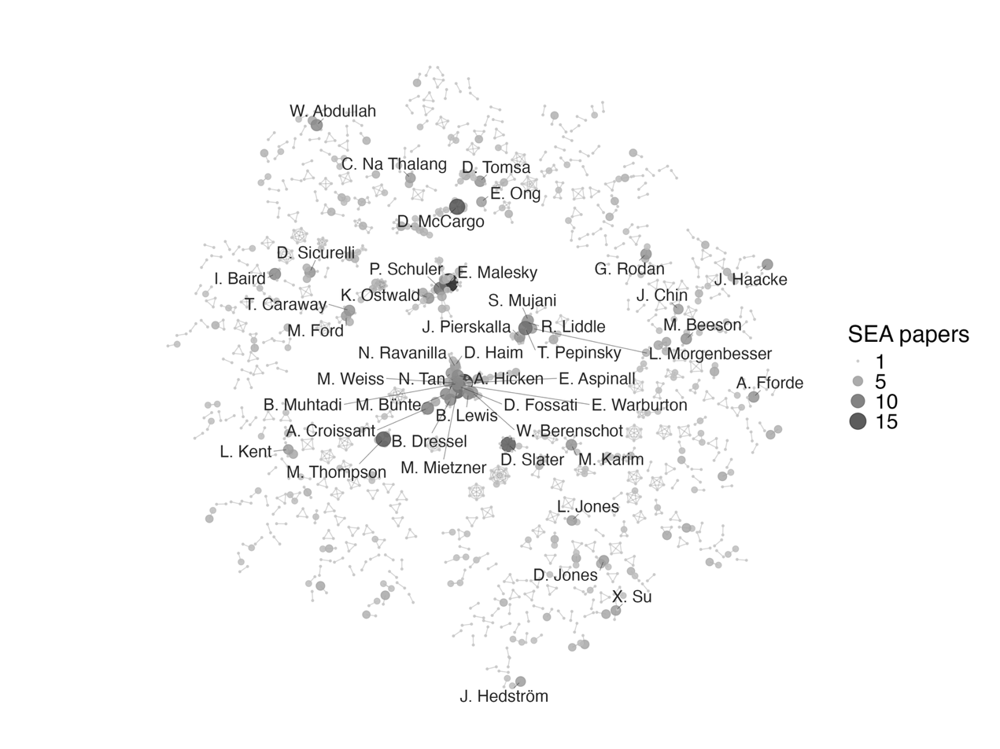

*Note:* Co-authorship network in Southeast Asia-focused Political Science, 2003–23. Nodes are all authors with at least one Southeast Asia-focused article and at least one co-author in the sample. Labels are shown for authors with five or more Southeast Asia-focused articles in the sample.

The network above shows a field that remains fragmented, with collaboration organized into small, largely country-specific clusters rather than one connected community. Figure 9 asks whether this fragmentation has eased over time by splitting the same network of authors (nodes) and co-authorship ties (edges) into three seven-year periods (2003–09, 2010–16 and 2017–23). The network shows that over time the field has become more connected and less fragmented. The largest connected cluster of scholars grew from just six authors in the first period to eight in the second and 44 in the third, and the share of Southeast Asia-focused articles written by a single author fell from 80 per cent to 56 per cent over the same span. The field has not transformed into a densely networked community, as even by 2017–23 it remains far more fragmented than the largest cluster’s growth alone might suggest. However, the trend is unambiguous: scholars increasingly join larger, more interconnected groups of collaborators rather than working in isolated pairs.

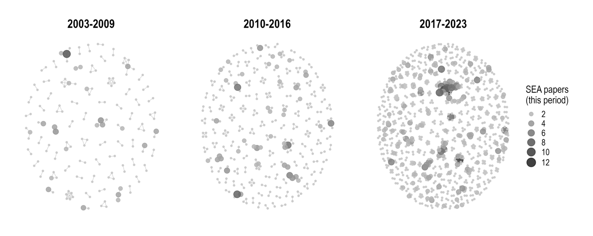

*Note:* Nodes are authors with at least one Southeast Asia-focused paper in the period who share a co-author within the same period. Size scale = articles per author, per period.

To sum up, the author-level analyses show that Southeast Asia-focused work in many ways develops in line with disciplinary trends, though not uniformly and not always at the same pace. Gender representation is the one dimension on which the field has done more than keep up, moving towards equity faster than the discipline itself and running slightly ahead of it in most years since 2011. Authorship has been more internationally distributed than the discipline throughout the period and has internationalised at a similar rate. Collaboration converged from a markedly lower base, closing most of the gap it started with. Yet individual countries follow these trends unevenly, and scholars in Western institutions continue to study countries without strong domestic research infrastructures. Co-authorship networks also reveal a highly fragmented field, shaped by collaborations organized around country expertise.

## Selection in the Sample

I return to the question about the extent to which these results are driven by the sample construction. Restricting the corpus to journals meeting the SJR threshold of 1.0 necessarily excludes specialist outlets whose explicit purpose is publishing on Southeast Asia, raising the concern that this systematically undercounts certain countries, institutions and scholars, particularly those based in the region or working on less-studied countries. I test this directly by building comparison samples from two excluded Southeast Asia-specialist journals, *Pacific Affairs* and the *Journal of Southeast Asian Studies* (JSEAS), and checking both country coverage and author location against the sample. I find no evidence that the most vulnerable case, Timor-Leste (the most Western-dominated case), is systematically undercounted. Its share of Southeast Asia-focused articles is essentially identical in-sample (2.5 per cent) and in both excluded journals (2.3–2.6 per cent). A few countries are somewhat better represented in these venues, most clearly Thailand, whose share is significantly higher in the *JSEAS*. However, the pattern also runs the other way, with Indonesia and Malaysia less represented in the *JSEAS*, suggesting that not every country is underrepresented in Southeast Asia-focused political science vis-à-vis area studies.

The comparison also speaks to author composition. Authors based at Southeast Asian institutions account for 24.0 per cent of authorships in the sample but 29.7 per cent in *Pacific Affairs* and 27.3 per cent in *JSEAS*, a difference that is statistically significant in the former comparison but not the latter. Including specialist outlets would therefore make the regional presence in this literature somewhat larger than the sample suggests, without altering the conclusion that most work on the region continues to be produced outside it.

The exclusion of books carries a related implication that, unfortunately, cannot be tested in the same way, since no comparable bibliometric corpus of monographs for Political Science exists. Book-length work in the field likely skews towards the area studies tradition and qualitative research, so its absence probably understates how qualitative the field is. On balance, the evidence points to a bounded effect rather than a sample-wide bias that would call the paper’s central findings into question. Section E in the appendix provides more details on these additional tests.

## Conclusion

The data presented offer the Southeast Asia community in Political Science the clearest empirical picture yet of where the field stands, providing additional impetus for further conversations about its direction. Research on the region has become slightly more prominent within the discipline than it was one or two decades ago. However, the share of Southeast Asia-focused work in Political Science still falls short of the region's share of the world’s population, which may be a suitable standard of comparison. The field has also become more gender-diverse and more collaborative than ever before, in line with broader disciplinary trends but even outpacing them for the former. Co-authorship has converged with disciplinary norms from a much lower starting point, while gender representation has moved towards equity faster than the discipline’s own progress across the period, overtaking it in the early 2010s and holding a modest lead since. Its shift towards a more internationally distributed set of authors has been consistent with the field overall, even as most Southeast Asia-focused work continues to be produced by scholars based outside the region. Meanwhile, the discipline’s adoption of quantitative methods has far outpaced Southeast Asia-focused scholarship, a gap that has not narrowed since 2017. Disaggregating these trends by country complicates the picture. Rather than a single subfield moving uniformly, individual countries diverge considerably, often in step with their own political trajectories. Cambodia’s autocratization since 2017, for instance, coincides with a shift towards Cambodia-based authorship and foreign-local collaboration. It is worth reiterating, though, that individual countries’ trends should be interpreted with caution, as they are more volatile.

This article primarily serves as a stock-taking exercise on the state of Southeast Asia in Political Science, rather than a normative stance on how research on Southeast Asia should be conducted. Yet the issue of Western dominance is well known to the community, and colleagues have long begun efforts to address it. For instance, the Southeast Asia Research Group at Duke University has done tremendous work over the past decade to build a community of Southeast Asia-focused scholars in Political Science and beyond. It has provided ample funding opportunities for early-career scholars at different stages, created regular opportunities to come together and significantly developed the study of Southeast Asia in Political Science. While these efforts are commendable, opportunities disproportionately go to early-career scholars who have already reached Western institutions. Other initiatives, such as the British Academy’s funding of writing workshops in countries with underrepresentation in science, may help scholars (primarily early-career scholars) develop their writing and make it publishable in many of the dominant academic journals. Finally, several journals themselves have started to offer mentorship schemes for authors from non-Western countries to maximize their chances of publication. These initiatives are valuable, and progress in this area will require multi-pronged strategies.

Ultimately, however, Western dominance in Southeast Asia-focused articles (or any region) is more likely to be reduced by the erosion of higher education in these places. Funding for, and by extension training in, area studies has already declined significantly in US graduate programmes and is unlikely to recover in the next few years.[^44] Similarly, universities are under severe strain, and research funding is cut significantly in Australia and the UK, the other two largest “producers” of knowledge on Southeast Asia in Political Science. These developments make it harder for scholars there to conduct fieldwork, attend conferences and fund PhD students. While technical developments may make remote collaboration easier, increasing workloads at home institutions can easily undermine any progress in this regard. Consequently, these developments may contribute more to the erosion of Western dominance than supportive initiatives from the West could ever achieve. This shift is already visible in miniature in my findings on Myanmar. As the country’s Anglophone-core authorship share fell after the 2021 coup, the most visible shift was towards Hong Kong. In place of this Western dominance, we will likely see more research on Southeast Asia coming out of rising higher education hubs such as Hong Kong, Singapore, China and perhaps even the Gulf states.

## Appendix

### Number of Articles on Southeast Asia

Figure A1 shows the absolute number of Southeast Asia-focused articles published per year, complementing the share-based analysis in the main text. Total Southeast Asia-related output grew roughly threefold over the period, from 57 articles in 2003 to 177 in 2023, with growth concentrated after 2017. The number of outputs rose from 106 articles that year to 169 in 2021, dipped to 153 in 2022, and reached a high of 177 by 2023. Table A1 reports total publication counts by country across the full period, countries’ populations in 2023, and per capita publication counts.

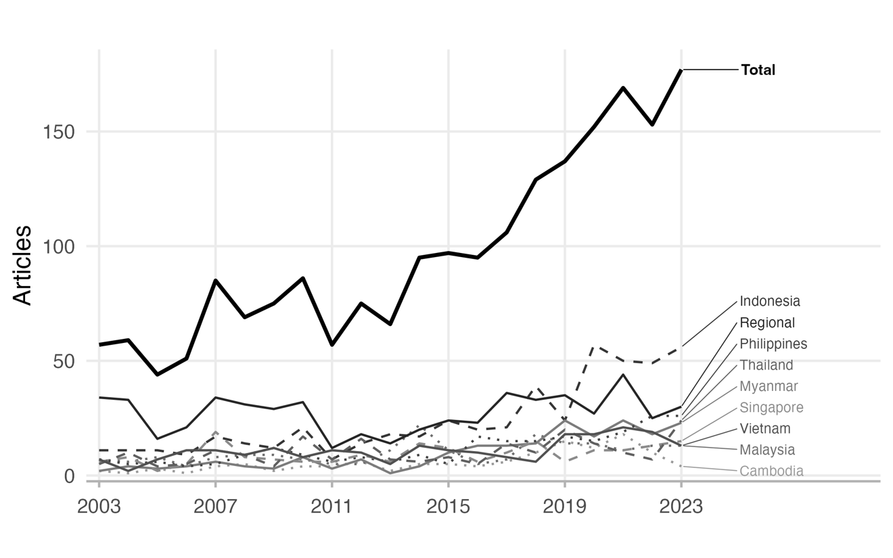

*Note:* Number of articles on Southeast Asia over time. A paper is counted for each country or region it mentions. Brunei, Laos and Timor-Leste are excluded due to a small number of articles.

**Table A1. Southeast Asia Publications by Country Focus, 2003–23**

| **Country** | **Publications** | **Population (millions)** | **Publications per million** |
|:--|:--|:--|:--|
| Indonesia | 502 | 281.19 | 1.79 |
| Philippines | 241 | 114.89 | 2.10 |
| Vietnam | 230 | 100.35 | 2.29 |
| Thailand | 213 | 71.70 | 2.97 |
| Malaysia | 207 | 35.13 | 5.89 |
| Myanmar | 205 | 54.13 | 3.79 |
| Singapore | 195 | 5.92 | 32.94 |
| Cambodia | 123 | 17.42 | 7.06 |
| Timor-Leste | 64 | 1.38 | 46.38 |
| Laos | 34 | 7.66 | 4.44 |
| Brunei | 10 | 0.46 | 21.74 |

*Note:* An article may be counted for multiple countries if it mentions more than one. Population figures are 2023 totals from the World Bank.

### Methods by Country

Figures A2 and A3 provide the by-country breakdown of methodological trends referenced in the main text. Both restrict the sample to articles with a single, unambiguous country or regional focus, where an article contributes to every country it mentions. An article is assigned to a specific country if exactly one Southeast Asian country appears in its title or abstract, or to “Regional” if only region-level terms (Southeast Asia, ASEAN) appear. Of the 2,034 Southeast Asia-focused articles in the full sample, 1,816 (89.3 per cent) can be assigned a single country or regional focus this way.

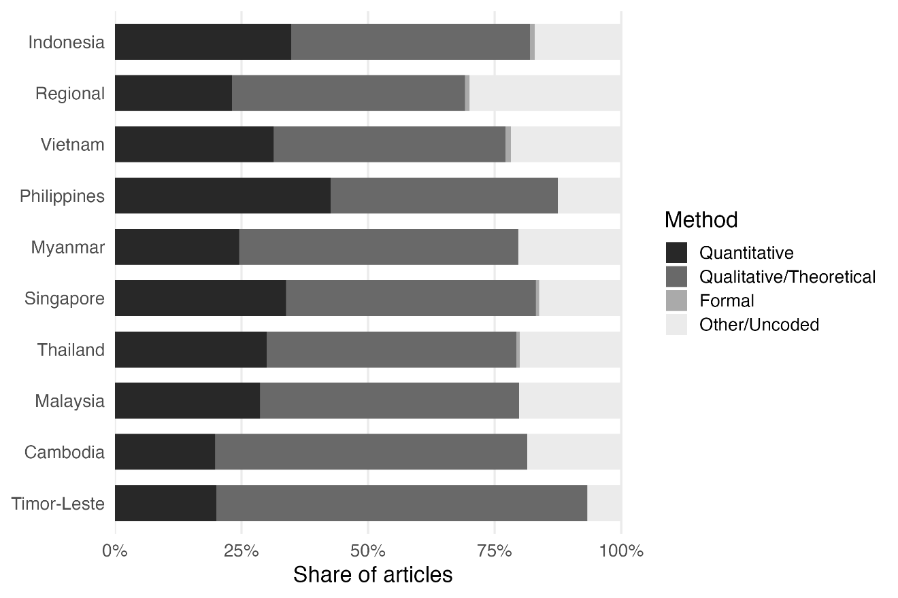

*Note:* Share of articles by method (quantitative, qualitative/theoretical, formal or other/uncoded; classifications from Grossman, Dinneen and Torreblanca), restricted to articles with a single, unambiguous country or regional focus. Brunei and Laos are excluded due to low article counts.

Two further points are worth covering. First, while the figure in the main text distinguishes only between qualitative and quantitative methods, Figure A2 uses the original four-fold distinction. This shows that formal modelling is essentially absent from Southeast Asia-focused scholarship regardless of country focus, accounting for at most around 1 per cent of articles in any country and 0 per cent in half of them. Regional-framed work also stands out for a distinctly high “other/uncoded” share (29.9 per cent, 1.37 times the share of the next-highest country), suggesting that pan-regional or comparative framing sits less easily within the quantitative/qualitative/formal coding scheme than single-country work does. Second, Figure A3 shows that countries’ positions relative to the Southeast Asia benchmark have not been stable over the period: Vietnam began 2003 with the lowest quantitative share of any country (9 per cent) but by 2023 had risen above the Southeast Asia average (40 per cent vs. 37 per cent), the largest shift in relative standing of any country, while Cambodia shows the reverse pattern. It recorded the highest quantitative share of any country in 2003 (50 per cent) but a below-average share by 2023 (27 per cent), a significant net decline. The Philippines and Thailand mark the two ends of the 2023 distribution, at 54 per cent and 21 per cent respectively, despite Thailand having itself peaked at 50 per cent mid-period (2018).

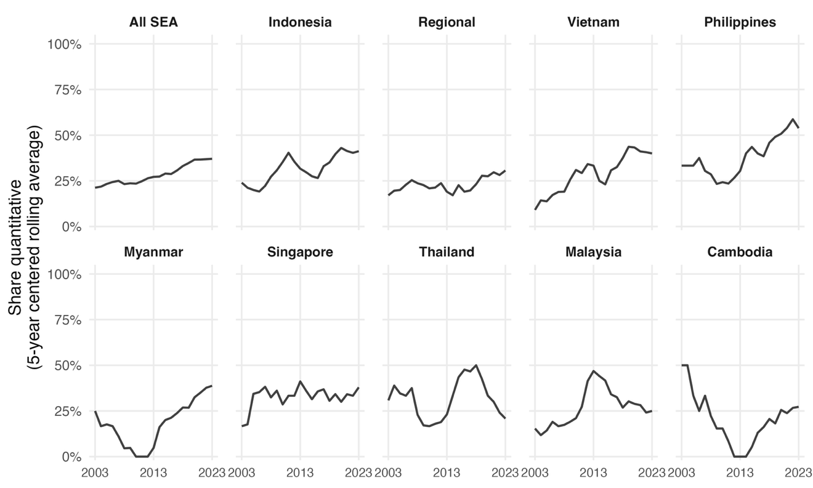

*Note:* Share of articles classified as quantitative by a five-year centred rolling average with narrower windows in 2003 and 2023. Brunei, Laos and Timor-Leste excluded due to low article counts.

### Gender Representation by Country

Figure A4 reports the by-country breakdown of gender representation referenced in the main text. The unit of observation here is the author-article pair (one author on one article). Restricting to author-article pairs with a known gender within the classified sample yields 2,662 observations.

The main text discusses the steepest gainers (Vietnam, Cambodia and Indonesia), the late-rising and outlier cases (Thailand and Myanmar) and the two countries whose female authorship share moves against the overall trend (the Philippines and Singapore). Malaysia follows a third pattern not covered in the main text. It starts at a regional high for that year (40 per cent in 2003) and shows little net change by 2023 (38 per cent), dipping as low as 22 per cent in the mid-2000s. But unlike the low-base gainers, it is not catching up to the regional trend, and unlike the Philippines and Singapore, it is not falling away from it either.

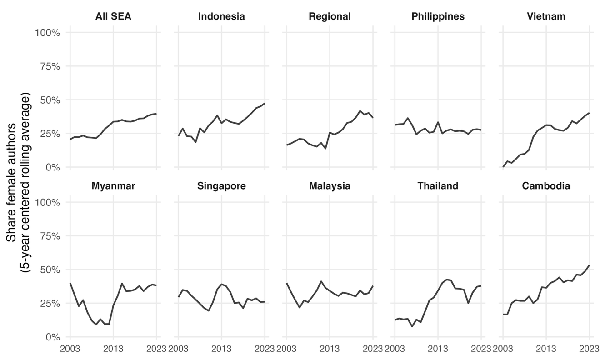

*Note:* Share of author-article observations with female authorship by five-year centred rolling average with narrower windows in 2003 and 2023. Authors with unknown gender excluded. Brunei, Laos and Timor-Leste excluded due to low observation counts.

### Co-Authorship Patterns by Country

Figure A5 reports the by-country breakdown of co-authorship trends referenced in the main text, using the same single-country/regional-focus classification described in Section B. This restriction yields 1,816 classified articles from 2003 to 2023 with available authorship-count data.

Two patterns go beyond what the main text reports. First, Cambodia shows the same reversal pattern documented for quantitative methods in Section B. It initially recorded the highest co-authorship share of any country in 2003 (50 per cent) but then fell to the lowest of any country by 2023 (27 per cent). This decline runs counter to the region-wide rise the main text describes. This parallel across two independent measures, namely Cambodia’s scholarship becoming both more qualitative and more solitary over the same period, may be consistent with, though not proof of, the reduced-fieldwork-access interpretation the main text offers for Cambodia’s declining publication volume. Second, Vietnam shows a comparable trajectory to its rise in quantitative methods. It started the period with the lowest co-authorship share of any country (9 per cent in 2003), but then converged to near the Southeast Asia benchmark by 2023 (44 per cent vs 48 per cent).

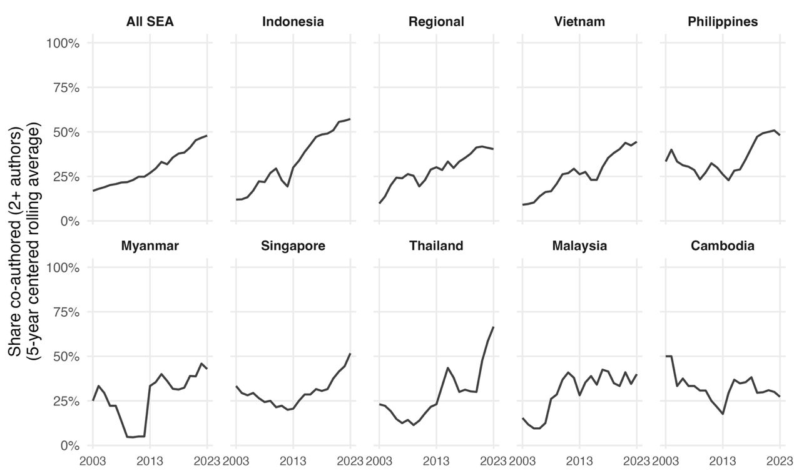

*Note:* Share of articles with two or more authors by five-year centred rolling average with narrower windows in 2003 and 2023. Brunei, Laos and Timor-Leste excluded due to low article counts.

### Sample Selection Bias

Figure A6 presents the full comparison underlying the sample-selection discussion. Two excluded Southeast Asia-specialist journals serve as comparison corpora: *Pacific Affairs* and the *Journal of Southeast Asian Studies* (JSEAS). Abstract coverage differs sharply between the two. Taylor & Francis’s platform blocks direct scraping, limiting *Pacific Affairs* to 32 per cent abstract coverage from this period. For *JSEAS*, by contrast, abstracts were available for 99.6 per cent of the journal’s articles. *JSEAS* is accordingly the stronger of the two checks, with *Pacific Affairs* as a secondary, lower-coverage comparison.

The left panel of Figure A6 shows the full country-by-country comparison underlying the country-coverage findings reported in the main text. The right panel reports whether authors based in the region itself are underrepresented in the in-sample corpus relative to the two excluded venues. The share of authors based at a Southeast Asian institution is higher in both comparison corpora than in the in-sample (24.0 per cent in-sample vs 29.7 per cent in *Pacific Affairs* and 27.3 per cent in *JSEAS*). This difference is statistically distinguishable from chance in the smaller *Pacific Affairs* comparison but not in the larger, better-covered *JSEAS* comparison. The two comparisons point to a real but modest tendency toward regional-author underrepresentation in the in-sample corpus. This bounds, but does not rule out, a degree of undercounting in the paper’s author-composition findings. However, it does not extend to the country coverage claims addressed in the main text, which show no comparable pattern across either comparison corpus.

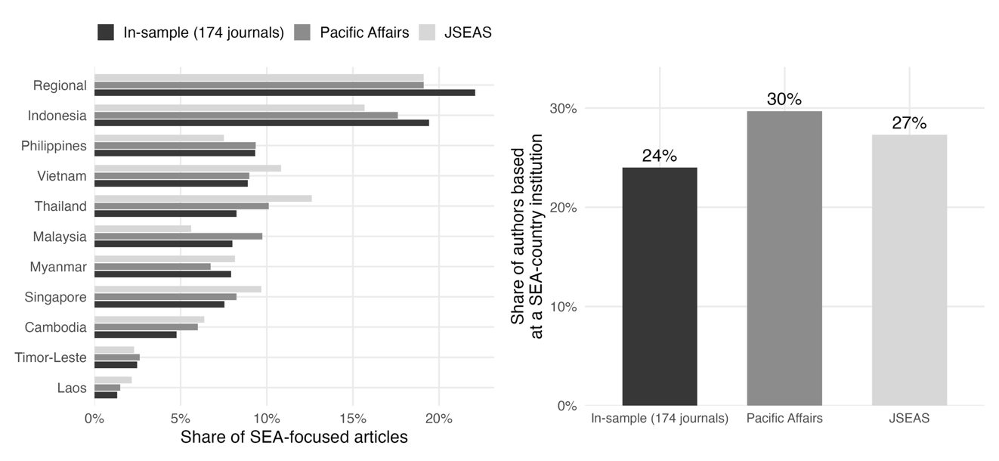

*Note:* Left panel: for each country, its share of all country mentions in that corpus, where an article contributes one mention for every country it names. Right panel: share of author–article observations based at a Southeast Asian institution.

[^1]:
    # NOTES

    Thomas B. Pepinsky, Barbara Geddes, Duncan McCargo, Richard Robison, Erik Martinez Kuhonta, Dan Slater and Tuong Vu, “Discussion of Erik Martinez Kuhonta, Dan Slater, and Tuong Vu’s Southeast Asia in Political Science: Theory, Region, and Qualitative Analysis”, *Journal of East Asian Studies* 10, no. 2 (2010): 171–208; Erik Martinez Kuhonta, Dan Slater and Tuong Vu, *Southeast Asia in Political Science: Theory, Region, and Qualitative Analysis* (Redwood City, California: Stanford University Press, 2008).

[^2]: Thomas B Pepinsky, “Context and method in Southeast Asian politics”, *Pacific Affairs* 87, no. 3 (2014): 441–461.

[^3]: Matthew Charles Wilson and Carl Henrik Knutsen, “Geographical coverage in political science research”, *Perspectives on Politics* 20, no. 3 (2022): 1024–1039.

[^4]: Thomas B Pepinsky, “Southeast Asia and World Politics”, *World Politics* 77, no. 1 (2025): 223–233.

[^5]: Kuhonta, Slater and Vu, *Southeast Asia in Political Science*.

[^6]: Lee Morgenbesser and Thomas B Pepinsky, “Elections as causes of democratization: Southeast Asia in comparative perspective”, *Comparative Political Studies* 52, no. 1 (2019): 3–35.

[^7]: Guy Grossman, William Dinneen and Carolina Torreblanca, “Political Science under Pressure: Competition and Collaboration in a Growing Discipline, 2003–23”, *Perspectives on Politics* (2026): 1–20.

[^8]: Wilson and Knutsen, “Geographical coverage in political science research”; Mark Stephen Berlin and Anum Pasha Syed, “The Middle East and North Africa in Political Science Scholarship: Analyzing Publication Patterns in Leading Journals, 1990–2019”, *International Studies Review* 24, no. 3 (2022): viac027.

[^9]: Pepinsky, “Southeast Asia and World Politics”.

[^10]: Chua Beng Huat, Ken Dean, Ho Engseng, Ho Kong Chong, Jonathan Rigg and Brenda Yeoh, “Area studies and the crisis of legitimacy: A view from South East Asia”, *South East Asia Research* 27, no. 1 (2019): 31–48.

[^11]: Berlin and Syed, “The Middle East and North Africa in Political Science Scholarship”; Wilson and Knutsen, “Geographical coverage in political science research”; Grossman, Dinneen and Torreblanca, “Political Science under Pressure”.

[^12]: Thomas Metz and Sebastian Jäckle, “Patterns of publishing in political science journals: An overview of our profession using bibliographic data and a co-authorship network”, *PS: Political Science & Politics* 50, no. 1 (2017): 157–165; Ole Wæver, “The sociology of a not so international discipline: American and European developments in international relations”, *International Organization* 52, no. 4 (1998): 687–727.

[^13]: Grossman, Dinneen and Torreblanca, “Political Science under Pressure”.

[^14]: Berlin and Syed, “The Middle East and North Africa in Political Science Scholarship: Analyzing Publication Patterns in Leading Journals, 1990–2019”; Gerardo L Munck and Richard Snyder, “Debating the direction of comparative politics: An analysis of leading journals”, *Comparative Political Studies* 40, no. 1 (2007): 5–31; Cullen S Hendrix and Jon Vreede, “US dominance in international relations and security scholarship in leading journals”, *Journal of Global Security Studies* 4, no. 3 (2019): 310–320.

[^15]: Thongchai Winichakul, “Asian studies across academies”, *The Journal of Asian Studies* 73, no. 4 (2014): 879–897.

[^16]: Grossman, Dinneen and Torreblanca, “Political Science under Pressure”.

[^17]: Grossman, Dinneen and Torreblanca, “Political Science under Pressure”.

[^18]: Wilson and Knutsen, “Geographical coverage in political science research”.

[^19]: Grossman, Dinneen and Torreblanca, “Political Science under Pressure”.

[^20]: Wilson and Knutsen, “Geographical coverage in political science research”.

[^21]: Caroline S Hau, “For Whom Are Southeast Asian Studies?”, *Asian Studies: Journal of Critical Perspectives on Asia* 56, no. 2 (2020): 59–98.

[^22]: Robert Cribb, “Circles of esteem, standard works, and euphoric couplets: Dynamics of academic life in Indonesian studies”, *Critical Asian Studies* 37, no. 2 (2005): 289–304.

[^23]: Hau, “For Whom Are Southeast Asian Studies?”.

[^24]: Lee Morgenbesser, “The autocratic mandate: elections, legitimacy and regime stability in Singapore”, *The Pacific Review* 30, no. 2 (2017): 205–231.

[^25]: Kristian Stokke, Klo Kwe Moo Kham, Nang K.L. Nge and Silje Hvilsom Kvanvik, “Illiberal peacebuilding in a hybrid regime. Authoritarian strategies for conflict containment in Myanmar”, *Political Geography* 93 (2022): 102551.

[^26]: Oliver P Richmond and Jason Franks, “Liberal peacebuilding in Timor Leste: the emperor’s new clothes?”, *International Peacekeeping* 15, no. 2 (2008): 185–200.

[^27]: Neil Loughlin, *The politics of coercion: state and regime making in Cambodia* (Ithaca, New York: Cornell University Press, 2024); Oren Samet, “When you come at the king: Opposition coalitions and nearly stunning elections”, *American Journal of Political Science* 69, no. 4 (2025): 1469–1485.

[^28]: Grossman, Dinneen and Torreblanca, “Political Science under Pressure”.

[^29]: Grossman, Dinneen and Torreblanca, “Political Science under Pressure”.

[^30]: Yuner Zhu and Edmund W Cheng, “Multidimensional Diversity and Research Impact in Political Science: What 50 Years of Bibliometric Data Tell Us”, *Perspectives on Politics* 23, no. 2 (2025): 686–704; Marijke Breuning and Kathryn Sanders, “Gender and journal authorship in eight prestigious political science journals”, *PS: Political Science & Politics* 40, no. 2 (2007): 347–351; Dawn Langan Teele and Kathleen Thelen, “Gender in the journals: Publication patterns in political science”, *PS: Political Science & Politics* 50, no. 2 (2017): 433–447.

[^31]: Grossman, Dinneen and Torreblanca, “Political Science under Pressure”.

[^32]: Sara Wallace Goodman and Thomas B Pepinsky, “Gender representation and strategies for panel diversity: Lessons from the APSA Annual Meeting”, *PS: Political Science & Politics* 52, no. 4 (2019): 669–676.

[^33]: Munck and Snyder, “Debating the direction of comparative politics”.

[^34]: Berlin and Syed, “The Middle East and North Africa in Political Science Scholarship”.

[^35]: Ryan C Briggs and Scott Weathers, “Gender and location in African politics scholarship: The other white man’s burden?”, *African Affairs* 115, no. 460 (2016): 466–489; Zack Zimbalist and Elisa Omodei, “Dominating the Narrative: How Scholars Outside of Africa Define African Politics in the Top Political Science Journals”, *PS: Political Science & Politics* (2026): 1–11.

[^36]: Briggs and Weathers, “Gender and location in African politics scholarship”; Berlin and Syed, “The Middle East and North Africa in Political Science Scholarship”.

[^37]: Joan Barceló, Christopher Paik, Peter van der Windt and Haoyu Zhai, “A global ranking of research productivity of political science departments”, *PS: Political Science & Politics* 58, no. 3 (2025): 574–585.

[^38]: Ibid.

[^39]: Luciana Alexandra Ghica, “Who are we? The diversity puzzle in European political science”, *European Political Science* 20, no. 1 (2021): 58–84.

[^40]: Barceló et al., “A global ranking of research productivity of political science departments”.

[^41]: Grossman, Dinneen and Torreblanca, “Political Science under Pressure”; Metz and Jäckle, “Patterns of publishing in political science journals”.

[^42]: Pepinsky, “Context and method in Southeast Asian politics”.

[^43]: Pepinsky et al., “Discussion of Erik Martinez Kuhonta, Dan Slater, and Tuong Vu’s Southeast Asia in Political Science”.

[^44]: Jordan Gans-Morse, Daniel W Gingerich and Thomas B Pepinsky, *Comparative Politics and the New Area Studies*. Preprint, APSA Preprints, Cambridge Open Engage. Oct. 2025. url: .
